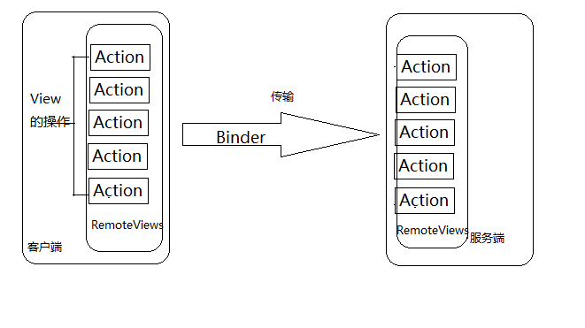

# RemoteViews

## 1 RemoteViews概述

在桌面Widget和自定义通知栏时，我们都用到了RemoteViews，那么RemoteViews到底是什么呢？
RemoteViews的作用是在其他进程更新view界面，首先看一个这个类：

```java
    /**
     * A class that describes a view hierarchy that can be displayed in
     * another process. The hierarchy is inflated from a layout resource
     * file, and this class provides some basic operations for modifying
     * the content of the inflated hierarchy.
     */
    public class RemoteViews implements Parcelable, Filter {
       ......
       public RemoteViews(String packageName, int layoutId) {}
       ......
    }
```

类的注释也说明了RemoteViews的作用是进程间通信，用于跨进程更新View。其本身也实现了序列化接口Parcelable，并不是一个View，其实它只是对一个ViewId和对View进程的操作的一个描述。而且现在它只支持部分View：


### RemoteViews支持的View

```
Layout：
 FrameLayout，LinearLayout，RelativeLayout，GridLayout
View：
 AnalogClock，Button，Chronometer，ImageButton，ImageView，ProgressBar，TextView， ViewFlipper，ListView，GridView,StackView,AdapterViewFlipper,ViewStub.
```

而其他自定义view和系统自带的View均不支持。由于它只是对一个ViewId和对View进程的操作的一个描述，所以我们不可能像操作view一样去操作他，而是通过他暴露的方法去操作,例如setOnClickPendingIntent

---
## 2 RemoteViews内部机制

RemoteViews主要用于通知栏和桌面Widget，他们分别由NotificationManager和AppWidgetManager通过Binder和NotificationManagerService和AppWidgetService进行通信，其实通知栏和桌面部件实在Service端杯加载的，他们运行在系统的SystemService进程中，和客户端构成进程间通信。

RemoteViews内部封装了LayoutId和对view的操作Action，由于其本身实现了Parcelable接口，可以跨进程传输，传输的不是View本身而是布局id和对View的操作，**而所有的操作都是在服务端完成的**。


RemoteViews内部有一个ArrayList用于存储Action，我们调用RemoteViews的一系列set方法，都会被封装成为一个Action,这可以用源码说明：

```java
    //设置TextView的显示文字    
    public void setCharSequence(int viewId, String methodName, CharSequence value) {
            addAction(new ReflectionAction(viewId, methodName, ReflectionAction.CHAR_SEQUENCE, value));
    }
    //添加操作
      private void addAction(Action a) {
           ......
            if (mActions == null) {
                mActions = new ArrayList<Action>();
            }
            mActions.add(a);
            // update the memory usage stats
            a.updateMemoryUsageEstimate(mMemoryUsageCounter);
        }
```

传输到服务端后，通过RemoteViews的apply和reApply提交的操作

apply与reApply的区别在于：
apply会加载布局并且更新界面，而reapply只会更新界面

```java
      /** @hide */
        public View apply(Context context, ViewGroup parent, OnClickHandler handler) {
            RemoteViews rvToApply = getRemoteViewsToApply(context);

            View result;
            // RemoteViews may be built by an application installed in another
            // user. So build a context that loads resources from that user but
            // still returns the current users userId so settings like data / time formats
            // are loaded without requiring cross user persmissions.
            final Context contextForResources = getContextForResources(context);
            Context inflationContext = new ContextWrapper(context) {
                @Override
                public Resources getResources() {
                    return contextForResources.getResources();
                }
                @Override
                public Resources.Theme getTheme() {
                    return contextForResources.getTheme();
                }
                @Override
                public String getPackageName() {
                    return contextForResources.getPackageName();
                }
            };
    
            LayoutInflater inflater = (LayoutInflater)
                    context.getSystemService(Context.LAYOUT_INFLATER_SERVICE);
    
            // Clone inflater so we load resources from correct context and
            // we don't add a filter to the static version returned by getSystemService.
            inflater = inflater.cloneInContext(inflationContext);
            inflater.setFilter(this);
            result = inflater.inflate(rvToApply.getLayoutId(), parent, false);
    
            rvToApply.performApply(result, parent, handler);
    
            return result;
        }
```

最后执行的performApply：

```java
     private void performApply(View v) {
            if (mActions != null) {
                final int count = mActions.size();
                for (int i = 0; i < count; i++) {
                    Action a = mActions.get(i);
                    a.apply(v);
                }
            }
        }
```

最后调用Action的apply来完成操作，其实Action真正的实现的ReflectionAction，从名字我们就可以推断出，其内部是通过反射完成的。

尤其内部的成员变量我们也可以推断出来：

```java
    ReflectionAction(int viewId, String methodName, int type, Object value) {
                this.viewId = viewId;
                this.methodName = methodName;
                this.type = type;
                this.value = value;
            }
```

而apply的内部实现却是如此：

```java
     @Override
            public void apply(View root) {
                final View view = root.findViewById(viewId);
                if (view == null) {
                    throw new ActionException("can't find view: 0x" + Integer.toHexString(viewId));
                }
    
                Class param = getParameterType();
                if (param == null) {
                    throw new ActionException("bad type: " + this.type);
                }
    
                Class klass = view.getClass();
                Method method;
                try {
                    method = klass.getMethod(this.methodName, getParameterType());
                }
                catch (NoSuchMethodException ex) {
                    throw new ActionException("view: " + klass.getName() + " doesn't have method: "
                            + this.methodName + "(" + param.getName() + ")");
                }
    
                if (!method.isAnnotationPresent(RemotableViewMethod.class)) {
                    throw new ActionException("view: " + klass.getName()
                            + " can't use method with RemoteViews: "
                            + this.methodName + "(" + param.getName() + ")");
                }
    
                try {
                    //noinspection ConstantIfStatement
                    if (false) {
                        Log.d("RemoteViews", "view: " + klass.getName() + " calling method: "
                            + this.methodName + "(" + param.getName() + ") with "
                            + (this.value == null ? "null" : this.value.getClass().getName()));
                    }
                    method.invoke(view, this.value);
                }
                catch (Exception ex) {
                    throw new ActionException(ex);
                }
            }
        }
```

所以RemoteView的流程如下图：




---
## 3 RemoteViews的意义

通过RemoteViews是使用场景：两个应用，一个应用需要更新另外一个应用的某个界面，当然我们也是使用AIDL，但是如果更新比较盘频繁的话，会有效率问题，而且也比较复杂，如果采用RemoteViews会简单一下，下面是一个RemoteViews的例子：

**跨进程的RemoteViews传递**模拟通知栏的实现。注意不同应用间RemoteViews的id不同，需要约定名称然后重新通过Resource.getIdentifier来获取。


Activity：

```java
    public class RemoteViewsActivity extends AppCompatActivity {
    
    
        private ViewGroup mRootView;
        private boolean isInitRemote;
        private View mView;
    
        @Override
        protected void onCreate(Bundle savedInstanceState) {
            super.onCreate(savedInstanceState);
            setContentView(R.layout.activity_remote_views);
            initView();
        }
    
        private void initView() {
            mRootView = (ViewGroup) findViewById(R.id.id_remote_root_ll);
    
    
            IntentFilter filter = new IntentFilter(Constants.BROADCAST_REMOTE_VIEW);
            registerReceiver(mRemoteViewsReceiver, filter);
    
    
            startService(new Intent(this, RemoteViewsService.class));
        }
    
        private BroadcastReceiver mRemoteViewsReceiver = new BroadcastReceiver() {
            @Override
            public void onReceive(Context context, Intent intent) {
                RemoteViews remoteViews = intent
                        .getParcelableExtra(Constants.KEY_REMOTE);
                if (remoteViews != null) {
                    updateUI(remoteViews);
                }
            }
        };
    
    
        private void updateUI(RemoteViews remoteViews) {
    
            //View view = remoteViews.apply(this, mRemoteViewsContent);
    
            if (!isInitRemote) {
                isInitRemote = true;
                int layoutId = getResources().getIdentifier("layout_remote_view", "layout", getPackageName());
                mView = getLayoutInflater().inflate(layoutId, mRootView, false);
                mRootView.addView(mView);
                remoteViews.reapply(this, mView);
            }else {
                remoteViews.reapply(this,mView);
            }
        }
    
    
        @Override
        protected void onDestroy() {
            super.onDestroy();
            stopService(new Intent(this, RemoteViewsService.class));
        }
    }
```

Service：

```java
    public class RemoteViewsService extends Service {
        public RemoteViewsService() {
        }
    
        @Override
        public IBinder onBind(Intent intent) {
            throw new UnsupportedOperationException("Not yet implemented");
        }
    
        private volatile boolean isRunning;
    
        @Override
        public void onCreate() {
            super.onCreate();
            isRunning = true;
    
            startLoop();
        }
    
        private void startLoop() {
            new Thread(new Runnable() {
                @Override
                public void run() {
                    while (isRunning) {
    
    
                        RemoteViews remoteViews = new RemoteViews(getPackageName(), R.layout.layout_remote_view);
                        remoteViews.setTextViewText(R.id.id_remote_content_tv, String.valueOf(System.currentTimeMillis()));
                        Intent intent = new Intent();
                        intent.setAction(Constants.BROADCAST_REMOTE_VIEW);
                        intent.putExtra(Constants.KEY_REMOTE, remoteViews);
                        sendBroadcast(intent);
                        SystemClock.sleep(1000);
    
                    }
                }
            }).start();
        }
    
        @Override
        public void onDestroy() {
            super.onDestroy();
            isRunning = false;
        }
    }
```


