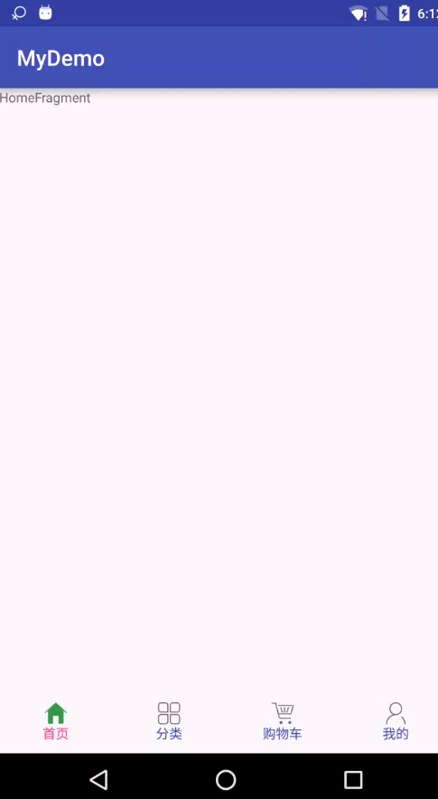

#  FragmentTabHost 介绍

FragmentTabHost可以很好的帮我们管理fragment，使用FragmentTabHost我们根本不需要处理**内存重启**后Fragmen的重叠或显示错乱的问题。所以掌握其用法很有必要

## 1 FragmentTabHost使用

### 1.1 布局文件

```xml
    <?xml version="1.0" encoding="utf-8"?>
    <android.support.v4.app.FragmentTabHost
        android:id="@android:id/tabhost"
        xmlns:android="http://schemas.android.com/apk/res/android"
        xmlns:tools="http://schemas.android.com/tools"
        android:layout_width="match_parent"
        android:layout_height="match_parent"
        tools:context="com.ztiany.mydemo.fragments.FragmentTabHostActivity">
    
    
        <LinearLayout
            android:layout_width="match_parent"
            android:layout_height="wrap_content"
            android:orientation="vertical">
    
            <!-- 这个布局决定了标签在上面还是在下面显示 -->
            <FrameLayout
                android:id="@android:id/tabcontent"
                android:layout_width="match_parent"
                android:layout_height="0dip"
                android:layout_weight="1"/>
    
    
            <TabWidget
                android:paddingBottom="10dp"
                android:paddingTop="10dp"
                android:id="@android:id/tabs"
                android:layout_width="match_parent"
                android:layout_height="wrap_content"
                android:orientation="horizontal"/>
        </LinearLayout>
    
    
    </android.support.v4.app.FragmentTabHost>
```

注意的地方： **id必须使用android中已经定义的id**

- `android:id/tabhost`
- `android:id/tabcontent`
- `android:id/tabs`


### 1.2 代码中设置Fragment

#### 主要代码

```java
    public class FragmentTabHostActivity extends AppCompatActivity {
    
        private FragmentTabHost mFragmentTabHost;
        private TabWidget mTabWidget;
        private String[] mTabNames = {
                "首页",
                "分类",
                "购物车",
                "我的"
        };
        private int[] mTabSrc = {
                R.drawable.tab_home_selector,
                R.drawable.tab_plaza_selector,
                R.drawable.tab_cart_selector,
                R.drawable.tab_my_selector
        };
    
    
        @Override
        protected void onCreate(Bundle savedInstanceState) {
            super.onCreate(savedInstanceState);
            setContentView(R.layout.activity_fragment_tab_host);
            findView();
            initFragments();//这里不需要判断savedInstanceState
            setTabListener();
        }
    
        private void findView() {
            mFragmentTabHost = (FragmentTabHost) findViewById(android.R.id.tabhost);
            mTabWidget = (TabWidget) findViewById(android.R.id.tabs);
    
        }
    
        private void initFragments() {
    
            mFragmentTabHost.setup(this, getSupportFragmentManager(), android.R.id.tabcontent);
    
            TabHost.TabSpec tabHome = mFragmentTabHost.newTabSpec("tabHome");
            tabHome.setIndicator(createTabView(0));
            mFragmentTabHost.addTab(tabHome, HomeFragment.class, null);
    
            TabHost.TabSpec tabPlaza = mFragmentTabHost.newTabSpec("tabPlaza");
            tabPlaza.setIndicator(createTabView(1));
            mFragmentTabHost.addTab(tabPlaza, PlazaFragment.class, null);
    
            TabHost.TabSpec tabShopping = mFragmentTabHost.newTabSpec("tabShopping");
    
            tabShopping.setIndicator(createTabView(2));
            mFragmentTabHost.addTab(tabShopping, ShoppingFragment.class, null);
    
            TabHost.TabSpec tabMine = mFragmentTabHost.newTabSpec("tabMine");
            tabMine.setIndicator(createTabView(3));
            mFragmentTabHost.addTab(tabMine, MineFragment.class, null);
    
    mFragmentTabHost.getTabWidget().setDividerDrawable(null);//去掉左右的分割线           
    mFragmentTabHost.getTabWidget().setStripEnabled(false);//去掉分割线
    
        }
    
        private void setTabListener() {
            mFragmentTabHost.setOnTabChangedListener(new TabHost.OnTabChangeListener() {
                @Override
                public void onTabChanged(String tabId) {
                    Log.d("FragmentTabHostActivity", tabId);
                }
            });
        }
    
        private View createTabView(int i) {
            AppCompatTextView textView = new AppCompatTextView(this);
            textView.setGravity(Gravity.CENTER);
            textView.setText(mTabNames[i]);
            textView.setTextColor(getResources().getColorStateList(R.color.tab_color));
            Drawable drawable = createDrawable(i);
            textView.setCompoundDrawablesWithIntrinsicBounds(null, drawable, null, null);
            return textView;
        }
    
        private Drawable createDrawable(int i) {
            int drawableId = mTabSrc[i];
            return getResources().getDrawable(drawableId);
        }
    }
```

Fragment：

```java
       public class HomeFragment extends BaseFragment {
    
        private AppCompatTextView mAppCompatTextView;
    
        @Override
        public void onAttach(Context context) {
            debugLifeCycle();
            super.onAttach(context);
        }
    
        @Nullable
        @Override
        public View onCreateView(LayoutInflater inflater, ViewGroup container, Bundle savedInstanceState) {
        //没必要每次都重建视图
            if (mAppCompatTextView == null) {
                mAppCompatTextView = new AppCompatTextView(getContext());
                Log.d(tag(), "onCreateView() called with: " + "HomeFragment");
    
                mAppCompatTextView.setText("HomeFragment");
                mAppCompatTextView.setOnClickListener(new View.OnClickListener() {
                    @Override
                    public void onClick(View v) {
    
                    }
                });
            }
    
            return mAppCompatTextView;
        }
    }
```

#### 资源文件

tabColor：

```xml
    <selector xmlns:android="http://schemas.android.com/apk/res/android">
    
        <item android:color="@color/colorAccent" android:state_selected="true"/>
        <item android:color="@color/colorPrimary" android:state_selected="false"/>
        <item android:color="@color/colorPrimary"/>
    
    </selector>
```

drawable

```xml
    <selector xmlns:android="http://schemas.android.com/apk/res/android">
    
        <item android:drawable="@drawable/tab_follow_circle_select" android:state_selected="true"/>
        <item android:drawable="@drawable/tab_follow_circle_nor" android:state_selected="false"/>
        <item android:drawable="@drawable/tab_follow_circle_nor"/>
    </selector>
```

### 2.3 界面



---
## 3 处理好生命周期的回调

```
    进入界面
    HomeFragment-->onAttach
    HomeFragment-->onCreate
    onCreateView() called with: HomeFragment
    HomeFragment-->onViewCreated
    HomeFragment-->onActivityCreated
    HomeFragment-->onStart
    HomeFragment-->onResume
    
    到第二个界面
    PlazaFragment-->onAttach
    PlazaFragment-->onCreate
    HomeFragment-->onPause
    HomeFragment-->onStop
    HomeFragment-->onDestroyView
    onCreateView() called with: PlazaFragment
    PlazaFragment-->onViewCreated
    PlazaFragment-->onActivityCreated
    PlazaFragment-->onStart
    PlazaFragment-->onResume
    
    回到第一个界面
    PlazaFragment-->onPause
    PlazaFragment-->onStop
    PlazaFragment-->onDestroyView
    onCreateView() called with: HomeFragment
    HomeFragment-->onViewCreated
    HomeFragment-->onActivityCreated
    HomeFragment-->onStart
    HomeFragment-->onResume
    
    在第一个界面中进入其他Activity
    HomeFragment-->onPause
    HomeFragment-->onStop
    
    从其他Activity回调第一个界面
    HomeFragment-->onStart
    HomeFragment-->onResume
    
    退出当前界面
    HomeFragment-->onPause
    HomeFragment-->onStop
    HomeFragment-->onDestroyView
    HomeFragment-->onDestroy
    HomeFragment-->onDetach
    PlazaFragment-->onDestroy
    PlazaFragment-->onDetach
```

从生命周期的回调可以看出`FragmentTabHost`使用的是`attach`和`detach`来管理Fragment的。个人觉得这种方式比show+hide更加灵活。