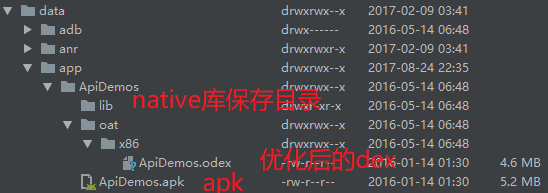

# Apk的安装过程

Apk的安装是通过PackageManagerService完成的，可以在shell中使用pm命令安装apk，但是pm命令也是调用的PackagManagerService。

---
## 1 Pm命令分析

pm命令由`frameworks/base/cmds/pm`下的Pm类实现，部分代码如下：

```java
public final class Pm {

    //PackageManagerService接口
    IPackageManager mPm;
    IPackageInstaller mInstaller;
    IUserManager mUm;

    //参数
    private String[] mArgs;
    private int mNextArg;
    private String mCurArgData;

    //main函数
    public static void main(String[] args) {
        int exitCode = 1;
        try {
            //创建Pm对象，执行pm命令
            exitCode = new Pm().run(args);
        } catch (Exception e) {
            Log.e(TAG, "Error", e);
            System.err.println("Error: " + e);
            if (e instanceof RemoteException) {
                System.err.println(PM_NOT_RUNNING_ERR);
            }
        }
        System.exit(exitCode);
    }

 //这里执行pm命令
 public int run(String[] args) throws IOException, RemoteException {
        boolean validCommand = false;
        if (args.length < 1) {
            return showUsage();
        }
        //这里通过系统的ServiceManager获取远程服务
        mUm = IUserManager.Stub.asInterface(ServiceManager.getService("user"));
        mPm = IPackageManager.Stub.asInterface(ServiceManager.getService("package"));

        if (mPm == null) {
            System.err.println(PM_NOT_RUNNING_ERR);
            return 1;
        }
        mInstaller = mPm.getPackageInstaller();

        mArgs = args;
        String op = args[0];
        mNextArg = 1;
        //......省略代码
        //如果是install命令则执行runInstall方法
        if ("install".equals(op)) {
            return runInstall();
        }
        //......省略代码
  }


 private int runInstall() {
    // .......省略代码

    LocalPackageInstallObserver obs = new LocalPackageInstallObserver();
        try {
            VerificationParams verificationParams = new VerificationParams(verificationURI,
                    originatingURI, referrerURI, VerificationParams.NO_UID, null);

            //调用PackageManagerService的installPackageAsUser方法来安装apk
            //这是一个跨进程调用
            mPm.installPackageAsUser(apkFilePath, obs.getBinder(), installFlags,
                    installerPackageName, verificationParams, abi, userId);

            //等待安装结果
            synchronized (obs) {
                while (!obs.finished) {
                    try {
                        obs.wait();
                    } catch (InterruptedException e) {
                    }
                }
                //输出结果
                if (obs.result == PackageManager.INSTALL_SUCCEEDED) {
                    System.out.println("Success");
                    return 0;
                } else {
                    System.err.println("Failure ["+ installFailureToString(obs) + "]");
                    return 1;
                }
            }
        } catch (RemoteException e) {
            System.err.println(e.toString());
            System.err.println(PM_NOT_RUNNING_ERR);
            return 1;
        }
 }
```
可以看到，Pm在runInstall方法中，调用了mPm(IPackageManager)的installPackageAsUser方法。

---
## 2 PackageManagerService

Android系统在启动的过程中，会启动一个应用程序管理服务PackageManagerService，这个服务负责扫描系统中特定的目录，找到里面的已安装的应用程序文件(即以Apk为后缀的文件)，然后对这些文件进解析，得到应用程序的相关信息，完成应用程序的解析过程，下面是PackageManagerService在启动的时候会扫码的系统目录：

- `/system/framework`
- `/system/app`
- `/vendor/app`
- `/data/app`
- `/data/app-private`

---
在安装Apk时，会调用PackageManagerService的installPackageAsUser方法，把Apk文件复制到安装目录下(比如`/data/app`)，然后执行相应的apk解析操作，PMS的源码在`frameworks/base/services/core`目录下。

PackageManagerService实现了IPackageManager.Stub，很明显是一个Binder结构：

```java
public class PackageManagerService extends IPackageManager.Stub {
     .......
}
```


### installPackageAsUser

```java
    public void installPackageAsUser(String originPath, IPackageInstallObserver2 observer,
            int installFlags, String installerPackageName, VerificationParams verificationParams,
            String packageAbiOverride, int userId) {

        //省略各种权限检测代码

        final Message msg = mHandler.obtainMessage(INIT_COPY);
        msg.obj = new InstallParams(origin, null, observer, installFlags, installerPackageName,
                null, verificationParams, user, packageAbiOverride, null);
        mHandler.sendMessage(msg);
    }
```
installPackageAsUser方法首先会检查安装权限，如果具备安装权限，就会创建一个InstallParams对象，发送INIT_COPY消息给内部的mHandler处理。

### doHandleMessage

通过追踪源码，发现`INIT_COPY`在doHandleMessage方法中处理

#### INIT_COPY处理

```java
 case INIT_COPY: {
                    //获取InstallParams，InstallParams是HandlerParams的子类
                    HandlerParams params = (HandlerParams) msg.obj;
                    int idx = mPendingInstalls.size();

                    // If a bind was already initiated we dont really
                    // need to do anything. The pending install
                    // will be processed later on.
                    /*安装apk的操作还需要一个服务，只有这个服务被bind了，才行进行下一步的工作，也就是通过handler继续发送一个消息。(这个服务是com.android.defcontainer.DefaultContainerService,它的作用就是用来解析APK，以及获取推荐安装路径的，安装的路径与内存情况以及一些标识来决定)*/
                    //如果服务没有被bind，先获取服务，然后把安装行为保证到mPendingInstalls中
                    if (!mBound) {
                        // If this is the only one pending we might
                        // have to bind to the service again.
                        if (!connectToService()) {
                            Slog.e(TAG, "Failed to bind to media container service");
                            params.serviceError();
                            return;
                        } else {
                            // Once we bind to the service, the first
                            // pending request will be processed.
                            mPendingInstalls.add(idx, params);
                        }
                    }
                    //如果服务已经被bind了，则直接添加，然后发送MCS_BOUND
                    else {
                        mPendingInstalls.add(idx, params);
                        // Already bound to the service. Just make
                        // sure we trigger off processing the first request.
                        if (idx == 0) {
                            mHandler.sendEmptyMessage(MCS_BOUND);
                        }
                    }
                    break;
                }
```

#### MCS_BOUND处理
```java
 case MCS_BOUND: {
                    if (msg.obj != null) {
                        mContainerService = (IMediaContainerService) msg.obj;
                    }
                    if (mContainerService == null) {
                        if (!mBound) {
                            // .......省略代码
                            //如果还没有绑定服务，就清空安装行为
                            mPendingInstalls.clear();
                    } else if (mPendingInstalls.size() > 0) {
                        HandlerParams params = mPendingInstalls.get(0);
                        if (params != null) {
                        //startCopy执行具体的安装步骤
                            if (params.startCopy()) {
                                //安装完毕后则移除任务
                                if (mPendingInstalls.size() > 0) {
                                    mPendingInstalls.remove(0);
                                }
                                //如果所有的安装任务就执行完了，就断开服务连接
                                if (mPendingInstalls.size() == 0) {
                                    if (mBound) {
                                        removeMessages(MCS_UNBIND);
                                        Message ubmsg = obtainMessage(MCS_UNBIND);
                                        sendMessageDelayed(ubmsg, 10000);
                                    }
                                } else {
                                    //还有安装任务就继续执行下一个安装任务
                                    mHandler.sendEmptyMessage(MCS_BOUND);
                                }
                            }
                        }
                    }
                    // .......省略代码
                    break;
                }
```

### HandlerParams

上面分析到调用了HandlerParams的startCopy方法
```java
     final boolean startCopy() {
            boolean res;
            try {
                //这里有重试处理，如果超过最大重试次数则放弃安装
                if (++mRetries > MAX_RETRIES) {
                    mHandler.sendEmptyMessage(MCS_GIVE_UP);
                    handleServiceError();
                    return false;
                } else {
                    //这里是执行真正的安装逻辑
                    handleStartCopy();
                    res = true;
                }
            } catch (RemoteException e) {
                mHandler.sendEmptyMessage(MCS_RECONNECT);
                res = false;
            }
            //在执行安装完毕后，处理返回结果
            handleReturnCode();
            return res;
        }

```
startCopy方法做了为三件事：
- 失败后的重试安装
- 调用handleStartCopy方法完整apk的安装
- 安装完毕后调用handleReturnCode方法返回结果

### handleStartCopy

HandlerParams是一个抽象类，执行Apk安装的是其子类InstallParams，InstallParams的handleStartCopy方法非常长，主要做功能是：

InstallParams的handleStartCopy()的主要内容是通过`com.android.defcontainer.DefaultContainerService`来获取apk的推荐安装路径，通过这个路径来确定是内部安装还是SD卡安装，在方法的末尾，根据路径来创建不同的InstallArgs,分别是FileInstallArgs和SdInstallArgs，然后执行各自的copyApk()方法。

```java
public void handleStartCopy() throws RemoteException {
   int ret = PackageManager.INSTALL_SUCCEEDED;
   // .......省略代码
   final InstallArgs args = createInstallArgs(this);
   // .......省略代码
   ret = args.copyApk(mContainerService, true);
   // .......省略代码
}

private InstallArgs createInstallArgs(InstallParams params) {
        if (params.move != null) {
            return new MoveInstallArgs(params);
        } else if (installOnExternalAsec(params.installFlags) || params.isForwardLocked()) {
            return new AsecInstallArgs(params);
        } else {
            return new FileInstallArgs(params);
        }
}
```

### FileInstallArgs copyApk
```java
int copyApk(IMediaContainerService imcs, boolean temp) throws RemoteException {
            // .......省略代码
            try {
                final File tempDir = mInstallerService.allocateStageDirLegacy(volumeUuid);
                codeFile = tempDir;
                resourceFile = tempDir;
            } catch (IOException e) {
                return PackageManager.INSTALL_FAILED_INSUFFICIENT_STORAGE;
            }


            int ret = PackageManager.INSTALL_SUCCEEDED;
            //执行安装操作，把APK给复制到/data/app下，这个的路径可以通过context.getPackageCodePath()获取到
            ret = imcs.copyPackage(origin.file.getAbsolutePath(), target);

            if (ret != PackageManager.INSTALL_SUCCEEDED) {
                return ret;
            }

            final File libraryRoot = new File(codeFile, LIB_DIR_NAME);
            NativeLibraryHelper.Handle handle = null;
            try {
                handle = NativeLibraryHelper.Handle.create(codeFile);
                ret = NativeLibraryHelper.copyNativeBinariesWithOverride(handle, libraryRoot, abiOverride);
            } catch (IOException e) {
                ret = PackageManager.INSTALL_FAILED_INTERNAL_ERROR;
            } finally {
                IoUtils.closeQuietly(handle);
            }
            return ret;
        }
```


### handleReturnCode

apk复制到指定目录后，就会执行handleReturnCode方法，完全apk的解析等操作

```java
void handleReturnCode() {
            if (mArgs != null) {
                processPendingInstall(mArgs, mRet);
            }
}
```
handleReturnCode调用了processPendingInstall方法

### processPendingInstall
```java
private void processPendingInstall(final InstallArgs args, final int currentStatus) {

        mHandler.post(new Runnable() {
            public void run() {
                mHandler.removeCallbacks(this);

                PackageInstalledInfo res = new PackageInstalledInfo();
                res.returnCode = currentStatus;
                res.uid = -1;
                res.pkg = null;
                res.removedInfo = new PackageRemovedInfo();
                if (res.returnCode == PackageManager.INSTALL_SUCCEEDED) {
                    //doPreInstall和doPostInstall的作用就是把我们安装过程中的临时文件删除
                    args.doPreInstall(res.returnCode);
                    synchronized (mInstallLock) {
                    //installPackageLI是执行真正的安装操作
                        installPackageLI(args, res);
                    }
                    args.doPostInstall(res.returnCode, res.uid);
                }
                
                // .......省略代码
                
                //发送一个POST_INTALL消息，告诉系统是否安装完毕。
                if (!doRestore) {
                    if (DEBUG_INSTALL) Log.v(TAG, "No restore - queue post-install for " + token);
                    Message msg = mHandler.obtainMessage(POST_INSTALL, token, 0);
                    mHandler.sendMessage(msg);
                }
            }
        });
    }
```

processPendingInstallf方法中调用了`doPreInstall()和installPackageLI(),doPostInstall()`三个关键方法，doPreInstall和doPostInstall的作用就是把安装过程中产生的临时文件删除，installPackageLI就是我们的真正的安装操作。 然后安装之后，发送一个POST_INTALL消息，告诉系统是否安装完毕。

### installPackageLI

installPackageLI方法非常长，主要功能有：
- 使用PackageParser对apk包进行解析
- 判断是升级apk还是安装新的apk
- 执行dex优化和替换，执行so的库的导出

```java
 private void installPackageLI(InstallArgs args, PackageInstalledInfo res) {
        // .......省略代码
        if (replace) {
        //升级替换
            replacePackageLI(pkg, parseFlags, scanFlags | SCAN_REPLACING, args.user,
                    installerPackageName, volumeUuid, res);
        } else {
        //安装新apk
            installNewPackageLI(pkg, parseFlags, scanFlags | SCAN_DELETE_DATA_ON_FAILURES,
                    args.user, installerPackageName, volumeUuid, res);
        }
 }
```

对APK进行解析时，会把apk中的信息存储到PackageManagerService中。了解4大组件的启动过程就会知道，需要从PackageManagerService中对应组件的信息，这些信息就是在安装时解析存储到PackageMangerService中的。

---
## 3 安装路径

安装一个APK时：

1. APK中的AndroidManifest.xml被解析，解析的内容会被存储到`/data/system/packages.xml`和`/data/system/packages.list`中。packages.list中指名了该应用默认存储的位置`/data/data/cn.ztiany.sample`packages.xml中包含了该应用申请的权限、签名和代码所在位置等信息，并且两者都有一个userId为10060。之所以每个应用都有一个userId，是因为Android在系统设计上把每个应用当作Linux系统上的一个用户对待，这样就可以利用已有的Linux上用户管理机制来设计Android应用，比如应用目录，应用权限，应用进程管理等。
2. 接下来是保存应用的执行文件，根据packages.xml中指定的codePath，创建一个目录，apk会被命名成base.apk并拷贝到此，其中lib目录用来存放native库。目录是由包名-1 组成，有时候此处是 -2。这是为了升级使用，升级时会新创建一个-1 或 -2的目录，如果升级成功，则删除原目录并更改packages.xml中codePath到新目录。
3. ODEX：如果每次应用运行还得去base.apk中取dex文件，效率就太低了。为了提升效率，Android系统在应用安装时还会做些优化操作，把所有可运行的dex文件单独提取放在一块并做些优化。在Dalvik模式下，会使用dexopt把base.apk中的dex文件优化为odex，存储在/data/dalvik-cache中，如果是ART模式，则会使用dex2oat优化成oat文件也存储在该目录下，并且文件名一样，但文件大小会大很多，因为ART模式会在安装时把dex优化为机器码，所以在ART模式下的应用运行更快，但apk安装速度相对Dalvik模式下变慢，并且会占用更多的ROM。




---
## 引用

- [Android应用程序安装过程源代码分析](http://blog.csdn.net/luoshengyang/article/details/6766010)
- [android apk安装过程源码解析](http://blog.csdn.net/qq_27540131/article/details/75042662)
- [understanding-the-apk-installation-process](https://stackoverflow.com/questions/12442979/android-understanding-the-apk-installation-process)