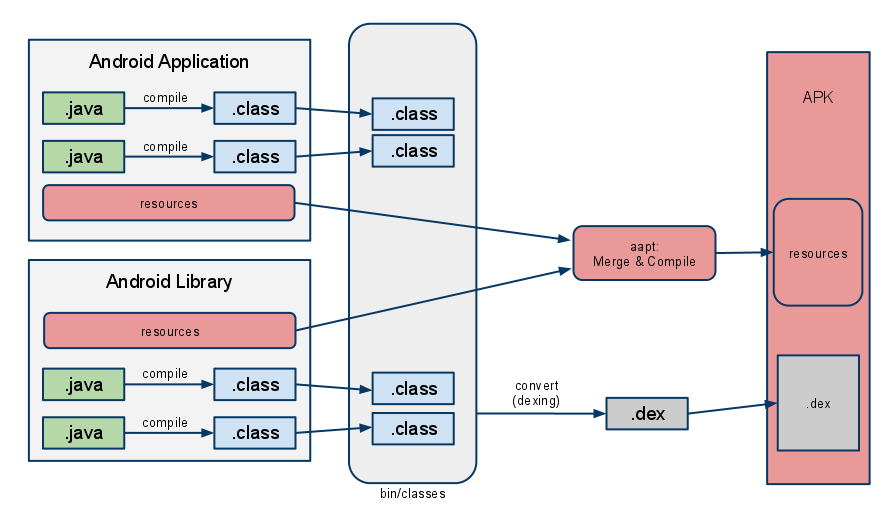

# APK打包流程

APK其实就是一个zip压缩包，解压一个Apk后可以得到如下文件：

```
├─assets   //apk资产文件
│  ├─address
│  ├─amap_sdk_shaders
│  └─fonts
│
├─classes.dex  //dex
│
├─resources.arsc  //具有ID值的资源的配置信息，它的内容就相当于是一个资源索引表。
│
├─lib        //so库
│  └─armeabi-v7a
│
└─res         //资源目录
    ├─anim
    ├─anim-v21
    ├─animator-v21
    ├─color
    ├─color-v11
    ├─color-v23
    ├─drawable
    ├─...各种文件
```

---
## 1 流程图

Android官方APK打包流程图：




---
## 2 流程说明

根据上图，可以把打包过程总结如下

### 2.1 打包资源文件，生成R.java文件

打包资源的工具是**aapt**（Android Asset Packaing Tool），位于`android-sdk/platform-tools`目录下。在这个过程中，项目中的`AndroidManifest.xml`文件和布局文件XML都会编译，然后生成相应的R.jva。

### 2.2 处理aidl文件，生成相应的Java文件

这一过程中使用到的工具是**aidl**（Android Interface Definition Language），即Android接口描述语言。位于`android-sdk/platform-tools`目录下。aidl工具解析接口定义文件然后生成相应的Java代码接口供程序调用。如果在项目没有使用到aidl文件，则跳过这一步。

### 2.3 编译项目源代码，生成class文件

项目中所有的Java代码，包括`R.java`和`.aidl`文件，都会由Java编译器（javac）编译成`.class`文件，生成的class文件位于工程中的build目录下。

### 2.4 转换所有的class文件，生成classes.dex文件

**dx**工具生成可供Android系统Dalvik和ART虚拟机执行的`classes.dex`文件，该工具位于`android-sdk/platform-tools`目录下。任何第三方的libraries和.class文件都会被转换成.dex文件。dx工具的主要工作是将Java字节码转成成Dalvik字节码、压缩常量池、消除冗余信息等。

###  2.5 打包生成APK文件

在打包apk文件之前需要通过appt工具打包资源文件，apk包中的资源文件都是经过编译过的，是二进制文件。资源打包过程将AndroidManifest.xml与res目录除了assets目录以外的文件进行编译，生成resource.arsc和若干二进制的xml文件。资源ID和资源文件的对应关系都是在resource.arsc中的。这些文件都会被打包到res.apk中。

所有没有编译的资源（如images等）、编译过的资源和.dex文件都会被**apkbuilder**工具打包到最终的`.apk`文件中。打包的工具apkbuilder位于`android-sdk/tools`目录下。apkbuilder为一个脚本文件，实际调用的是`android-sdk/tools/lib/sdklib.ja`r文件中的`com.android.sdklib.build.ApkbuilderMain`类。

###  2.6 对APK文件进行签名

一旦APK文件生成，它必须被签名才能被安装在设备上。

### 2.7 对签名后的APK文件进行对齐处理

发布正式版的apk，就必须对APK进行对齐处理，用到的工具是**zipalign**，它位于`android-sdk/tools`目录下。对齐的主要过程是将APK包中**所有的资源文件距离文件起始偏移为4字节整数倍**，这样通过内存映射访问apk文件时的速度会更快。对齐的作用就是减少运行时内存的使用。

---
## 3 手动实现一次打包过程

平时在开发时，只需要点击AndroidStudio的run即可以自动打包，其内部都是上诉步骤来生成APK的，如果自己手动实现一次APK打包流程的话，则可以加深理解。

具体参考[自己动手生成Android Apk](http://blog.csdn.net/chenkai19920410/article/details/60589100)


---
## 4 问题

### 4.1 Android是如何通过R文件引用到真正的资源文件？

aapt工具对于每个资源文件生成了唯一的ID，这些ID保存在R.java文件中。资源ID是一个4字节的无符号整数，在R.java文件中用16进制表示。其中，最高的1字节表示Package ID，次高1个字节表示Type ID，最低2字节表示Entry ID。只有一个ID如何能引用到实际资源呢？实际上aapt工具还生成了一个文件resources.arsc，相当于一个资源索引表，或者你理解成一个map也行，map的key是资源ID，value是资源在apk文件中的路径。resources.arsc里面还有其他信息。通过R.java文件和resources.arsc配合，就能引用到实际的资源文件。

### 4.2 打包流程中的的对齐是什么，为什么要对齐？

第7步已经阐述了对齐所做的工作，为什么要进行对齐，这是为了加快资源的访问速度。如果每个资源的开始位置都是上一个资源之后的 `4*n`字节，那么访问下一个资源就不用遍历，直接跳到4*n字节处判断是不是一个新的资源即可。如果举例子，那么对齐有点类似于资源数组化，数组的访问速度当然比链表快。

### 4.3 为什么要把xml文件编译成二进制文件？

xml里面都是各种字符，不利于快速遍历。编译成二进制文件，用数字替换各种符号，一方面能快速访问，另一方面也能减少APK的大小。

---
## 引用

[Android打包流程](https://mp.weixin.qq.com/s?__biz=MjM5NDkxMTgyNw==&mid=2653059035&idx=1&sn=50773de47cfbbf54a4521e141b93125d&chksm=bd5654e78a21ddf11dfde7366de2722a2945d0003d3b413b221c89fc07fd66abd0def480ff5e&mpshare=1&scene=1&srcid=0802VY4KGr2wHrS30pBI1Kme#rd)


