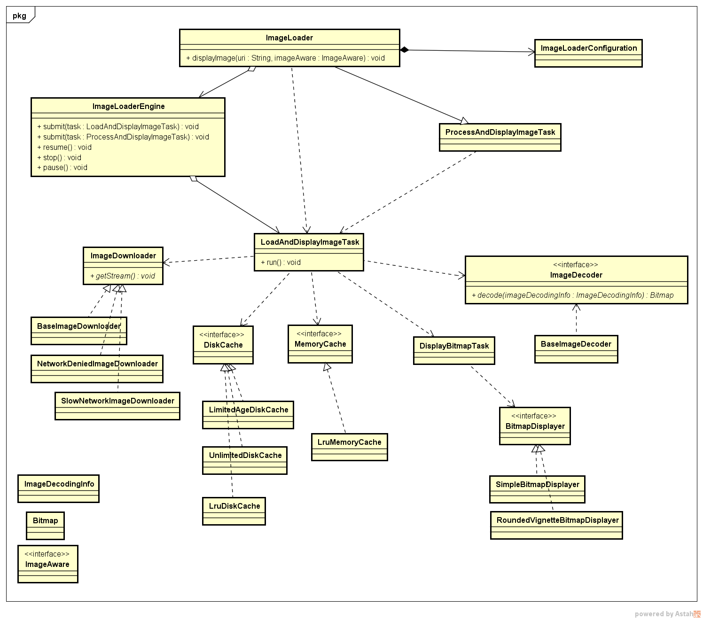

# [Android-Universal-Image-Loader](https://github.com/nostra13/Android-Universal-Image-Loader) 分析

---
## 1 ImageLoader 的整体框架介绍

### 相关类的介绍

主要类：

 - ImageLoader 全局单例，提供显示或加载图片的功能，相当于门面
 - ImageLoaderConfiguration 图片加载的全局配置类
 - ImageLoaderEngine 任务调度器
 - LoadAndDisplayImageTask 真正用来加载图片的任务类，实现了Runnable接口
 - ImageDecoder 图片解码器
     - BaseImageDecoder 实现了ImageDecoder接口
 - ImageDownloader 图片下载器接口
      - Scheme 内部枚举，定义了图片下载的方案，如http，file，assets
      - BaseImageDownloader 实现了ImageDownloader接口，主要的图片下载器实现
      - SlowNetworkImageDownloader  实现了ImageDownloader接口
      - NetworkDeniedImageDownloader  实现了ImageDownloader接口

辅助类：

- ImageLoadingInfo 描述了一个加载任务的信息，key，uri，监听器等
 - ImageSize 图片尺寸的抽象
 - ImageAware 抽象显示显示图片、获取显示尺寸，缩放类型的接口
 - DefaultConfigurationFactory 整个库的一些默认配置工厂
 - DisplayImageOptions 任务的配置类
 - ImageDecodingInfo 需要被解码的图片的信息，如uri,key,imageScaleType等

工具类：

- ImageSizeUtils 计算图片尺寸


### 整体设计

首先实现一个图片加载框架都需要考虑哪些问题：

- 是什么View需要显示图片(不只是ImageView吧)，实现图片的尺寸与缩放类型
- 是同步加载图片还是异步加载图片，如果是异步加载图片，如何设计异步任务调度
- 图片加载之后可能需要进行缓存，如何实现内存缓存与磁盘缓存，以及实现配置是否对图片进行缓存
- 图片被加载之后可能需要对图片进行处理，并且希望让用户自由的实现对图片的处理
- 图片加载的过程可能是一个比较耗时的过程，也有可能会失败，希望可以配置这些情况下默认显示的图片，以及监听到这些情况
- 首先图片肯定是以流的方式加载，即源对象为InputStream类型，那么如何把流转变为Android中的Bitmap，在这个过程中又需要对图片的尺寸进行处理，以防止oom
- 加载图片的来源可能有多种，比如resoure，assets，file，network等，如何从这些源中获取到inputStream
- 图片被加载到后，如何显示，是直接设置给View还行需要展示一个渐入动画在展示
- 图片的加载很有可能用于列表中，那么由于Android列表Item的复用机制，如何去避免在列表滑动的过程中导致是图片跳动问题。
- 希望可以控制图片加载，比如暂停，恢复，停止等。

以上的这些问题都是需要考虑到的，而ImageLoader也实现了这些功能，并且这些功能的实现都是可配置的。ImageLoader是如何做到的呢？

ImageLoader的整体设计如下：



ImageLoader把上面提到的各种功能都抽象为接口，以达到可以自由配置各种具体功能的实现。充分的体现了类的单一原则。


---
## 2 相关类详解

### ImageLoaderConfiguration

ImageLoader在使用之前可以进行一些全局的配置，使用的是ImageLoaderConfiguration类，这个类在初始化后可以调用ImageLoader的init方法设置给ImageLoader，在此之后ImageLoaderConfiguration对象内部配置的各种信息与功能组件将为ImageLoader在加载图片的过程提供各种服务，这些组件包括：

```
     final int maxImageWidthForMemoryCache;//缓存在内存中的图片允许的最大图片宽度，在对图片进行缩放时以此作为参考
     final int maxImageHeightForMemoryCache;//同上
     final int maxImageWidthForDiskCache;
     final int maxImageHeightForDiskCache;
     final BitmapProcessor processorForDiskCache;//图片处理器，

     final Executor taskExecutor;//加载图片的执行器
     final Executor taskExecutorForCachedImages;//加载缓存图片的执行器

     final boolean customExecutor;//自定义的执行器，如果设置了自定义的执行器， 那么就会使用自定义的执行器
     final boolean customExecutorForCachedImages;//自定义的加载缓存图片的执行器

     final int threadPoolSize;//执行器线程池的核心线程数量
     final int threadPriority;//线程优先级
     final QueueProcessingType tasksProcessingType;

     final MemoryCache memoryCache;//内存缓存
     final DiskCache diskCache;//磁盘缓存
     final ImageDownloader downloader;//图片下载器
     final ImageDecoder decoder;//图片解码器，把InputStream转换为Bitmap
     final DisplayImageOptions defaultDisplayImageOptions;//默认的显示图片的配置

     final ImageDownloader networkDeniedDownloader;//禁用网络是的图片下载器
     final ImageDownloader slowNetworkDownloader;//慢网络状态时的图片下载器
```

这些配置的将作为ImageLader加载图片的全局功能组件。这也充分的体现了ImageLoader的高度可配置性。

这么多信息需要配置给ImageLoaderConfiguration，使用构造方法注入式不现实的，使用setter方式也不够优雅，所以这里ImageLoaderConfiguration使用的是构建者模式。比如：

```
     ImageLoaderConfiguration config = new ImageLoaderConfiguration.Builder(context)
                 .memoryCacheExtraOptions(320, 480)    // max width, max height，即保存的每个缓存文件的最大长宽
                 .threadPoolSize(3)    // 线程池内加载的数量
                 .threadPriority(Thread.NORM_PRIORITY - 1)
                 .denyCacheImageMultipleSizesInMemory()
                 .memoryCache(new UsingFreqLimitedMemoryCache(memoryCacheSize))
                 .memoryCacheSize(2 * 1024 * 1024)
                 .diskCacheSize(30 * 1024 * 1024)     
                 .tasksProcessingOrder(QueueProcessingType.LIFO)
                 .diskCache(new UnlimitedDiskCache(cacheDir))
                 .defaultDisplayImageOptions(DisplayImageOptions.createSimple())
                 .imageDownloader(new BaseImageDownloader(context, 5 * 1000, 30 * 1000)) // connectTimeout
                 .writeDebugLogs() // Remove for release app
                 .build();// 开始构建

             ImageLoader.getInstance().init(config);// 全局初始化此配置
```

这样就完成了ImageLoader的全局配置。

### ImageLoader

ImageLoader使用了单例模式，提供了加载图片与操作缓存等一系列方法：

 - loadImage() 有多个重载方法
 - loadImageSync 有多个重载方法
 - clearMemoryCache 清空内存缓存
 - clearDiskCache 情况磁盘缓存
 - pause/resume/stop/destroy 暂停/恢复/停止/销毁图片加载

ImageLoader 有如下成员变量：

```
     private ImageLoaderConfiguration configuration;//全局配置
     private ImageLoaderEngine engine;//任务分发器，管理执行异任务的线程池
     private ImageLoadingListener defaultListener = new SimpleImageLoadingListener();//默认监听器
```

虽有有很多加载图片的方法，但是最终都会调用到下面这个方法(不管是同步的还是异步的)：

```
    /*
     显示图片最终都会调用此方法
      */
     public void displayImage(String uri, ImageAware imageAware, DisplayImageOptions options,
             ImageSize targetSize, ImageLoadingListener listener, ImageLoadingProgressListener progressListener) {

             /*
                 uri 即图片的源地址
                 targetSize 封装了希望加载图片的尺寸 一般为null
                 imageAware 封装了显示图片的View，默认使用ImageViewAware封装ImageView
                 options 加载这个图片的配置
                 listener 加载图片的结果监听
                 progressListener 加载图片的进度监听

             */

        checkConfiguration();//判断是否设置了configuration

        if (imageAware == null) {
             throw new IllegalArgumentException(ERROR_WRONG_ARGUMENTS);
         }

        //如果某些参数为null，则配置默认的参数
         if (listener == null) {
             listener = defaultListener;
         }
         if (options == null) {
             options = configuration.defaultDisplayImageOptions;
         }

        if (TextUtils.isEmpty(uri)) {//如果资源是空的
             engine.cancelDisplayTaskFor(imageAware);//取消之前的加载任务
             listener.onLoadingStarted(uri, imageAware.getWrappedView());//回调任务开始
             if (options.shouldShowImageForEmptyUri()) {//显示空url是的占位图

                imageAware.setImageDrawable(options.getImageForEmptyUri(configuration.resources));//显示预设的空地址图片

            } else {
                 imageAware.setImageDrawable(null);
             }
             listener.onLoadingComplete(uri, imageAware.getWrappedView(), null);
             return;
         }

        // 如果没有指定加载图片的尺寸，则通过imageAware和配置的默认的图片尺寸来计算
         // 默认的行为是如果没有获取到图片的大小，就使用最大的图片尺寸
         if (targetSize == null) {
             targetSize = ImageSizeUtils.defineTargetSizeForView(imageAware, configuration.getMaxImageSize());
         }

        //跟根据Uri和目标尺寸生产一个唯一的key，所以默认的缓存是根据uri和加载图片大小进行缓存的
         String memoryCacheKey = MemoryCacheUtils.generateKey(uri, targetSize);

        //这里是把imageAware对应View的id作为key，把memoryCacheKey作为value放入放入一个同步的
         //map中，这里的作用有：
         // 1：防止在列表中因为View的复用而导致图片错乱调到，因为最后加载到图片显示时或根据这里的key和value进行判断，是最初的任务才会去显示
         engine.prepareDisplayTaskFor(imageAware, memoryCacheKey);//准备加载任务

        listener.onLoadingStarted(uri, imageAware.getWrappedView());

        Bitmap bmp = configuration.memoryCache.get(memoryCacheKey);//从内存中加载图片

        if (bmp != null && !bmp.isRecycled()) { //内存命中

            L.d(LOG_LOAD_IMAGE_FROM_MEMORY_CACHE, memoryCacheKey);

            if (options.shouldPostProcess()) {//是否要处理图片
                 //构建任务
                 ImageLoadingInfo imageLoadingInfo = new ImageLoadingInfo(uri, imageAware, targetSize, memoryCacheKey,
                         options, listener, progressListener, engine.getLockForUri(uri));
                 ProcessAndDisplayImageTask displayTask = new ProcessAndDisplayImageTask(engine, bmp, imageLoadingInfo,
                         defineHandler(options));
                 //同步或异步执行任务
                 if (options.isSyncLoading()) {
                     displayTask.run();
                 } else {
                     engine.submit(displayTask);
                 }
             } else {//不需要处理就直接显示图片
                 options.getDisplayer().display(bmp, imageAware, LoadedFrom.MEMORY_CACHE);
                 listener.onLoadingComplete(uri, imageAware.getWrappedView(), bmp);
             }
         } else {//没有从内存缓存中加载到图片
             if (options.shouldShowImageOnLoading()) {//显示loading
                 imageAware.setImageDrawable(options.getImageOnLoading(configuration.resources));
             } else if (options.isResetViewBeforeLoading()) {//需要重置就先设置空的Drawable
                 imageAware.setImageDrawable(null);
             }

            //构建加载任务
             ImageLoadingInfo imageLoadingInfo = new ImageLoadingInfo(uri, imageAware, targetSize, memoryCacheKey,
                     options, listener, progressListener, engine.getLockForUri(uri));
             LoadAndDisplayImageTask displayTask = new LoadAndDisplayImageTask(engine, imageLoadingInfo,
                     defineHandler(options));

            if (options.isSyncLoading()) {//同步异步
                 displayTask.run();
             } else {
                 engine.submit(displayTask);
             }
         }
     }
```

displayImage方法虽然有点长，但是逻辑确实比较清晰，主要做了一下事情：

 1. 检查配置与参数
 2. 如果参数合法，则为加载任务准备ImageSize和生产memoryCacheKey，并把此次任务对应的id和memoryCacheKey放入一个map中保存
 3. 首先从内存中根据memoryCacheKey加载图片，如果获取到了图片，则从DisplayImageOptions获取BitmapDisplayer来显示图片，这里如果DisplayImageOptions中设置了BitmapProcessor，还会先对图片进行处理，然后再显示。
 4. 如果中没有获取到图片，则会构建ImageLoadingInfo把display方法的参数封装起来，然后构建一个LoadAndDisplayImageTask任务，如果是同步加载图片的话就直接任务LoadAndDisplayImageTask的run方法加载图片，否则会把LoadAndDisplayImageTask提交给任务调度器ImageLoaderEngine执行。

### ImageAware

ImageAware用于封装Android中的View，抽象了获取加载图片必要的信息与View如何显示图片的行为，因为在Android中并不是只有ImagView才能显示图片，所有的View都可以，所以这里对做了一个抽象。

```
        public interface ImageAware {
            int getWidth();//显示图片的宽度
            int getHeight();//显示图片的高度
            ViewScaleType getScaleType();//缩放类型
            View getWrappedView();//获取包装的view
            boolean isCollected();
            int getId();//View的id
            boolean setImageDrawable(Drawable drawable);
            boolean setImageBitmap(Bitmap bitmap);
     }
```

而默认的ImageView会使用ImageViewAware来封装，ImageVIewAware继承自ViewAware，ViewAware采用WeakReference的方式来引用View，防止内存泄漏的发生，来看一下ImageVIewAware是如何获取其封装的View的size的。

```
    public int getWidth() {
         View view = viewRef.get();
         if (view != null) {
             final ViewGroup.LayoutParams params = view.getLayoutParams();
             int width = 0;
             if (checkActualViewSize && params != null && params.width != ViewGroup.LayoutParams.WRAP_CONTENT) {
                 width = view.getWidth(); // Get actual image width
             }
             if (width <= 0 && params != null) width = params.width; // Get layout width parameter
             return width;
         }
         return 0;
     }
```

从方法来看，如果View的宽度设置的不是实际的尺寸，则会使用其父布局的宽度。


### DisplayImageOptions

在调用displayImage方法时，可以传入一个DisplayImageOptions对象，用于设置显示图片的一些选项，比如：loading的占位图、emptyUri时的占位图、是否缓存加载到的图片，图片的缩放类型、图片处理器、等等。


### ImageLoaderEngine

ImageLoaderEngine是任务调度器，用于对图片加载任务进行异步调度，其内部的一些变量与方法如下：

```
    //下面是使用DefaultConfigurationFactory创建的自定义的线程池
     private Executor taskExecutor;//执行器
     private Executor taskExecutorForCachedImages;//缓存执行器

    /**其实是一个缓冲的线程池*/
     private Executor taskDistributor;//任务分发，任务分发线程池，任务指LoadAndDisplayImageTask和ProcessAndDisplayImageTask，因为只需要分发给上面的两个 Executor 去执行任务，不存在较耗时或阻塞操作，所以用无并发数(Int 最大值)限制的线程池即可。

    //下面是使用DefaultConfigurationFactory创建的自定义的线程池
     private Executor taskExecutor;//执行器
     private Executor taskExecutorForCachedImages;//缓存执行器

    /**其实是一个缓冲的线程池*/
     private Executor taskDistributor;//任务分发，任务分发线程池，任务指LoadAndDisplayImageTask和ProcessAndDisplayImageTask，因为只需要分发给上面的两个 Executor 去执行任务，不存在较耗时或阻塞操作，所以用无并发数(Int 最大值)限制的线程池即可。
     
     private final Map<Integer, String> cacheKeysForImageAwares = Collections
             .synchronizedMap(new HashMap<Integer, String>());//ImageAware与内存缓存 key 对应的 map，key 为ImageAware的 id，value 为内存缓存的 key。

    private final Map<String, ReentrantLock> uriLocks = new WeakHashMap<>();//图片正在加载的重入锁 map，key 为图片的 uri，value 为标识其正在加载的重入锁。

     //提交一个加载任务
     void submit(final LoadAndDisplayImageTask task) {
         taskDistributor.execute(new Runnable() {
             @Override
             public void run() {
                 File image = configuration.diskCache.get(task.getLoadingUri());
                 boolean isImageCachedOnDisk = image != null && image.exists();
                 initExecutorsIfNeed();
                 if (isImageCachedOnDisk) {
                     taskExecutorForCachedImages.execute(task);
                 } else {
                     taskExecutor.execute(task);
                 }
             }
         });
     }
```

首先可以看到ImageLoaderEngine内存定义了三个线程池，分别是

- taskExecutor 没有缓存时的图片调度器
- taskExecutorForCachedImages 有缓存时的图片加载调度器
- taskDistributor 主要用于分发任务

taskDistributor主要做了一下事情L

```
    File image = configuration.diskCache.get(task.getLoadingUri());//判断是否存在缓存
    boolean isImageCachedOnDisk = image != null && image.exists();
    initExecutorsIfNeed();//初始化线程池执行器
    if (isImageCachedOnDisk) {
        taskExecutorForCachedImages.execute(task);
    } else {
        taskExecutor.execute(task);
    }
```

由于判断是否存在磁盘缓存操作了file，也可算作做是一个耗时的任务，所以这里也使用了异步操作。

#### 线程池的创建

下面来看一下加载图片的线程池是如何配置的，在ImageLoaderEngine中，线程池是由DefaultConfigurationFactory类创建的，

```
    //创建分发线程池
    taskDistributor = DefaultConfigurationFactory.createTaskDistributor();
    //创建用于加载图片的线程池
    private Executor createTaskExecutor() {
            return DefaultConfigurationFactory
                    .createExecutor(configuration.threadPoolSize, configuration.threadPriority,
                    configuration.tasksProcessingType);
    }
```
    
分发任务执行器使用的是java中的newCachedThreadPool，由于分发任务是多任务+短耗时类型的，所以使用CachedThreadPool也是合理的。

```
        public static Executor createTaskDistributor() {
            return Executors.newCachedThreadPool(createThreadFactory(Thread.NORM_PRIORITY, "uil-pool-d-"));
        }
```

然后是用于加载图片的线程池执行器：

```
        public static Executor createExecutor(int threadPoolSize, int threadPriority,
                QueueProcessingType tasksProcessingType) {
            boolean lifo = tasksProcessingType == QueueProcessingType.LIFO;
            BlockingQueue<Runnable> taskQueue =
                    lifo ? new LIFOLinkedBlockingDeque<Runnable>() : new LinkedBlockingQueue<Runnable>();
            return new ThreadPoolExecutor(threadPoolSize, threadPoolSize, 0L, TimeUnit.MILLISECONDS, taskQueue,
                    createThreadFactory(threadPriority, "uil-pool-"));
        }
```

这里使用的是ThreadPoolExecutor来实现的，用户可以配置任务的调度顺序，如先进先出，或者是先进后出。然后任务队列使用的是没有数量限制的LinkedBlockingQueue。


#### 任务的调度顺序

对于提交的任务，可以配置是LIFO还是FIFO，由于LinkedBlockingQueue本身就是FIFO类型的队列，这里看一下作用是如如何实现LIFO队列的：

```
    public class LIFOLinkedBlockingDeque<T> extends LinkedBlockingDeque<T> {
    
        private static final long serialVersionUID = -4114786347960826192L;
    
        @Override
        public boolean offer(T e) {
            return super.offerFirst(e);
        }
    
        @Override
        public T remove() {
            return super.removeFirst();
        }
    }
```

通过继承**双端队列**LinkedBlockingDeque，然后重写其offer与remove方法。由于offer方法在LinkedBlockingDeque中的实现是offerLast，而这里修改为offerFirst，即每次把最后的元素放入到队列的头部，然后LinkedBlockingDeque中remove、take方法都是是从队列的头部获取元素，这里就轻易的实现了一个LIFO的队列。


### 小结

- 灵活使用线程池
- 任务队列的选择、这里使用的是没有数量限制的LinkedBlockingDeque
- 通过LinkedBlockingDeque实现LIFOLinkedBlockingDeque，只需要修改一个方法即可


---
## 3  LoadAndDisplayImageTask 设计

- [ ] todo
