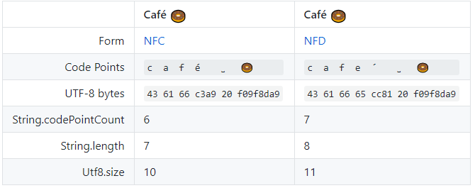

# Okio

>[okio wiki](https://github.com/square/okio)翻译

Okio 作为 java io  和 nio 的补充，让我们更简单的去读取、存储和处理数据，首先它是作为 OkHttp 的一个组件发展而来的。

---
## ByteStrings and Buffers

Okio围绕两种类型构建，它们将大量功能集成到一个简单的API中：

- **ByteString**（字节串）是一个不可变的字节序列，对于字符数据，String 是基础，而 ByteString 是 String 失散多年的兄弟，可以轻松将二进制数据视为一种值，它知道如何编码和解码为 hex，base64 和 UTF-8。
- **Buffer** 是一个可变的字节序列，就像 ArrayList，你不需要提前为它设置 size，你从 buffer 读取和写入，就像一个队列一样，把数据写到队尾，从头部读取数据，而不用管理  positions, limits, 和 capacities。

在内部，ByteString 和 Buffer 做了一些聪明的事情来节省 CPU 和内存。如果将 UTF-8 字符串编码为 ByteString，它会缓存对该字符串的引用，如果稍后对其进行解码，则无需执行任何操作。

Buffer 是用 segments 组成的链表实现的。当你把数据从一个 Buffer 移到另一个，它重新分配段的所有权，而不是复制数据。这种方法对多线程程序特别有用：与网络通信的线程可以与工作线程交换数据而无需任何复制。

>string 本意是“串”，只不过在编程语言的世界中，我们基本都用它来指代“字符串”，其实字符串应该叫 `CharString`，因此 `ByteString` 的意义也就很好理解了，“字节串”。——[Understand-Okio](https://blog.piasy.com/2016/08/04/Understand-Okio/)

---
## Sources and Sinks

`java.io` 设计中的一个优雅部分是如何对流进行分层以支持加密和压缩等转换。Okio 包含自己的流类型：Source 和 Sink，其工作方式类似于 InputStream 和 OutputStream，但也有一些关键区别：

- **Timeouts**：流提供对底层 I/O 机制的超时的访问。与 java.io 套接字流不同，read() 和 write() 都有超时机制。
- **Easy to implement**(易于实施)：`Source` 声明了三个方法: `read()`, `close()`, 和 `timeout()`，不像 `available()`方法或者`单个字节的读取`导致的正确性和性能问题，对它们的调用是没有风险的。
- **Easy to use**：虽然 Source 和 Sink 的实现只有三种写入方法，但 BufferedSource 和 BufferedSink 接口为调用者提供了丰富的 API。这些接口可为你提供所需的一切。
- **No artificial distinction between byte streams and char streams**(字节流和字符串流之间没有人为的区别)：OkIO 提供了简单的 API 用于读写包括 byge，UTF-8 String，big-endian 32位int，little-endian short 类型的数据。而不是像 java.io 那样提供了 InputStreamReader！
- **Easy to test**：Buffer 类同时实现了 BufferedSource 和 BufferedSink，因此你的测试代码简单明了

对于 Sources , sinks 与 `InputStream` , `OutputStream` 的交互. 你可将任何 `Source` 看作 `InputStream`, 同时你可将任何 `InputStream` 看作 `Source`. 这同样适用于 Sink 和 OutputStream。

---
## Recipes

我们已经写了一些 Recipes 来演示如何解决 Okio 的常见问题。仔细阅读它们，了解一切如何协同工作，你可以自由剪切和粘贴这些例子。

### 逐行读取文本文件

使用 `Okio.source(File)` 打开一个源 Stream 来读取一个文件，返回的 Source 接口用途有限。相反，我们用 Buffer 包装 Source 。这有两个好处：

- API 更强大。 BufferedSource 有许多方法可以简洁地解决大多数常见问题。
- 使程序运行得更快。Buffer 允许 Okio 通过更少的 I/O 操作完成更多工作。

打开的每个 Source 都需要关闭。打开流的代码负责确保它已关闭。在这里，我们使用 Java 的 try 块自动关闭源代码。

```java
public void readLines(File file) throws IOException {
  try (Source fileSource = Okio.source(file);
       BufferedSource bufferedSource = Okio.buffer(fileSource)) {

    while (true) {
      String line = bufferedSource.readUtf8Line();
      if (line == null) break;

      if (line.contains("square")) {
        System.out.println(line);
      }
    }

  }
}
```

`readUtf8Line()` 方法会读取所有数据：

- 直到下一行分隔符`\n` 或 `\r\n`，或文件的结尾
- 它将该数据作为字符串返回，省略末尾的分隔符。
- 当遇到空行时，该方法将返回一个空字符串。
- 如果没有更多数据要读取，它将返回 null。


`readUtf8Line()`方法适用于解析大多数文件。对于某些用例，您还可以考虑`readUtf8LineStrict()`，与`readUtf8Line()`的功能类似，但是：

- 但它要求每行以`\n` 或 `\r\n`结束。如果在此之前遇到文件的末尾，则会抛出EOFException。
- strict 变量还允许字节限制来防止格式错误的输入。使用此选项可以防止可能不包含`\n` 或 `\r\n`的流。

```java
public void readLines(File file) throws IOException {
  try (BufferedSource source = Okio.buffer(Okio.source(file))) {
    while (!source.exhausted()) {
      //限制一次读取多少
      String line = source.readUtf8LineStrict(1024L);
      if (line.contains("square")) {
        System.out.println(line);
      }
    }
  }
}
```

### 写一个文本文件

上面我们使用 Source 和 BufferedSource 来读取文件，对于写，我们使用 Sink 和 BufferedSink。缓冲的优点是相同的：更强大的API和更好的性能。

```java
public void writeEnv(File file) throws IOException {
  try (Sink fileSink = Okio.sink(file);
       BufferedSink bufferedSink = Okio.buffer(fileSink)) {

    for (Map.Entry<String, String> entry : System.getenv().entrySet()) {
      bufferedSink.writeUtf8(entry.getKey());
      bufferedSink.writeUtf8("=");
      bufferedSink.writeUtf8(entry.getValue());
      bufferedSink.writeUtf8("\n");
    }

  }
}
```

这里没有用于编写输入行的 API;相反，我们需要手动插入换行符。大多数程序都可以使用 `\n` 硬编码为换行符。在极少数情况下，你可以使用 `System.lineSeparator()` 而不是 `\n`：它在 Windows 上返回`\r\n`，在其他地方返回`\r`。

我们可以通过内联 fileSink 变量并利用方法链来更紧凑地编写上述程序：

```java
public void writeEnv(File file) throws IOException {
  try (BufferedSink sink = Okio.buffer(Okio.sink(file))) {
    for (Map.Entry<String, String> entry : System.getenv().entrySet()) {
      sink.writeUtf8(entry.getKey())
          .writeUtf8("=")
          .writeUtf8(entry.getValue())
          .writeUtf8("\n");
    }
  }
}
```

在上面的代码中，我们对 `writeUtf8` 进行四次调用，进行四次调用比下面的代码更有效，因为 JVM 不必创建和收集临时的字符串。

```java
sink.writeUtf8(entry.getKey() + "=" + entry.getValue() + "\n"); // 更慢!
```

---
### UTF-8

在上面的 API 中你可以看出 Okio 对 UFT 的偏爱，早期的计算机系统有许多不兼容的字符集编码：`ISO-8859-1, ShiftJIS, ASCII, EBCDIC`, 等等，编写一个支持多字符集的程序是可怕的，我们甚至没有表情符号，幸运的是，通过 UTF-8 编码现在世界各地的字符编码已经标准化了，包括遗留系统中其他字符集的一些罕见用途。

如果你需要其他的字符集，`readString()` 和 `writeString()` 适用于你，这些方法要求你指定一个字符集编码，否则，你可能会意外创建只能由本地计算机读取的数据。大部分应用程序都使用 `UTF-8`编码。

编码字符串时，你需要注意字符串的表示和编码方式。当字形具有重音或其他装饰时，它可以表示为单个复杂 code point`（é）`或后面跟随修饰符`（'）`的简单 code point`（e）`。当整个字形是单 个code point 时称为 NFC ;当它是多个 code point 时则称为 NFD。

虽然我们在 I/O 中读取或写入字符串时都使用 UTF-8 编码，但是当字符串在内存中时，Java Strings 使用一种名为UTF-16 的过时字符编码。这是一个糟糕的编码，因为它对大多数字符使用 16 位字符，这对某些字符不适用，特别是，大多数表情符号使用两个 Java 字符。这是有问题的，因为 `String.length()`可能返回一个令人惊讶的结果：UTF-16 字符的数量而不是字形的自然数量（String.length()返回的数可能与字符串的表面上的字符数不等）。



在大多数情况下，Okio 都可以让你忽略掉这些问题而去专注于数据，但当你需要它们时，有方便的 API 来处理低级 UTF-8 字符串。

- 使用 `Utf8.size()` 计算将字符串编码为 UTF-8 需要的字节数，而不会实际编码它。这在协议缓冲区等长度前缀编码中很方便。
- 使用 `BufferedSource.readUtf8CodePoint()` 读取一个可变长的 Code Points，使用  `BufferedSink.writeUtf8CodePoint()`写一个可变长的 Code Points。

---
### Golden Values

Okio 喜欢测试。这个库本身经过了严格的测试，它具有在测试应用程序代码时通常很有用的功能。我们发现一种非常有用的模式是**“Golden Values”**测试。此类测试的目的是确认使用早期版本的程序编码的数据可以安全地由当前程序解码。

我们将通过使用Java Serialization编码值来说明这一点。虽然 Java Serialization 是一个糟糕的编码系统，大多数程序应该更喜欢其他格式，如 JSON 或 protobuf，任何情况下，这是一个获取对象，序列化它并将结果作为 `ByteString` 返回的方法：

```java
private ByteString serialize(Object o) throws IOException {
  Buffer buffer = new Buffer();
  try (ObjectOutputStream objectOut = new ObjectOutputStream(buffer.outputStream())) {
    objectOut.writeObject(o);
  }
  return buffer.readByteString();
}
```

这里有很多事情要做。

1. 我们创建了一个 Buffer 用来存放序列化对象后的数据，这比 `ByteArrayOutputStream` 方便
2. 我们访问 Buffer 的输出流，写入缓冲区或其输出流始终将数据附加到缓冲区的末尾。
3. 我们创建了一个 `ObjectOutputStream` 对象并写入了我们的对象，try 负责为我们关闭流。注意，关闭 Buffer 是无效。
4. 最终我们从 Buffer 读取了一个  byte string， `readByteString()`允许我们指定读取多少字节，这里我们没有指定是因为我们需要读取整个实体内容。

使用我们的 `serialize()`方法，我们已准备好计算和打印 golden value。

```java
Point point = new Point(8.0, 15.0);
ByteString pointBytes = serialize(point);
System.out.println(pointBytes.base64());
```

我们将 ByteStrin g打印为 base64，因为它是一种适合嵌入测试用例的紧凑格式。该程序打印这个：

```
rO0ABXNyAB5va2lvLnNhbXBsZXMuR29sZGVuVmFsdWUkUG9pbnTdUW8rMji1IwIAAkQAAXhEAAF5eHBAIAAAAAAAAEAuAAAAAAAA
```

这就是我们的 golden value!我们可以使用 base64 把它转换回 ByteString：

```
ByteString goldenBytes = ByteString.decodeBase64("rO0ABXNyAB5va2lvLnNhbXBsZ"
    + "XMuR29sZGVuVmFsdWUkUG9pbnTdUW8rMji1IwIAAkQAAXhEAAF5eHBAIAAAAAAAAEAuA"
    + "AAAAAAA");
```

下一步是将 ByteString 反序列化我们的值对象，此方法反转上面的 `serialize()`方法，我们添加 byte string 到 Buffer中，然后使用 `ObjectInputStream` 消费它：

```
private Object deserialize(ByteString byteString) throws IOException, ClassNotFoundException {
  Buffer buffer = new Buffer();
  buffer.write(byteString);
  try (ObjectInputStream objectIn = new ObjectInputStream(buffer.inputStream())) {
    return objectIn.readObject();
  }
}
```

现在我们可以针对 golden value 测试解码器：

```
ByteString goldenBytes = ByteString.decodeBase64("rO0ABXNyAB5va2lvLnNhbXBsZ"
    + "XMuR29sZGVuVmFsdWUkUG9pbnTdUW8rMji1IwIAAkQAAXhEAAF5eHBAIAAAAAAAAEAuA"
    + "AAAAAAA");
Point decoded = (Point) deserialize(goldenBytes);
assertEquals(new Point(8.0, 15.0), decoded);
```

### Write a binary file

编码二进制文件与编码文本文件不同，Okio 对两者使用相同的 BufferedSink 和 BufferedSource。这对包含字节和字符数据的二进制格式很方便。

写入二进制数据更加危险，因为通常很难诊断你犯的错误，小心的对待这些陷阱可以避免我们犯错误：

- **The width of each field** （每个字段的宽度）：这是使用的字节数。Okio 不包含发出`部分字节`的机制。如果你需要，你需要在写入之前手动进行位移和掩码。
- **The endianness of each field** （每个字段的字节顺序）：具有多个字节的所有字段都具有字节序：对于字节是否被排序为最重要(big endian)或最不重要(little endian)。Okio 将 Le 后缀用于 little-endian 类方法，没有后缀的方法的字节顺序为 big-endian。
- **Signed vs. Unsigned** （有符号的和没符号的）：java 没有无符号的基本类型(char 除外)，所以应对这种情况通常是在应用层发生的事情。为了使这更容易一些，Okio 的 `writeByte(`) 和 `writeShort()` 接收的 int 类型。你可以传递像 255 这样的 “无符号” 字节，Okio 会做正确的事情。


| Method | Width | Endianness | Value | Encoded Value |
| :-- | --: | :-- | --: | :-- |
| writeByte | 1 | 3 | `03` |
| writeShort | 2 | big | 3 | `00 03` |
| writeInt | 4 | big | 3 | `00 00 00 03` |
| writeLong | 8 | big | 3 | `00 00 00 00 00 00 00 03` |
| writeShortLe | 2 | little | 3 | `03 00` |
| writeIntLe | 4 | little | 3 | `03 00 00 00` |
| writeLongLe | 8 | little | 3 | `03 00 00 00 00 00 00 00` |
| writeByte | 1 | Byte.MAX_VALUE | `7f` |
| writeShort | 2 | big | Short.MAX_VALUE | `7f ff` |
| writeInt | 4 | big | Int.MAX_VALUE | `7f ff ff ff` |
| writeLong | 8 | big | Long.MAX_VALUE | `7f ff ff ff ff ff ff ff` |
| writeShortLe | 2 | little | Short.MAX_VALUE | `ff 7f` |
| writeIntLe | 4 | little | Int.MAX_VALUE | `ff ff ff 7f` |
| writeLongLe | 8 | little | Long.MAX_VALUE | `ff ff ff ff ff ff ff 7f` |

下面代码按照 BMP 文件格式对位图进行编码：

```java
void encode(Bitmap bitmap, BufferedSink sink) throws IOException {
  int height = bitmap.height();
  int width = bitmap.width();

  int bytesPerPixel = 3;
  int rowByteCountWithoutPadding = (bytesPerPixel * width);
  int rowByteCount = ((rowByteCountWithoutPadding + 3) / 4) * 4;
  int pixelDataSize = rowByteCount * height;
  int bmpHeaderSize = 14;
  int dibHeaderSize = 40;

  // BMP Header
  sink.writeUtf8("BM"); // ID.
  sink.writeIntLe(bmpHeaderSize + dibHeaderSize + pixelDataSize); // File size.
  sink.writeShortLe(0); // Unused.
  sink.writeShortLe(0); // Unused.
  sink.writeIntLe(bmpHeaderSize + dibHeaderSize); // Offset of pixel data.

  // DIB Header
  sink.writeIntLe(dibHeaderSize);
  sink.writeIntLe(width);
  sink.writeIntLe(height);
  sink.writeShortLe(1);  // Color plane count.
  sink.writeShortLe(bytesPerPixel * Byte.SIZE);
  sink.writeIntLe(0);    // No compression.
  sink.writeIntLe(16);   // Size of bitmap data including padding.
  sink.writeIntLe(2835); // Horizontal print resolution in pixels/meter. (72 dpi).
  sink.writeIntLe(2835); // Vertical print resolution in pixels/meter. (72 dpi).
  sink.writeIntLe(0);    // Palette color count.
  sink.writeIntLe(0);    // 0 important colors.

  // Pixel data.
  for (int y = height - 1; y >= 0; y--) {
    for (int x = 0; x < width; x++) {
      sink.writeByte(bitmap.blue(x, y));
      sink.writeByte(bitmap.green(x, y));
      sink.writeByte(bitmap.red(x, y));
    }

    // Padding for 4-byte alignment.
    for (int p = rowByteCountWithoutPadding; p < rowByteCount; p++) {
      sink.writeByte(0);
    }
  }
}
```

该程序最棘手的部分是格式所需的 padding，BMP 格式要求每行以 4 字节边界开始，因此必须添加一个 0 以维持对齐。编码其他二进制格式通常非常相似。一些技巧：

- 用 golden value 写测试！确认你的程序发出了预期结果可以使调试更容易。
- 使用 `Utf8.size()` 来计算编码字符串需要的字节数，这对于 `长度前缀格式` 至关重要
- 使用`Float.floatToIntBits()` 和 `Double.doubleToLongBits()` 来编码浮点值。

---
### Communicate on a Socket（在套接字上进行通信）

通过网络发送和接收数据有点像写入和读取文件（本质上都是 I/O 操作），我们使用 `BufferedSink`去编码输出和`BufferedSource`编码输入，就像文件一样，网络协议中的数据可以是`文本、二进制、或两者都有`，但是文件系统也网络之间也存在者很多不同的地方。

对于一个文件，你要么是读取、要么是写入，但通过网络，您可以同时执行这两项操作，有些协议通过轮流处理：写入一个请求，读取一个响应，然后重复，你可以使用单线程实现这种协议，对于其他协议，你可以需要同时进行读写，通常，你需要一个专用线程进行读取。对于写，你也可能需要另一个专用的线程或使用 synchronized，以便多个线程可以共享 sink（接收器），对于并发，Okio 是不安全的。

Sinks 会缓冲出站（outbound）数据以最小化 I/O 操作。这是高效的，但也意味着你需要手动调用 flush 来发送数据，通常，对于面向消息的协议在每条消息之后刷新。请注意，当缓冲数据超过某个阈值时，Okio 将自动刷新，这是为了节省内存，您不应该依赖它来进行交互式协议。

Okio 构建在 `java.io.Socket` 上以实现连接。将你的套接字创建为服务器或客户端，然后使用 `Okio.source(Socket)` 去读取或使用 `Okio.sink(Socket)` 来写，这些 API 同样可以工作于 `SSLSocket`上，你应该使用 SSL 除非你有非常好的理由。

想要取消一个 Socket 可以在任何线程调用 `Socket.close()`，这会导致它的资源和 关联的 sinks 理解产生一个`IOException`，你也可以为每一个套接字操作配置超时时间，你不需要引用引用一个套接字去调整超时时间，`Source` 和 `Sink` 直接暴露了超时时间，即使流被包装了，此 API 也可以工作。

我们写了一个[basic SOCKS proxy](https://github.com/square/okio/blob/master/samples/src/main/java/okio/samples/SocksProxyServer.java)  作为 Okio 和网络协作的完整示例，有一些需要强调：

```java
Socket fromSocket = ...
BufferedSource fromSource = Okio.buffer(Okio.source(fromSocket));
BufferedSink fromSink = Okio.buffer(Okio.sink(fromSocket));
```

为 Socket 创建 sources 和 sinks 与为文件操作创建它们类似，为套接字创建 sources 和 sinks 后，不得分别使用其InputStream 或 OutputStream。

```java
Buffer buffer = new Buffer();
for (long byteCount; (byteCount = source.read(buffer, 8192L)) != -1; ) {
  sink.write(buffer, byteCount);
  sink.flush();
}
```

上面的循环把数据从 Source 复制到 Sink，如果我们不需要刷新，我们可以通过一次调用 `BufferedSink.writeAll(Source)`来替换这个循环。

8192 参数是 read 返回之前要读取的最大字节数。我们可以在这里传递任意值，但是我们喜欢 `8 KiB`，因为这是 Okio 在单个系统调用中可以做的最大值。大多数时候应用程序代码不需要处理这样的限制！

```java
int addressType = fromSource.readByte() & 0xff;
int port = fromSource.readShort() & 0xffff;
```

Okio 使用有符号的类型比如 `byte` 和 `short`,但是协议通常需要无符号值。按位与 `＆` 运算符是 Java 首选的将有符号值转换为无符号值的习惯用法。这里是`bytes, shorts, ints`的备忘单：

| Type | Signed Range | Unsigned Range | Signed to Unsigned |
| :-- | :-: | :-- | :-- |
| byte | -128..127 | 0..255 | `int u = s & 0xff;` |
| short | -32,768..32,767 | 0..65,535 | `int u = s & 0xffff;` |
| int | -2,147,483,648..2,147,483,647 | 0..4,294,967,295 | `long u = s & 0xffffffffL;` |

Java 没有可以表示 unsigned long 的原始类型。

