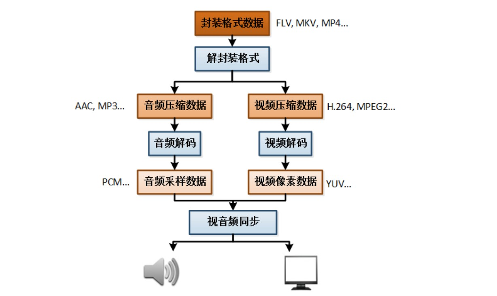
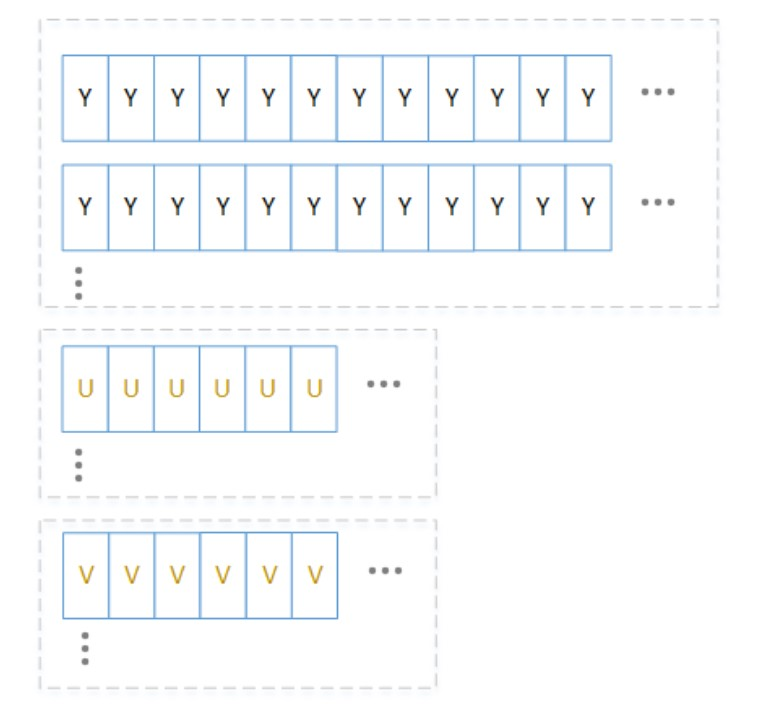
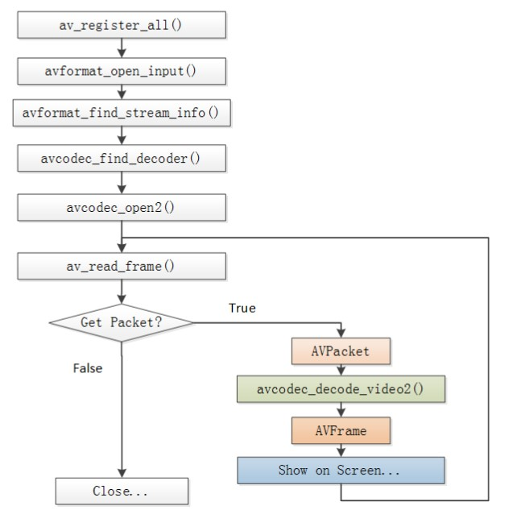
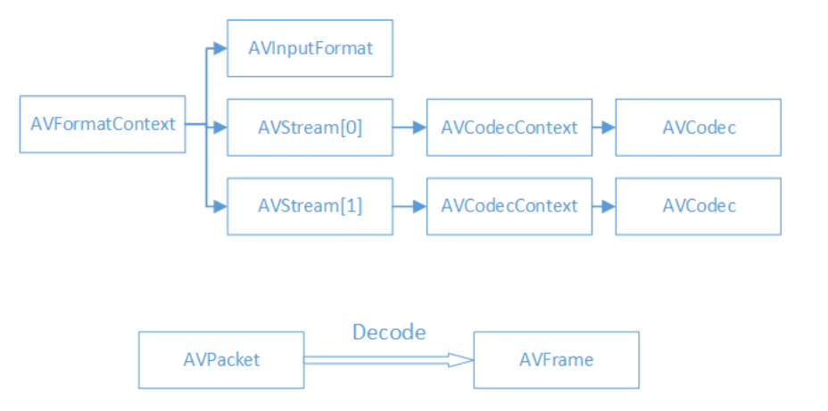
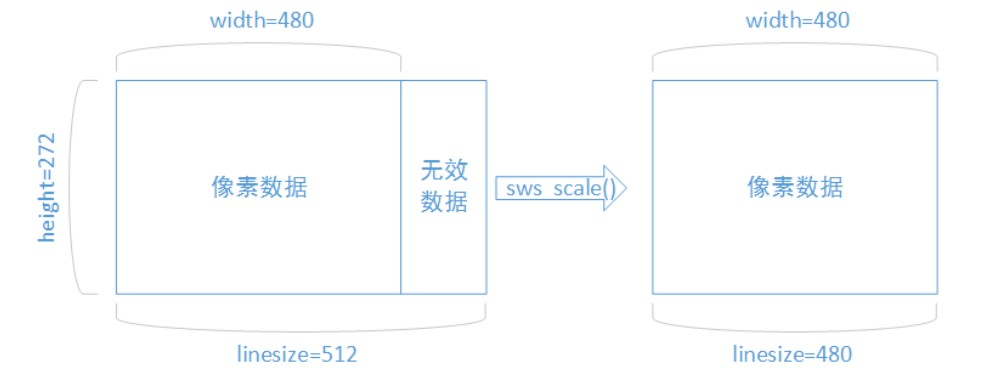

# FFmpeg与视音频基础知识

全部内容来自[基于FFmpeg+SDL的视频播放器的制作](http://blog.csdn.net/leixiaohua1020/article/details/47068015)

---
## 1 视音频基础知识视音频基础知识

### 视频播放器原理


录音实质是一个压缩采集到的图像或音频数据的过程，这个过程又称为编码，封装格式：FLV、AVI、MP4，播放视频或音频文件，实质就是一个解码过程。



信息查看工具：
- 综合信息查看 MediaInfo
- 二进制信息查看UltraEdit
- 封装格式 ElecardFormat Analyzer
- 视频编码数据：ElecardStream Eye
- 视频像素数据：YUV Player
- 音频采样数据：Adobe Audition

### 1.1 音视频封装格式

封装格式的作用：将视频码流和音频码流按照一定的格式存储在一个文件中。

常见封装格式：AVI、MP4、TS、MKV、RMVB

- MPEG2-TS格式简介：不包含文件头。数据大小固定（188Byte）的TS Packet构成。
- FLV格式简介：包含文件头。数据由大小不固定的Tag构成。所以FLV一般不支持视频播放时的进度拖动

### 1.2 视频编码

视频编码的作用：将视频像素数据（RGB、YUV等）压缩成为视频码流，从而降低视频的数据量。

视频编码数据：HEVC(H0264)、H.264、MPEG4、MPEG2、VC-1、VP9、VP8

#### H.264格式简介

数据由大小不固定的NALU构成，最常见的情况下，1个NALU存储了1帧画面的压缩编码后的数据。

H.264压缩方法：
- 比较复杂。包含了帧内预测、帧间预测、熵编码、环路滤波等环节构成。
- 可以将图像数据压缩100倍以上。

### 1.3 音频编码

音频编码的作用：将音频采样数据（PCM等）压缩成为音频码流，从而降低音频的数据量。

音频编码数据：AAC、MP3、AC-3、WMA

### 1.4 视频像素数据

视频像素数据作用：保存了屏幕上每个像素点的像素值。

格式：常见的像素数据格式有RGB24，RGB32，YUV420P，YUV422P，YUV444P等。压缩编码中一般使用的是YUV格式的像素数据，最为常见的格式为YUV420P。

特点：视频像素数据体积很大，一般情况下1小时高清视频的RGB24格式的数据体积为：`3600*25*1920*1080*3=559.9GBytePS`，这里假定帧率为25Hz,取样精度8bit。

#### RGB格式简介

- Red、Green、Blue三种颜色，几乎可以混合成世界上所有的颜色。
- 彩色图像中每个点，由R、G、B三个分量组成。

#### YUV格式简介

相关实验表明，人眼对亮度敏感而对色度不敏感。因而可以将亮度信息和色度信息分离，并对色度信息采用更“狠”一点的压缩方案，从而提高压缩效率。

YUV格式中，Y只包含亮度信息，而UV只包含色度信息。

以YUV420P为例，图像像素数据的存储方式如图所示：



从上图图可以看出，YUV420P首先存储了整张图像的Y信息，然后存储整张图像的U信息，最后存储了整张图像的V信息。

使用YUV Player可以查看YUV像素数据

### 1.5 音频采样数据

音频采样数据作用：保存了音频中每个采样点的值。

特点：音频采样数据体积很大，一般情况下一首4分钟的PCM格式的歌曲体积为：`4*60*44100*2*2=42.3MBytePS`，这里假定采样率为44100Hz，采样精度为16bit。

音频采样数据：PCM


---
## 2 FFmpeg介绍

### FFmpeg背景

- FFmpeg基于命令行，界面不太人性化，操作相对复杂，但是也更加灵活。
- FFmpeg是开源的，可以吸引全世界优秀的开发者加入其中进行开发。
- 使用FFmpeg作为内核的视频播放器：Mplayer，射手播放器，暴风影音，KMPlayer，QQ影音。
- 使用FFmpeg作为内核的转码器格式工厂，狸窝视频转换器，暴风转码。

### 版本说明

- Static：只包含3个体积很大的exe。
- Shared：除了3个体积较小的exe之外，还包含了dll动态库文件。
- Dev：只包含了开发用的头文件（`*.h`）和导入库文件（`*.lib`）。

### FFmpeg组件

FFmpeg是一套强大的音视频处理工具。常用来对音频、视频进行合并或分离、拼接、剪裁，音频视频的转码等，还有非常强大的视频采集、视频抓图、给视频加水印等功能。FFmpeg包含八大组件：

- libavcodec-提供了更加全面的编解码实现的合集
- libavformat-提供了更加全面的音视频容器格式的封装和解析以及所支持的协议
- libavutil-提供了一些公共函数
- libavfilter-提供音视频的过滤器，如视频加水印、音频变声等
- libavdevice-提供支持众多设备数据的输入与输出，如读取摄像头数据、屏幕录制
- libswresample,libavresample-提供音频的重采样工具
- libswscale-提供对视频图像进行色彩转换、缩放以及像素格式转换，如图像的YUV转换
- libpostproc-多媒体后处理器

和以下几个工具

- ffmpeg-一个流媒体的编解码、格式转换以及多媒体流的内容处理工具
- ffplay-一个使用FFmpeg编解码的播放器
- ffprobe-一个多媒体分析工具
- ffserver-一个流多媒体服务器


### ffmpeg.exe的使用

ffmpeg.exe用于视频的转码。示例：
```
#该命令将当前文件夹下的input.avi文件转换为output.ts文件，并将output.ts文件视频的码率设置为640kbps。
ffmpeg-i input.avi -b:v640k output.ts
```

命令格式：`ffmpeg-i{输入文件路径} -b:v{输出视频码率} {输出文件路径}`

所有的参数都是以键值对的形式指定的。例如输入文件参数是“-i”，而参数值是文件路径；输出视频码率参数是“-b:v”，而参数值是视频的码率值。但是注意位于最后面的输出文件路径前面不包含参数名称

命令参数：

参数|说明
---|---
-h | 帮助-
i | filename输入文件
-t duration |设置处理时间，格式为`hh:mm:ss`
-ss position |设置起始时间，格式为`hh:mm:ss`
-b:v bitrate |设置视频码率
-b:a bitrate |设置音频码率
-r fps |设置帧率
-s wxh |设置帧大小，格式为WxH
-c:v codec |设置视频编码器
-c:a codec |设置音频编码器
-ar freq |设置音频采样率

### ffplay.exe的使用

ffplay.exe用于视频的播放。最简单的命令：`ffplayinput.avi`

---
## 3 视频解码知识

一般的视频解码流程：
- 视频码流一般存储在一定的封装格式（例如MP4、AVI等）中。封装格式中通常还包含音频码流等内容
- 对于封装格式中的视频，需要先从封装格式中提取中视频码流，然后再进行解码。例如解码MKV格式的视频文件，就是`MKV->H.264码流->YUV`

### FFmpeg解码的函数

解码流程图：


函数简介：
```
av_register_all()：注册所有组件
avformat_open_input()：打开输入视频文件
avformat_find_stream_info()：获取视频文件信息
avcodec_find_decoder()：查找解码器
avcodec_open2()：打开解码器
av_read_frame()：从输入文件读取一帧压缩数据
avcodec_decode_video2()：解码一帧压缩数据
avcodec_close()：关闭解码器
avformat_close_input()：关闭输入视频文件
```

### FFmpeg解码的数据结构



FFmpeg数据结构简介：

- **AVFormatContext** 封装格式上下文结构体，也是统领全局的结构体，保存了视频文件封装格式相关信息。
- **AVInputFormat** 每种封装格式（例如FLV, MKV, MP4, AVI）对应一个该结构体。
- **AVStream** 视频文件中每个视频（音频）流对应一个该结构体。
- **AVCodecContext** 编码器上下文结构体，保存了视频（音频）编解码相关信息。
- **AVCodec** 每种视频（音频）编解码器(例如H.264解码器)对应一个该结构体。
- **AVPacket** 存储一帧压缩编码数据。
- **AVFrame** 存储一帧解码后像素（采样）数

AVFormatContext：
- iformat：输入视频的AVInputFormat
- nb_streams ：输入视频的AVStream 个数
- streams ：输入视频的AVStream []数组
- duration ：输入视频的时长（以微秒为单位）
- bit_rate ：输入视频的码率

AVInputFormat：

- name：封装格式名称
- long_name：封装格式的长名称
- extensions：封装格式的扩展名
- id：封装格式ID
- 一些封装格式处理的接口函数

AVStream：

- id：序号
- codec：该流对应的AVCodecContext
- time_base：该流的时基
- r_frame_rate： 该流的帧率

AVCodeContext：

- codec：编解码器的AVCodec
- width, height：图像的宽高（只针对视频）
- pix_fmt：像素格式（只针对视频）
- sample_rate：采样率（只针对音频）
- channels：声道数（只针对音频）
- sample_fmt：采样格式（只针对音频）

AVCodec：

- name：编解码器名称
- long_name：编解码器长名称
- type：编解码器类型
- id：编解码器ID
- 一些编解码的接口函数

AVPacket：

- pts：显示时间戳
- dts ：解码时间戳
- data ：压缩编码数据
- size ：压缩编码数据大小
- stream_index ：所属的AVStream

AVFrame：

- data：解码后的图像像素数据（音频采样数据）
- linesize：对视频来说是图像中一行像素的大小；对音频来说是整个音频帧的大小
- width, height：图像的宽高（只针对视频）
- key_frame：是否为关键帧（只针对视频）
- pict_type：帧类型（只针对视频） ，例如I， P， B

### 解码后的数据为什么要经过`sws_scale()`函数处理

解码后YUV格式的视频像素数据保存在AVFrame的`data[0]、data[1]、data[2]`中。但是这些像素值并不是连续存储的，每行有效像素之后存储了一些无效像素。以亮度Y数据为例，`data[0]`中一共包含了`linesize[0]*height`个数据。但是出于优化等方面的考虑，`linesize[0]`实际上并不等于宽度width，而是一个比宽度大一些的值。因此需要使用`sws_scale()`进行转换。转换后去除了无效数据，width和`linesize[0]`取值相等

