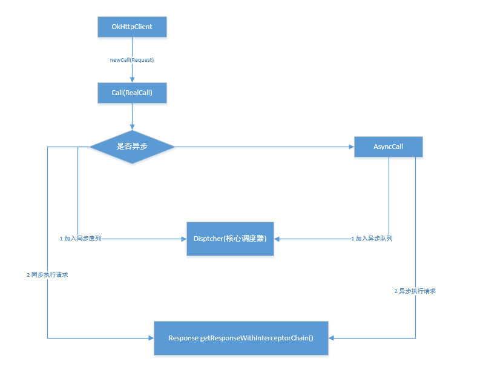

# OkHttp(3.4)

---
## 1 okhttp 核心类介绍

- OkHttpClient 客户端类
- Dispatcher 核心调度类
- InterceptorChain 核心拦截器链
- Builder 构建者模式
- Requeest 类
- Response 类

---
## 2 okhttp 同步与异步请求方法流程分析

### 请求方式

```java
//异步
OkHttpClient okHttpClient = new OkHttpClient();
        okHttpClient.newCall(new Request.Builder().url("https://baidu.com").build())
                .enqueue(new Callback() {
                    @Override
                    public void onFailure(Call call, IOException e) {
                        System.out.println(e);
                    }

                    @Override
                    public void onResponse(Call call, Response response) throws IOException {
                        if (response.isSuccessful()) {
                            System.out.println(response.body().string());
                        } else {
                            System.out.println("fail");
                        }
                    }
                });

//同步
 OkHttpClient okHttpClient = new OkHttpClient();
        try {
            Response response = okHttpClient.newCall(new Request.Builder().url("https://baidu.com").build()).execute();
            if (response.isSuccessful()) {
                System.out.println(response.body().string());
            }
        } catch (IOException e) {
            e.printStackTrace();
        }
```

### 请求流程



同步请求处理方法：

```
 public Response execute() throws IOException {
        synchronized (this) {
            //只能被执行一次
            if (executed) {
                throw new IllegalStateException("Already Executed");
            }
            executed = true;
        }
        try {
            //获取 dispatcher 调度类，加入到执行队列
            client.dispatcher().executed(this);
            //通过连接器链获取执行结果
            Response result = getResponseWithInterceptorChain(false);
            if (result == null) {
                throw new IOException("Canceled");
            }
            return result;
        } finally {
            //一个Call完成，不论是失败还是成功，都要调用dispatcher的finished方法
            client.dispatcher().finished(this);
        }
    }
```

异步请求处理：

```
    /*异步执行*/
    void enqueue(Callback responseCallback, boolean forWebSocket) {
        synchronized (this) {
            if (executed) {
                throw new IllegalStateException("Already Executed");
            }
            executed = true;
        }
        //加入到dispatcher的队列中
        client.dispatcher().enqueue(new AsyncCall(responseCallback, forWebSocket));
    }
```

## 3 核心 Dispatcher 调度器

### Dispatcher 的职责

- 同步和异步请求都会在 Dispatchtor 中管理其状态
- Dispatcher 的作用为维护请求的状态，并维护一个线程池，用于执行请求

### Dispatcher 的队列

```
 private final Deque<AsyncCall> readyAsyncCalls = new ArrayDeque<>();//等待执行的异步请求队列。
 private final Deque<AsyncCall> runningAsyncCalls = new ArrayDeque<>();//正在执行的异步请求，包括取消了但还没完成Call。
 private final Deque<RealCall> runningSyncCalls = new ArrayDeque<>();//正在执行的同步请求。
```

- 两个队列，同步与异步
- 为什么需要两个队列：生产者消费者模型

控制最大并发数：

```
    /*限制最大的请求数量为 64*/
    private int maxRequests = 64;
    /*同一个主机只能同时有 5 个请求*/
    private int maxRequestsPerHost = 5;
```


### 执行结果处理

任何一个请求执行完毕后，需要移除出队列，并调整现有任务调度

```
    synchronized void finished(AsyncCall call) {
        if (!runningAsyncCalls.remove(call)) {
            throw new AssertionError("AsyncCall wasn't running!");
        }
        promoteCalls();
    }

   /**
     * 非常重要的方法，当一个Call被执行完成后，需要调用此方法把对应的Call移除出对象，然后检测须有需要将等待队列中的Call加入到执行队列中去。
     * 该方法在 synchronized 方法的中调用。
     */
    private void promoteCalls() {
        if (runningAsyncCalls.size() >= maxRequests) {
            return; // Already running max capacity.
        }
        if (readyAsyncCalls.isEmpty()) {
            return; // No ready calls to promote.
        }

        for (Iterator<AsyncCall> i = readyAsyncCalls.iterator(); i.hasNext(); ) {

            AsyncCall call = i.next();

            if (runningCallsForHost(call) < maxRequestsPerHost) {
                i.remove();
                runningAsyncCalls.add(call);
                executorService().execute(call);
            }

            if (runningAsyncCalls.size() >= maxRequests) {
                return; // Reached max capacity.
            }
        }
    }
```

---
## 4 拦截器

### 拦截器的作用

拦截器是 OkHttp 中提供的一种强大的机制，它可以实现网络监听、请求以及响应重写、请求失败重试等功能，OkHttp中的拦截器分为两类：

- 应用拦截器
- 网络连接器

同时OkHttp内置了很多用于实现Http核心功能的拦截器

### 拦截器链

OkHttp 在执行请求时，由多个拦截器组成的拦截器链处理，参考下面代码:

```
   //由Call调用，用于获取请求结果
  private Response getResponseWithInterceptorChain() throws IOException {
    // Build a full stack of interceptors.
    List<Interceptor> interceptors = new ArrayList<>();
    //用户添加的 Interceptor
    interceptors.addAll(client.interceptors());
    //重试和重定向
    interceptors.add(retryAndFollowUpInterceptor);
    
    interceptors.add(new BridgeInterceptor(client.cookieJar()));
    //缓存拦截器
    interceptors.add(new CacheInterceptor(client.internalCache()));
    //拦截拦截器
    interceptors.add(new ConnectInterceptor(client));

    if (!retryAndFollowUpInterceptor.isForWebSocket()) {
      interceptors.addAll(client.networkInterceptors());
    }

    interceptors.add(new CallServerInterceptor(retryAndFollowUpInterceptor.isForWebSocket()));

    //构成了一个拦截器链
    Interceptor.Chain chain = new RealInterceptorChain(interceptors, null, null, null, 0, originalRequest);

    return chain.proceed(originalRequest);
  }
```

核心在于 Chain 的 processed 方法，有多少个拦截器就会调用多少次 proceed 方法：

```
//proceed的核心逻辑
 public Response proceed(Request request, StreamAllocation streamAllocation, HttpStream httpStream,
                            Connection connection) throws IOException {

        //重新构造一个链条，但是Index + 1，下一次proceed方法就会获取下一个拦截器
        RealInterceptorChain next = new RealInterceptorChain(interceptors, streamAllocation, httpStream, connection, index + 1, request);

        //获取
        Interceptor interceptor = interceptors.get(index);
        //调用interceptor的intercept方法，把chain传入，intercept方法中必须调用chain的proceed方法
        Response response = interceptor.intercept(next);

        //最后返回响应
        return response;
    }
```

流程总结：

- 创建一系列拦截器，将其放入到一个拦截器list中
- 创建一个拦截器链RealInterceptorChain，并执行拦截器的proceed方法
- 在发起请求前对 request 进行处理
- 调用下一个拦截器获取Response
- 对Response进行处理，返回给上一个拦截器

### 内置的核心拦截器

- RetryAndFollowUpInterceptor
- BridgeInterceptor
- CacheInterceptor
- ConnectInterceptor
- CallServerInterceptor

#### RetryAndFollowUpInterceptor

RetryAndFollowUpInterceptor 用于进行网络重连和失败重试

- 重试有一定的数量限制
- 针对特定的网络异常进行重试

```
    if (++followUpCount > MAX_FOLLOW_UPS) {
        streamAllocation.release();
        throw new ProtocolException("Too many follow-up requests: " + followUpCount);
    }
```

#### BridgeInterceptor

用于补充 Http 请求必要的头部信息

- 负责将用户构建的一个 Request 请求转化为能够进行网络访问的请求
- 将这个符合网络请求的 Request 进行网络请求
- 将网络请求回来的响应 Response 转化为用户可用的 Responnse

#### CacheInterceptor

- Cache类
- Cache只处理 Get 缓存
- DiskLRUCache
- CacheStrategy

#### ConnectInterceptor

- 连接池概念
- 打开与服务器之间的连接
- 标准连接、隧道连接

## 5 连接池

- ConnectionPool
- put、get方法
- 连接池复用、回收算法

---
## 6 CallServerInterceptor


- HttpCodec 编码与解码


