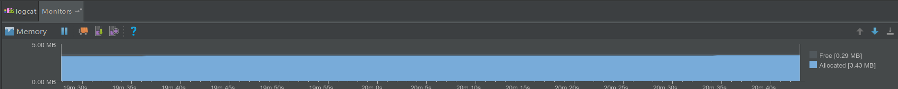
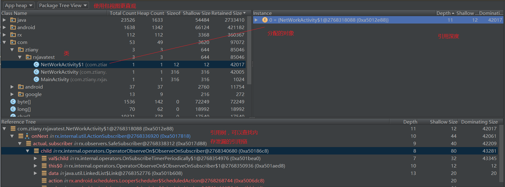
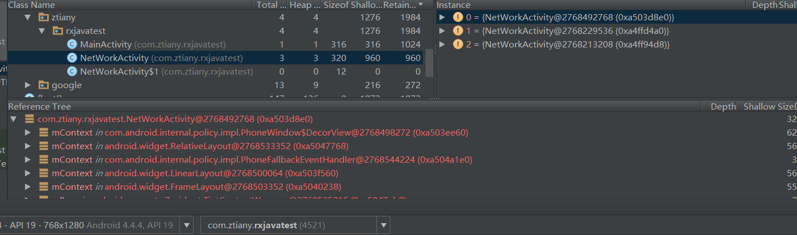
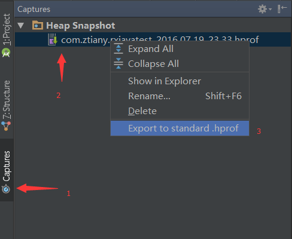
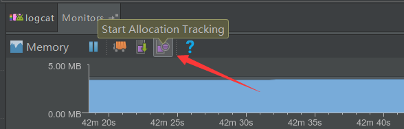

# AndroidStudio内存分析工具使用

AndroidStudio的内存分析工具还是比较强大的，使用起来也比较简单，使用界面如下图：

主要有四大功能：

- 发起一次GC
- 内存使用与空闲视图
- java堆转储(手机内存分配信息，收集信息前最好先触发一次GC)
- 追踪内存分配

## 1 内存信息收集

图1：

图2：

图中引用树为红色时说明对象已经被回收了。

### 各属性中英文对照表

| 名称 | Total Count | Heap Count | Sizeof | Shallow size | Retained Size |
| --- | --- | --- | --- | --- | --- |
| 意义 | 内存中该类的对象个数 | 堆内存中该类的对象个数 | 物理大小 | 对象本身占有内存大小 | 释放该对象后，节省的内存大小 |

| 名称 | depth | Shallow Size | Dominating Size |
| --- | --- | --- | --- |
| 意义 | 深度 | 对象本身内存大小 | 管辖的内存大小 |

### 导出hprof文件

有时候需要借助更加强大的MAT工具分析内存信息，需要导出hprof文件，操作如下：

这样就可以导出标准的hprof文件了。

---
## 2 内存分配分析

如果我们想了解内存分配更详细的情况,可以使用Allocation Traker来查看内存到底被什么占用了。

