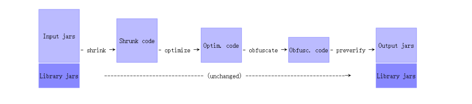

# ProGuard学习

## 1 ProGuard的作用

在Android中提到ProGuard就会认为它是用来做代码混淆的，在打包生成APK的时候，它能根据匹配规则，它代码中的各种命名混淆成a,b,c等没有意义的字母，以防止别人轻易的反编译我们发布的APP，但是ProGuard并不只有混淆这一个功能，它一共包括四个功能：

- 压缩(Shrink)：侦测并移除代码中无用的类，字段，方法和特性(Attribute)
- 优化(Optimize)：对字节码进行优化，移除无用的指令
- 混淆(Obfuscate)：使用a、b、c等这样简短的无意义的名称对类，方法，和字段进行重命名
- 预检(Preveirfy)：在Java平台上对处理后的代码进行预检

>如果仅仅是为了混淆，可以使用DexGuard

ProGurad由Shrink、Optimize、Obfuscate、Preveirfy四个步骤组成，其中每个步骤都是可选的，可以通过脚本文件来配置。在此引入一个EntryPoint概念，EntryPoint是在ProGurad过程中不被处理的类和方法。

1. 在压缩阶段，ProGurad从EntryPoint开始遍历，对于没有被使用的类和类成员会被丢弃。
2. 在优化过程中，哪些非EntryPoint类，方法都会被设置为private，static,或final，不使用的参数都会被移除,有些方法被标记为内联的
3. 在混淆的步骤中，对非EntryPoint的类和方法进行重命名




### 哪些类不能被混淆

- 1 避免混淆泛型 –keepattributes Signature
- 2 排除反射、序列化相关的类
- 3 JNI 中调用的类
- 4 AndroidManifest.xml 中配置的类

---
## 2 ProGuard的基本语法

### 基本指令

```
-optimizationpasses 5  # 指定代码的压缩级别(在0-7之间，默认为5)
-optimizations !code/simplification/arithmetic,!code/simplification/cast,!field/*,!class/merging/*  # 混淆时所采用的算法 这是google推荐的算法，一般不需要改变
-ignorewarnings  # 忽略警告，避免打包时某些警告出现
-skipnonpubliclibraryclasses #跳过(不混淆) jars中的 非public classes
-dontskipnonpubliclibraryclasses #不跳过(混淆) jars中的 非public classes 默认选项
-dontskipnonpubliclibraryclassmembers #不跳过 jars中的非public classes的members
-dontusemixedcaseclassnames #不使用大小写混合(由于windows平台大小写不敏感，必须开启)
-verbose    #用于生成混淆日志 (-printmapping proguardMapping.txt,#指定日志文件)
-allowaccessmodification # 优化时允许访问并修改有修饰符的类和类的成员
-dontshrink # 不启用 shrink。shrink操作默认启用，主要的作用是将一些无效代码给移除，即没有被显示调用的代码。
-dontoptimize # 该选项表示 不启用 optimization，默认启用
-dontpreverify  # 混淆时不做预校验(Android不需要预校验，预校验是第一步，去掉这一步可以加快混淆速度)
-dontobfuscate # 不混淆
```


### 保留语法

```
-libraryjars class_path 指定的jar将不被混淆，如 android-support-v4
-dontwarn [class_filter] 不提示 warnning
-keep {Modifier} {class_specification} 保护指定的类文件和类的成员
-keepclassmembers {modifier} {class_specification} 保护指定类的成员，如果此类受到保护他们会保护的更好
-keepclasseswithmembers {class_specification} 保护指定的类和类的成员，但条件是所有指定的类和类成员是要存在。
-keepnames {class_specification} 保护指定的类和类的成员的名称（如果他们不会压缩步骤中删除）
-keepclassmembernames {class_specification} 保护指定的类的成员的名称（如果他们不会压缩步骤中删除）
-keepclasseswithmembernames {class_specification} 保护指定的类和类的成员的名称，（如果他们不会压缩步骤中删除）
-keepattributes [attribute_filter]混淆时可能被移除下面这些东西，如果想保留，需要用该选项。“Annotation、Exceptions, Signature(泛型), Deprecated, SourceFile(源文件), SourceDir, LineNumberTable(行号)”
-assumenosideeffects class_specification 假设调用不产生任何影响，在 proguard代码优化时将该调用 remove 掉。如 system.out.println 和 Log.v 等等 
-keeppackagenames [package_filter] 保持packagename 不混淆
```

说明：

- Modifier 表示修饰符
- class_specification 表示类的声明


#### 使用示例

**-libraryjars** 用于保护指定的Jar包不被混淆。一般和-dontwarn一起使用，防止第三方sdk出现警告
**-keep** 与其他keep语法类似

```
    -keep class android.support.v4.** { *; }
    表示不混淆所有android.support.v4包里面的类，不加上{ *; }表示只保护类，加上{ *; }表示同时包含类中的所有成员与方法。
    -keep interface android.support.v4.app.** { *; }
    表示不混淆所有android.support.v4包里面的接口以及接口中的方法
```

也就是说只指定类的包含则不需要加速{},如果需要保护类里面的成员需要加上{},并在{}中指定需要保护的成员，如*;表示包含所有

**-assumenosideeffects** 去掉所有的Log:

```
    -assumenosideeffects class android.util.Log { 
        public static boolean isLoggable(java.lang.String, int); 
        public static int v(...); 
        public static int i(...); 
        public static int w(...); 
        public static int d(...); 
        public static int e(...); 
    }
```

比如如果我们使用了android-support-v4.jar,语法如下：

```
-libraryjars libs/android-support-v4.jar
-dontwarn android.support.v4.**
-keep class android.support.v4.** { *; }
-keep interface android.support.v4.app.** { *; }
-keep class * extends android.support.v4.** { *; }
-keep public class * extends android.support.v4.**
-keep public class * extends android.support.v4.widget
-keep class * extends android.support.v4.app.** {*;}
-keep class * extends android.support.v4.view.** {*;}
```

####  字符串匹配规则

上面可能对那些"*"，"."之类的东西不理解，现在来说明一下：
ProGuard支持文件名，类名，或者包名等可以使用占位符代替，具体的匹配规则如下：

```
    ？匹配任意单个字符，非包分割符 keep class i? 
    *匹配除包分隔符以及目录分隔符外的所有符号  
    **匹配多个字符（任意） 
    ！不匹配 
    比如”foo,*bar”匹配 foo 以及任意以 bar 结果的字符串 
    方法以及函数 
    <init>匹配所有构造函数 
    <fields>匹配所有字段 
    <methods>匹配所有方法 
    *匹配任何方法与字段 
    函数参数 
    %匹配所有基本类型（不包含 void） 
    ?匹配类的单个字符 只针对类 
    *以及**类似之前的 只针对类 
    ***任何类型
    …任何个数的任何类型的参数 
```

## 3 在Android中使用ProGuard

现在我们使用的都是AndroidStudio，在AndroidStudio开启混淆非常简单，在主项目的gradle文件中配置如下即可：

```
    buildTypes {
            release {
                minifyEnabled true
                proguardFiles getDefaultProguardFile('proguard-android.txt'), 'proguard-rules.pro'
            }
        }
```

minifyEnabled设置为true开启混淆，proguard-android.txt中已经配置了常用的指令，其他配置我们可以在主项目的proguard-rules.pro文件中进行配置。

### proguard-android.txt

proguard-android.txt已经配置的指令：

```
    -dontpreverify  # 混淆时不做预校验(Android不需要预校验，预校验是第一步，去掉这一步可以加快混淆速度)
    -dontoptimize #不优化
    -verbose    #用于生成混淆日志 (-printmapping proguardMapping.txt,#指定日志文件)
    
    -dontusemixedcaseclassnames  # 不使用大小写混合(由于windows平台大小写不敏感，必须开启)
    -dontskipnonpubliclibraryclasses  # 混淆第三方jar公共类库，不跳过对非公共类库的处理
    -dontskipnonpubliclibraryclassmembers  # 混淆第三方jar公共类库的类成员
    

    #保留注解
    -keepattributes *Annotation*
    -keep public class com.google.vending.licensing.ILicensingService
    -keep public class com.android.vending.licensing.ILicensingService
    #保留本地方法
    -keepclasseswithmembernames class * {
        native <methods>;
    }
    #枚举
    -keepclassmembers enum * {
        public static **[] values();
        public static ** valueOf(java.lang.String);
    }
    
    #View的keep setters in Views so that animations can still work.
    -keepclassmembers public class * extends android.view.View {
       void set*(***);
       *** get*();
    }
    #保留Activity的xml中注册的点击事件
    -keepclassmembers class * extends android.app.Activity {
       public void *(android.view.View);
    }
    
    #序列化
    -keep class * implements android.os.Parcelable {
      public static final android.os.Parcelable$Creator *;
    }
    #保留R文件
    -keepclassmembers class **.R$* {
        public static <fields>;
    }
    
    -dontwarn android.support.**
```


### 配置proguard-rules.pro

```
    -allowaccessmodification #优化时允许访问并修改有修饰符的类和类的成员
    -ignorewarnings  # 忽略警告，避免打包时某些警告出现
    
    -keepattributes Signature #过滤泛型  出现类型转换错误时，启用这个
    -keepattributes SourceFile,LineNumberTable # 保持反编译工具能看到代码的行数，以及release包安装后出现异常信息可以知道在哪行代码出现异常
    
    #保留所有继承Activity，Fragment等的类都不被混淆
    -keep public class * extends android.app.Activity
    -keep public class * extends android.app.Fragment
    -keep public class * extends android.app.Application
    -keep public class * extends android.app.Service
    -keep public class * extends android.content.BroadcastReceiver
    -keep public class * extends android.content.ContentProvider
    -keep public class * extends android.app.backup.BackupAgentHelper
    -keep public class * extends android.preference.Preference
    
    #自定义类及其构造方法不被混淆
    -keepclasseswithmembers class * {
        public <init>(android.content.Context, android.util.AttributeSet);
    }
    -keepclasseswithmembers class * {
        public <init>(android.content.Context, android.util.AttributeSet, int);
    }
    
    #V4包
    -dontwarn android.support.v4.**
    -keep class android.support.v4.** { *; }
    -keep interface android.support.v4.app.** { *; }
    -keep class * extends android.support.v4.** { *; }
    -keep public class * extends android.support.v4.**
    -keep public class * extends android.support.v4.widget
    -keep class * extends android.support.v4.app.** {*;}
    -keep class * extends android.support.v4.view.** {*;}
    
    #Serializable序列化
    -keep class * implements java.io.Serializable {*;}
    -keepnames class * implements java.io.Serializable
    -keepclassmembers class * implements java.io.Serializable {*;}
    
    #Gson
    -keepattributes *Annotation*
    -keep class sun.misc.Unsafe { *; }
    -keep class com.idea.fifaalarmclock.entity.***
    -keep class com.google.gson.stream.** { *; }
    
    #去掉Log
    -assumenosideeffects class android.util.Log {
        public static boolean isLoggable(java.lang.String, int);
        public static int v(...);
        public static int i(...);
        public static int w(...);
        public static int d(...);
        public static int e(...);
    }
```

### 禁止混淆内部类

$用来分割内部类及其母类

```
    -keepnames class com.packagename.ClassName$* {
        public <fields>;
        public <methods>;
    }
```

### 对WebView的处理

```
    -keepclassmembers class * extends android.webkit.WebViewClient{
           public void *(android.webkit.WebView, java.lang.String, android.graphice.Bitmap);
           public boolean *(android.webkit.WebView,java.lang.String);
    }
    -keepclassmembers class * extends android.webkit.WebViewClient{
       public boolean *(android.webkit.WebView,java.lang.String);
    }
```

### 对JavaScript的处理

参考：[Android经验: proguard 阻碍 webview 正常工作](http://blog.csdn.net/span76/article/details/9065941)

在项目中搜索addJavascriptInterface。

### 对自定义View的保护

在xml中使用的自定义View都不能进行混淆

### 第三方库

在使用第三方库时，如果有需要，作者会提供相关混淆配置，记得加上
