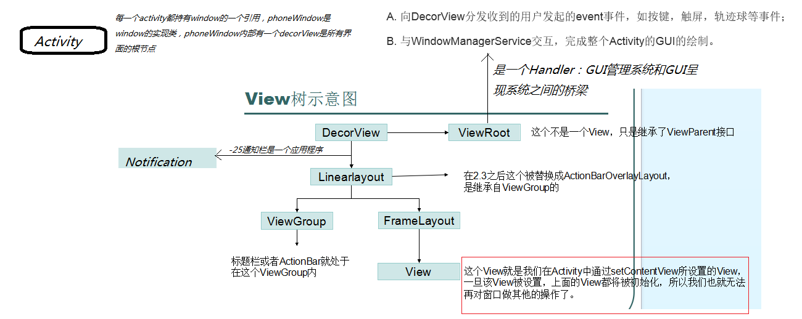
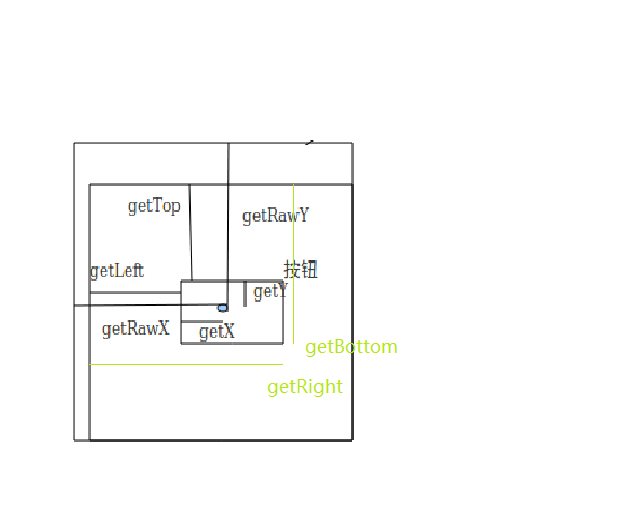

# Android群英传读书笔记

>[书籍介绍](http://blog.csdn.net/eclipsexys/article/details/47405045)

---
## 第一章-Android系统体系架构

### Dalvik与ART

每一个app都会分配Dalvik虚拟机来保证相互之间互补干扰，独立运行，Android5.0开始，ART已经取代了Dalvik，ART在应用安装时就直接把字节码编译成机器码

### Android系统源码目录

- **bionic** bionic C库是Android提供的c标准库
- **bootable** 启动引导相关代码
- **build** 存放系统编译规则等基础开发包配置
- **cts** google兼容性测试标准
- **dalvik** dalvik虚拟机
- **development** 应用程序开发相关
- **external** android使用的开源模块
- **frameworks** Framework 框架核心
- **hardware** 厂商硬件适配层HAL代码
- **out** 编译完成的代码输出目录
- **packages** 应用程序包
- **prebuilt** x86和arm架构下的预编译资源
- **sdk** sdk与模拟器
- **system** 底层文件系统库，应用及组建
- **vendor** 厂商定制代码
- **makefile** makefile定义了一系列的规则来指定模块，哪些文件需要被编译以及这些文件按照怎样的循序去编译。可以看到Makefile最大的好处就是自动化编译


---
## 第二章-Android开发工具新接触

- 掌握adb、aapt等sdk中提供的开发工具
- `adb shell`命名来源于`frameworks/base/cmds/`中

---
## 第三章-Android控件架构与自定义控件详解

### View树结构



每个Activity都包含一个Window对象，有PhoneWindow实现，所有View的监听事件，统一由WindowManagerService来接受，当在onCreate()中调用setContentView方法时，AMS会回调onResume()方法，此时系统才会把整个DecorView添加到PhoneWindow中，让其显示，最终完成界面绘制。这些PhoneWindow统一由WindowManager管理。

### View的测量

三种测量模式

- EXACTLY     精确的
- AT_MOST        有限制的
- UNSPECIFIED    不限制的

View默认的onMeasure方法支持ECACTLY模式，如果自定义控件的时候，不重写omMeasure方法，就只能使用match_parent来指定view的宽高了，一般的处理流程如下面代码

```java
    private Bitmap mBitmap;

    private void init() {
        mBitmap = BitmapFactory.decodeResource(getResources(), R.drawable.meinv);
    }

    @Override
    protected void onMeasure(int widthMeasureSpec, int heightMeasureSpec) {
        // 获取宽度测量规格中的mode
        int widthMode = MeasureSpec.getMode(widthMeasureSpec);
         int heightMode = MeasureSpec.getMode(heightMeasureSpec);
        // 获取宽度测量规格中的size
        int widthSize = MeasureSpec.getSize(widthMeasureSpec);
        int heightSize = MeasureSpec.getSize(heightMeasureSpec);

        // 声明一个临时变量来存储计算出的测量值
        int  heightResult = 0;
        int widthResult = 0;
         /*
         * 如果爹心里有数
         */
        if (widthMode == MeasureSpec.EXACTLY) {
            // 那么儿子也不要让爹难做就取爹给的大小吧
            widthResult = widthSize;
        }
        /*
         * 如果爹心里没数
         */
        else{
            // 那么儿子可要自己看看自己需要多大了
            widthResult = mBitmap.getWidth()+getPaddingLeft()+getPaddingRight();
            /*
               * 如果爹给儿子的是一个限制值
             */
            if (widthMode == MeasureSpec.AT_MOST) {
                // 那么儿子自己的需求就要跟爹的限制比比看谁小要谁
                widthResult = Math.min(widthSize, widthResult);
            }
        }

        if (heightMode == MeasureSpec.EXACTLY) {
            heightResult = widthSize;
        }else{
            //考虑padding
            heightResult = mBitmap.getHeight()+getPaddingBottom()+getPaddingTop();
            if (heightMode == MeasureSpec.AT_MOST) {
                heightResult = Math.min(widthSize, heightResult);
            }
        }
        // 设置测量尺寸
        setMeasuredDimension(widthResult, heightResult);
    }
```

**一般重写View的onMeasure的就是为了能够给View一个wrap_content属性下的默认大小**（当然也可以有其他用途，比如控制宽高比例等）

### View的绘制

一般只用自定义View需要重写onDraw方法，通过canvas来绘制view的内容，onDraw方法的canvas的由来说起来有点复杂

### ViewGroup的测量

ViewGroup不仅需要测量自身大小，还负责测量其子view的大小。当ViewGroup的大小为wrap_content时，ViewGroup就需要根据子view的大小来决定自己的大小了，ViewGroup还要处理子view的margin值。

### ViewGroup的绘制

通常情况下，ViewGroup不需要绘制，他本身没有需要回绘制的东西，如果不指定ViewGroup的背景色，那么它的onDraw方法都不会被调用，但是ViewGroup会通过过dispatchDraw方法通知子view进行自身的绘制

### 自定义View


一些回调方法：

- **onAttachedToWindow** 当view被添加到view树中
- **onFinishInflate** 从xml加载组件后
- **onSizeChanged** View的大小发生变化
- **onMeasure** 测量
- **onLayout** 布局显示位置
- **onDraw** 绘制自身
- **onTouchEvent** 监听触摸
- **onDetachedFromWindow** 当view从view树中移除

View真正的生命周期经过**测量-->布局显示-->绘制**三个步骤

自定义view的三种形式

- 对现有控件的拓展
- 通过组合现有控件带实现新的效果
- 通过重写View来实现全新的控件

### 自定义View一般流程

1. 自定义属性，引用UI模板，在构造方法中获取属性TypedArray
2. 重写onAttachedToWindow了一做一些准备工作，如注册广播的：关于调用时机：当此view附加到窗体上时调用该方法。在这时，view有了一个用于显示的Surface，将开始绘制。注意，此方法要保证在调用onDraw(Canvas) 之前调用，但可能在调用 onDraw(Canvas) 之前的任何时刻，包括调用 onMeasure(int, int) 之前或之后。
3. 重写onMeasure方法来实现精确测量
4. 重写onDraw来实现自身的绘制，onDraw由draw方法回调，draw方法做的事情如下：
  1. Draw the background
  2. If necessary, save the canvas' layers to prepare for fading为显示渐变框做一些准备操作
  3. Draw view's content
  4. Draw children调用dispatchDraw ()方法绘制子视图(如果该View类型不为ViewGroup，即不包含子视图，不需要重载该方法)，值得说明的是，ViewGroup类已经为我们重写了dispatchDraw ()的功能实现，应用程序一般不需要重写该方法，但可以重载父类函数实现具体的功能。dispatchDraw()方法内部会遍历每个子视图，调用drawChild()去重新回调每个子视图的draw()方法(注意，这个 地方“需要重绘”的视图才会调用draw()方法)。值得说明的是，ViewGroup类已经为我们重写了dispatchDraw()的功能实现，应用程序一般不需要重写该方法，但可以重载父类函数实现具体的功能。
  5. If necessary, draw the fading edges and restore layers绘制控件四周的阴影渐变效果
  6. Draw decorations (scrollbars for instance)而重写onDraw方法就是实现第三部，实现view的显示内容的绘制
5. 重写onDetachedFromWindow 可以做一些资源回收，如取消广播监听
6. 暴露一些接口方法，供外部回调

### 自定义ViewGroup

1. 重写onMeasure方法来实现精确测量
2. 测量可能会用到的几个方法：
   - measureChildren
   - measureChild
   - measureChildWithMargins
   - getChildMeasureSpec
   - resolveSize
3. 重写onLayout来确定子view的位置
4. 重写onTouchEvent实现对触摸事件的响应

#### 事件拦截机制

用于解决的问题-->ViewGroup里面的View层层嵌套，到底触摸事件传递给谁。需要了解的只是点：1，事件传递机制；2MotionEvent对于事件的封装（多指触控）


相关方法：

```
dispatchTouchEvent          (View,ViewGroup)                    传递事件
onInterceptouchEvent        (ViewGroup,View不需要拦截事件)       拦截事件
onTouchEvent                (View,ViewGroup)                    处理事件
```
事件传递的返回值，ture表示 拦截不继续 false表示 不拦截，继续流程;事件处理的返回值，true处理了，false由上层View处理

有时候需要实现自己的LayoutParams，重写LayoutParams相关方法

- 实现自己的LayoutParams，一般继承MarginLayoutParams
- 重写相关方法： generateDefaultLayoutParams() ：生成默认的布局参数
- generateLayoutParams(android.view.ViewGroup.LayoutParams p)生成布局参数 ，从属性配置中生成我们的布局参数
- checkLayoutParams(android.view.ViewGroup.LayoutParams p)检查当前布局参数是否是我们定义的类型这在code声明布局参数时常常用到

### invalidate()方法

请求重绘View树，即draw()过程，假如视图发生大小没有变化就不会调用layout()过程，并且只绘制那些需要重绘的视图，即谁请求invalidate()方法，就绘制谁。

一般引起invalidate()操作的函数如下：

1. 直接调用invalidate()方法，请求重新draw()，但只会绘制调用者本身。
2. setSelection()方法，请求重新draw()，但只会绘制调用者本身。
3. setVisibility()方法，当View可视状态在INVISIBLE转换VISIBLE时，会间接调用invalidate()方法，继而绘制该View。
4. setEnabled()方法，请求重新draw()，但不会重新绘制任何视图包括该调用者本身。

### requestLayout()方法

会导致调用measure()过程 和 layout()过程 。

只是对View树重新布局layout过程包括measure()和layout()过程，不会调用draw()过程，但不会重新绘制任何视图包括该调用者本身。

一般引起invalidate()操作的函数如下：

1. setVisibility()方法：当View的可视状态在INVISIBLE/ VISIBLE 转换为GONE状态时，会间接调用requestLayout() 和invalidate()方法。
2. 由于整个个View树大小发生了变化，会请求measure()过程以及draw()过程，同样地，只绘制需要“重新绘制”的视图。

### requestFocus()函数说明

请求View树的draw()过程，但只绘制“需要重绘”的视图。

---
## 第四章-ListView的使用技巧

- ViewHolder使用
- 设置分割线：divider与deviderHeight属性
- 隐藏滚动条：scrollbars="none"
- 取消默认的点击效果 listSelector
- 处理空的listView listView.setEmptyView(View)
- 滑动监听与滑动状态 停止-滚动-抛
- 弹性ListView 重写overScrollBy 修改maxOverScroll返回值
- 多种item的listview，getItemViewType和getViewTypeCount，getItemViewType从1开始
- 动态改变ListView的布局，方法1：控制布局隐藏显示
- 设置ListView需要显示在第几项listView.setSelection(N)(注意:这个方法类似scrollTo,是瞬间完成的移动)
- 实现平滑移动：
 - listView.smoothScrollBy(distance,duration)
 - listView.smoothScrollByOffset(offset)
 - listView.smoothScrollToPosition(index)

---
## 第五章-Android Scroll的分析

### Android坐标系与视图坐标

在Android中屏幕的最左上角作为Android坐标系的**原点坐标**，而**视图坐标**是View的父节点的左上角坐标

    View.getLocationInWindow()和 View.getLocationOnScreen()在window占据全部screen时，
    返回值相同，不同的典型情况是在Dialog中时。当Dialog出现在屏幕中间时，
    View.getLocationOnScreen()取得的值要比View.getLocationInWindow()取得的值要大。

### 触控事件MotionEvent

    getRawX()          获取点击事件在距离屏幕左边的距离，绝对坐标
    getRxwY()
    getX()              获取点击事件在距离父控件左边的距离，视图坐标坐标
    getY()
    getTop             View自身的顶边到父控件顶边的距离
    getBottom          View自身的底边到父控件顶边的距离
    getLeft             View自身的左边到父控件左边的距离
    getRight         View自身的右边到父控件顶边的距离



触摸事件

    ACTION_DOWN                    单指模式手指按下
    ACTION_MOVE                    手指移动（包括单指和多指模式）出于效率的考虑,事件代码为
                                ACTION_MOVE的Motion,会在一个MotionEvent对象中包含多个移动数据采样
    ACTION_UP                    单指模式手指抬起
    ACTION_POINTER_DOWN            多点触控手指按下
    ACTION_POINTER_UP            多点触控手机抬起
    ACTION_CANCEL                事件取消
    ACTION_MASK                    动作常量遮罩0xFF
    ACTION_POINTER_INDEX_MASK    索引信息遮罩0xFF00。

    getAction()                    返回action的类型,考虑使用getActionMasked()和getActionIndex()来获得单独的经过掩码的action和触控点的索引
    getActionMasked()            返回经过掩码的action,没有触控点索引信息. 通过getActionIndex()来得到触控操作点的索引.
    event.getPointerCount()        触控点的个数

一个MotionEvent中的action代码,前8位是实实在在包含表示哪一个动作常量.后八位呢就是包含了触控点的索引信息.

动作常量就是指代什么类型操作，由于触摸操作可能是多点的，所以索引信息就是用来作为多点的标识，比如单点的话索引值是为０的。 

因为ACTION_MASK = 0x00ff所以ACTION_MASK掩码过后的action码就没有索引信息了.也就是说getActionMasked()得到的值是经过掩码处理过的action码，里面信息只有动作常量


每个触点都有一个唯一的id，这个id是在触点第一次按下的时候(动作代码为ACTION_DOWN或者ACTION_POINTER_DOWN)由系统自动分配的。触点的id会一直保持有效，当触点抬起的时候(动作代码为ACTION_UP或者ACTION_POINTER_UP)或者动作取消(动作代码为ACTION_CANCEL)的时候会导致触点的id失效。

MotionEvent类提供了许多可以查看触点的位置或者其他信息的方式，比如getX(int)、getY(int)、getAxisValue(int)、getPointerId(int)、getToolType(int)。这其中的大部分方法都将触点的索引值作为参数而不是触点的id。在事件中，每个触点的索引号的取值范围是从0到getPointerCount()-1。

为了提高效率，代码为ACTION_MOVE的运动事件可能会将多个运动路径处理成一个。最常用的当前触点的坐标可以通过getX(int)和getY(int)获得。之前的坐标可以通过getHistoricalX(int,int)和getHistoricalY(int,int)获得。这些坐标之所以被成为”历史坐标”是因为这些坐标比当前坐标更早的出现了。要想按照时间顺序处理所有坐标，首先要处理历史坐标，然后再是当前坐标。

### View实现滑动的七种方式

#### 1:layout方法

view在绘制时，会调用onLayout方法来设置显示的位置，通过修改View的属性left，right，top，bottom来控制View的坐标

```java
    private int lastEventX;
    private int lastEvetyY;

    //onTouchEvebt方法中
    public boolean onTouchEvent(MotionEvent event）{

        int x = (int)event.getX();
        int y = (int)event.getY();
        int action = event.getAction();
        switch(action){
            case MotionEvent.ACTION_DOWN：
                lastEventX = x;
                lastEventY = y;
                break;
            case MotionEvent.ACTION_MOVE：
                int dx = x - lastEventX;
                int dy = y - lastEventY;
                layout(getLeft()+dx , 
                        getTop()+dy    ,
                        getRight()+dx ,
                        getBottom()+dy );
            Case .......
        }

    }
```

#### 2:offsetLeftAndRight方法和offsetTopAndBottom方法

这俩个方法相当于系统提供的一个正对左右和上下移动的API封装，计算方法与上面代码相似

#### 3:LayoutParams

layoutParams中封装了View的布局参数，可以通过动态的修改布局参数，从而达到View的修改效果

    layoutParams.leftMargin = getLeft() + dx;
    layoutParams.topMargin = getTop() + dy;

#### 4:scrollTo与scrollBy

在一个View中，体统提供了scrollTo和scrollBy来改变view的位置

- scrollTo(int x ,int y)移动到坐标点
- scrollTo(int dx ,int dy)移动增量

需要注意的是，这两个方法移动端View的content，如果在ViewGroup中移动的是ViewGroup的所有子view。如果在View中使用，那么移动的就是View的内容，类如TextView的content就是它的文本，ImageView的content就是他的drawable

**View的视图移动理解**

手机屏幕是一个中空的盖板，盖板下面是一个巨大的画布，也就是我们需要显示的内容，把这个盖板盖在画布的某一处时，透过中间的矩形，我们看见了手机屏幕上显示的视图，而画布上的其他视图，被盖住了无发看见,在手机屏幕上，我们看不见的视图，不代表它不存在，可能就是被盖住了（在屏幕外面），当调用scrollTo方法时，可以理解为外面的盖板在移动

        scrollBy(dx , dy);
        所以在scrollBy方法中,dx与dy为正数，视图将向坐标轴的负方向移动；dx与dy为负数，视图将向坐标轴的正方向移动。

>我的理解就是你手机往下滑动的时候，你希望看到的是view的content往下移动了，而如果你用的是scrollTo/scrollBy方法,你直接滑动的是那个遮罩，所有你看到的现象刚好相反，遮罩像下移动，你看到的是View的conten的下面的内容，所以你把dx,dy取负数，这时遮罩是往上面移动，就好像是view的content往下移动一样。

#### 5:Scroller

    invalidate()-->onDraw()-->computeScroll()

#### 6:属性动画

使用动画其实还是需要调用view像个的方法

#### 7:ViewDragHelper

ViewDragHelper位于support v4包中，DrawerLayoou和SlidingPaneLayout就是用ViewDrawHelper实现的，ViewDragHelper的功能非常强大，这里不详细笔记

---
## 第六章-Android绘图机制与处理技巧

Android绘图机制是Android核心内容之一

### 屏幕尺寸信息

- 屏幕大小：用寸表示，指得是屏幕的对角线长度
- 分辨率：手机屏幕的像素点个数
- PPI/DPI (pixels/dots per inch)像素每英寸。对角线的像素点数除以屏幕的大小

系统屏幕密度，每个厂商都有自己的不同的屏幕密度和像素，要精确到每种DPI是不现实的，所以系统定义了几个标准的DPI值，作为手机固定的DPI

### 2D绘图

- 熟悉Paint相关api
- 熟悉Canvas相关api
- 熟悉Path相关api

### Android XML绘图

- [bitmap](http://blog.csdn.net/coder_pig/article/details/49103657)
- shape
   - rectangle矩形；oval椭圆；line 线；ring圆环 <br/>
   - corners：半径；gradient：渐变；padding：内边距；size：尺寸；solid：填充颜色；stroke：边框
- layer：layer类似photoShop中图层的概念，在xml中根节点是layer-list
- selector：选择器，各种状态下显示的drawable

### Android 绘图技巧

#### canvas 画布

    方法分类：

    1：save与restore类:
        save方法就是将之前画的东西用一个图层保存起来，新画的东西画在一个新的图层。
        restore类似photoShop里的合并图层
    2：drawX类
        画各种图形
    3：translate，rotate，scale，

#### Android图像处理值色彩特效处理

- 色调：物体传播的颜色
- 饱和度：颜色的纯度 0-100
- 亮度：颜色的相对明暗程度

Android利用ColorMatrix来实现对颜色变换，这里只简单介绍；详细可以参考爱哥博客

    colorMatrix是一个4*5的矩阵

    相关方法：
    setRotate(int axis, float degree)设置色调
        axis取值范围：1-red；2-green；3-blue
        如colorMatrix.setRotate(1 , 1);

    setSaturation(float sat)设置饱和度

    setScale()设置亮度

    poastConcat()方法用于将矩阵的作用混合

#### 像素点分析

bitmap传递进来的图片是不能修改的mutable，一般根据原始图生成一张新的图片来修改

    bitmap.getPixels 获取bitmap像素点

#### Android图像处理值图形特效处理

    Android变换矩阵：Matrix
    Matrix是一个3*3的矩阵

#### Android图像处理之画笔特效处理

    proterDuffXfermode

#### Shader着色器

    BitmapShader         位图着色器,通过paint对画布进行指定的bitmap的填充
        了解三种模式：CALMP拉伸；REPEAT重复；MIRROR镜像。
    LinearGradient       线性
    RadialGradient       光束
    SweepGradient        梯度
    ComposeShader        混合模式

    matrix.setScale(1F , -1F)；实现图片的垂直翻转

#### PathEffect

    六种路径效果

### View 的孪生兄弟--SurfaceView

view通过刷新来重新绘图，刷新的时间间隔为16ms，如果16ms内没有完成执行的操作，就会出现掉帧动的现象，SurfaceView用于解决这一问题

    SurfaceView适用于被动更新，频繁的刷新，通过一个子线程来进行刷新，内部的双缓冲机制

---
## 第七章-Android动画机制与使用技巧

- 帧动画
- View动画
- 属性动画

---
## 第八章-Activity与Activity调用栈分析

- 启动模式
- Intent的Flag

---
## 第九章-Android系统信息与安全机制

### Android系统信息的获取

#### android.os.Build

如：Build.VERSION_SDK_INT 版本号

#### SystemProperty

使用方式：`String os_version = System.getProperty("os.version");`

```
os.sersion 版本
os.name 名称
os.arch 架构
user.home Home属性
user.name Name属性
user.dir dir属性
user.timezone 时区
path.separator 路径分隔符
line.separator 行分隔符
file.separator 文件分隔符
java.vendor.url Java Vender URL属性
java.class.path Java Class路径
java.class.version Java Class 版本
java.version java版本
java.home javaHome 属性
```


#### PackageManager

获取应用的包信息，复杂管理所有已安装的App

常用方法

    getPackageManager
    getApplicationInfo          以ApplicationInfo形式返回执行包名的ApplicationInfo
    getApplicationIcon
    getInstalledApplications    以ApplicationInfo形式返回安装的应用
    getInstalledPaceages        以PaceagesInfo形式返回安装的应用
    queryIntentActivitys        返回指定intent的ResolveInfo对象，Activity集合
    queryIntentServices         返回指定intent的ResolveInfo对象，Service集合
    resolveActivity             返回指定intent的Activity
    resolveService              返回指定intent的Service

#### ActivityManager

获取运行的应用程序信息

    内存信息：MemoryInfo：
        availMen     系统可用内存
        totalMen     总内存
        threshold    低内存的阈值
    Debug.MomoryInfo用于统计进程下的内存信息
    RunningServiceInfo与RunningAppProcessInfo类似

### Android的安全机制

#### 系统安全策略

- 第一道防线：proguard混淆
- 权限与文件权限
- 应用签名
- linux内核安全机制，Uid访问权限控制
- 虚拟沙箱

#### 系统安全隐患

- 代码漏洞
- root风险
- 安全机制不健全
- 用户安全意识
- 开发原则与安全
- Apk反编译

---
## 第十章-Android性能优化

### 布局优化

- 防止overdraw
- 优化view的层级，越少越好
- 使用includ重用
- ViewStub延迟加载

### 内存优化

- 寄存器-registers
- 栈-stack
- 堆-heap
- 静态存储区域-static field
- 常量池-constans pool

优化方案：

    1:bitmap优化
    2:代码优化
    3:lint工具
    4:AndroidStudio的Memory Monitor工具
    5:TraceView 工具优化App性能
    6:使用MAT工具分析App内存状态

## 第十一章-搭建云端服务器

略

## 第十二章-Android5.X新特性

略

