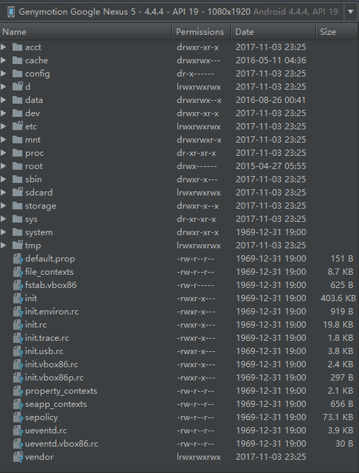

# Android系统目录结构介绍

Android操作系统基于Linux内核，Linux是基于文件的操作系统，硬件驱动以及配置全部以文件形式描述。独有权限验证识别系统。

Android版本对应的Linux内核版本：
```
Android Version    |API Level  |Linux Kernel in AOSP
----------------------------------------------------
1.5   Cupcake      |3          |2.6.27
1.6   Donut        |4          |2.6.29
2.0/1 Eclair       |5-7        |2.6.29
2.2.x Froyo        |8          |2.6.32
2.3.x Gingerbread  |9, 10      |2.6.35
3.x.x Honeycomb    |11-13      |2.6.36
4.0.x Ice Cream San|14, 15     |3.0.1
4.1.x Jelly Bean   |16         |3.0.31
4.2.x Jelly Bean   |17         |3.4.0
4.3   Jelly Bean   |18         |3.4.39
4.4   Kit Kat      |19, 20     |3.10
5.x   Lollipop     |21, 22     |3.16.1
6.0   Marshmallow  |23         |3.18.10
7.0   Nougat       |24         |4.4.1
7.1   Nougat       |25         |4.4.1 (To be updated)
```

---
## 1 目录结构介绍

虽然Android基于Linux内核，但是Android还是对Linux系统的目录结构做了一些调整，具体目录作用如下：

- acct
- data目录： 保存应用程序的数据
```
 *  /data/app目录 用户安装的应用程序的apk
 *  /data/data目录 应用程序产生的私有数据
 *  /data/anr目录 开发人员使用定位anr异常
 *  /data/system目录 系统配置信息，注册表
 *  /data/local/tmp目录 用于存放临时文件
```
- dev目录：用于存放设备文件
- mnt目录/sdcard目录/storage目录：都指向外部存储
```
 * /sdcard/Android/data/<package_name> 应用的额外数据，应用卸载时自动删除。
```
- system 系统目录文件夹（重要） Android系统标准目录结构
```
 * /system/app目录 系统应用程序目录,默认无法卸载
 * /system/bin目录 可执行的二进制程序
 * /system/exc 扩展目录
 * /system/fonts 字体目录
 * /system/framework 框架平台中间件
 * /system/lib 类库 c/c++代码
 * /system/media 媒体资源
 * /system/tts 语音发声引擎
 * /system/usr 用户设备的配置信息，按键编码映射
 * /system/xbin 二进制文件，为开发人员提供的二进制文件
```
- sbin目录：adbd 通讯客户端
- proc目录：配置，状态信息
```
 * /proc/cpuinfo cpu信息
```

---
## 2 目录结构截图



---
## 引用

- [Android的文件系统结构](http://blog.csdn.net/conowen/article/details/7251057)
- [Android系统目录结构](http://www.cnblogs.com/pixy/p/4744501.html)


