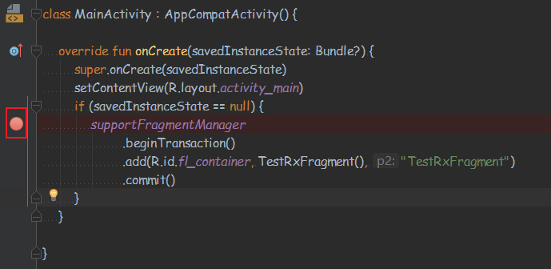
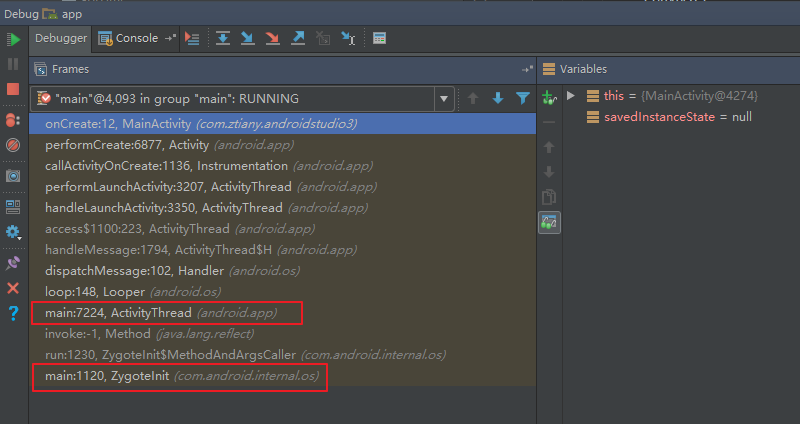
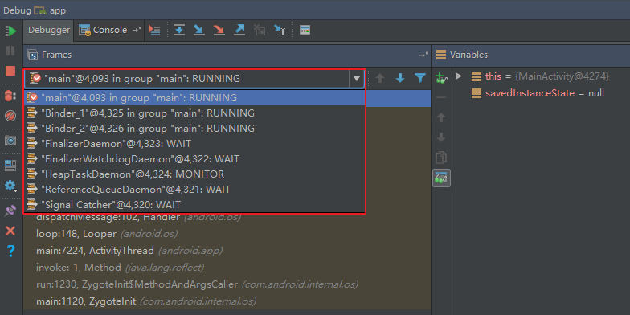

# 从Debug看方法执行流程

开发中经常用Debug调试程序，用来查找各种bug，但是Debug还可以看当前虚拟机有几个线程在运行，并且还可以查看每个线程执行的堆栈信息，这对理清代码执行流程很有帮助，比如假如我们不知道App的启动入口是ActivityThread，也没有资料可以用来查询，那么可以用Debug来查看main线程的堆栈信息：

- 打断点

- 查看main线程的堆栈信息，可以看到Zygote和ActivityThread

- 切换线程
