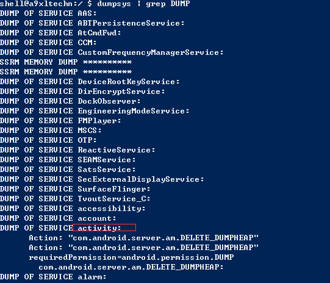

#  adb 学习

---
## 1 adb介绍

**Android Debug Bridge**，Android调试桥接器，简称adb ，该工具位于`<sdk>/platform-tools/`目录下，其源码位于`<path-to-sourcecode>/system/core/adb`目录下，是用于管理模拟器或真机状态的万能工具。 adb 采用了客户端-服务器模型，包括三个部分：

1.  客户端部分，运行在开发用的电脑上，可以在命令行中运行adb命令来调用该客户端，像 DDMS 这样的 Android 工具也可以调用adb客户端。
2.  守护进程部分，运行于模拟器或手机的后台。
3.  服务端部分，是运行在开发用电脑上的后台进程，用于管理客户端与运行在模拟器或真机的守护进程通信。

---
###  ADB原理

当启动adb客户端时，客户端首先检查PC的adb服务进程是否运行，如果没有运行，则启动服务端。当服务端启动时，它会绑定到本地的** TCP5037** 端口，并且监听从adb客户端发来的命令——**所有adb客户端都使用 5037 端口与 adb 服务端通信。**

接下来服务端与所有正在运行的模拟器或手机连接。它通过扫描` 5555-5585 `之间的奇数号端口来搜索模拟器或手机，一旦发现 adb 守护进程，就通过此端口进行连接。需要说明的是，**每一个模拟器或手机使用一对有序的端口，偶数号端口用于控制台连接，奇数号端口用于 adb 连接**

### 使用ADB调试

模拟器可以直接与PC端连接，而默认情况下，真机不会与PC端进行ADB连接，如果要进行ADB连接，需要打开真机的**开发者模式，并且开启adb调试**，如果在系统设置中没有找到**开发者模式选项**，则通过下面方式开启开发者模式:`「设置」-「关于手机」连续点击「版本号」7 次`。

### Windows平台使用技巧

windows如果不进入设置终端，则无法使用grep命令，可以使用**cmd**的**findstr**命令：

`type a.txt | findstr "abc"`命令表现显示a.txt文档中有字符串**abc**的文本。

而findstr应用到dumpsys如下：

    adb shell dumpsys display | findstr DisplayDeviceInfo

findstr DisplayDeviceInfo 表示找到DisplayDeviceInfo相关的信息，这与进入设备终端使用`dumpsys display | grep DisplayDeviceInfo`命令的效果时一致的，当然findstr和grep命令还是有很多的不同的。


---
## 2 用法

### 基本用法

语法为：`adb [-d|-e|-s <serialNumber>] <command>`

| 参数 | 含义 |
| --- | --- |
| -d | 指定当前唯一通过 USB 连接的 Android 设备为命令目标 |
| -e | 指定当前唯一运行的模拟器为命令目标 |
| `-s <serialNumber>` | 指定相应 serialNumber 号的设备/模拟器为命令目标 |


如果只有一个设备/模拟器连接时，可以省略掉` [-d|-e|-s <serialNumber>] `这一部分，直接使用` adb <command>`。如果有多台设备，先使用`adb devices`命令查看设备的序列号，然后使用-s指令，比如：`adb -s 序列号 install xxx.apk`


其他基本命令：

- `adb kill-server` 停止adb服务
- `adb start-server` 开启adb服务
- `adb version` 查看adb版本
- `adb -P <port> start-server` 指定端口启动adb，默认为5037端口
- `adb devices`查看已经连接的设备,加上`-l`指令可以列出更详细的信息
- `adb connect device_ip_address` 根据ip地址链接设备
- `adb shell` 进入设备的终端
- `adb install xxx.apk`安装apk
- `adb uninstall package_name`卸载apk
- `adb pull remote local/adb push local remote`将文件复制到设备/从设备复制文件


### 无线连接设备

可以通过USB数据线连接设备，但是有时候这并不方便，其实也可以使用无线连接的方式，不过要使用无线连接首先还是需要通过USB连接进行设置：

0. 将 Android 设备与要运行 adb 的电脑连接到同一个局域网，比如连到同一个 WiFi。
1. 通过USB连接设备
2. 让设备在555 端口监听 TCP/IP 连接：`adb tcpip 5555`
3. 断开 USB 连接。
4. 找到设备的 IP 地址。
 - 方式1：在手机上通过`「设置」-「关于手机」-「状态信息」-「IP地址」`找到
 - 方式2：通过adb找到，下面会介绍
5. 通过 IP 地址连接设备。`adb connect <device-ip-address>`device-ip-address即设备的ip地址
6. 确认连接状态。
7. 断开连接可以使用：`adb disconnect <device-ip-address>`

**不借助USB进行无线连接需要Root权限，还需要在手机上安装终端模拟器，具体参考下方链接**

### 设置端口转发

可以使用 `forward` 命令设置任意端口转发 — 将对特定主机端口的请求转发到模拟器/设备实例上的其他端口。下面向您介绍如何设置主机端口 6100 到模拟器/设备端口 7100 的转发：

    adb forward tcp:6100 tcp:7100

您也可以使用 adb 设置传输到指定的抽象 UNIX 网域套接字的转发，如下所示：

    adb forward tcp:6100 local:logd

### 调试

通过adb可以查看Android设备的日志信息，Android 系统的日志分为两部分：

- 底层的 Linux 内核日志输出到 /proc/kmsg
- Android 的日志输出到 /dev/log。

查看Android日志：`[adb] logcat [<option>] ... [<filter-spec>] ...`，`adb logcat -c`可以清空日志
查看内核日志：`adb shell dmesg`

**`control+V`可以退出日志输出**

---
## 3 转发shell命令

`adb [-d|-e|-s serial_number] shell shell_command` 直接执行shell命令
`adb [-d|-e|-s serial_number] shell`进入模拟器/设备实例上的远程 shell
`Control + D `或输入` exit`。可以退出shell

### PM命令

pm即PackageManager，使用pm命令可以执行PackageManager的相关功能，在终端使用`pm ?`可以获取pm帮助文档

PM主要功能包括：

**查看应用**：

`pm list packages [-f] [-d] [-e] [-s] [-3] [-i] [-u] [--user USER_ID] [FILTER]`

| 参数 | 显示列表 |
| --- | --- |
| 无 | 所有应用 |
| -f | 显示应用关联的 apk 文件 |
| -d | 只显示 disabled 的应用 |
| -e | 只显示 enabled 的应用 |
| -s | 只显示系统应用 |
| -3 | 只显示第三方应用 |
| -i | 显示应用的 installer |
| -u | 包含已卸载应用 |
| `<FILTER>` | 包名包含 `<FILTER>` 字符串 |


**查看权限**：

`pm list permission`
`pm list permission-groups`

**安装和卸载APK**

`pm install [-lrtsfd] [-i PACKAGE] [--user USER_ID] [PATH]`
`pm uninstall [-k] [--user USER_ID] PACKAGE`

| 参数 | 含义 |
| --- | --- |
| -l | 将应用安装到保护目录 /mnt/asec |
| -r | 允许覆盖安装 |
| -t | 允许安装 AndroidManifest.xml 里 application 指定 `android:testOnly="true"` 的应用 |
| -s | 将应用安装到 sdcard |
| -d | 允许降级覆盖安装 |
| -g | 授予所有运行时权限 |


**清理应用数据**
` pm clear [--user USER_ID] PACKAGE`

**重置所有授权**

`pm reset-permissions`


### AM命令

AM即ActivityManager服务

语法：`am [subcommand] [options]`

- 调起 Activity
- 调起 Service
- 发送广播
- 强制停止应用

### WM命令

WM即WindowManager

语法：`wm [subcommand] [options]`-

- `wm size [reset|WxH|WdpxHdp]` 返回或重置显示的尺寸

常用的WM命令
```
wm size：查询设备分辨率
wm size 1000x2000 设置设备的分辨率
wm size reset 重置分辨率
wm density 查看设备密度
wm density 420 设置设备密度
wm density reset 重置设备密度
wm overscan 20,20,20,20 修改当前设备的屏幕内边距
wm overscan reset 重置
```

### input命令

input可以模拟按键/输入

### dumps命令

`adb shell dumpsys`默认打印出当前系统所有service信息，在后面可加上具体的服务名，需要列出当前运行的服务，可以使用`service list`命令或者进入终端使用`dumpsys | grep DUMP`命令

服务信息部分显示如下：



某些命令可以加上`- h`获取帮助文档，比如：`dumpsys activity -h`

### 常用的命令

**获取设备分辨率：**`dumpsys display | grep DisplayDeviceInfo`
**获取设备电池信息：**`dumpsys battery`
**获取cpu信息：**`dumpsys cpuinfo`
**获取内存信息：**`adb shell dumpsys meminfo`，获取具体应用的内存信息，可在后面加上包名
**查看正在运行的Services**：`adb shell dumpsys activity services [<packagename>]`，`<packagename>` 参数不是必须的，指定 `<packagename>` 表示查看与某个包名相关的 Services，不指定表示查看所有 Services。`<packagename>` 不一定要给出完整的包名,可以只给前面部分。
**查看前台Activity：** `dumpsys activity activities | grep mFocusedActivity`
**获取某个包的信息：**`adb shell dumpsys package PACKAGE_NAME`
**获取通知信息：**`adb shell dumpsys notification`
**获取wifi信息：**`adb shell dumpsys wifi`

- account     显示accounts信息
- activity     显示所有的activities的信息
- cpuinfo    显示CPU信息
- window    显示键盘，窗口和它们的关系
- wifi     显示wifi信息 
- package packagename    获取安装包信息
- usagestats    每个界面启动的时间
- statusbar    显示状态栏相关的信息
- meminfo    内存信息（`meminfo $package_name or $pid `使用程序的包名或者进程id显示内存信息）
- diskstats     磁盘相关信息
- battery     电池信息
- alarm    显示Alarm信息

### 获取系统信息

`adb shell cat /sys/class/net/wlan0/address` 获取 wifi mac 地址
`adb shell cat/proc/cpuinfo`   获取 cpu 序列号
`adb shell cat /system/build.prop`  获取设备编译属性
`adb shell cat /data/misc/wifi/*.conf`  获取设备 Wi-Fi 配置信息


---
## 4 参考

- [Command Line Tools](https://developer.android.com/studio/command-line/index.html?hl=zh-cn)
- [Android 开发中常用 ADB 命令总结](http://mp.weixin.qq.com/s?__biz=MzI3NjAwMzk3Mg==&mid=402824871&idx=1&sn=fe0b154985b7372178b427ae3c436f49&scene=1&srcid=01278wDVR8EwxAC3C27Z0eF5#wechat_redirect)
- [awesome-adb](https://github.com/mzlogin/awesome-adb)


