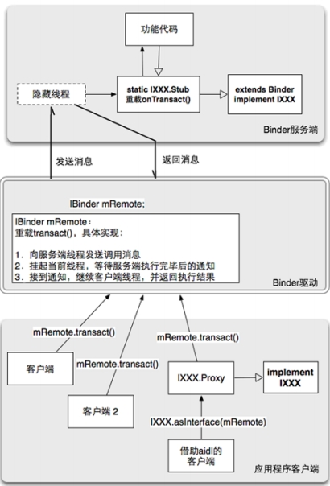
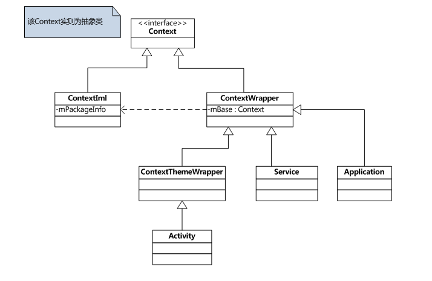
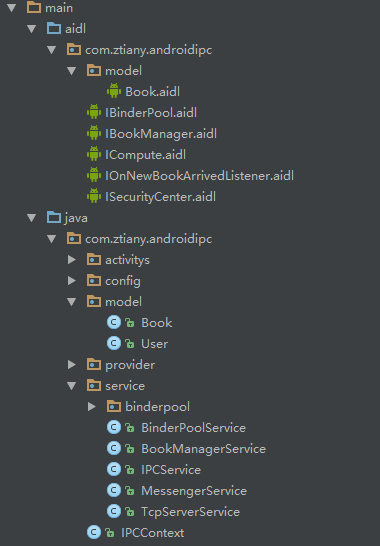
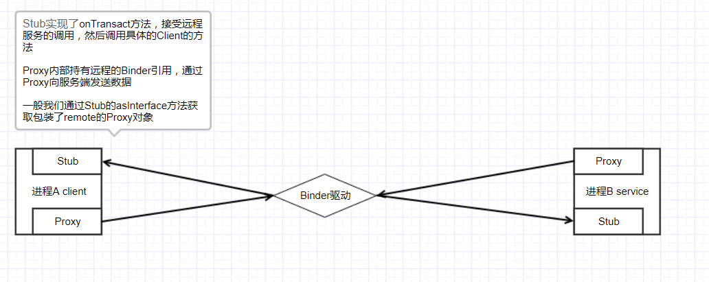
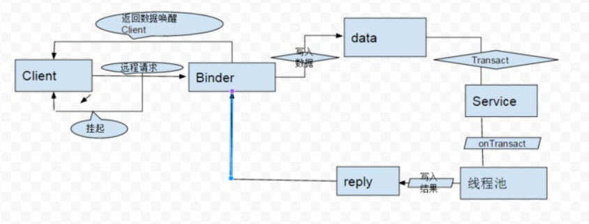

# Binder、ServiceManager、AIDL

## 1 Binder基本介绍

Binder在各层面来说代表什么

- 从直观的交流来讲，Binder是一个实现了IBinder接口的一个类
- 从IPC角度来讲，Binder是Android中一种进程间通信方式
- Binder还可以理解为一个虚拟的物理设备，它的设备驱动是`/dev/binder`
- 从Android的Framework来讲，Binder是ServiceManager连接各种Manager(ActivityManager、WIndowManager等)的桥梁
- 从安卓应用层讲，Binder是客户端和服务端进行通信的媒介，当`bindeSercice`时，服务端返回一个包含了服务端业务的调用对象，通过这个Binder对象，客户端就可以获取服务端提供的服务或者数据

## 2 Binder架构

Android的Binder架构图：


>图摘自《Android内核剖析》

Binder是一种架构，它提供了**客户端接口**、**服务端接口**、**Binder驱动**三个模块。

- 一个Binder服务端实际就是一个Binder对象，该对象一旦创建，内部就会启动一个隐藏的线程，该线程会接受来自Binder驱动的消息，收到消息后，Binder的onTransact方法会被调用，然后按照onTransact的参数执行服务端对应的代码，所以要实现Binder服务端就需要实现创建一个Binder，然后重载onTransact方法，把从Binder驱动传递过来的参数转换为服务端认识的参数，而实际服务端onTransact方法的参数来源于Binder客户端transact方法的调用，因此如何客户端Binder transact有固定格式的输入，那么客户端onTransact就会有固定格式的输出。
- 任意一个服务端Binder对象被创建时，同时会在Binder驱动中(共享内存)创建一个与之对应的`mRemote`对象，该对象也是Binder类型，客户端访问都是通过`mRemote`对象进行访问的。
- 客户端要想访问远程服务，必须获取远程服务Binder对象在Binder驱动的`mRemote`引用，然后可以调用`mRemote`的transact方法，Binder驱动中的`mRemote`重载了transact方法，重载内容包括：
   - 以线程间通讯的模式，向服务端发送从客户端发送过来的参数
   - 挂起当前线程(客户端线程)，等待服务端对应方法执行完毕后的通知
   - 接受服务端线程的通知，然后继续执行客户端线程，并返回客户端代码区

在开发中，客户端调用服务端的服务，就好像是直接调用一样，实际上，客户端是通过Binder驱动中的`mRemote`调用服务端的。


### 客户端如何获取这个Binder驱动中的mRemote对象

首先看看ActivityManagerService的startService：
```java
     ActivityManagerService.java

     public ComponentName startService(IApplicationThread caller, Intent service,
                String resolvedType) {
            // Refuse possible leaked file descriptors
            if (service != null && service.hasFileDescriptors() == true) {
                throw new IllegalArgumentException("File descriptors passed in Intent");
            }

            synchronized(this) {
                final int callingPid = Binder.getCallingPid();
                final int callingUid = Binder.getCallingUid();
                final long origId = Binder.clearCallingIdentity();
                ComponentName res = startServiceLocked(caller, service, esolvedType, callingPid, callingUid);
                Binder.restoreCallingIdentity(origId);
                return res;
            }
        }
```

这个方法用于启动一个服务。但是并没有获取服务端的Binder对象应用，还无法调用服务端业务。平时开发中要与远程Sercice机械能通讯，必须使用bindService的方式，bindService方法：
```java
        ContextWrapper.java

        @Override
        public boolean bindService(Intent service, ServiceConnection conn,
                int flags) {
            return mBase.bindService(service, conn, flags);
        }

```
mBase实际上时ContextImpl，ContextImpl会调用ActivityManagerService的bindService方法。

bindService方法的第二个参数类型是ServiceConnection，是一个接口
```java
    public interface ServiceConnection {

        public void onServiceConnected(ComponentName name, IBinder service);
        public void onServiceDisconnected(ComponentName name);
    }
```

`ServiceConnection`的`onServiceConnected`方法的第二个参数service是什么？假设在客户端(进程A)要绑定一个Service(进程B)，会发生如下流程：

- 当进程A请求ActivityManagerService bind进程B Service时，ActivityManagerService会要求进程B创建Service(如果进程B没有启动，就启动该进程)，进程B创建Service后会通知ActivityManagerService，告知Service创建成功
-  ActivityManagerService收到Service创建成功的消息后，接着就会调用进程B ActivityThread类中的`ApplicationThread`的scheduleBindService方法，然后ApplicationThread中的handleBindService方法被调用，在handleBindService方法中会获取刚刚启动的Service，调用其onBind方法，onBind返回一个Service创建的Binder类型的对象(这个对象就是服务端提供的服务)，通过ActivityManagerService的publishService方法把该Binder对象在共享内存中注册的服务回调到进程A，即进程A 通过ServiceConnection的onServiceConnected回调方法获取远程服务，onServiceConnected的service参数就代表服务端的服务代理
- 服务端进行B中，Service onBind返回一个Binder类型的对象，这个Binder对象在创建的时候会调用内部的init方法，init方法是native的，其实是通过底层`c/c++`向Binder驱动注册一个`mRemote`

```java
ApplicationThread中：

        public final void scheduleBindService(IBinder token, Intent intent,
                    boolean rebind) {
                BindServiceData s = new BindServiceData();
                s.token = token;
                s.intent = intent;
                s.rebind = rebind;
                queueOrSendMessage(H.BIND_SERVICE, s);
            }

ApplicationThread的内部H类中的处理:
      case BIND_SERVICE:
                        handleBindService((BindServiceData)msg.obj);

ApplicationThread中:
private final void handleBindService(BindServiceData data) {
        Service s = mServices.get(data.token);
        if (s != null) {
            try {
                data.intent.setExtrasClassLoader(s.getClassLoader());
                try {
                    if (!data.rebind) {
                        IBinder binder = s.onBind(data.intent);
                        ActivityManagerNative.getDefault().publishService(
                                data.token, data.intent, binder);
                    } else {
                        s.onRebind(data.intent);
                        ActivityManagerNative.getDefault().serviceDoneExecuting(
                                data.token, 0, 0, 0);
                    }
                    ensureJitEnabled();
                } catch (RemoteException ex) {
                }
            } catch (Exception e) {
                if (!mInstrumentation.onException(s, e)) {
                    throw new RuntimeException(
                            "Unable to bind to service " + s
                            + " with " + data.intent + ": " + e.toString(), e);
                }
            }
        }
    }
```

具体过程还需要结合Service的工作过程进行分析。

### 应用层进程在启动后如何与服务端通讯？

ActivityThread中的ApplicationThread作为一个Binder，是怎么被ActivityManagerService调用的呢，也就是ActivityManagerService是怎么获取一个应用进程中ApplicationThread的远程引用的呢？

ActivityThread是开启一个应用的入口，应用进程被创建时，会调用其main方法开启主线程。ActivityThread的main方法：
```java
    public static final void main(String[] args) {
            SamplingProfilerIntegration.start();
            //......省略代码
            Looper.prepareMainLooper();
            if (sMainThreadHandler == null) {
                sMainThreadHandler = new Handler();
            }
            ActivityThread thread = new ActivityThread();
            thread.attach(false);
            //......省略代码
            Looper.loop();
            //......省略代码
            thread.detach();
            //......省略代码
        }
```

ApplicationThread等关键成员是直接在成员位置创建的
```java
        final ApplicationThread mAppThread = new ApplicationThread();
        final Looper mLooper = Looper.myLooper();
        final H mH = new H();
```
ApplicationThread继承ApplicationThreadNative，然后ApplicationThreadNative继承Binder，这明显是一个Binder架构，用来和底层服务端进行通信，在ActivityThread的mian方法中有一个关键的attach方法调用，具体逻辑如下：
```java
     private final void attach(boolean system) {
           ......
                RuntimeInit.setApplicationObject(mAppThread.asBinder());
                IActivityManager mgr = ActivityManagerNative.getDefault();
                try {
                    mgr.attachApplication(mAppThread);
                } catch (RemoteException ex) {
                }
           ......
        }
```

ActivityManagerNative的getDefault：
```java
     static public IActivityManager getDefault()
        {
            if (gDefault != null) {
               .....
                return gDefault;
            }
            IBinder b = ServiceManager.getService("activity");
           ......
            gDefault = asInterface(b);
            ....
            return gDefault;
        }
```

`IBinder b = ServiceManager.getService("activity");`这句代码很关键，通过这行代码获取ActivityManagerService的一个远程引用，那么是如何获取的呢？

---
## 3 ServiceManager管理服务

ServiceManager是一个独立的Java进程，其作用如名称所示，管理各种系统服务，ServiceManager本身也是一个Service，Framework提供了一个系统函数，可以获取该Service对应的Binder引用，那就是`BinderInternal.getContextObject()`(这是一个静态native方法)。该静态函数返回ServiceManager后，就可以通过ServiceManager提供的方法获取其他系统Service的Binder引用。这种设计模式在日常生活中到处可见，ServiceManager就像是一个公司的总机，这个总机号码是公开的，系统中任何进程都可以使用`BinderInternal.getContextObject()`获取该总机的Binder对象，而当用户想联系公司中的其他人（服务）时，则要经过总机再获得分机号码。这种设计的好处是系统中仅暴露一个全局Binder引用，那就是ServiceManager，而其他系统服务则可以隐藏起来，从而有助于系统服务的扩展，以及调用系统服务的安全检查。其他系统服务在启动时，首先把自己的Binder对象传递给ServiceManager，即所谓的注册（addService）。

**ServiceManager是充当着一个中间人的角色，它是整个Binder机制的守护进程，用来管理开发者和系统创建的各种Server，并且向Client提供查询Server远程接口的功能。**

ServiceManager：
```java
    private static IServiceManager getIServiceManager() {
            if (sServiceManager != null) {
                return sServiceManager;
            }
            // Find the service manager
            sServiceManager = ServiceManagerNative.asInterface(BinderInternal.getContextObject());
            return sServiceManager;
        }
```

所以上面函数`BinderInternal.getContextObject()`是一个关键，通过这个静态函数返回ServiceManager对应的全局Binder对象，该函数不需要任何参数，因为它的作用是固定的。从这个角度来看，这个函数的命名似乎更应该明确一些，比如，可以命名为getServiceManager()。

```
` IBinder b = ServiceManager.getService("activity");`返回的就是ActivityManagerService的Binder引用了。
```
具体实现也是用过Native实现的：
```java
       /**
         * Return the global "context object" of the system.  This is usually
         * an implementation of IServiceManager, which you can use to find
         * other services.
         */
        public static final native IBinder getContextObject();
```

再回到asInterface方法：
```java
       static public IActivityManager asInterface(IBinder obj)
        {
            if (obj == null) {
                return null;
            }
            IActivityManager in =
                (IActivityManager)obj.queryLocalInterface(descriptor);
            if (in != null) {
                return in;
            }

            return new ActivityManagerProxy(obj);
        }
```
返回的是一个ActivityManagerProxy对象，传入了ServiceManager中获取IBinder对象(其实就是ActivityManagerService的远程引用)

最终在ActivityManagerProxy的attachApplication把IApplicationThread的Binder引用传递到服务端，从而建立通信，其中transact方法是非常重要的，下面会详细讲解。
```java
      public void attachApplication(IApplicationThread app) throws RemoteException
        {
            Parcel data = Parcel.obtain();
            Parcel reply = Parcel.obtain();
            data.writeInterfaceToken(IActivityManager.descriptor);
            data.writeStrongBinder(app.asBinder());
            mRemote.transact(ATTACH_APPLICATION_TRANSACTION, data, reply, 0);
            reply.readException();
            data.recycle();
            reply.recycle();
        }
```

### 利用Context获取系统底层服务的简单流程梳理

一般要获取一个系统服务是我们会调用如下代码
```java
            WindowManager wm = (WindowManager) getSystemService(WINDOW_SERVICE);
```
接下来跟着这行代码，深入了解其具体实现，熟悉Android Context的都知道Context有如下继承关系：



getSystemService方法最终调用的是ContextImpl中的方法：
```java
        @Override
        public Object getSystemService(String name) {
            //......省略代码
            } else if (ACTIVITY_SERVICE.equals(name)) {
                return getActivityManager();
            } else if (INPUT_METHOD_SERVICE.equals(name)) {
                return InputMethodManager.getInstance(this);
            } else if (ALARM_SERVICE.equals(name)) {
                return getAlarmManager();
            } else if (ACCOUNT_SERVICE.equals(name)) {
                return getAccountManager();
            }
            //......省略代码
            else if (LOCATION_SERVICE.equals(name)) {
                return getLocationManager();
            } else if (SEARCH_SERVICE.equals(name)) {
                return getSearchManager();
            } else if (SENSOR_SERVICE.equals(name)) {
                return getSensorManager();
            } else if (STORAGE_SERVICE.equals(name)) {
                return getStorageManager();
            }
            //......省略代码
            return null;
        }
```

由此可见我们可以通过getSystemService获取各种系统服务，随便看几个获取服务方法，比如获取闹钟管理器：
```java
     private AlarmManager getAlarmManager() {
            synchronized (sSync) {
                if (sAlarmManager == null) {
                    IBinder b = ServiceManager.getService(ALARM_SERVICE);
                    IAlarmManager service = IAlarmManager.Stub.asInterface(b);
                    sAlarmManager = new AlarmManager(service);
                }
            }
            return sAlarmManager;
        }
```
获取电池管理器：
```java
     private PowerManager getPowerManager() {
            synchronized (sSync) {
                if (sPowerManager == null) {
                    IBinder b = ServiceManager.getService(POWER_SERVICE);
                    IPowerManager service = IPowerManager.Stub.asInterface(b);
                    sPowerManager = new PowerManager(service, mMainThread.getHandler());
                }
            }
            return sPowerManager;
        }
```

以上都是直接通过ServiceManager来获取远程服务，再看一下获取ActivityManager
```java
     private ActivityManager getActivityManager() {
            synchronized (mSync) {
                if (mActivityManager == null) {
                    mActivityManager = new ActivityManager(getOuterContext(),
                            mMainThread.getHandler());
                }
            }
            return mActivityManager;
        }
```

表面上返回的是一个ActivityManager，其实内部调用还是通过ActivityManagerNative实现的，比如下面代码：
```java
    public void killBackgroundProcesses(String packageName) {
            try {
                ActivityManagerNative.getDefault().killBackgroundProcesses(packageName);
            } catch (RemoteException e) {
            }
        }

//ActivityManagerNative声明
public abstract class ActivityManagerNative extends Binder implements IActivityManager{}

//getDefault方法
    static public IActivityManager getDefault()
        {
            if (gDefault != null) {
                //if (Config.LOGV) Log.v(
                //    "ActivityManager", "returning cur default = " + gDefault);
                return gDefault;
            }
            IBinder b = ServiceManager.getService("activity");
            if (Config.LOGV) Log.v(
                "ActivityManager", "default service binder = " + b);
            gDefault = asInterface(b);
            if (Config.LOGV) Log.v(
                "ActivityManager", "default service = " + gDefault);
            return gDefault;
        }
```
最终还是调用了`ServiceManager.getService`。

## 4 Binder细节

在Android开发中，Binder主要用于Service中，包含AIDL和Messenger，而Messenger也不过是对AIDL的封装，所以下面通过AIDL示例来了解Binder的具体细节。

AIDL全名为Android Interface Definition Language，用于生成可以在Android设备上两个进程之间进行进程间通信的代码。如果在一个进程中（例如Activity）要调用另一个进程中（例如Service）对象的操作，就可以使用AIDL生成可序列化的参数。如果另个程序需要使用AIDL进行通讯，那么两个工程的代码中必须有完全一致的AIDL文件，AIDL可以理解为服务端和客户端都能懂的一种语言(数据格式)，只有使用同一种语言才能进行有效的沟通。


### 图书管理器示例

Service为一个图书管理器，通过AIDL调用远程服务进行图书的添加与查询

#### 代码目录


#### 序列化Book

Book类，实现了Parcelable，因为需要跨进程传递

```java
    package com.ztiany.androidipc.model;

    public class Book implements Parcelable{
    
        private String mBookId;
        private String mBookName;
    
        public Book() {
        }
    
        public Book(String bookId, String bookName) {
            mBookId = bookId;
            mBookName = bookName;
        }
    
        protected Book(Parcel in) {
            mBookId = in.readString();
            mBookName = in.readString();
        }

        public static final Creator<Book> CREATOR = new Creator<Book>() {
            @Override
            public Book createFromParcel(Parcel in) {
                return new Book(in);
            }
    
            @Override
            public Book[] newArray(int size) {
                return new Book[size];
            }
        };
    
        @Override
        public int describeContents() {
            return 0;
        }
    
        @Override
        public void writeToParcel(Parcel dest, int flags) {
            dest.writeString(mBookId);
            dest.writeString(mBookName);
        }
    }
```

然后是Book的AIDL文件，**由于Book需要通过Binder进行进程间传递，所以必须声明其AIDL文件，所在包名必须与Book.java相同**

```java
//Book.adil
    package com.ztiany.androidipc.model;
    parcelable Book;
```

#### IBookManager

定义IBookManager.aidl，里面定义图书管理的业务方法，注意代码中导入了Book，**AIDL所用到的其他类，必须使用import声明导入，即使是在同一包名下也需要**

```java
//IBookManager.aidl
    package com.ztiany.androidipc;

    // Declare any non-default types here with import statements
    import java.util.List;
    import com.ztiany.androidipc.model.Book;

    interface IBookManager {
       //用于添加Book
       void addBook(in Book book);
       //用于查询所有的Book
       List<Book> getBookList();
    }
```

上面的`void addBook(in Book book);`写法可能有点奇怪，`in` 表示什么？在使用AIDL时，除了基本数据类型，其他参数类型必须标识上方向：

- in 表示输入类型（客户端-->服务端）
- out 表示输出类型（服务端-->客户端）
- inout 表示输入输出类型（服务端<-->客户端）

接着AndroidStudio会给我们生成一个`IBookManager.java`，一般我们都会这么使用IBookManager：

```java
    //服务端端
    public class BookManagerService extends Service {

        private List<Book> mBooks;

        public BookManagerService() {
        }

        @Override
        public void onCreate() {
            super.onCreate();
            mBooks = new ArrayList<>();
            mBooks.add(new Book("001", "Android 群英传"));
            mBooks.add(new Book("002", "Android 开发艺术探索"));
        }
        @Override
        public IBinder onBind(Intent intent) {
            return new BookManager();
        }
    
    
        public class BookManager extends IBookManager.Stub {
    
            @Override
            public void basicTypes(int anInt, long aLong, boolean aBoolean, float aFloat, double aDouble, String aString) throws RemoteException {
    
            }
    
            @Override
            public void addBook(Book book) throws RemoteException {
    
                if (mBooks != null) {
                    synchronized (mBooks) {
                        mBooks.add(book);
                    }
                }
    
            }
    
            @Override
            public List<Book> getBookList() throws RemoteException {
                synchronized (mBooks) {
                    return mBooks;
                }
            }
        }
    }
    
//客户端
//在Activity中绑定服务就可以，通过回调接口可以拿到服务端BooKManager的远程引用，进程调用业务方法，进行操作了

      private IBookManager mIBookManager

      Intent intent = new Intent(this, BookManagerService.class);
    
            bindService(intent, new ServiceConnection() {
                @Override
                public void onServiceConnected(ComponentName name, IBinder service) {
                    if (service != null) {
                        mIBookManager = IBookManager.Stub.asInterface(service);
                    }
                }
    
                @Override
                public void onServiceDisconnected(ComponentName name) {
    
                }
            }, Service.BIND_AUTO_CREATE);
```


为什么是要这样使用呢，答案在IBookManager源码中：

```java
package com.ztiany.androidipc;

public interface IBookManager extends android.os.IInterface {

    //服务端Service需要定一个继承Stub的具体服务，然后在onBind方法中返回这个具体的服务
    //显然Stub是在服务端使用的
    public static abstract class Stub extends android.os.Binder implements com.ztiany.androidipc.IBookManager {
        private static final java.lang.String DESCRIPTOR = "com.ztiany.androidipc.IBookManager";

        //Stub的函数会调用到父类Binder的构造函数，然后
        //父类的init方法被调用，init是一个native方法，该方法被通过底层c/c++向Binder驱动注册一个服务，即mRemote
        public Stub() {
        //attachInterface传递的DESCRIPTOR会被记住，用于在queryLocalInterface方法中判断远程的IBinder是否在同一个进程
            this.attachInterface(this, DESCRIPTOR);
        }

        //进程方法asInterface用于把远程服务端返回的IBinder包装为一个IBookManager的对象
        //从而方便服务端调用
        public static com.ztiany.androidipc.IBookManager asInterface(android.os.IBinder obj) {
            if ((obj == null)) {
                return null;
            }
            //这里会先查询obj是否处于同一进程，如果是则直接返回即可，不需要进行IPC
            android.os.IInterface iin = obj.queryLocalInterface(DESCRIPTOR);
            if (((iin != null) && (iin instanceof com.ztiany.androidipc.IBookManager))) {
                return ((com.ztiany.androidipc.IBookManager) iin);
            }
            
            //如果不是同一个进程则创建Proxy，Proxy包装了mRemote，方便客户端调用
            return new com.ztiany.androidipc.IBookManager.Stub.Proxy(obj);
        }

        @Override
        public android.os.IBinder asBinder() {
            return this;
        }

        //onTransact方法表示收到客户端的调用，然后根据参数调用具体的方法
        @Override
        public boolean onTransact(int code, android.os.Parcel data, android.os.Parcel reply, int flags) throws android.os.RemoteException {
            switch (code) {
                case INTERFACE_TRANSACTION: {
                    reply.writeString(DESCRIPTOR);
                    return true;
                }
                //调用addBook方法
                case TRANSACTION_addBook: {
                    data.enforceInterface(DESCRIPTOR);
                    com.ztiany.androidipc.model.Book _arg0;
                    if ((0 != data.readInt())) {
                        _arg0 = com.ztiany.androidipc.model.Book.CREATOR.createFromParcel(data);
                    } else {
                        _arg0 = null;
                    }
                    this.addBook(_arg0);
                    reply.writeNoException();
                    return true;
                }
                //调用getBookList方法
                case TRANSACTION_getBookList: {
                    data.enforceInterface(DESCRIPTOR);
                    java.util.List<com.ztiany.androidipc.model.Book> _result = this.getBookList();
                    reply.writeNoException();
                    reply.writeTypedList(_result);
                    return true;
                }
                case TRANSACTION_registerListener: {
                    data.enforceInterface(DESCRIPTOR);
                    com.ztiany.androidipc.IOnNewBookArrivedListener _arg0;
                    _arg0 = com.ztiany.androidipc.IOnNewBookArrivedListener.Stub.asInterface(data.readStrongBinder());
                    this.registerListener(_arg0);
                    reply.writeNoException();
                    return true;
                }
                case TRANSACTION_unregisterListener: {
                    data.enforceInterface(DESCRIPTOR);
                    com.ztiany.androidipc.IOnNewBookArrivedListener _arg0;
                    _arg0 = com.ztiany.androidipc.IOnNewBookArrivedListener.Stub.asInterface(data.readStrongBinder());
                    this.unregisterListener(_arg0);
                    reply.writeNoException();
                    return true;
                }
            }
            return super.onTransact(code, data, reply, flags);
        }

        //Proxy包装了mRemote，屏蔽了mRemote的复制使用方式，客户端只需调用简单的接口方法即可
        private static class Proxy implements com.ztiany.androidipc.IBookManager {
            private android.os.IBinder mRemote;

            Proxy(android.os.IBinder remote) {
                mRemote = remote;
            }

            @Override
            public android.os.IBinder asBinder() {
                return mRemote;
            }

            public java.lang.String getInterfaceDescriptor() {
                return DESCRIPTOR;
            }

            //看看，addBook方法内部通过调用mRemote的transact方法进行跨进程调度
            @Override
            public void addBook(com.ztiany.androidipc.model.Book book) throws android.os.RemoteException {
                android.os.Parcel _data = android.os.Parcel.obtain();
                android.os.Parcel _reply = android.os.Parcel.obtain();
                try {
                    _data.writeInterfaceToken(DESCRIPTOR);
                    if ((book != null)) {
                        _data.writeInt(1);
                        book.writeToParcel(_data, 0);
                    } else {
                        _data.writeInt(0);
                    }
                    mRemote.transact(Stub.TRANSACTION_addBook, _data, _reply, 0);
                    _reply.readException();
                } finally {
                    _reply.recycle();
                    _data.recycle();
                }
            }

            @Override
            public java.util.List<com.ztiany.androidipc.model.Book> getBookList() throws android.os.RemoteException {
                android.os.Parcel _data = android.os.Parcel.obtain();
                android.os.Parcel _reply = android.os.Parcel.obtain();
                java.util.List<com.ztiany.androidipc.model.Book> _result;
                try {
                    _data.writeInterfaceToken(DESCRIPTOR);
                    mRemote.transact(Stub.TRANSACTION_getBookList, _data, _reply, 0);
                    _reply.readException();
                    _result = _reply.createTypedArrayList(com.ztiany.androidipc.model.Book.CREATOR);
                } finally {
                    _reply.recycle();
                    _data.recycle();
                }
                return _result;
            }

        }
        //这些否是方法表示，用于判断是调用的哪个方法
        static final int TRANSACTION_addBook = (android.os.IBinder.FIRST_CALL_TRANSACTION + 1);
        static final int TRANSACTION_getBookList = (android.os.IBinder.FIRST_CALL_TRANSACTION + 2);
    }

    public void addBook(com.ztiany.androidipc.model.Book book) throws android.os.RemoteException;

    public java.util.List<com.ztiany.androidipc.model.Book> getBookList() throws android.os.RemoteException;

}
```

#### IBookManager、Stub、Proxy架构分析

接下来详细分析`IBookManager.java`

- IBookManager继承了`android.os.IInterface`,**所有可以在Binder中传输的接口都需要继承IInterface接口**
- 内部类Stub实现了IBookManager并继承自Binder
- Stub实现了onTransact方法
- Proxy为Stub的内部类IBookManager，同样实现了，它内部含有一个Binder类型的`mRemote`引用
- 一般我们通过Stub的`asInterface`方法获取包装了remote的Proxy对象

两个进程分别具有各自的Stub和Proxy，所以构成了下面结构：



1. 当客户端通过bindService获取远程的`mRemote`对象后，通过Stub的asInterface方法返回包装了`mRmote`的IBookManager类型的Proxy对象，然后就可以通过这个IBookManager调用远程服务。
2. 当服务端的Service被bind后，onBind方法被调用，Service会返回继承了Stub的具体Binder对象，这个对象就是远程服务端具体实现了
3. 客户端通过Proxy调用远程服务的时，Proxy是通过调用内部`mRemote`的transact方法实现跨进程调度的，通过transact方法把数据传递到Binder驱动中
4. Binder驱动收到消息就会把数据发送到服务端，这是服务端的Stub类型的onTransact方法就会被调用，然后根据参数类型调度到具体的服务方法
5. 这样就完成了一个跨进程的调度


#### AIDL文件细节分析

其实看似机构混乱的类，仔细分析还是很清晰的

1 声明了两个id，用于标识两个方法

`static  final  int TRANSACTION_addBook`
`static  final  int TRANSACTION_getBookList`

这两个id用于标识在transact过程中客户端请求的到底是哪个方法

2 声明了一个内部类Stub，这个Stub类就是一个Binder类，

  - 当客户端与服务端在同一个进程中是，不会走跨进程的transact方法
  - 当两者不在同一个进程时，方法调用需要走transact过程，这个过程具体由Stub的内部代理类Proxy来完成，可见Binder核心就在Stub类和其内部的Proxy类

3 每个方法的含义：

```java
    **DESCRIPTOR**：Binder的唯一标识，一般用Binder的当前类名表示，比如下面

    private static final java.lang.String DESCRIPTOR = "com.ztiany.androidipc.IBookManager";
```


**asInterface**:用于将服务端的Binder对象转换成客户端所需要的AIDL接口类型对象，这种转换的过程是区分进程的。

- 如果是同一个进程，直接返回服务端Stub本身
- 如果不在同一进程，则返回的是系统封装后的Stub.proxy对象

```java
    public static com.ztiany.androidipc.IBookManager asInterface(android.os.IBinder obj) {
                if ((obj == null)) {
                    return null;
                }
                android.os.IInterface iin = obj.queryLocalInterface(DESCRIPTOR);
                if (((iin != null) && (iin instanceof com.ztiany.androidipc.IBookManager))) {
                    return ((com.ztiany.androidipc.IBookManager) iin);
                }
                return new com.ztiany.androidipc.IBookManager.Stub.Proxy(obj);
            }
```

**asBinder**用于返回当前Binder对象

```java
            @Override
            public android.os.IBinder asBinder() {
                return this;
            }
```

**onTransact**这个方法运行在**服务端中的Binder线程池中**，当服务端发起跨进程时，远程请求通过系统底层封装后交由此方法来处理，方法原型如下：

```java
     public final boolean onTransact(int code, Parcel data, Parcel reply, int flags) throws RemoteException
```

- int code 通过此code来确定远程请求的是那个方法
- Parcel data 从此data中去除目标方法所需要的参数（远程方法传递的参数）
- Parcel reply 当目标方法执行完毕后，就会把执行结果的返回值写入到reply中

这就是onTransact的调用过程，需要注意是，如果目标方法返回false的话，远程方法就会调用失败，可以利用这个特性来做权限认证，在接口中声明的两个业务方法：这两个就是我们在AIDL中声明的两个业务方法，是由服务端Binder实现的，这要与下面Proxy中的对于的同名方法区分开，一类运行在客户端，一类运行在服务端

```java
     public void addBook(com.ztiany.androidipc.model.bean.Book book) throws android.os.RemoteException;

        public java.util.List<com.ztiany.androidipc.model.bean.Book> getBookList() throws android.os.RemoteException;
```

接下来是Proxy分析

```java
private  static  class  Proxy  implements com.ztiany.androidipc.IBookManager
```

**Proxy#getBookList**这个方法运行在客户端，当客户端调用此方法时，其内部运行时这样的：首先创建该方法需要的所需要的输入类型Parcel对象_data,输出类型Parcel对象reply和返回值对象List，然后把该方法的参数信息写入_data中，(如果有参数)接着调用transact方法来发起RPC(远程过程调用)请求，同时当前线程挂起，然后服务端的onTransact方法被调用，知道RPC返回结果后，当前线程继续执行，并从reply中去除调用结果，最后返回_reply中的数据

这个过程从系统Binder类的源码来看，也可以说明：

```java
        public final boolean transact(int code, Parcel data, Parcel reply,
                int flags) throws RemoteException {
            if (Config.LOGV) Log.v("Binder", "Transact: " + code + " to " + this);
            if (data != null) {
                data.setDataPosition(0);
            }
            boolean r = onTransact(code, data, reply, flags);
            if (reply != null) {
                reply.setDataPosition(0);
            }
            return r;
        }
```

**Proxy#addBook**：与getBookList过程一样，只有没有返回值，由此可见Proxy内部持有一个服务端的Binder的一个引用，内部封装了对数据操作，最终调用的是mRemote去调用服务端方法，这样的就简化了客户端的操作。也算是java封装很好的一个体现，封装细节，暴露简单的访问接口。

需要注意两点：

1. 由于客户端调用远程方法会挂起，直到远程方法返回结果，所以如果远程方法是一个耗时方法，应该在子线程中调用远程方法
2. 由于服务端的Binder方法运行在Binder的线程池中，所以Binder方法应该采取同步方式去实现

#### 流程图



方法流程是：

```
客户端调用 getBookList() --> 准备数据_data , _reply --> （当前线程挂起）调用远程transact() --> 调用远程onTransact()
--> 去除客户端数据 --> 调用服务端getBookList()实现，传入参数(如果有的话) --> 服务端getBookList的实现被调用 --> 回到远程onTransact()，把服务端getBookList执行结果写入reply --> 回到远程transact()，返回执行结果true/false --> 回到客户端，返回结果后，客户端线程继续执行。
```

从上面的过程分析来看，系统根据AIDL生成的java类格式是固定的，其实AIDL只是Android提供的一个简单的实现Bindr的工具而已，我们完全可以抛开AIDL来自己写一个Binder出来，从而实现Binder进程间通信

### Binder的死亡监听与重连

Binder有两个重要的方法

- linkToDeath
- unlinkToDeath

Binder运行在服务端，可能由于某种原因导致其异常终止，那么势必会影响客户端的业务调用，可以通过linkToDeath给Binder设置一个死亡代理，当Bidner死亡之后，我们会收到通知，这个时候我们就可以重新发送连接请求从而恢复连接，实现如下：

定义一个IBinder.DeathRecipient

```java
        private IBinder.DeathRecipient mDeathRecipient = new IBinder.DeathRecipient() {
            @Override
            public void binderDied() {
                if (mIBookManager == null) {
                    return;
                }
                mIBookManager.asBinder().unlinkToDeath(mDeathRecipient, 0);
                mIBookManager = null;
                //重连
                bindService(null);
            }
        };
```

然后客户端在bind成功后通过onServiceConnected的回调设置这个死亡监听：

```java
      @Override
                public void onServiceConnected(ComponentName name, IBinder service) {
                    if (service != null) {
                        mIBookManager = IBookManager.Stub.asInterface(service);
                        try {
                            service.linkToDeath(mDeathRecipient , 0);
                        } catch (RemoteException e) {
                            e.printStackTrace();
                        }
                    }
                }
```


另外一个Binder重连的方法是在ServiceConnection的onServiceDisconnected中恢复重连，区别是DeathRecipient运行在Binder线程池中，而onServiceDisconnected在主线程：

```java
            @Override
            public void onServiceDisconnected(ComponentName name) {
                Log.d(TAG, "" + name.getPackageName());
                Log.d("BookManagerActivity", Thread.currentThread().getName());
            }
```
