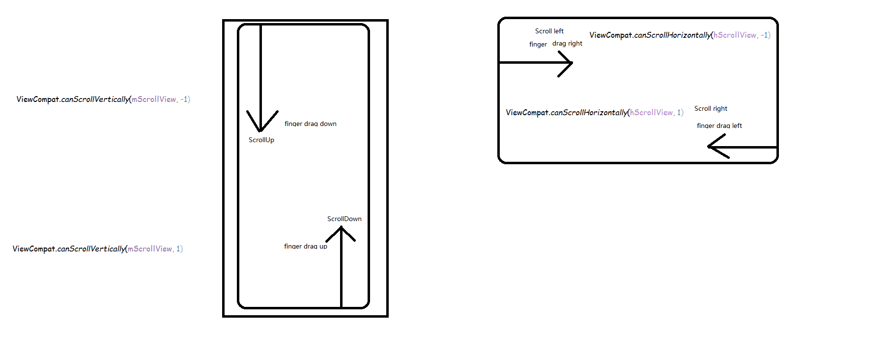

## 1 判断一个View是否可以向下向上滑动

```java
     //判断是否可以向上滑动
     public boolean canChildScrollUp(View view) {
    //api 14用getScroll， 但是对于absListView返回的scroll总是0，
    //所以使用getFirstVisiblePosition和getPaddingTop等判断
            if (android.os.Build.VERSION.SDK_INT < 14) {
                if (view instanceof AbsListView) {
                    final AbsListView absListView = (AbsListView) view;
                    return absListView.getChildCount() > 0
                            && (absListView.getFirstVisiblePosition() > 0 || absListView.getChildAt(0)
                            .getTop() < absListView.getPaddingTop());
                } else {
                    return view.getScrollY() > 0;
                }
            } else {
                //对于api14后，使用canScrollVertically
                //传入负数表示判断是否可以被向下拖动，也就是向上滑动
                //传入正数表示判断是否可以被向上拖动。也就是向下滑动
                return ViewCompat.canScrollVertically(view, -1);
            }
        }
```



## 2 ScrollView是否滑动到底部或头部

```
    if (contentView != null && contentView.getMeasuredHeight() <= getScrollY() + getHeight()) {
            if (onBorderListener != null) {
                onBorderListener.onBottom();
            }
        } else if (getScrollY() == 0) {
            if (onBorderListener != null) {
                onBorderListener.onTop();
            }
        }
```

## 3 [得到view坐标的各种方法](http://www.cnblogs.com/tianzhijiexian/p/4097225.html)

    1.getLocationInWindow:这个方法得到的是view相对于当前Activity的左上角坐标。
      int[] position01 = new int[2];
            imageView.getLocationInWindow(position01);
    2.getLocationOnScreen:得到view相对于整个屏幕的左上角坐标.
     int[] position02 = new int[2];
            imageView.getLocationOnScreen(position02);
    3.getGlobalVisibleRect
    得到整体相对于屏幕的区域范围（Rect），这个rect表示当前view的范围。通过上面的分析，我们可以容易知道这个rect的各个坐标是：
    4.getLocalVisibleRect
    得到自己显示的区域，这个区域的坐标是相对自身的，仅仅用来表示自身所占的范围。左上角坐标一直为（0，0），右下角通过计算可得
    （0，0——160，160）
            // 得到自己的可见的区域坐标，左上角坐标总是（0，0）
            Rect globeRect = new Rect();
            imageView.getLocalVisibleRect(globeRect);
            Log.d(tag, globeRect.toString());
    5相对父控件的坐标
    下面的各种坐标全是相对于父控件的，是相对值。这些值取决于view在父控件中的位置，认为父控件的左上角永远是(0,0)
    复制代码
            //下面得到的坐标是相对于自己的父控件来说的，以父控件的左上角为(0,0)
            Log.d("demo", "X = "+ imageView.getX());
            Log.d("demo", "Y = "+ imageView.getY());
            Log.d("demo", "left:" + imageView.getLeft());
            Log.d("demo", "right:" + imageView.getRight());
            Log.d("demo", "Top:" + imageView.getTop());
            Log.d("demo", "Bottom:" + imageView.getBottom());


## 4 根据View获取View在ViewGroup中位置

比如要获取你现在选中的item在你现在屏幕上**可以看见**的listView的所有item中的第几个：
```
    GroupView.indexOfChild(view);
```
看源码实现：
```
        public int indexOfChild(View child) {
            final int count = mChildrenCount;
            final View[] children = mChildren;
            for (int i = 0; i < count; i++) {
                if (children[i] == child) {
                    return i;
                }
            }
            return -1;
        }
```
## 5 bringToFront

bringToFront方法在SDK中的说明是“Change the view's z order in the tree, so it's on top of other sibling views”，翻译过来就是改变view的z轴，使其处在他父view的顶端。关于bringToFront的实现，网上有很多资料介绍，大体来说就是将这个view从父view中移除，然后再加入父view的顶端。具体实现如何呢？
```
    public void bringChildToFront(View child) {
            int index = indexOfChild(child);
            if (index >= 0) {
                removeFromArray(index);
                addInArray(child, mChildrenCount);
                child.mParent = this;
            }
        }
```
分两步，首先remove，然后add，实际上ViewGroup维持了一个View数组，addInArray方法会把这个child加入到数组最末端，在draw的时候，将依次画数组中的child，最后一个自然就放到了顶端。

## 6 View关闭硬件加速

`setLayerType(LAYER_TYPE_SOFTWARE, null);`

## 7  nextfocus:

 配合` focusSearch(@FocusRealDirection int direction)`方法使用，如果当前view指定了` android:nextFocusRight="@+id/tv"`，那么 focusSearch传入指定 方向得到的是id为tv 的view


## 8 clipToPadding:

该属性默认值为android:clipChildren="true"，设置为false后， 设置根局部padding，表示允许内容在padding中绘制。

## 9 clipChildren：

    该属性默认值为android:clipChildren="true"设置为false后 当子控件的高度高于父控件时， 也会完全显示,而不会被压缩.

##  10 android:duplicateParentState="true"

    如果希望子view的状态跟随父View的状态变化的话加上这个属性，即selector的状态， 如pressed等。

           http://blog.csdn.net/a220315410/article/details/23127787

[View的各种属性说明](http://blog.csdn.net/meng_lw/article/details/7974166)

##  11 android:descendantFocusability="blocksDescendants"

在ListView的Item中，如果有checkBox类控件，整个item会被抢占焦点，用这个属性设置各个控件自己处理

`android:descendantFocusability`，有三个属性值，简述如下表：

| 属性值 |说明|
| --- | --- |
| beforeDescendants | viewgroup会优先其子类控件而获取到焦点 |
| afterDescendants | viewgroup只有当其子类控件不需要获取焦点时才获取焦点 |
| blocksDescendants | viewgroup会覆盖子类控件而直接获得焦点 |

## 12 android:foreground

设置前景属性可以用来处理图片的点击效果，结果发现这个属性存在限制：


View的解析公共属性的源码中有一段：
```
    case R.styleable.View_foreground:
        if (targetSdkVersion >= VERSION_CODES.M || this instanceof FrameLayout) {
            setForeground(a.getDrawable(attr));
        }
        break;
```

从上面代码可以看出，`foreground`属性只有在以下两种情况下生效：

1. 安卓M版本（6.0）及以上
2. FrameLayout本身及其子类


## 13 getChildDrawingOrder和setChildrenDrawingOrderEnabled：

参考：[改变GridView或ListView刷新ITEM的次序](http://m.blog.csdn.net/blog/l598252892/9813249)


## 14 shouldDelayChildPressedState

在自定义控件时，如果控件事不需要滑动的，可以重写`shouldDelayChildPressedState`方法，告诉Framework控件不是不滚动的

## 15 Gravity的使用

    在自定义属性时：直接使用android:layout_gravity这样的name而无需定义类型值，
    这样则表示我们的属性使用的Android自带的标签，之后我们只需根据布局文件中layout_gravity属性的值调用Gravity类下的方法去计算对齐方式则可，
    Gravity类下的方法很好用，为什么这么说呢？因为其可以说是无关布局的，拿最简单的一个来说：
                    public static void apply(int gravity, int w, int h, Rect container, Rect outRect) 更多方法查看：http://www.programgo.com/article/42992498417/
                        gravity      所需放置的对象，由该类中的常量定义
                        w               对象的水平尺寸
                        h                对象的垂直尺寸
                        container          容器空间的框架，将用来放置指定对象，应该足够大，以包含对象的宽和高。
                        outRect    接收对象在其容器中的计算帧(computed frame)

掌握这些技巧对自定义控件会有很大的帮助。


## 16 getGlobalVisibleRect和getLocalVisibleRect

- getGlobalVisibleRect方法的作用是获取视图在屏幕坐标中的可视区域
- getGlobalVisibleRect(Rect r, Point gobalOffset)重载方法，gobalOffset是对应View原点偏离屏幕坐标原点的距离。
- getLocalVisibleRect的作用是获取视图本身可见的坐标区域，坐标以自己的左上角为原点（0，0）

## 17 getHitRect

判断一个点是否在View上：

```java
Rect frame = new Rect();
child.getHitRect(frame);
frame.contains(x, y)
```


## 18 禁止ScrollView自动滑动到底部

给ScrollView的唯一子View加上下面属性

```xml
        android:focusable="true"
        android:descendantFocusability="blocksDescendants"
```

## 19 ScrollView滚动

```
 public boolean fullScroll(int direction)
```

## 20 如果让View支持MAX_HEGIHT

自定一个View，在 onMeasure 中控制 max_height

---
## 21 使用View的静态方法自动生成id

```
    View.generateViewId()
```

---
## 22 ArgbEvaluator

`ArgbEvaluator.evaluate(float fraction, Object startValue, Object endValue);` 用于根据一个起始颜色值和一个结束颜色值以及一个偏移量生成一个新的颜色，分分钟实现类似于微信底部栏滑动颜色渐变


---
## 23 ListView局部刷新：

有的列表可能notifyDataSetChanged()代价有点高，最好能局部刷新。

```
    private void updateItem(int index) {
        int visiblePosition = listView.getFirstVisiblePosition();
        if (index - visiblePosition >= 0) {
            //得到要更新的item的view
            View view = listView.getChildAt(index - visiblePosition);
            // 更新界面（示例参考）
            // TextView nameView = ViewLess.$(view, R.id.name);
            // nameView.setText("update " + index);
            // 更新列表数据（示例参考）
            // list.get(index).setName("Update " + index);
        }
    }
```

也可以使用 hasStableIds ，静态参考[Android开发——ListView局部刷新的实现](https://blog.csdn.net/SEU_Calvin/article/details/69661110)


---
## 24 `setCompoundDrawablesWithIntrinsicBounds()` 方法

```
    setCompoundDrawables()
    setBounds()
```

---
## 25 善用系统已有资源

`?attr/selectableItemBackground` 指向一个选择器

```xml
    <FrameLayout
            android:id="@+id/id_item_gank_mask_iv"
            android:layout_width="match_parent"
            android:layout_height="match_parent"
            android:layout_marginTop="30dp"
            android:background="?attr/selectableItemBackground"
            android:clickable="true" />

`?android:attr/selectableItemBackgroundBorderless` 将波纹效果延伸至视图之外。
`?android:attr/selectableItemBackground`-在视图范围内展示波纹效果；
```

---
## 26 elevation 与绘制顺序

在 Android API21 中，新添加了一个属性 `android:elevation`，用以在xml定义View的深度(高度)，也即 z 方向的值。 与之对应的还有 translationZ 值，elevation的作用：

- 影响View的阴影
- 控制绘制顺序，elevation 越高的View，绘制优先级越高

具体参考[shadows-clipping](https://developer.android.com/training/material/shadows-clipping)

---
## 27 View中的mTransientViews

mTransitioningViews 官方解释如下：

     The set of views that are currently being transitioned. This list is used to track views being removed that should not actually be removed from the parent yet because they are being animated.

当某个child正在做动画的时候(这里指`android.app.Fragment和android.animation.LayoutTransition`移除view的动画)，还不能删除这个child，应该等到动画结束，所以在ViewGroup中暂时保留这个child，直到动画真正结束后再真正删除。ViewGroup有两个成对出现的方法：`startViewTransition和endViewTransition`。在startViewTransition方法中将child加入mTransitioningViews中，在endViewTransition中最终执行view.dispatchDetachedFromWindow()，并在函数最后调用invalidate()。

在removeView的时候，如果当前child在mTransitioningViews中，ViewGroup并不会执行view.dispatchDetachedFromWindow()，也不会设置当前view的mParent为空。由此可以看到一个潜在的问题，如果我们在执行LayoutTransition的DISAPPEARING动画同时removeView，这时子view还并未删除，如果直接将子view加入其它ViewGroup中则会报错 “The specified child already has a parent. You must call removeView() on the child's parent first.”  因为此时这个view还未从上一个ViewGroup中删除。
