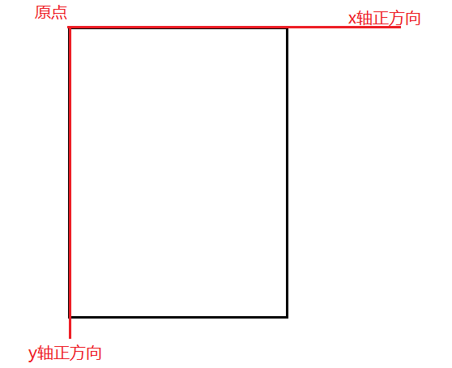
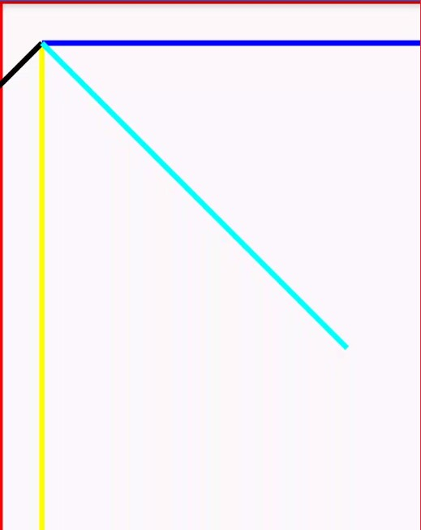

# 基础知识

---
## 1 Canvas

### 1.1 canvas介绍

玩过自定义控件的都知道canvas这个东西，一个画布，这个画布是时在view树构建的时候由系统框架层给我们创建的，然后在执行view树遍历的时候，在draw流程中不断的向下传递，每个view都通过这个canvas来绘制自己的内容，canvas的定义如下：

> The Canvas class holds the “draw” calls. To draw something, you need 4 basic components: A Bitmap to hold the pixels, a Canvas to host the draw calls (writing into the bitmap), a drawing primitive (e.g. Rect,Path, text, Bitmap), and a paint (to describe the colors and styles for the drawing).

canvas拥有一些列drawXXX方法，去画一些东西，需要四个基本组件：

1.  一个Bitmap来保存像素信息(不能使用只读内存)
2.  canvas
3.  绘制一些基本的元素(矩形，路径，文本，位图等)
4.  一个画笔用来描述颜色，风格

在自定义控件中，掌握对canvas的用法非常重要，canvas的方法很多主要可以分为下面几类：

- `drawXXX` 各种draw方法可以绘制出不同的图形
- `translate、rotate、scale`方法用于对canvas进行各种变换
- `clipXXX` clip系类方法用于对canvas进行各种裁剪
- `saveXXX、retore` 用于对canvas的图层进程操作
- 其他方法


### 1.2 canvas的创建

刚刚说了canvas由系统框架层给我们创建，那么到底是在哪里创建的呢？我们可以想一下，既然是在ViewRootImpl中开始执行的遍历绘制，那就肯定就要从ViewRootImpl中找咯。...... 经过一番查找canvas的创建确实是在ViewRootImpl中，主要的流程如下：

```
    performTraversals-->performDraw-->draw-->drawSoftware
```

#### draw方法

```java
     private final Surface mSurface = new Surface();//成员变量mSurface
      private void draw(boolean fullRedrawNeeded) {
            Surface surface = mSurface;
            ......
           if (!drawSoftware(surface, mAttachInfo, xOffset, yOffset, scalingRequired, dirty)) {
                        return;
            }
    }
```

#### drawSoftware

```java
      private boolean drawSoftware(Surface surface, AttachInfo attachInfo, int xoff, int yoff,
                boolean scalingRequired, Rect dirty) {
            // Draw with software renderer.
            final Canvas canvas;
            try {
                final int left = dirty.left;
                final int top = dirty.top;
                final int right = dirty.right;
                final int bottom = dirty.bottom;
                canvas = mSurface.lockCanvas(dirty);//画布的获取
            ......
            if (!canvas.isOpaque() || yoff != 0 || xoff != 0) {
                    canvas.drawColor(0, PorterDuff.Mode.CLEAR);
             }
            ......
             mView.draw(canvas);//绘制
             surface.unlockCanvasAndPost(canvas);//刷新绘制内容
            ......
    }
```

上面是draw和drawSoftware方法的部分逻辑，可以看到canvas用过ViewRootImpl的mSurface创建，然后调用根view的draw方法开始执行遍历，这样在view树种的每一个view都可以通过canvas来绘制各种图像了。

>至于这个Surface这里就不深入分析了，我现在也不是很懂，大概就是这个Surface会通过sWindowSession与WMS取得联系，然后进一步和底层的SurfaceFlinger进行交互。


当根view的draw方法被调用后，canvas就会被传递到各个view的draw方法中，onDraw方法用于绘制自身，而dispatchDraw方法用于把canvas传递给子view进行绘制。而且在传递canvas的过程中，根据子组件的大小和位置，分别调用canvas的translate(int dx, int dy)和clipRect(int l, int t, int r, int b)方法来设置canvas的当前原点坐标和绘制的可见范围，对canvas的坐标和绘图区域进行调整，一般canvas的宽高等于view自身的宽高。


### 1.3 Canvas的坐标系

#### Canvas坐标系

 Canvas坐标系指的是Canvas本身的坐标系，Canvas坐标系有且只有一个，且是唯一不变的，其坐标原点在View的左上角，从坐标原点向右为x轴的正半轴，从坐标原点向下为y轴的正半轴。

#### Canvas绘图坐标系

在一个平面中必然可以用一个二维坐标系对这个平面进行区域和方向的划分，canvas中也存在绘图坐标系的概念，canvas可以通过各种draw方法来绘制不同的图形，但是图形到底绘制在哪里呢，当然是通过坐标来指定位置，初始状况下，绘图坐标系的坐标原点也在View的左上角，从原点向右为x轴正半轴，从原点向下为y轴正半轴。而且canvas绘图坐标系是可变的，可以通过调用Canvas的translate方法可以平移坐标系，也可以通过Canvas的rotate方法可以旋转坐标系，还可以通过Canvas的scale方法可以缩放坐标系，当通过translate、rotate、scale等方法对canvas的绘图坐标进行操作后，之后的绘图操作都是基于新的绘图坐标了。



下面是一个小demo

```java
            mPaint.setColor(Color.RED);
            canvas.drawLine(0, 0, 0, getHeight(), mPaint);
            mPaint.setColor(Color.RED);
            canvas.drawLine(0, 0, getWidth(), 0, mPaint);
    
            int trans = UnitConverter.dpToPx(40);
            canvas.translate(trans, trans);
    
            mPaint.setColor(Color.YELLOW);
            canvas.drawLine(0, 0, 0, getHeight(), mPaint);
            mPaint.setColor(Color.BLUE);
            canvas.drawLine(0, 0, getWidth(), 0, mPaint);
    
            canvas.rotate(45);
            mPaint.setColor(Color.BLACK);
            canvas.drawLine(0, 0, 0, getHeight(), mPaint);
            mPaint.setColor(Color.CYAN);
            canvas.drawLine(0, 0, getWidth(), 0, mPaint);
```

在draw方法中通过对canvas的变换，就可以改变canvas的绘图坐标




---
## 2 绘图坐标与角度计算

在自定义控件过程中，很多ui效果都需要通过数学计算来实现，所以先了解这些数学计算是非常有必要的。

### 2.1 角度与弧度

角度与弧度都表示一个角的大小，角度是60进制，弧度是10进制。

角度和弧度一样都是描述角的一种度量单位，下面是它们的定义：

| 名称 | 定义 |
| --- | --- |
| 角度 | 两条射线从圆心向圆周射出，形成一个夹角和夹角正对的一段弧。**当这段弧长正好等于圆周长的360分之一时，两条射线的夹角的大小为1度.** |
| 弧度 | 两条射线从圆心向圆周射出，形成一个夹角和夹角正对的一段弧。**当这段弧长正好等于圆的半径时，两条射线的夹角大小为1弧度.** |

360角度和2π长度都表示一个圆的夹角大小

角度与弧度的余弦公式如下：

- **弧度 = 角度xπ/180**
- **角度 = 弧度x180/π**

平时在使用`Java uitl`包中的Math计算时需要注意，比如Math.sin(double a),这里**a表示以弧度表示的角**，对于弧度与角度的转换，可以使用Math类中的方法。

     Math.toRadians(angle)
     Math.toDegrees(radian)

### 2.2 Android坐标系角度与数学坐标系角度的区别

其次需要注意的是在android的坐标系中，顺时针方向是角度增大的方向，而逆时针方向是角的较少方向，与数学系的坐标系正好相反。

---
## 3 图形的基础知识

位图都是由像素点组成的，Android使用的颜色模式决定了一个像素点占用内存大小。

Android支持的颜色模式如下：

| 颜色模式 | 说明 |
| --- | --- |
| ARGB8888 | 四通道高精度(32位) |
| ARGB4444 | 四通道低精度(24位) |
| RGB565 | **屏幕默认模式**(16位) |
| Alpha8 | 仅有透明通道(8位) |

颜色模式中，**字母表示通道类型**，**数值表示该类型用多少位二进制来描述**。

**以ARGB888为例：**使用一个int型变量表示一个像素点，我们都知道一个int在内存中占32位，用来表示颜色的话就是分成四个八位，这四个八位分别表示**`A(透明度)，R，G,B`**四个通道，这四个值的取值范围都是`0-255`，其中RGB表示色光三原色，利用色光三元色可以组合成其他各种各样的颜色。


类型|解释|0(0x00)|255(0xff)
---|---|---
A(Alpha)|透明度|透明|不透明
R(Red)|红色|无色|红色
G(Green)|绿色|无色|绿色
B(Blue)|蓝色|无色|蓝色

- A 从ox00到oxff表示从透明到不透明。
- RGB 从0x00到0xff表示颜色从浅到深。
- 当RGB全取最小值(0或0x000000)时颜色为黑色
- 当RGB全取最大值(255或0xffffff)时颜色为白色

在Android中使用一个Bitmap表示一个图像，如果使用`ARGB8888的`颜色模式的话，这个图形占用的内存最大。一般推荐使用`RGB565`模式。注意 **所有的安卓设备屏幕上默认的模式都是RGB565**