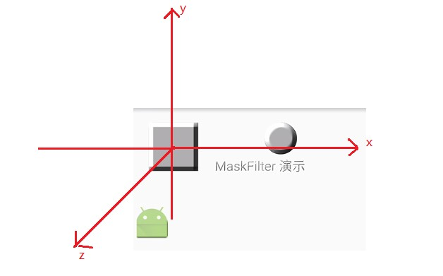

#  Paint介绍

前面介绍了Canvas的基础用法，但是光光有Canvas还是不够的，Canvas只是一个画布，画布需要画笔才能画出图形出来，所以在学习Canvas的相关知识前，需要学好如何使用绘图的工具，如Paint。

在Android中Paint表示一个画笔，Paint类包含了在绘制几何图形、文本和位图时的样式和颜色信息。Paint是一个非常强大和重要的类，掌握其用法对掌握绘图非常重要。

`Paint` 的 API 大致可以分为4类

*   初始化
*   颜色
*   效果
*   drawText() 相关

---
# 1 基本初始化方法

- reset()：重置 `Paint` 的所有属性为默认值。相当于重新 `new` 一个，不过性能当然高一些。
- set(Paint src)：把 `src` 的所有属性全部复制过来
- setFlags(int flags)：批量设置 flags。相当于依次调用它们的 `set` 方法。
`paint.setFlags(Paint.ANTI_ALIAS_FLAG | Paint.DITHER_FLAG);`

---
# 2 绘制效果

Paint关于绘制效果的API总结如下：

1. setAntiAlias (boolean aa)：设置抗锯齿
2. setStyle(Paint.Style style)：绘制风格
3. 线条形状
   - setStrokeWidth(float width)
   - setStrokeCap(Paint.Cap cap)
   - setStrokeJoin(Paint.Join join)
   - setStrokeMiter(float miter)
4. 色彩优化
   - setDither(boolean dither)：色彩抖动
   - setFilterBitmap(boolean filter)：设置是否使用双线性过滤来绘制 `Bitmap`
5. setPathEffect(PathEffect effect)：路径效果
6. setShadowLayer(float radius, float dx, float dy, int shadowColor)
7. setMaskFilter(MaskFilter maskfilter)
8. 获取绘制的Path

---
## 2.1 设置抗锯齿

- **setAntiAlias(boolean aa)**：打开抗锯齿，抗锯齿是依赖于算法的，算法决定抗锯齿的效率，在我们绘制棱角分明的图像时，比如一个矩形、一张位图，我们不需要打开抗锯齿。 等同于：`Paint paint  = new TextPaint(Paint.ANTI_ALIAS_FLAG)`

---
## 2.2 设置样式：setStyle

- **setStyle(Style style)**：用于设置画笔的风格，有**填充、描边、填充+描边 **

---
## 2.3 线条形状

- **setStrokeCap(Paint.Cap cap)**：该方法用来设置我们画笔的笔触风格,可以设置的风格如下：  落笔是圆形的`Paint.Cap.ROUND`  落笔是正方形的`Paint.Cap.BUTT`(默认,绘制的线段恰好在起点终点位置处戛然而止)  落笔是正方形的`Paint.Cap.SUEARE`(绘制的线段的两端端点也会超出起点和终点一点距离)
- **setStrokeJoin(Paint.Join join)** ：这个方法用于设置路径结合处的形态，可以设置的形态分别为： 锐角 `Paint.Join.MITER` 圆弧 `Paint.Join.ROUND`  直线 `Paint.Join.BEVEL`
- **setStrokeWidth(float width)**：用于设置描边的宽度
当线条宽度被设置为 0 时，它的宽度就被固定为 1 像素，就算 Canvas 通过几何变换被放大，它也依然会被以 1 像素宽度来绘制

---
## 2.4 色彩优化

- **setDither(boolean dither)**：用来设置我们在绘制图像时的抖动，也称为递色，将相邻像素之间颜色值进行一种“中和”以呈现一个更细腻的过渡色， 等同于`Paint paint  = new TextPaint(Paint.DITHER_FLAG)`, 其次Paint的参数构造参数支持位运算

- **setShadowLayer(float radius, float dx, float dy, int shadowColor)**：在之后的绘制内容下面加一层阴影
 - 在硬件加速开启的情况下， `setShadowLayer()` 只支持文字的绘制，文字之外的绘制必须关闭硬件加速才能正常绘制阴影。
 - 如果 `shadowColor` 是半透明的，阴影的透明度就使用 `shadowColor` 自己的透明度；而如果 `shadowColor`是不透明的，阴影的透明度就使用 `paint` 的透明度。
- **setRasterizer (Rasterizer rasterizer)**：设置光栅，不支持HW在API21中被废弃

---
## 2.5 setPathEffect

此方法用于设置路径效果，需要一个PathEffect参数：PathEffect 表示路径效果，在画路径的时候使用，有六个子类：

- CornerPathEffect 将路径的转角变得圆滑
- DiscretePathEffect 离散效果：其会在路径上绘制很多“杂点”
- DashPathEffect 破折号效果
- PathDashPathEffect 和DashPathEffect是类似，但是可以自己定义路径虚线的样式
- ComposePathEffect 复合路径
- SumPathEffect 复合路径

需要注意的是ComposePathEffect和SumPathEffect的区别：

- ComposePathEffect(PathEffect outerpe, PathEffect innerpe)会先将路径变成innerpe的效果，再去复合outerpe的路径效果
- SumPathEffect(PathEffect first, PathEffect second)则会把两种路径效果加起来再作用于路径

PathEffect 在有些情况下不支持硬件加速，需要关闭硬件加速才能正常使用：

1. Canvas.drawLine() 和 Canvas.drawLines() 方法画直线时，setPathEffect() 是不支持硬件加速的；
2. PathDashPathEffect 对硬件加速的支持也有问题，所以当使用 PathDashPathEffect 的时候，最好也把硬件加速关闭。

---
## 2.6 遮罩过滤：setMaskFilter(MaskFilter maskfilter)

MaskFilter 有两个子类：

 - BlurMaskFilter 模糊遮罩滤镜
 - EmbossMaskFilter 浮雕遮罩滤镜

###  2.6.1 BlurMaskFilter

**使用BlurMaskFilter需要关闭硬件加速**

模糊遮罩：

       BlurMaskFilter blurMaskFilter = new BlurMaskFilter(radius, blur);

- radius 表示模糊半径，取值必须大于0
- blur 表示模块样式

>阴影按细节来分主要分为内阴影和外阴影，内阴影指的是阴影从图形轮廓向内侧扩张，外阴影指的是阴影从图形轮廓向外侧扩张。从阴影角度说，图形的绘制最多由三部分组成： 外阴影 + 图形本身内容 + 内阴影

blur有四个可选值

- NORMAL 同时绘制图形本身内容+内阴影+外阴影，即正常阴影效果。当阴影模糊半径为0时没有阴影效果，随着阴影模糊半径变大，图形更模糊看不清。
- INNER 绘制图形内容本身+内阴影，不绘制外阴影。
- OUTTER 不绘制图形内容以及内阴影，只绘制外阴影，即图形轮廓以内完全不绘制，轮廓线以内完全是空白的，绘制的Bitmap不可见
- SOLID 只绘制外阴影和图形内容本身，不绘制内阴影。图形轮廓线内部不会发虚，Bitmap无影响

以上四种Blur对用BUTT、SQUARE绘制的点吴影响。

###  2.6.2 EmbossMaskFilter

浮雕效果

>所谓的浮雕效果其实就是模拟光照效果，靠近光的一面显得亮一点，远离光的一面显得暗一点，这样就通过颜色的亮暗营造出浮雕的3D立体效果。

          EmbossMaskFilter(float[] direction, float ambient, float specular, float blurRadius) 

- direction是一个三个长度的数组，用于控制光照方向
- ambient  表示环境光因子，取值范围(0,1),值越接近于1，环境光越亮
- specular 表示镜面反射因子，取值范围(0,1),镜面反射就是模拟像镜子一样的高光反射，值越接近于0，镜面反射越强，被光照照射到的地方更容易出现很白很亮的状态，即高光效果。
- blurRadius 表示模糊半径，其值越大，模糊效果越明显。

关于direction说明：
>表示光线的方向，是个向量，包含三个值，分别是x分量、y分量、z分量，这三个值的绝对大小并不重要，因为direction最后在真正被Android使用时会被归一化成一个单位向量，即变成长度为1的向量.

关于方向的划分如下图所示：

当x=1,y=z=0时，光照像向量值为(1,0,0),表示光从x负半轴照向x正半轴。所以接近x负方向的地方显得亮一些。

**阴影层，同样不支持硬件加速**

---
## 2.7 获取绘制的Path

- getFillPath(Path src, Path dst)
- getTextPath(String text, int start, int end, float x, float y, Path path)
- getTextPath(char[] text, int index, int count, float x, float y, Path path)