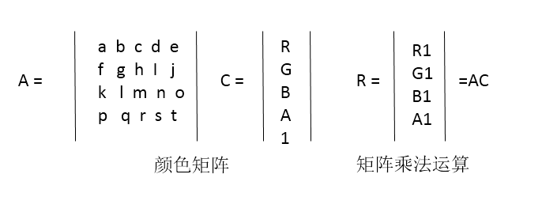
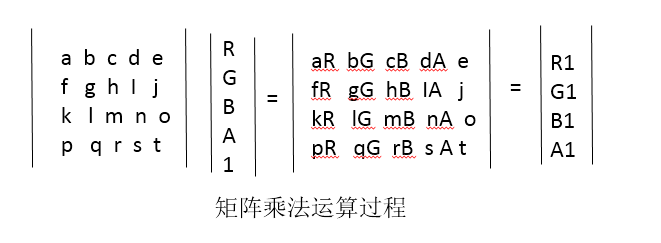
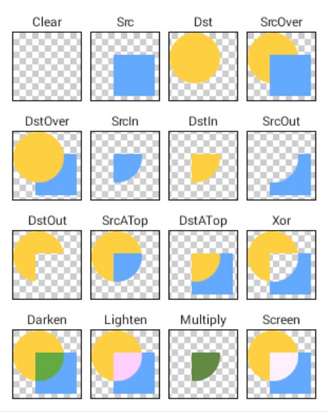

# 3 颜色

Paint关于颜色的API可以范围以下几类：

1. 直接设置颜色
2. setShader(Shader shader) 设置 Shader
3. setColorFilter(ColorFilter colorFilter)
4. setXfermode(Xfermode xfermode)

---
## 3.1 直接设置颜色

-  setColor(int color)
-  setARGB(int a, int r, int g, int b)

---
## 3.2 着色器：setShader(Shader shader)

Shader就是着色器，可用画笔设置，其作用就像它的名字一样是来给图像着色的或者可以理解为上色。Shader有五个子类，分别为：

- BitmapShader bitmap着色器
- LinearGradient 线性渐变着色器
- SweepGradient  梯度渐变着色器
- RadialGradient 镜像渐变着色器
- ComposeShader 组合效果着色器

### BitmapShader

BitmapShader 构造方法：`BitmapShader (Bitmap bitmap, Shader.TileMode tileX, Shader.TileMode tileY)`

bitmap 表示用来上色的bitmap 后面的tileX tileY分别表示 x 和 y 方向的上色模式（该模式是先运用y方向上的上色模式，在运用x方向的上色模式）

BitmapShader是从画布的左上方开始着色，上色方式有：

- Shader.TileMode.MIRROR: 镜像模式，就是反复以远bitmap的镜像上色
- Shader.TileMode.CLAMP：  边缘拉伸模式：就是反复以bitmap的边缘的最后一个像素进行上色
- Shader.TileMode.REPEAT： 反复模式：就是反复以bitmap进行上色

需要注意的是：BitmapShader默认是从画布的左上方开始着色，可以通过Matrix改变默认的行为。

### LinearGradient

LinearGradient的构造方法1：`LinearGradient(float x0, float y0, float x1, float y1, int color0, int color1, Shader.TileMode tile)`

- x0和y0表示渐变的起点坐标
- x1和y1则表示渐变的终点坐标

LinearGradient的构造方法2：`LinearGradient(float x0, float y0, float x1, float y1, int[] colors, float[] positions, Shader.TileMode tile)`

- colors表示渐变应用的颜色
- positions表示的是渐变的相对区域，其取值只有0到1

SweepGradient和RadialGradient两个分别表示梯度渐变和径向渐变,梯度渐变类似扫描仪效果，而径向渐变表示圆形中心向四周渐变的效果。构造方法与LinearGradient类似。

### ComposeShader

组合着色器，**在硬件加速下不支持两个相同类型的 `Shader`**

```
    ComposeShader (Shader shaderA, Shader shaderB, Xfermode mode)
    ComposeShader (Shader shaderA, Shader shaderB, PorterDuff.Mode mode)
```

PorterDuff.Mode用来指定两个图像共同绘制时的颜色策略的。它是一个 enum，不同的 `Mode` 可以指定不同的策略。具体可以参考官网[PorterDuff.Mode](https://developer.android.com/reference/android/graphics/PorterDuff.Mode.html)

---
## 3.3 设置颜色过滤：setColorFilter

### setColorFilter(ColorFilter filter)

setColorFilter用于设置颜色过滤效果。
ColorFilter一共有三个子类，每个子类都有不同的效果

#####  LightingColorFilter

LightingColorFilter光照颜色过滤，该类只有一个构造方法： 
`mul`的全称是colorMultiply意为色彩倍增，`add`的全称是colorAdd意为色彩添加，这两个值都是16进制的色彩值`0xAARRGGBB`。 当`LightingColorFilter(0xFFFFFFFF, 0x00000000)`的时候原图是不会有任何改变的， 如果我们想增加红色的值，那么设置LightingColorFilter(0xFFFFFFFF, 0x00XX0000)即可。其中XX取值为00至FF：

```
     LightingColorFilter lightingColorFilter = new LightingColorFilter(0xFFFFFFFF, 0x00FF0000);
     mPaint.setColorFilter(lightingColorFilter);
```

##### PorterDuffColorFilter

PorterDuffColorFilter的构造方法接受两个值， 一个是16进制表示的颜色值，另一个是PorterDuff内部类Mode中的一个常量值， 这个值表示混合模式，使用示例：

```java
    PorterDuffColorFilter proterFilter = new PorterDuffColorFilter(0x0000FF00 , PorterDuff.Mode.DARKEN);
    mPaint.setColorFilter(proterFilter);
```

##### ColorMatrixColorFilter

ColorMatrixColorFilter内部有一个 4*5的颜色矩阵 ，用来控制颜色的RAGA：

默认的颜色矩阵是这样的：

```java
    ColorMatrix colorMatrix = new ColorMatrix(new float[]{  
            1, 0, 0, 0, 0,
            0, 1, 0, 0, 0,
            0, 0, 1, 0, 0,
            0, 0, 0, 1, 0,
    });
```

- 第一行abcd颜色系数用于决定新的颜色值 R（红色）
- 第二行fghi颜色系数用于决定新的颜色值 G（绿色）
- 第三行klmn颜色系数用于决定新的颜色值 B（蓝色）
- 第四行pqrs颜色系数用于决定新的颜色值 A（透明度）
- 最后一列ejot分别表示每个分量中的offset偏移量

当Matrix中的值为上面矩阵时不对改变原来的颜色。偏移值可以理解为想让颜色更倾向于哪个颜色的时候就增大哪个向量中的偏移值。我们应该使计算后的ARGB在[0,255]间。


关于矩阵的运行公式如下图：





另外直接操作矩阵的话，其实是比较复杂的，colorMatrix也提供了一些方法用于简化对颜色的操作：

- setRotate(int axis, float degrees)： 设置色调，第一个参数系统分别使用0,1,2来代表red green blue 三个颜色的处理，第二个参数就是需要处理的值
- setSaturation(float sat)：设置饱和度，当饱和度为0的时候是灰色的.
- setScale(float rScale, float gScale, float bScale,float aScale)：设置亮度，四个参数分别代表rgba的亮度。，当亮度为零时图像会变成全黑。

除了使用上面的三种方法来处理颜色的效果之外,Android系统还封装了矩阵的乘法运算,可以使用postConcat方法来将矩阵的作用效果混合叠加处理效果,代码如下:

```java
            ColorMatrix colorMatrix = new ColorMatrix();
            colorMatrix.postConcat(colorMatrix);
```

常用矩阵颜色处理效果：

```java
    //灰度效果
        float[] effect1 = {
                0.33F, 0.59F, 0.11F, 0, 0,
                0.33F, 0.59F, 0.11F, 0, 0,
                0.33F, 0.59F, 0.11F, 0, 0,
                0, 0, 0, 1, 0,
        };
    //反转效果
        float[] effect2 = {
                -1, 0, 0, 1, 1,
                0, -1, 0, 1, 1,
                0, 0, -1, 1, 1,
                0, 0, 0, 1, 0,
        };
    //怀旧效果
        float[] effect3 = {
                0.393F, 0.769F, 0.189F, 0, 0,
                0.349F, 0.686F, 0.168F, 0, 0,
                0.272F, 0.534F, 0.131F, 0, 0,
                0, 0, 0, 1, 0,
        };
    //去色效果
        float[] effect4 = {
                1.5F, 1.5F, 1.5F, 0, -1,
                1.5F, 1.5F, 1.5F, 0, -1,
                1.5F, 1.5F, 1.5F, 0, -1,
                0, 0, 0, 1, 0,
        };
    //高饱和度效果
        float[] effect5 = {
                1.438F, -0.122F, -0.016F, 0, -0.03F,
                -0.62F, 1.378F, -0.16F, 0, -0.05F,
                -0.062F, -0.122F, 1.438F, 0, -0.02F,
                0, 0, 0, 1, 0,
        };
```

---
## 3.4 图形混合：setXfermode(Xfermode xfermode)

在颜色的混合模式中可以使用PorterDuff.Mode指定混合模式，但是PorterDuff.Mode不只是应用于颜色混合模式，还有图像混合模式。

"Xfermode" 其实就是 "Transfer mode"，`Xfermode` 指的是你要绘制的内容和 `Canvas` 的目标位置的内容应该怎样结合计算出最终的颜色。其实就是要你以绘制的内容作为源图像，以 View 中已有的内容作为目标图像，选取一个 `PorterDuff.Mode` 作为绘制内容的颜色处理方案

Xfermode本来有三个子类：

- AvoidXfermode
- PixelXorXfermode
- PorterDuffXfermode

现在SDK中只保留了PorterDuffXfermode，其他两个都已经删除和废弃。下面介绍图形混合模式。

**图形混合的作用**：两个图形通过一定的计算产生不同的组合效果，其中：

- Src为源图像，意为将要绘制的图像
- Dis为目标图像，意为我们将要把源图像绘制到的图像

**先画的是目标图 再画才是原图**

例如：

```java
       // 先绘制dis目标图
        canvas.drawBitmap(disBitmap, rectX, rectY, mPaint);
        // 设置混合模式
        mPaint.setXfermode(porterDuffXfermode);
        // 再绘制src源图
        canvas.drawBitmap(srcBitmap, rectX, rectY, mPaint);
        //用完一定要及时清除 Xfermode
        paint.setXfermode(null);
```

图形的混合模式效果如下图：




具体来说， `PorterDuff.Mode` 一共有 17 个，可以分为两类：

1.  Alpha 合成 (Alpha Compositing)
2.  混合 (Blending)

各种模式文字描述如下：

```
    PorterDuff.Mode.ADD                         饱和相加-->ADD模式简单来说就是对图像饱和度进行相加
    PorterDuff.Mode.CLEAR                       清除
    PorterDuff.Mode.DARKEN                      变暗 -->两个图像混合，较深的颜色总是会覆盖较浅的颜色，如果两者深浅相同则混合
    PorterDuff.Mode.LIGHTEN                     变亮-->
    PorterDuff.Mode.MULTIPLY                    正片叠底-->源图像素颜色值乘以目标图像素颜色值除以255即得混合后图像像素的颜色值
    PorterDuff.Mode.OVERLAY                     叠加-->在实际效果中其对亮色和暗色不起作用，也就是说黑白色无效，它会将源色与目标
                                                色混合产生一种中间色，这种中间色生成的规律也很简单，如果源色比目标色暗，那么让目
                                                标色的颜色倍增否则颜色递减。
    
    PorterDuff.Mode.DST                         只绘制目标图
    PorterDuff.Mode.DST_ATOP                    在源图像和目标图像相交的地方绘制目标图像而在不相交的地方绘制源图像
    PorterDuff.Mode.DST_IN                      只在源图像和目标图像相交的地方绘制目标图像-->最常见的应用就是蒙板绘制，
                                                利用源图作为蒙板“抠出”目标图上的图像
                                                
    PorterDuff.Mode.DST_OUT                     只在源图像和目标图像不相交的地方绘制目标图像
    PorterDuff.Mode.DST_OVER                    在源图像的上方绘制目标图像-->就是两个图片谁在上谁在下的意思

    PorterDuff.Mode.SCREEN                      滤色-->滤色产生的效果我认为是Android提供的几个色彩混合模式中最好的，
                                                它可以让图像焦媃幻化，有一种色调均和的感觉

    PorterDuff.Mode.SRC                         显示源图
    PorterDuff.Mode.SRC_ATOP                    在源图像和目标图像相交的地方绘制源图像，在不相交的地方绘制目标图像
    PorterDuff.Mode.SRC_IN                      只在源图像和目标图像相交的地方绘制源图像
    PorterDuff.Mode.SRC_OUT                     只在源图像和目标图像不相交的地方绘制源图像
    PorterDuff.Mode.SRC_OVER                    在目标图像的顶部绘制源图像

    PorterDuff.Mode.XOR                         在源图像和目标图像重叠之外的任何地方绘制他们，而在不重叠的地方不绘制任何内容
```

####  注意事项1：使用离屏缓冲（Off-screen Buffer）

在View的onDraw方法中：

    Xfermode xfermode = new PorterDuffXfermode(PorterDuff.Mode.DST_IN);
    ...
    canvas.drawBitmap(rectBitmap, 0, 0, paint); // 画方
    paint.setXfermode(xfermode); // 设置 Xfermode
    canvas.drawBitmap(circleBitmap, 0, 0, paint); // 画圆
    paint.setXfermode(null); // 用完及时清除 Xfermode

上面这段例子代码，如果直接执行的话是不会绘制出图中效果的，按照逻辑我们会认为，在第二步画圆的时候，跟它共同计算的是第一步绘制的方形。但实际上，却是整个 `View` 的显示区域都在画圆的时候参与计算，并且 `View` 自身的底色并不是默认的透明色，这就导致不仅绘制的是整个圆的范围，而且在范围之外都变成了黑色

要想使用 `setXfermode()` 正常绘制，必须使用离屏缓存 (Off-screen Buffer) 把内容绘制在额外的层上，再把绘制好的内容贴回 View中，通过使用离屏缓冲，把要绘制的内容单独绘制在缓冲层， `Xfermode` 的使用就不会出现奇怪的结果了。

使用离屏缓冲有两种方式

1. Canvas.saveLayer()：`saveLayer()` 可以做短时的离屏缓冲。使用方法很简单，在绘制代码的前后各加一行代码，在绘制之前保存，绘制之后恢复
```java
    int saved = canvas.saveLayer(null, null, Canvas.ALL_SAVE_FLAG);
    canvas.drawBitmap(rectBitmap, 0, 0, paint); // 画方
    paint.setXfermode(xfermode); // 设置 Xfermode
    canvas.drawBitmap(circleBitmap, 0, 0, paint); // 画圆
    paint.setXfermode(null); // 用完及时清除 Xfermode
    canvas.restoreToCount(saved);
```
2. View.setLayerType()：`View.setLayerType()` 是直接把整个 `View` 都绘制在离屏缓冲中。 `setLayerType(LAYER_TYPE_HARDWARE)` 是使用 GPU 来缓冲， `setLayerType(LAYER_TYPE_SOFTWARE)` 是直接直接用一个 `Bitmap` 来缓冲。

关于离屏幕缓存可以参考：[hardware-accel](https://developer.android.com/guide/topics/graphics/hardware-accel.html)

当然还可以创建一个新的Bitmap来作为离屏缓存(一般使用新创建的Bitmap作为构建Canvas的对象)：

```java
        //创建一个Bitmap来作为离屏缓存
        protected Bitmap createDrawingBitmap() {
            if (getDrawable() instanceof BitmapDrawable) {
                Bitmap bitmap = ((BitmapDrawable) getDrawable()).getBitmap();
                //创建一个Bitmap，作为离屏缓冲
                Bitmap drawingBitmap = Bitmap.createBitmap(bitmap.getWidth(),bitmap.getHeight(),Bitmap.Config.ARGB_8888);
                if (mDrawingBitmap != null) {
                    //我们希望对一张已有的图片进行图片混合操作(比如橡皮擦应用)
                    //就把已有的图片画上去，这样PorterDuff的图片混合模式才会有作用 
                    new Canvas(drawingBitmap).drawBitmap(mDrawingBitmap, 0, 0, null);
                }
                return mDrawingBitmap;
            }
        }
```
####  注意事项2： 控制好透明区域

使用 Xfermode 来绘制的内容，除了注意使用离屏缓冲，还应该注意控制它的透明区域不要太小，要让它足够覆盖到要和它结合绘制的内容，否则得到的结果很可能不是你想要的

---
## 3.5 总结PorterDuff.Mode

`PorterDuff.Mode` 在 `Paint` 一共有三处 API ，它们的工作原理都一样，只是用途不同：

API|用途
---|---
ComposeShader|混合两个Shader
PorterDuffColorFilter|增加一个但是的ColorFilter
Xfermode|设置绘制内容 和View中已含有内容的缓和计算方式

## 引用

- [hencoder](http://hencoder.com/)