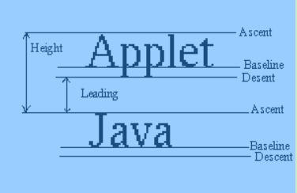
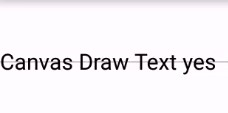

# 4 文本绘制相关

关于Text的绘制方法，可以分为以下几类：

- **绘制文字的方法**
    - `drawText(String text, float x, float y, Paint paint)`
    - `drawTextOnPath()` 在Path上绘制文字
- **StaticLayout进行多行文字的绘制**
- **Paint 对文字绘制的辅助**
    - `setTextSize(float textSize)` 设置文字大小
    - `setTypeface(Typeface typeface) 设置字体
    - `setFakeBoldText(boolean fakeBoldText)` 设置伪粗体
    - `setStrikeThruText(boolean strikeThruText)` 删除线
    - `setUnderlineText(boolean underlineText)` 下划线
    - `setTextSkewX(float skewX)` 设置文字横向错切角度。其实就是文字倾斜度
    - `setTextScaleX(float scaleX)`设置文字的横向缩放
    - `setLetterSpacing(float letterSpacing)` 设置字符间距。默认值是 0。
    - `setFontFeatureSettings(String settings)` 用 CSS 的 font-feature-settings 的方式来设置文字。
    - `setTextAlign(Paint.Align align)` 设置文字的对齐方式
    - `setTextLocale(Locale locale)/ setTextLocales(LocaleList locales)` 设置绘制所使用的 Locale
    - `setHinting(int mode)` 设置是否启用字体的 hinting （字体微调）。
    - `setSubpixelText(boolean subpixelText)` 是否开启次像素级的抗锯齿（ sub-pixel anti-aliasing ）
- **测量文字尺寸类**
    - `float getFontSpacing()` 获取推荐的行距。即推荐的两行文字的 baseline 的距离。这个值是系统根据文字的字体和字号自动计算的。getFontSpacing() 的结果并不是通过 FontMetrics 的标准值计算出来的，而是另外计算出来的一个值，它能够做到在两行文字不显得拥挤的前提下缩短行距，以此来得到更好的显示效果。所以如果你要对文字手动换行绘制，多数时候应该选取 getFontSpacing() 来得到行距，不但使用更简单，显示效果也会更好。
    - `FontMetircs getFontMetrics()`
    - `getTextBounds(String text, int start, int end, Rect bounds)` 获取文字的显示范围。
    - `float measureText(String text)` 测量文字的宽度并返回。测量的是文字绘制时所占用的宽度
    - `getTextWidths(String text, float[] widths)` 获取字符串中每个字符的宽度，并把结果填入参数 widths。
    - `int breakText(String text, boolean measureForwards, float maxWidth, float[] measuredWidth)` 这个方法也是用来测量文字宽度的。但和 measureText() 的区别是， breakText() 是在给出宽度上限的前提下测量文字的宽度。如果文字的宽度超出了上限，那么在临近超限的位置截断文字。
- **光标相关**
    - `getRunAdvance(CharSequence text, int start, int end, int contextStart, int contextEnd, boolean isRtl, int offset)` 对于一段文字，计算出某个字符处光标的 x 坐标。
    - `getOffsetForAdvance(CharSequence text, int start, int end, int contextStart, int contextEnd, boolean isRtl, float advance)`给出一个位置的像素值，计算出文字中最接近这个位置的字符偏移量（即第几个字符最接近这个坐标）。
    -  `hasGlyph(String string)` 检查指定的字符串中是否是一个单独的字形 (glyph）。最简单的情况是，string 只有一个字母

---
## 4.1  getFontMetrics()详解

getFontMetrics返回一个FontMetrics，这个FontMetrics描述了字体的测量信息，文字不像一般的图形只要上下左右，FontMetrics内部定义了top,ascent,descent,bottom,leading五个变量，可用如下图表示：



- ascent表示字体的升部
- descent表示字体的降部
- leading表示行间距
- top表示字体的顶部(为了可能需要的音符而预留)
- bottom 与top类似

升部和降部都是基于baseLine而言的，baseLine以上都是负数，而baseLine以下才是正数。

TextView中我们可以通过xml设置其属性`android:includeFontPadding="false"`去掉一定的边距值但是不能完全去掉。

如果需要把文字绘制在一个控件的垂直居中位置的话，该怎么计算呢？

```java
            int halfHeight = getMeasuredHeight() / 2;
            canvas.drawLine(0, halfHeight, getMeasuredWidth(), halfHeight, mPaint);
            mPaint.getFontMetrics(mFontMetrics);
            canvas.drawText(mText, 0, (halfHeight - ((mFontMetrics.ascent + mFontMetrics.descent) / 2)), mPaint);
```

效果如下：



想对应的还有下面一系列方法：

```java
    getFontMetrics();
    getFontMetricsInt();
    getFontMetrics(FontMetricsInt fontmetricsInt);
    getFontMetrics(FontMetrics fontMetrics);
```

>中文字符的绘制和英文字符并无区别，也可使用类似的基线和升部、降部。

---
## 4.2 getTextBounds

**getTextBounds**，获取的是一个能包裹住文本的最小矩形，矩形原点默认为(0,0)。

下面方法可以正好把Rect画在包括Text的地方

```java
paint.setStyle(Paint.Style.FILL);
canvas.drawText(text, offsetX, offsetY, paint);
paint.getTextBounds(text, 0, text.length(), bounds);  
bounds.left += offsetX;  
bounds.top += offsetY;  
bounds.right += offsetX;  
bounds.bottom += offsetY;  
paint.setStyle(Paint.Style.STROKE);  
canvas.drawRect(bounds, paint);
```

---
## 4.3 setTypeface

设置字体，默认的字体有:

```java
    public static final Typeface DEFAULT;
    public static final Typeface DEFAULT_BOLD;
    public static final Typeface SANS_SERIF;
    public static final Typeface SERIF;
    public static final Typeface MONOSPACE
    //风格
    public static final int NORMAL = 0;
    public static final int BOLD = 1;
    public static final int ITALIC = 2;
    public static final int BOLD_ITALIC = 3;
```
我们也可以使用自定义的字体：

```java
    createFromAsset(AssetManager mgr, String path)
    createFromFile(String path)
    createFromFile(File path)
    Typeface.defaultFromStyle();
    Typeface.create(Typeface.SERIF, Typeface.BOLD);
```
