# Path

---
## 1 Path介绍

Path类表示路径，封装了直线，曲线，图形等等，利用Path类可以绘制出比较炫的效果，所以掌握其用法还是有必要的。

---
## 2 Path常用方法说明


| 方法名  | 说明  |
| ------------ | ------------ |
| moveTo(float x, float y) |  移动下一次操作的起点位置 |
| setLastPoint(float x, float y)  | 重新设置当前path的最后一个点位置，如果在绘制之后调用，对之气的操作有影响，如果在绘制之前调用则效果和moveTo相同  |
| lineTo(float x, float y) |  在最后点和当前点间添加一条直线 |
| close()  | 闭合路径，连接第一个点连接到最后一个点，形成一个闭合区域  |
| addXXX系类方法  |  添加一个路径或图形到当前路径 |
| isEmpty()  | 判断Path是否包含内容空  |
| isRect()  |  判断path是不是一个矩形 |
| set(Path path)  | 新的路径替换到当前路径的内容  |
| offset((float x, float y))  | 对当前路径之前的操作进行偏移,不影响之后的操作  |
| quadTo(float x1, float y1,float x2, float y2)  | 二阶贝塞尔曲线  |
|  cubicTo(float x1, float y1,float x2, float y2，float x3, float y3) | 三阶贝塞尔曲线  |
| rXxxTo类方法  |  不带r的方法是基于当前canvas的坐标系，rXxx方法是基于以当前点作为坐标原点的坐标系 |
|incReserve(int extraPtCount)|提示Path还有多少个点等待加入，让Path优化存储结构)|
|op(Path path, Op op)|对两个Path进行布尔运算(即取交集、并集等操作)|
|computeBounds(RectF bounds, boolean exact)|计算Path的边界|
|transform(Matrix matrix)|对Path做矩阵操作|
|setFillType, getFillType, isInverseFillType, toggleInverseFillType|填充模式相关|
|reset()|清除Path中的内容，reset不保留内部数据结构，但会保留FillType|
|rewind()|清除Path中的内容，|
·

---
## 3 Path的点、直线、图形与主要方法说明

Path被创建出来后，默认的启动即使canvas的坐标原点

### moveTo和setLastPosition方法的区别

- moveTo 移动下一次操作的起点，不对之前的操作产生影响，对之后的操作产生影响
- setLastPoint，设置之前操作的最后一个点，对之前和之后的操作都会产生影响

### Close

close方法用于封闭路径，如果其实点和最后一个点不重合，则会连接成一个闭合路径，**如果连接了最后一个点和第一个点仍然无法形成封闭图形，则close无效果**

### addXxxx类方法

add类方法如下：
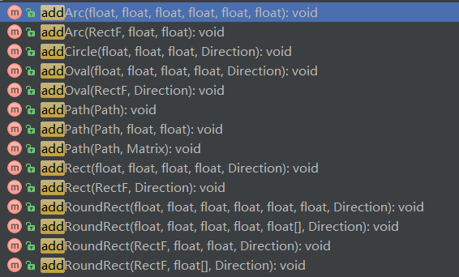

根据参数可以分为三类：

#### 第一类

```java
        // 圆形
        addCircle (float x, float y, float radius, Path.Direction dir)
        // 椭圆
        addOval (RectF oval, Path.Direction dir)
        // 矩形
        addRect (float left, float top, float right, float bottom, Path.Direction dir)
        addRect (RectF rect, Path.Direction dir)
        // 圆角矩形
        addRoundRect (RectF rect, float[] radii, Path.Direction dir)
        addRoundRect (RectF rect, float rx, float ry, Path.Direction dir)
        addRoundRect(float left, float top, float right, float bottom, float rx, float ry,
                Direction dir)
        addRoundRect(float left, float top, float right, float bottom, float[] radii,
                Direction dir)
```

添加基本图形，包括圆形，椭圆，矩形，圆角矩形，这些都比较好理解，比如下面操作：

```java
 canvas.translate(getMeasuredWidth()/2,getMeasuredHeight()/2);//移动绘图坐标到view的中心
            mPath.addRect(-400, -400, 400, 400, Path.Direction.CCW);//添加一个矩形
            canvas.drawPath(mPath, mPaint);//绘制
```

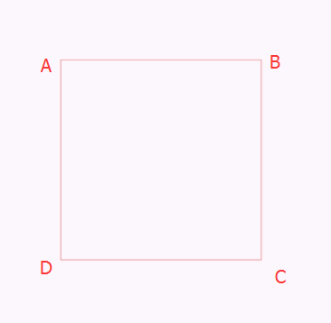


但是这些方法的最后一个参数都是Direction，Direction表示方向，有两个可选值：

| 类型 | 解释 |
| --- |  --- |
| CW | 顺时针 |
| CCW | 逆时针 |

Direction的作用如下：

- 在添加图形时确定闭合顺序(比如ABCD还是ACDB)
- 对自相交图形的渲染结果有影响
- 对drawTextOnPath有影响

Path是对直线，曲线的封装，而矩形其实就是由线段组成的，只需要两点(对角线亮点)即可确定一个矩形，在绘制矩形时其实就是通过moveTo到起点，然后四次lineTo即可完成。这里顺时针和逆时针就是用来确定记录这些lineTo点的顺序的，比如下面操作：

##### CW 顺时针

```java
            canvas.translate(getMeasuredWidth() / 2, getMeasuredHeight() / 2);
            mPath.addRect(-300, -300, 300, 300, Path.Direction.CW);
            mPath.setLastPoint(200, -200);
            canvas.drawPath(mPath, mPaint);
```

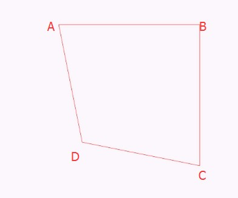

##### CCW 逆时针

```java
     canvas.translate(getMeasuredWidth() / 2, getMeasuredHeight() / 2);
            mPath.addRect(-300, -300, 300, 300, Path.Direction.CCW);
            mPath.setLastPoint(200, -200);
            canvas.drawPath(mPath, mPaint);
```

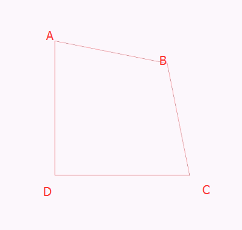

由此可以看出，当Direction为CW时，绘制循序是**ABCD**，而当Direction为CCW时，点的顺序是**ADCB**

##### Direction对绘制文字的影响：

CW:

```java
      canvas.translate(getMeasuredWidth() / 2, getMeasuredHeight() / 2);
            mPath.addRect(-300, -300, 300, 300, Path.Direction.CW);
            mPath.setLastPoint(200, -200);
            canvas.drawPath(mPath, mPaint);
            canvas.drawTextOnPath(mText,mPath,0,0,mPaint);
```

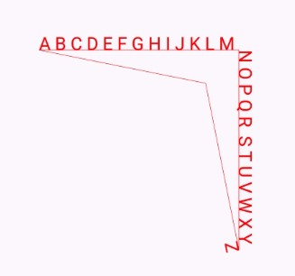

CCW：

```java
     canvas.translate(getMeasuredWidth() / 2, getMeasuredHeight() / 2);
            mPath.addRect(-300, -300, 300, 300, Path.Direction.CCW);
            mPath.setLastPoint(200, -200);
            canvas.drawPath(mPath, mPaint);
            canvas.drawTextOnPath(mText,mPath,0,0,mPaint);
```

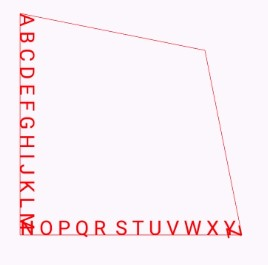

从文字的绘制方向也可以看出Direction对矩形四个点的顺序的影响。

#### 第二类

第二类是对path的操作

```java
        public void addPath (Path src)//两个path合并
        public void addPath (Path src, float dx, float dy)//src应用dx,dy位移后，再和原path合并
        public void addPath (Path src, Matrix matrix)//src应用matrix变化后，再和原path合并
```

Path的操作比较简单，如：

```java
        mPath.addRect(-300, -300, 300, 300, Path.Direction.CW);
        mPathByAdd.addCircle(0, 0, UnitConverter.dpToPx(20), Path.Direction.CW);
        //mPath.setLastPoint(200, -200);
        mPath.addPath(mPathByAdd, 0,- 300);
        canvas.drawPath(mPath, mPaint);
```

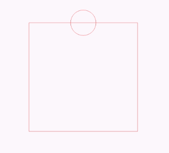


#### 第三类

Arc相关操作，这里的Arc操作都是弧形而不是扇形：

```java
        //addArc
        public void addArc (RectF oval, float startAngle, float sweepAngle)
        // arcTo
        public void arcTo (RectF oval, float startAngle, float sweepAngle)
        public void arcTo (RectF oval, float startAngle, float sweepAngle, boolean forceMoveTo)
```

- addArc 直接添加一个圆弧到path
- arcTo 添加一个圆弧到path，如果圆弧的起点和上次操作的最后一个坐标点不相同，就会连接两个点

**forceMoveTo**的作用：

当forceMoveTo为true时，将最后一个点移动到圆弧起点，即不连接最后一个点与圆弧起点，等价于addArc方法：

```java
        canvas.translate(getMeasuredWidth() / 2, getMeasuredHeight() / 2);
        mRectF.set(0, 0, 300, 300);
        mPath.lineTo(100,-100);
        mPath.arcTo(mRectF,0,270,true);//不链接，移动
        mPath.lineTo(500,500);
```

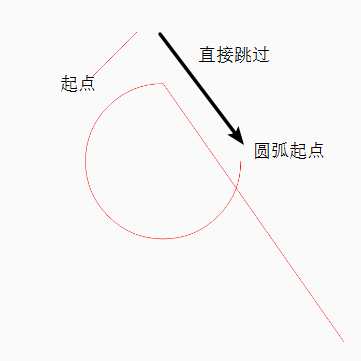

当forceMoveTo为false时，不移动最后一个点，而是连接最后一个点与圆弧起点

```java
      canvas.translate(getMeasuredWidth() / 2, getMeasuredHeight() / 2);
      mRectF.set(0, 0, 300, 300);
      mPath.lineTo(100,-100);
      mPath.arcTo(mRectF,0,270,false);//不移动，连接
      mPath.lineTo(500,500);
      mPath.lineTo(-500,600);
```

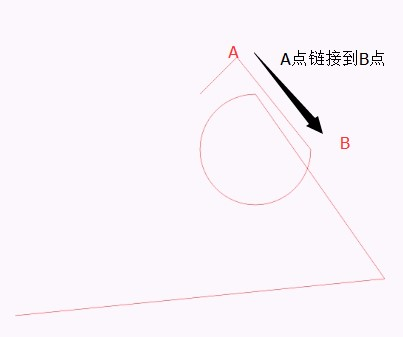

从绘制文字方向可以看出addArc的方向：

```java
         canvas.translate(getMeasuredWidth() / 2, getMeasuredHeight() / 2);
                mRectF.set(0, 0, 300, 300);
                mPath.addArc(mRectF, 0, 270);
                mPath.lineTo(500,500);
                mPath.lineTo(-500,600);
            canvas.drawPath(mPath, mPaint);
            canvas.drawTextOnPath(mText, mPath, 0, 0, mPaint);
```

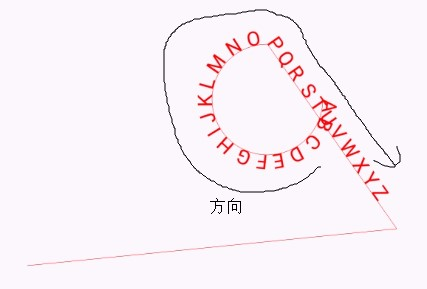


### isEmpty

判断path对象中是否有内容

#### isRect

判断Path是否为一个矩形：`boolean  isRect (RectF rect)`
如果是，则把矩形的信息放入参数rect中。

#### offset

对path进行一段平移

```java
     offset(float dx, float dy, Path dst)//对dst进行平移，对当前path无影响
     offset(float dx, float dy)//对当前path进行平移
```

#### set

将新的path应用到当前的path

---
## 4 贝塞尔曲线

Path提供一些方法用来模拟贝塞尔曲线，对于贝塞尔曲线维基百科的介绍如下：

>贝赛尔曲线（Bézier曲线）是电脑图形学中相当重要的参数曲线。更高维度的广泛化贝塞尔曲线就称作贝塞尔曲面，其中贝塞尔三角是一种特殊的实例。贝塞尔曲线于1962年，由法国工程师皮埃尔·贝塞尔（Pierre Bézier）所广泛发表，

贝塞尔曲线有高阶和低阶之分，

#### 一阶贝塞尔曲线

给定点**P0**、**P1**，线性贝塞尔曲线只是一条两点之间的直线。这条线由下式给出：
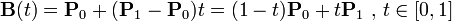

效果如下：

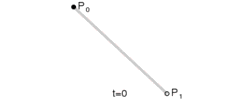

#### 二阶贝塞尔曲线

二次方贝塞尔曲线的路径由给定点**P0**、**P1**、**P2**的函数B（t）追踪：

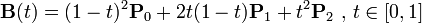

效果如下：


#### 三阶贝塞尔曲线

P0、P1、P2、P3四个点在平面或在三维空间中定义了三次方贝塞尔曲线。曲线起始于P0走向P1，并从P2的方向来到P3。一般不会经过P1或P2；这两个点只是在那里提供方向资讯。P0和P1之间的间距，决定了曲线在转而趋进P2之前，走向P1方向的“长度有多长”。

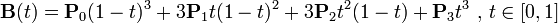

效果如下：


当然还有四阶五阶贝塞尔曲线，这里不做深入研究。对于贝塞尔曲线方程的求解[维基百科](https://zh.wikipedia.org/wiki/%E8%B2%9D%E8%8C%B2%E6%9B%B2%E7%B7%9A)上也有相关示例，有需要可以去研究。

根据贝塞尔曲线的返程，其实我们就可以绘制出贝塞尔曲线的轨迹，只需要把对应的点代入公式中即可，关键代码如下：

```java
    //100个点用来记录贝塞尔曲线轨迹
    for (float i = 0F; i < 1F; i += 0.01F) {
                mPointList.add(new PointF());
      }

    //根据手势改变坐标
      public boolean onTouchEvent(MotionEvent event) {
            int action = event.getAction();
            float x = event.getX();
            float y = event.getY();
            switch (action) {
                case MotionEvent.ACTION_DOWN: {
                    mLastX = x;
                    mLastY = y;
                    mCurrentP = getCatchPoint(x, y);
                    break;
                }
                case MotionEvent.ACTION_MOVE: {
                    if (mCurrentP != null) {
                        mCurrentP.set(x, y);
                    } else {
                        mLastX = x;
                        mLastY = y;
                    }
                    invalidate();
                    break;
                }
                case MotionEvent.ACTION_CANCEL:
                case MotionEvent.ACTION_UP: {
                    mCurrentP = null;
                    break;
                }
            }

            return true;
        }
       //在onDraw方法中计算贝塞尔曲线的坐标：
        @Override
        protected void onDraw(Canvas canvas) {
            super.onDraw(canvas);
            canvas.drawPoint(mPointF0.x, mPointF0.y, mPointPaint);
            canvas.drawPoint(mPointF1.x, mPointF1.y, mPointPaint);

            setPoints();
            for (PointF pointF : mPointList) {
                canvas.drawPoint(pointF.x, pointF.y, mPaint);
            }

        }

    //根据方程算轨迹
     private void setPoints() {
            float temp = 0F;
            float add = 0.01F;
            float x = 0;
            float y = 0;
            for (PointF pointF : mPointList) {
                x = (1 - temp) * (1 - temp) * mPointF0.x + 2 * temp * (1 - temp) * mLastX + (temp * temp) * mPointF1.x;
                y = (1 - temp) * (1 - temp) * mPointF0.y + 2 * temp * (1 - temp) * mLastY + (temp * temp) * mPointF1.y;
                pointF.set(x, y);
                temp += add;
            }
        }
```

效果如下：

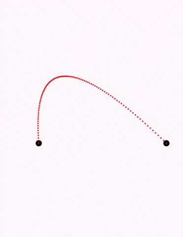


#### 使用贝塞尔曲线

Path类提供了quadTo和cubicTo方法来分别模拟二阶和三阶贝塞尔曲线

**quadTo**

刚刚根据贝塞尔曲线的非常计算出了二阶贝塞尔曲线的轨迹，而利用Path的quadTo方法更加简便：

```java
        mPath.reset();
        mPath.moveTo(mPointF0.x,mPointF0.y);
        mPath.quadTo( mLastX, mLastY,mPointF1.x, mPointF1.y);
        canvas.drawPath(mPath, mPaint);
```

效果如下：

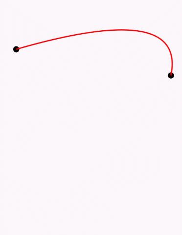

**cubicTo**

cubicTo可以绘制出三阶段贝塞尔曲线，一般用于绘制图表。

---
## 5 Op

多个Path之间可以进行操作，Path内部定义了枚举类Op，用来定义Path之间的各种操作：

- DIFFERENCE 从第一个路径减去第二个路径
- INTERSECT 相交的路径
- UNION 合并路径
- XOR 异或操作
- REVERSE_DIFFERENCE 从第二个路径减去第一个路径

---
## 6 setFillType

`Path.setFillType(fillType)` 是用来设置图形自相交时的填充算法的，`Path.setFillType(fillType)`的效果与绘制图形的方向与传入的填充类型有关系，具体算法可以参考[HenCoder_UI_1](http://hencoder.com/ui-1-1/)