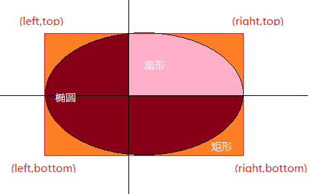
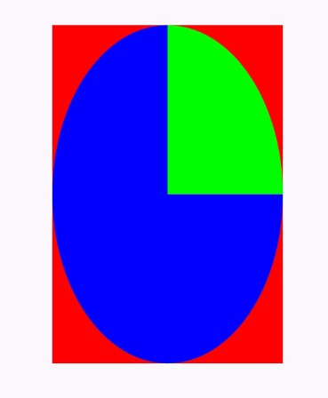

---
# 1 Rect介绍

在Android绘图中，使用**`Rect`**表示一个矩形，对应的还有精度更高的**`RectF`**(float数据类型)，Rect在绘图中用到的还是比较多的，掌握Rect的相关操作，对提供绘图技能很有帮助的。

## 1.1 Rect的表示

Rect常用的构造方法如下：

```java
       public Rect(int left, int top, int right, int bottom) {
            this.left = left;
            this.top = top;
            this.right = right;
            this.bottom = bottom;
        }
```

可见其内部有`left、top、right、bottom`四个变量，这四个变量用来确认矩形的位置，如下图所示：


然后Rect除了表示自身是矩形之外，**还用来规定椭圆和扇形的区域**，如下图所以：



**所以，矩形的局域确定了，其内部的椭圆和扇形也就确认了**,如下面示例：

```java
        protected void onDraw(Canvas canvas) {
            super.onDraw(canvas);
            canvas.translate(mWidth / 2, mHeight / 2);
            mRect.set(-mWidth / 4F, -mHeight / 4F, mWidth / 4F, mHeight / 4F);
            mPaint.setColor(Color.RED);
            canvas.drawRect(mRect, mPaint);
            mPaint.setColor(Color.GREEN);
            canvas.drawOval(mRect, mPaint);
            mPaint.setColor(Color.BLUE);
            canvas.drawArc(mRect, 0, 270, true, mPaint);
        }
```

效果如下：



## 1.2 Rect的相关操作

多个Rect之间可以有去交集或并集的操作，在Rect中很多类似这种操作的方法：

### intersect

intersect用于计算相交区域最近的左上端点和最近的右下端点，然后用最近的左上端点和右下端点生成新的矩形，如果两个矩形没有相交，则不会产生任何操作，此时intersect方法返回false。

### union
union和intersect相反，用于计算相交区域最远的左上端点和最远的右下端点,即使两个矩形没有相交也有效果

## 1.3 其他方法列表

| 方法  | 说明 |
| ------------ | ------------ |
| centerX(),centerY()  | 返回矩形的中心点，对应的还有`exactCenterX(),exactCenterX()`返回精确的centerX和centerY  |
| contains(int x , int y)  | 如果坐标(x,y)在矩形局域类，将返回true，  |
| cantains(int left, int top, int right, int bottom)  | 如果参数表示的矩形被包含在此矩形中，返回true  |
| width(),height()  | 返回矩形的宽度和高度  |
| intersects(Rect a, Rect b)  | 当两个矩形相交时，返回true ，setIntersect不仅判断两个矩形是否相交，如果相交还会进行Intersect操作 |
| offset(int dx, int dy)和 offsetTo（int dx, int dy） | 对矩形进行偏移操作  |
|set(int left, int top, int right, int bottom)|给矩形重新赋值|
|setEmpty()|让矩形的`left、top、right、bottom`重置为0|
|inset(int dx,int dy)|根据dx、dy的值对矩形进行操作，如果dx是负数，那么对矩形变宽，左右都增长dx，如果dx是正数，那么矩形的变窄，左右都减小dx，dy的操作类似|


**Rect的坐标系是相对于当前画布的坐标系的！！！**

---
# 2 Region

在Android中，Region同样表示的是一块封闭的区域，Region的很多都与Rect类似，需要说明一下的就是它内部的枚举类Op。

|Op|说明|
|---|---|
| [Region.Op] | DIFFERENCE：最终区域为第一个区域中与第二个区域不同的区域  |
| [Region.Op] | INTERSECT：最终区域为第一个区域与第二个区域相交的区域  |
| [Region.Op] | REPLACE： 最终区域为第二个区域 |
| [Region.Op]| REVERSE_DIFFERENCE：最终区域为第二个区域中与第一个区域不同的区域  |
| [Region.Op] | UNION：最终区域为第一个区域加第二个区域  |
| [Region.Op] | XOR：最终区域为第一个区域加第二个区域并减去两者相交的区域  |

Op表示两个Region的组合模式。不过Region现在已经被标记为废弃的API了，推荐使用Rect。

### 注意

Region与Rect存在的最大的区别在于，Rect的坐标系是相对于当前画布的绘图坐标系的，对canvas的各种操作都会影响Rect的表示，但是 **Region的区域并不参考canvas的绘图坐标系，而是参数canvas不变的原始坐标系**