# Android 图形变换 Matrix 学习

---
## 1 Matrix介绍

矩阵的定义是：将一些元素排列成若干行，每行放上相同数量的元素，就是一个矩阵。这里说的元素可以是数字，例如以下的矩阵：


更多的概念参考[维基百科](https://zh.wikipedia.org/wiki/%E7%9F%A9%E9%98%B5)

Matrix在Android中应用也比较多，如ColorMatrix、图形变换Matrix等。掌握Matrix对于自定义控件或者实现某些图形变换操作很有帮助，所以也是必备技能。

---
## 2 矩形的运算

矩阵的之间可以进行运算，矩阵的最基本运算包括矩阵加（减）法，数乘和转置运算。被称为“矩阵加法”、“数乘”和“转置”

### 2.1 加减法

m×n矩阵**A**和**B**的和（差）：**A±B**为一个 m×n 矩阵，其中每个元素是**A**和**B**相应元素的和（差）。

公式：

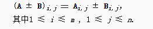

示例：

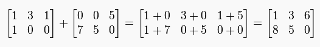


矩阵的加法运算满足交换律：

     A + B = B + A

矩阵的转置和数乘运算对加法满足分配律：

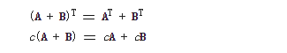

### 2.2 乘法

两个矩阵的乘法仅当**第一个矩阵A的列数和另一个矩阵B的行数相等**时才能定义。如**A**是m×n矩阵和**B**是n×p矩阵，它们的**乘积AB**是一个m×p矩阵


示例：

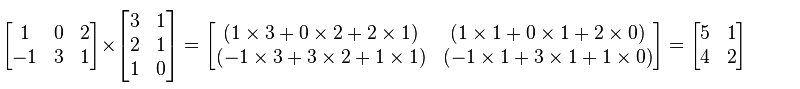

乘法运算中，左边的矩阵的行数决定新矩阵的行数，右边矩阵的列数决定新矩阵的列数。**矩阵的乘法运算是不符合交换律的**，因此矩阵B*A和A*B是两个截然不同的结果，对于矩阵的乘法分为左乘和右乘：

- B*A 读作A右乘B，是列变换
- A*B 读作A左乘B，是行变换

矩阵的乘法满足结合律和对矩阵加法的分配律（左分配律和右分配律）:

*   结合律：(**AB**)**C** = **A**(**BC**),
*   左分配律：(**A + B**)**C** = **AC** + **BC**,
*   右分配律：**C**(**A + B**) = **CA** + **CB**.

矩阵的乘法与数乘运算之间也满足类似结合律的规律；与转置之间则满足倒置的分配律。


在Android的Matrix类中有三大类方法：setXXX、preXXX和postXXX，其中preXXX和postXXX就是分别表示矩阵的左右乘


### 2.3 转置

m×n矩阵**A**的转置是一个n×m的矩阵，其中的第i个行向量是原矩阵**A**的第i个列向量。

示例：

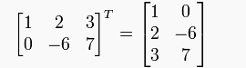


---
## 3 Matrix的变换

在Paint的`setColorFilter`方法中，涉及到一个4x5的`ColorMatrix`，用对颜色进行变换，而除了这个`ColorMatrix`外，还有一个重要的3x3的坐标矩阵：

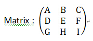

Matrix主要用于实现对图形的变化，如：

- 平移
- 缩放
- 旋转
- 错切
- 透视

GHI都表示的是透视参数,但是一般情况下不需要去处理，三维的透视推荐使用Camare，所以很多时候G和H的值都为0而I的值恒为1

图形的变换实质上就是图形上点的变换，而Matrix可以理解为存放变换信息的容器，Matrix的所有方法都是针对其自身的，我们把所有的变换操作对Matrix做完后再“一次性地”把它注入我们想要应用的地方，**有一点需要注意，ColorMatrix和Matrix在应用给其他对象时都是左乘的**，而其自身内部是可以左右乘的。**可以把矩阵理解为一个用来保存变化信息的容器，然后一次性注入给对象。**

对于点P0(x0,y0)应用矩阵变换的公式是：

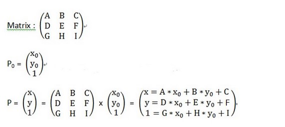

>P0点坐标多了一个1，这是使用了齐次坐标系的缘故，在数学中我们的点和向量都是这样表示的(x, y)，两者看起来一样，计算机无法区分，为此让计算机也可以区分它们，增加了一个标志位，增加之后看起来是这样:
```
(x, y, 1) 表示 点
(x, y, 0) 表示 向量
```
具体[参考齐次坐标](https://zh.wikipedia.org/wiki/%E9%BD%90%E6%AC%A1%E5%9D%90%E6%A0%87)

### 3.1 平移

矩阵的平移操作相对简单，举个具体的例子：现设点P0（x0 ，y0）进行平移后，移到P（x，y），其中x移动距离为a，移动距离为b，则矩阵就是：

      | x |     | 1,0,a |      | x0 |           | x0 + a|
      | y |  =  | 0,1,b |  *   | y0 |    =      | y0 + b|
      | 1 |     | 0,0,1 |      | 1  |           |   1   |

除了平移外，缩放、旋转、错切都是需要一个中心点作为参照的，如果没有平移，默认为图形的[0,0]点，平移只需要指定移动的距离即可，平移操作会改变中心点的位置！非常重要！

### 3.2 缩放

一个像素点不存在缩放概念，但是由于图像是有很多个像素点组成的，将每个像素的按照坐标进行等比例缩放最终就会形成图片的缩放效果，矩阵的缩放操作也相对简单，缩放的计算公式如下如：


      | x |        | a,0,0 |       | x0 |     | x0*a |
      | y |    =   | 0,b,0 |   *   | y0 | =   | y0*b |
      | 1 |        | 0,0,1 |       |  1 |     |  1   |

    x = x0 * a;
    y = y0 * b;


### 3.3 旋转

旋转操作就是将所有的像素点围绕着某个中心点进行旋转，到达一个新的点，分为两种：

- 直接绕默认的原点[0,0]旋转
- 指定中心点的旋转

旋转操作如下图所示，点p0旋转角度b到P1：

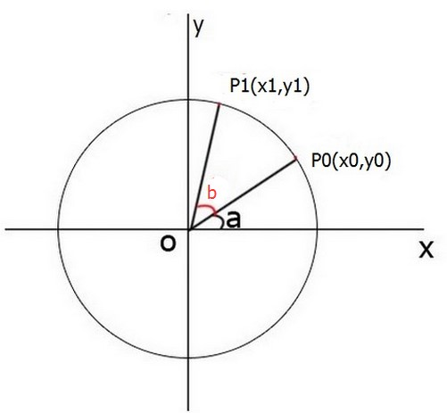

根据三角函数的关系我们可以得出:

**p1**的坐标:

    x = r * cos(a + b) = r*cos(a)*cos(b) - r*sin(a)*sin(b)
    y = r * sin(a + b) = r*sin(a)*cos(b) + r*cos(a)*sin(b)

**p0**的坐标:

    x0 = r * cos(a);
    y0 = r * sin(a)

最终可以得出：

    x = x0 * cos(b) - y0 * sin(b)
    y = y0 * cos(b) + x0 * sin(b)

然后根据矩阵的运算公式，我们可以得出旋转的操作式为：

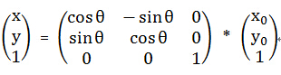

其实了解了三角函数的公式就很好理解了。

对于指定中心点的旋转操作，比如图像围绕着某个点(a ，b)旋转角度e，则先要将坐标平移到该点(a,b)，再进行旋转，然后将旋转后的图像平移回到旋转后的坐标系的原点。所以对于这种指定中线点旋转的操作，应该有如下矩阵变换顺序：


     | x |      | 1,0,a |    | cos(e), -sin(e),0 |   | 1,0,-a |   | x0 |
     | y |   =  | 0,1,b |  * | sin(e), cos(e), 0 | * | 0,1,-b | * | y0 |
     | 1 |      | 0,0,1 |    |  0,       0   , 1 |   | 0,0, 1 |   |  1 |


如果需图片要以某中心P(a,b)应用矩阵变变换，比如以P点为中心旋转180°的代码应该是：

```java
            canvas.save();
            int a = point1.x + bitmap.getWidth() / 2;
            int b = point1.y + bitmap.getHeight() / 2;
            mMatrix.reset();
            mMatrix.setRotate(180);
            mMatrix.preTranslate(-(a), -(b));
            mMatrix.postTranslate(a, b);
            canvas.concat(mMatrix);
            //绘制bitmap
            canvas.drawBitmap(bitmap, point1.x, point1.y, paint);
            canvas.restore();
```

对应的变换顺序就是：

    translate(a,b)-->rotate(c)-->translate(-a,-b)
    移动到中心点-->以中心点旋转c°-->移动回来


### 3.4 错切

错切是在某方向上，按照一定的比例对图形的每个点到某条平行于该方向的直线的有向距离做放缩得到的平面图形。水平错切的效果是将每一点水平移动，移动的长度和该点的纵坐标成比例,错切变换前后图形的面积不变

错切变换示例：

    mMatrix.postSkew(0.2F, 0.3F);
    canvas.drawBitmap(mBitmap, mMatrix, null);
    
效果如下：


打印一下错切前和错切后的Matrix信息：

```
       mMatrix:Matrix{
        [1.0, 0.0, 0.0]
        [0.0, 1.0, 0.0]
        [0.0, 0.0, 1.0]
      }
        
      mMatrix:Matrix{
        [1.0, 0.2, 0.0]
        [0.3, 1.0, 0.0]
        [0.0, 0.0, 1.0]
      }
```

错切的公式为：

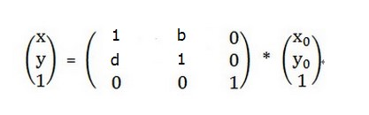

    x = x0 + y0 * b
    y = x0 * d + y0

可以看出其中b和d都为错切因子。


| 取值  |x和y|  效果 |
| ------------ | ------------ |------------ |
|`d= 0 ,b != 0` | `x= x0 + b*y0, y= y0`|图形Y坐标不变，x坐标随着初始值为(x0,y0)和错切因子b做线性变换，如果b>0，图形会沿着x方向作切换变换，如果`b<0`，则图形沿着-x方向作切换变换|
|`d !=0 ,b= 0`|`x= x0 , y= x0 *d + y0`|图形X坐标不变，Y坐标随着初始值为(x0,y0)和错切因子d做线性变换，如果d>0，图形会沿着y方向作切换变换，如果`d<0`，则图形沿着-y方向作切换变|
|`d != 0 ,b != 0`| `x= x0 + b*y0, y= x0 *d + y0`|图形沿着x和y方向都会作切换变换|


#### 错切的倾斜角度

直线的方程式为`y=kx+b`,其中k为斜率，而对于上面的坐标公式：

        x = x0 + y0 * b
        y = x0 * d + y0

b可以看做x倾斜角度(与y轴夹角)的tan值
d可以看做y倾斜角度(与x轴夹角)的tan值

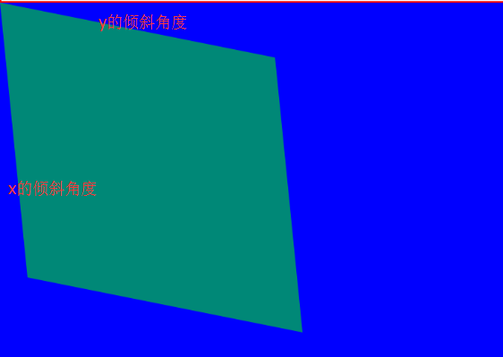


### 3.5 对称变换（反射）

对于一个矩阵：

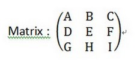

有：

```
    x = x0 * A + y0 * B + C
    y = x0 * D + y0 * E + F
```

这里假设 C = F = 0;对于A，B，D，E的取值有如下反射效果。

取值|效果
--- | ---
`A= 1,B= D= 0,E= -1` | 产生与X轴对称的反射图形(垂直翻转)
`A= -1,B= D= 0,E= 1 `| 产生与Y轴对称的反射图形(水平翻转)
`A= E = -1,B= D= 0`  | 产生与原点对称的反射图形
`A= E = 0 ,B= D= 1`  | 产生与直线`y=x`对称的反射图形
`A= E = 0 ,B= D= -1` | 产生与直线`y=-x`对称的反射图形


---
## 4 如何理解变换顺序

**其实Matrix的多种复合操作都是使用矩阵乘法实现的**，从原理上理解很简单，但是使用矩阵乘法也有其弱点，后面的操作可能会影响到前面到操作，所以在构造Matrix时顺序很重要:

有两种方式理解canvas的变换顺序：

1. 如果认为 Canvas 在每一次变换之后都形成了新的内部坐标体系，然后在下一次变换的时候以这个新的坐标体系为基准，那么就是正序的。(但这种思维方式不够直观，在多次变换的情况下会很难去计算参数。)——**变化参考坐标系随着每次变换都在改变**
2. 如果把所有的变换全部按照以原坐标体系为基准，就可以理解为倒序的。——**变化参考坐标系始终为原始坐标系**

比如有如下矩阵变换：

```
     mMatrix.preScale(0.5f, 1);
     mMatrix.preTranslate(10, 0);
     mMatrix.postScale(0.7f, 1);
     mMatrix.postTranslate(15, 0);
     canvas.concat(mMatrix);
     结果：
           [0.35, 0.0, 18.5]
           [0.0, 1.0, 0.0]
           [0.0, 0.0, 1.0]
```

以第一种方式理解的变换顺序为

    transalte(15,0) --> scale(0.7F,1) --> scale(0.5F,1) --> translate(10,0)
    x位移15-->x轴缩放0.7-->x轴缩放0.5-->然后x位移(0.7x0.5x10)=0.35.

从上面的结果可以看出，x方法确实是缩放了`0.5x0.7`,位移了`15+3.5`。

以第二种方式理解的变换顺序为：

    translate(10,0) --> scale(0.5F,1) --> scale(0.7F,1) -->  transalte(15,0)

**不管以何种方式去理解，最后矩阵的结果都是一样的，目的只是为了帮助直观的理解界面变化，但是不要忘了内部是需要数学原理支持的**

---
## 5  示例

使用Matrx可以很方便的对图形进行各种变换，有这样一个建议，对图片做缩放使用`BitmapFactory.Options`,对图片进行放大等操作使用`Matrix`，下面是一个Demo：

实现方式比较简单，在单指按下的时候，把模式设置为拖动模式，记录按下的位置，在多指按下的时候记录两指直接的角度和距离(用于计算缩放值和旋转值)，把模式设置为缩放和旋转，然后在MOVE的时候根据模式和对图片进行各种操作。


```java
    public class MatrixView extends ImageView {
    
        private Matrix mSaveMatrix;//保存操作之后的矩阵
        private Matrix mCurrentMatrix;//当前应用的矩阵
    
        private float mDownRotate;//两个手指按下时的角度
    
    
        private final static int MODE_NONE = 0;
        private final static int MODE_DRAG = 1;
        private final static int MODE_ZOOM = 2;
    
    
        private PointF mMid;//两个手指的中心点
        private PointF mStart;//按下时的位置
    
        private int mCurrentMode = MODE_NONE;//当前模式
        private float mPreMove;//初次按下时两个手指之间的距离，用于计算缩放比例
    
    
        public MatrixView(Context context) {
            this(context, null);
        }
    
        public MatrixView(Context context, AttributeSet attrs) {
            this(context, attrs, 0);
        }
    
        public MatrixView(Context context, AttributeSet attrs, int defStyleAttr) {
            super(context, attrs, defStyleAttr);
    
            mSaveMatrix = new Matrix();
            mCurrentMatrix = new Matrix();
            mStart = new PointF();
            mMid = new PointF();
            setScaleType(ScaleType.MATRIX);
    
        }
    
    
        @Override
        public boolean onTouchEvent(MotionEvent event) {
            if (!hasDrawable()) {
                return super.onTouchEvent(event);
            }
    
            int action = MotionEventCompat.getActionMasked(event);
            switch (action) {
                case MotionEvent.ACTION_DOWN: {
                    mStart.set(event.getX(), event.getY());
                    mCurrentMode = MODE_DRAG;//单个手指就是拖动状态
                    mSaveMatrix.set(mCurrentMatrix);//记录上一下matrix的信息
                    break;
                }
                case MotionEvent.ACTION_MOVE: {
                    if (mCurrentMode == MODE_DRAG) {
    
                        mCurrentMatrix.set(mSaveMatrix);//重置到按下按下状态
    
                        float x = event.getX();
                        float y = event.getY();
                        float dx = x - mStart.x;
                        float dy = y - mStart.y;
                        mCurrentMatrix.postTranslate(dx, dy);//注意，这里的postTranslate是基于按下状态的
    
                    } else if (mCurrentMode == MODE_ZOOM && event.getPointerCount() == 2) {
                        mCurrentMatrix.set(mSaveMatrix);
                        float currentMove = calcSpace(event);
                    /*
                     * 指尖移动距离大于10F缩放
                     */
                        if (currentMove > 10F) {
                            float scale = currentMove / mPreMove;//计算缩放比例，初次按下时的两指之间的长度/现在两指之间的长度
                            mCurrentMatrix.postScale(scale, scale, mMid.x, mMid.y);//以两指之间为中心缩放
                        }
    
                        float r = calcRotate(event) - mDownRotate;
                        mCurrentMatrix.postRotate(r, getMeasuredWidth() / 2, getMeasuredHeight() / 2);
                    }
                    break;
                }
                case MotionEvent.ACTION_CANCEL:
                case MotionEvent.ACTION_UP: {
                    mCurrentMode = MODE_NONE;
                    break;
                }
                case MotionEvent.ACTION_POINTER_DOWN: {
                    mPreMove = calcSpace(event);
                    if (mPreMove > UnitConverter.dpToPx(12)) {
                        calcMin(mMid, event);//计算两只之间的中心点
                        mCurrentMode = MODE_ZOOM;
                        mSaveMatrix.set(mCurrentMatrix);
                    }
                    mDownRotate = calcRotate(event);//记录两只按下时的夹角
                    break;
                }
                case MotionEvent.ACTION_POINTER_UP: {
    
                    break;
                }
            }
    
            setImageMatrix(mCurrentMatrix);
    
            return true;
        }
    
        private float calcRotate(MotionEvent event) {
            double deltaX = (event.getX(0) - event.getX(1));
            double deltaY = (event.getY(0) - event.getY(1));
            double radius = Math.atan2(deltaY, deltaX);
            return (float) Math.toDegrees(radius);
        }
    
        private void calcMin(PointF mid, MotionEvent event) {
            float x = event.getX(0) + event.getX(1);
            float y = event.getY(0) + event.getY(1);
            mid.set(x / 2, y / 2);
        }
    
        private float calcSpace(MotionEvent event) {
            return (float) Math.hypot(event.getX(0) - event.getX(1), event.getY(0) - event.getY(1));
        }
    
    
        private boolean hasDrawable() {
            return getDrawable() instanceof BitmapDrawable;
    
        }
    }
```

效果如下：


---
## 6 可能用到的公式

```
    两角和公式
    sin(a+b)=sinacosb+cosasinb
    sin(a-b)=sinacosb-sinbcosa 
    cos(a+b)=cosacosb-sinasinb
    cos(a-b)=cosacosb+sinasinb
    tan(a+b)=(tana+tanb)/(1-tanatanb)
    tan(a-b)=(tana-tanb)/(1+tanatanb)
    cot(a+b)=(cotacotb-1)/(cotb+cota)
    cot(a-b)=(cotacotb+1)/(cotb-cota)

    倍角公式
    tan2a=2tana/[1-(tana)^2]
    cos2a=(cosa)^2-(sina)^2=2(cosa)^2 -1=1-2(sina)^2
    sin2a=2sina*cosa

    半角公式
    sin(a/2)=√((1-cosa)/2) sin(a/2)=-√((1-cosa)/2)
    cos(a/2)=√((1+cosa)/2) cos(a/2)=-√((1+cosa)/2)
    tan(a/2)=√((1-cosa)/((1+cosa)) tan(a/2)=-√((1-cosa)/((1+cosa))
    cot(a/2)=√((1+cosa)/((1-cosa)) cot(a/2)=-√((1+cosa)/((1-cosa)) 
    tan(a/2)=(1-cosa)/sina=sina/(1+cosa)

    和差化积
    2sinacosb=sin(a+b)+sin(a-b)
    2cosasinb=sin(a+b)-sin(a-b) )
    2cosacosb=cos(a+b)-sin(a-b)
    -2sinasinb=cos(a+b)-cos(a-b)
    sina+sinb=2sin((a+b)/2)cos((a-b)/2
    cosa+cosb=2cos((a+b)/2)sin((a-b)/2)
    tana+tanb=sin(a+b)/cosacosb

    积化和差公式
    sin(a)sin(b)=-1/2*[cos(a+b)-cos(a-b)]
    cos(a)cos(b)=1/2*[cos(a+b)+cos(a-b)]
    sin(a)cos(b)=1/2*[sin(a+b)+sin(a-b)]

    诱导公式
    sin(-a)=-sin(a)
    cos(-a)=cos(a)
    sin(pi/2-a)=cos(a)
    cos(pi/2-a)=sin(a)
    sin(pi/2+a)=cos(a)
    cos(pi/2+a)=-sin(a)
    sin(pi-a)=sin(a)
    cos(pi-a)=-cos(a)
    sin(pi+a)=-sin(a)
    cos(pi+a)=-cos(a)
    tga=tana=sina/cosa

    万能公式
    sin(a)= (2tan(a/2))/(1+tan^2(a/2))
    cos(a)= (1-tan^2(a/2))/(1+tan^2(a/2))
    tan(a)= (2tan(a/2))/(1-tan^2(a/2))

    其它公式
    a*sin(a)+b*cos(a)=sqrt(a^2+b^2)sin(a+c) [其中，tan(c)=b/a]
    a*sin(a)-b*cos(a)=sqrt(a^2+b^2)cos(a-c) [其中，tan(c)=a/b]
    1+sin(a)=(sin(a/2)+cos(a/2))^2
    1-sin(a)=(sin(a/2)-cos(a/2))^2

    其他非重点三角函数
    csc(a)=1/sin(a)
    sec(a)=1/cos(a)

    双曲函数
    sinh(a)=(e^a-e^(-a))/2
    cosh(a)=(e^a+e^(-a))/2
    tgh(a)=sinh(a)/cosh(a)
```