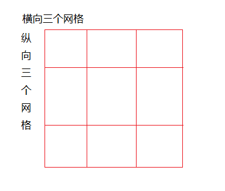
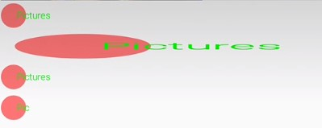

---
## 6 drawBitmapMesh

drawBitmapMesh是canvas提供的一个非常强大的方法，方法如下:

```
    canvas.drawBitmapMesh(Bitmap bitmap,int meshWidth,int meshHeight,float [] verts,int vertOffset,int [] color,int colorOffset,Paint paint);
```

使用这个方法，可以把需要绘制的bitmap切割成若干个网格，在绘制的时候对网格的坐标进行操作，从而实现各种不同的变换。

首先需要说一下该方法的各个参数的含义：

*   bitmap:将要应用网络切割的图像
*   meshWidth:横向网格数目
*   meshHeight:纵向网格数目
*   verts:网格交叉点的坐标数组，我们的变化操作就是变化交叉点的坐标
*   vertOffset:verts数组中开始跳过的(X,Y)坐标对的数目

如下图所示：



如果需要把图片切割成横向三个网格，纵向三个网格，则网格交叉点有`(3+1) x (3+1)= 16`个，如果vertOffset=0，则verts数组的长度为`16 x 2`(横纵坐标)个，签名已经学习过canvas的错切操作，现在利用drawBitmapMesh也可以实现：

```java
    public class BitmapMeshView extends View {
    
        private final static int WIDTH_MESH = 19;
        private final static int HEIGHT_MESH = 19;
        private static final int COUNT = (WIDTH_MESH + 1) * (HEIGHT_MESH + 1);// 横纵向网格交织产生的点数量
    
        private float[] mVerts;
        private static final String TAG = BitmapMeshView.class.getSimpleName();
    
        private Bitmap mBitmap;// 位图资源
    
        public BitmapMeshView(Context context) {
            this(context, null);
        }
    
        public BitmapMeshView(Context context, AttributeSet attrs) {
            this(context, attrs, 0);
        }
    
        public BitmapMeshView(Context context, AttributeSet attrs, int defStyleAttr) {
            super(context, attrs, defStyleAttr);
            init();
        }
    
        @Override
        protected void onMeasure(int widthMeasureSpec, int heightMeasureSpec) {
            super.onMeasure(widthMeasureSpec, MeasureSpec.makeMeasureSpec(mBitmap.getHeight(), MeasureSpec.EXACTLY));
    
        }
    
        private void init() {
            mVerts = new float[COUNT * 2];
            mBitmap = BitmapFactory.decodeResource(getResources(), R.drawable.shader);
    
            int width = mBitmap.getWidth();
    
            int height = mBitmap.getHeight();
    
    
            int index = 0;
    
            float fx ;
            float fy ;
    
            for (int i = 0; i <= HEIGHT_MESH; i++) {
    
                fy = height * (i*1.0F / HEIGHT_MESH);
    
                for (int j = 0; j <= WIDTH_MESH; j++) {
    
                    // 根据 x = x0 + b*y0公式
                    fx = width * (j*1.0F / WIDTH_MESH) + 1 * fy;//这里1表示 tan45，即x方法倾斜45度
                    
                    setXYWithIndex(fx, fy, index);
                    index++;
    
                }
            }
    
        }
    
        private void setXYWithIndex(float fx, float fy, int index) {
            mVerts[2 * index] = fx;
            mVerts[2 * index + 1] = fy;
        }
    
    
        @Override
        protected void onDraw(Canvas canvas) {
            super.onDraw(canvas);
            canvas.drawBitmapMesh(mBitmap, WIDTH_MESH, HEIGHT_MESH, mVerts, 0, null, 0, null);
        }
    }
```

效果如下：


---
## 7 drawPicture

**drawPicture需要关闭硬件加速**

```
    drawPicture(Picture picture)
    drawPicture(Picture picture, @NonNull RectF dst)
```

要搞懂drawPicture方法，需要先弄清楚Picture。

>Picture在android.graphics.Picture包中，相对于Drawable和Bitmap而言，Picture对象就小巧的多，它并不存储实际的像素，仅仅记录了每个绘制的过程。整个类提供了两个重载形式.

```java
    Canvas  beginRecording(int width, int height)  //开始记录绘制过程
    void  draw(Canvas canvas)  //在canvas上画这个picture对象
    void  endRecording()  //结束录制绘制过程
    int  getHeight()//获取高度
    int  getWidth()//获取宽度
    static Picture  createFromStream(InputStream stream)  //静态方法，从输入流创建一个Pictrue对象(已废弃)
    void  writeToStream(OutputStream stream)  //将绘制结果写到输出流中(已废弃)
```

Picture的一般使用步骤是：

- 创建一个Picure对象
- 使用Picure的beginRecording方法开始录制，并传入录制区域
- 进行各种操作
- 结束录制
- 绘制Picture

Picture只负责录制，而要将录制的内容显示出来，就需要调用绘制相关的api，将Picture中的内容绘制出来可以有以下几种方法：

- 使用Picture提供的draw方法绘制。此方法会影响Canvas的状态(Matrix clip等)
- 使用Canvas提供的drawPicture方法绘制。如果绘制区域不一致，会拉伸绘制内容
- 将Picture包装成为PictureDrawable，使用PictureDrawable的draw方法绘制。不会拉伸绘制内容

如下面代码所示：

```java
    public class DrawPictureView extends View {
    
        Picture mPicture;
        private PictureDrawable mDrawable;
    
        public DrawPictureView(Context context) {
            this(context,null);
        }
    
        public DrawPictureView(Context context, AttributeSet attrs) {
            this(context, attrs,0);
        }
    
        public DrawPictureView(Context context, AttributeSet attrs, int defStyleAttr) {
            super(context, attrs, defStyleAttr);
    
            init();
        }
    
    
        private void init() {
            setLayerType(LAYER_TYPE_SOFTWARE,null);//关闭硬件加速
    
            mPicture = new Picture();//创建一个Pictrue
    
            Canvas canvas = mPicture.beginRecording(200, 100);//开始录制
            Paint p = new Paint(Paint.ANTI_ALIAS_FLAG);
            p.setColor(0x88FF0000);
            canvas.drawCircle(50, 50, 40, p);
            p.setColor(Color.GREEN);
            p.setTextSize(30);
            canvas.drawText("Pictures", 60, 60, p);
            mPicture.endRecording();//结束录制
            mDrawable = new PictureDrawable(mPicture);
        }
    
        @Override
        protected void onDraw(Canvas canvas) {
            super.onDraw(canvas);
    
            canvas.drawPicture(mPicture);
    
            canvas.drawPicture(mPicture, new RectF(0, 100, getWidth(), 200));//mPicture会被拉伸
    
            mDrawable.setBounds(0, 200, getWidth(), 300);//使用PictureDrawable，Picture不会被拉伸
            mDrawable.draw(canvas);
    
            mDrawable.setBounds(0, 300, 100, 400);
            mDrawable.draw(canvas);
        }
    }
```

效果如下：


