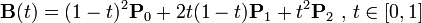
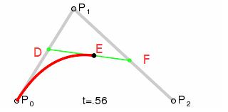

# 贝塞尔曲线基础学习

---
## 1 贝塞尔曲线介绍

>wiki:贝塞尔曲线的数学基础是早在 1912 年就广为人知的[伯恩斯坦多项式](http://en.wikipedia.org/wiki/Bernstein_polynomial)。但直到 1959 年，当时就职于雪铁龙的法国数学家 [Paul de Casteljau](http://en.wikipedia.org/wiki/Paul_de_Casteljau) 才开始对它进行图形化应用的尝试，并提出了一种数值稳定的 [de Casteljau 算法](http://en.wikipedia.org/wiki/De_Casteljau's_algorithm)。然而贝塞尔曲线的得名，却是由于 1962 年另一位就职于雷诺的法国工程师 [Pierre Bézier](http://en.wikipedia.org/wiki/Pierre_B%C3%A9zier) 的广泛宣传。他使用这种只需要很少的控制点就能够生成复杂平滑曲线的方法，来辅助汽车车体的工业设计。

### 1.1 二阶贝塞尔曲线

公式和动态图：

贝塞尔曲线是由上面公式中，t从0到1的递增计算出的所有点的集合组成的曲线，但是对与下图中这些点都是什么关系呢？

其实贝塞尔曲线上的点是这样确定的：在平面内任选3个不共线的点(P1,P0，P2)，依次用线段连接。在第一条线段上任选一个点 D。计算该点到线段起点的距离 P0D，与该线段总长 P0P1 的比例。从第二条线段上找出对应的点 F，使得 `P0D:P0P1 = P1F:P1P2`,然后连接这两点 DF。从新的线段 DF 上再次找出相同比例的点 E，使得 `DE:DF = P0D:P0P1 = P1F:P1P2`。

贝塞尔曲线上的点分为控制点和数据点，控制点用于控制贝塞尔曲线的弯曲程度，比如P1，数据点确定了贝塞尔曲线的起点和终点，比如P0和P2。

对于高阶的曲线，可以用低阶的曲线组合达到相同的效果，具体参考贝塞尔曲线的升降算法。

---
## 引用

- [贝塞尔曲线扫盲](http://www.html-js.com/article/1628)
- [How to create circle with Bézier curves?](http://stackoverflow.com/questions/1734745/how-to-create-circle-with-b%C3%A9zier-curves)
- [用三阶贝塞尔曲线拟合圆](http://www.jianshu.com/p/5198d8aa80c1)
- [bezierinfo](https://pomax.github.io/bezierinfo/zh-CN/)