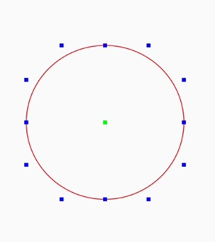
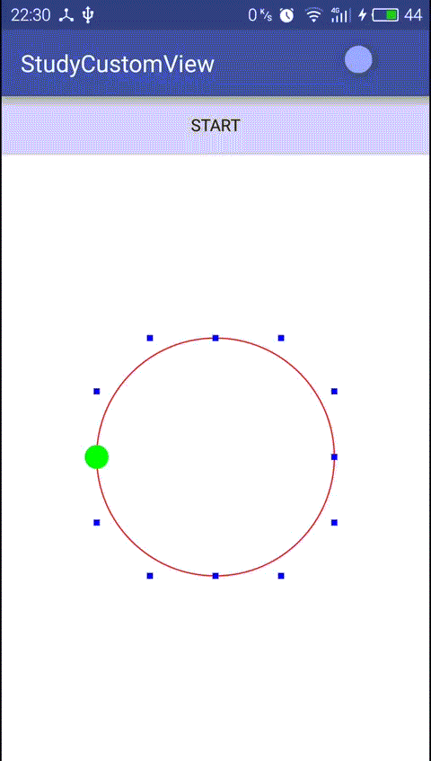

# PathMeasure

PathMeasure是一个Path的坐标计算器。

---
## 1 API说明

1. `PathMeasure(Path path, boolean forceClosed)`：构造方法需要一个Path对象，forceClosed如果为true，那么Path将被是为封闭的。
1. `getLength()` ：获取路径的长度
2. `getPosTan(float distance, float pos[],float tan[])`当Path为null时返回false，distance的取值范围是[0,getLength()]，根据传入的distance值，PathMeasure会计算出当前点的坐标封装到pos中。而tan中封装的是path的切线。
3. `setPath(Path path, boolean forceClosed)`： 设置一个新的路径
4. `getSegment (float startD, float stopD, Path dst, boolean startWithMoveTo)`： 传入一个开始和结束距离，然后会把介于这之间的Path填充到dst中去
5. `nextContour() `：移动到下一个笔画，如果Path是由多个笔画组成的话，就可以使用这个方法

**关于forceClosed**：forceClosed参数对绑定的Path不会产生任何影响，例如一个折线段的Path，本身是没有闭合的，forceClosed设置为True的时候，PathMeasure计算的Path是闭合的，但Path本身绘制出来是不会闭合的。只是在计算的时候，PathMeasure根据forceClosed不同而计算结果可能不同，比如传入一个没有闭合的Path，但是forceClosed为ture的话，那么PathMeasure计算的闭合的路径。

---
## 2 硬件加速的Bug

由于硬件加速的问题，PathMeasure中的getSegment在将Path添加到dst数组中时会被导致一些错误，所在在调用getSegment方法时，需要通过调用mDst.lineTo(0,0)来避免这样一个Bug。

---
## 3 实例

前面学习了，如何使用Path的贝塞尔曲线创建一个圆形：



利用12个点控制贝塞尔曲线就可以创建一个圆形，如果我们需要一个点绕着圆弧移动呢？



也许可以通过计算0-360°的圆弧上的坐标来实现动画，但是这样还是比较麻烦的，如果使用PathMeasure就会非常方便，一个圆形可能还看不出PathMeasure的强大，但是不规则的图形呢？


如下图所示，这时候就真正体现出 PathMeasure 的强大之处了：代码如下：

```java
    public class PathMeasureAnimView extends View {

        private static final String TAG = PathMeasureAnimView.class.getSimpleName();
        private static final float C = 0.551915024494f;
    
    
        private PointF[] mControlPoints = new PointF[8];
        private PointF[] mExtremityPoints = new PointF[4];
    
        private Paint mPaint;
        private Path mPath;
    
        private float mPointWidth;
        private PointF mPointF;
    
        private PathMeasure mPathMeasure;
        private ValueAnimator mValueAnimator;
        private float[] mCurrentPoint;
    
    
        public PathMeasureAnimView(Context context) {
            this(context, null);
        }
    
        public PathMeasureAnimView(Context context, AttributeSet attrs) {
            this(context, attrs, 0);
        }
    
        public PathMeasureAnimView(Context context, AttributeSet attrs, int defStyleAttr) {
            super(context, attrs, defStyleAttr);
            init();
        }
    
        private void init() {
            mPaint = new Paint(Paint.ANTI_ALIAS_FLAG);
            mPath = new Path();
            mCurrentPoint = new float[2];
    
            int length = mControlPoints.length;
            for (int i = 0; i < length; i++) {
                mControlPoints[i] = new PointF();
            }
            length = mExtremityPoints.length;
            for (int i = 0; i < length; i++) {
                mExtremityPoints[i] = new PointF();
            }
        }
    
        @Override
        protected void onSizeChanged(int w, int h, int oldw, int oldh) {
            super.onSizeChanged(w, h, oldw, oldh);
            float min = Math.min(w, h) / 1.8F;

            mPointWidth = min * 0.2F;
            float circleRadius = min / 2;
            float bezierDistance = circleRadius * C;

            mExtremityPoints[0].set(-circleRadius, 0);
            mExtremityPoints[1].set(0, -circleRadius);
            mExtremityPoints[2].set(circleRadius, 0);
            mExtremityPoints[3].set(0, circleRadius);

            mControlPoints[0].set(-circleRadius, -bezierDistance);
            mControlPoints[1].set(-bezierDistance, -circleRadius);
            mControlPoints[2].set(+bezierDistance, -circleRadius);
            mControlPoints[3].set(circleRadius, -bezierDistance);
    
            mControlPoints[4].set(circleRadius, bezierDistance);
            mControlPoints[5].set(bezierDistance, circleRadius);
            mControlPoints[6].set(-bezierDistance, circleRadius);
            mControlPoints[7].set(-circleRadius, bezierDistance);
    
    
        }
    
        private void drawCircle() {
            mPath.reset();
            mPath.moveTo(mExtremityPoints[0].x, mExtremityPoints[0].y);
    
            int length = mExtremityPoints.length;
            int temp;
            for (int i = 0; i < length; i++) {
                temp = i + 1;
                if (temp == length) {
                    temp = 0;
                }
                mPath.cubicTo(mControlPoints[i * 2].x, mControlPoints[i * 2].y,
                        mControlPoints[i * 2 + 1].x, mControlPoints[i * 2 + 1].y,
                        mExtremityPoints[temp].x, mExtremityPoints[temp].y);
            }
        }
    
    
        @Override
        protected void onDraw(Canvas canvas) {
            super.onDraw(canvas);
    
            drawCircle();
            mPaint.setStrokeCap(Paint.Cap.SQUARE);
    
            canvas.translate(getMeasuredWidth() / 2, getMeasuredHeight() / 2);
            mPaint.setStyle(Paint.Style.STROKE);
            mPaint.setStrokeWidth(UnitConverter.dpToPx(1));
            mPaint.setColor(Color.RED);
            canvas.drawPath(mPath, mPaint);
    
            mPaint.setStyle(Paint.Style.FILL);
            mPaint.setStrokeWidth(UnitConverter.dpToPx(5));
            mPaint.setColor(Color.BLUE);
    
    
            for (PointF controlPoint : mControlPoints) {
                canvas.drawPoint(controlPoint.x, controlPoint.y, mPaint);
            }
    
            for (PointF extremityPoint : mExtremityPoints) {
                canvas.drawPoint(extremityPoint.x, extremityPoint.y, mPaint);
            }
    
            mPaint.setColor(Color.GREEN);
    
            mPaint.setStrokeWidth(UnitConverter.dpToPx(20));
            mPaint.setStrokeCap(Paint.Cap.ROUND);
            canvas.drawPoint(mCurrentPoint[0], mCurrentPoint[1], mPaint);
    
        }
    
    
        public void startAnim() {
            mPathMeasure = new PathMeasure(mPath, true);
            if (mValueAnimator != null) {
                mValueAnimator.cancel();
            }
            float length = mPathMeasure.getLength();
            mValueAnimator = ValueAnimator.ofFloat(0, length).setDuration(3000);
            mValueAnimator.addUpdateListener(new ValueAnimator.AnimatorUpdateListener() {
                @Override
                public void onAnimationUpdate(ValueAnimator animation) {
                    float animatedValue = (float) animation.getAnimatedValue();
                    mPathMeasure.getPosTan(animatedValue, mCurrentPoint, null);
                    invalidate();
                }
            });
            mValueAnimator.start();
    
        }
    
    
        @Override
        public boolean onTouchEvent(MotionEvent event) {
            float x = event.getX();
            float y = event.getY();
            x -= getMeasuredWidth() / 2;
            y -= getMeasuredHeight() / 2;
            if (event.getAction() == MotionEvent.ACTION_DOWN) {
                for (PointF controlPoint : mControlPoints) {
                    if (getCatchPoint(x, y, controlPoint)) {
                        mPointF = controlPoint;
                        break;
                    }
                }
                if (mPointF == null) {
                    for (PointF controlPoint : mExtremityPoints) {
                        if (getCatchPoint(x, y, controlPoint)) {
                            mPointF = controlPoint;
                            break;
                        }
                    }
                }
            }
            if (event.getAction() == MotionEvent.ACTION_UP) {
                mPointF = null;
            }
            if (mPointF != null) {
                mPointF.set(x, y);
            }
            invalidate();
            return true;
        }
    
        boolean getCatchPoint(float x, float y, PointF controlPoint) {
            float hypot = (float) Math.hypot(x - controlPoint.x, y - controlPoint.y);
            Log.d(TAG, "hypot:" + hypot);
            if (hypot <= mPointWidth) {
                controlPoint.set(x, y);
                return true;
            }
            return false;
        }
    }
```

# 引用

- [PathMeasure之迷径追踪](http://blog.csdn.net/eclipsexys/article/details/51992473)