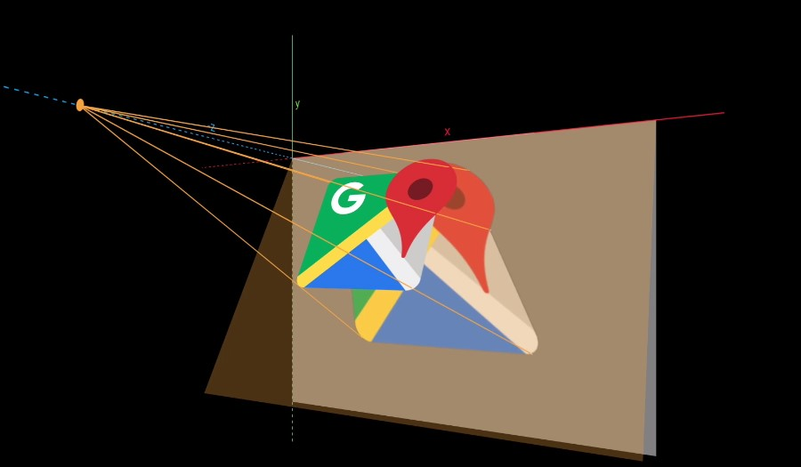
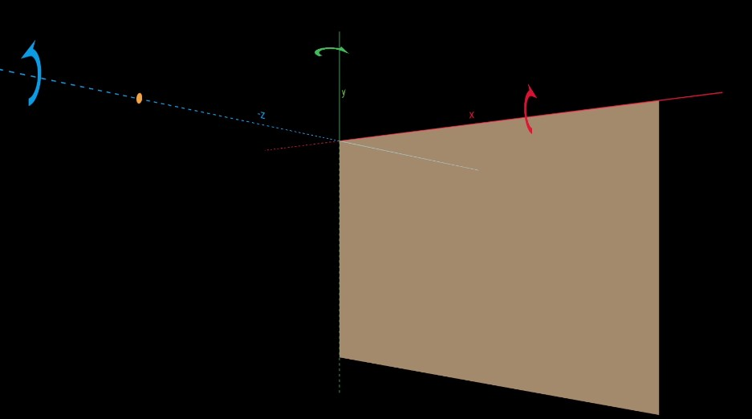
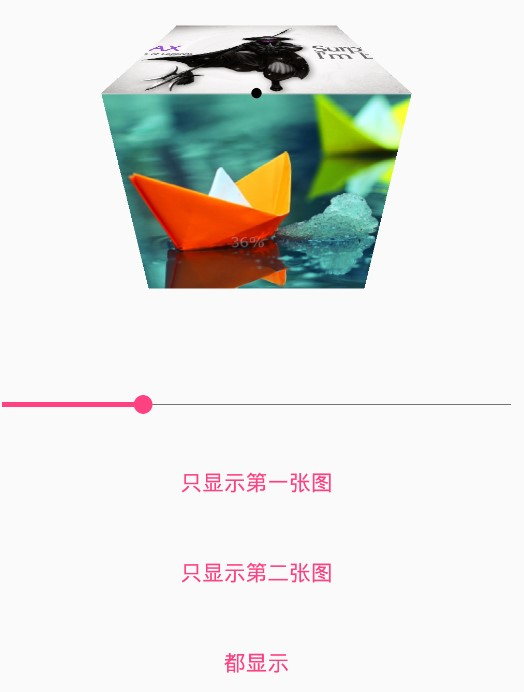

# Camera

---
## 1 Camera介绍

` android.graphics`包中的Camera用于在绘图时对视图做3维变换，Camera 的三维变换有三类：**旋转、平移、移动相机**。

Camera的原理：**对图像做投影**

canvas就像摆在画布前面的一个虚拟相机，正对这画布，默认情况下画布不会有任何变幻，但是当旋转画布角度后，就会才生投影，投影到画布原来的位置上。


>图片来自HenCoder

camera的坐标系是一个三位坐标系：坐标系为：**右正左负，上正下负，内正外负。**

---
## 2 Camera方法介绍


| 方法 | 说明 |
| --- | --- |
| getMatrix(mMatrix) | 把camera内部的变换填充到给定的举证中 |
| applyToCanvas(mCanvas) | 将变换获得的Matrix直接作用到mCanvas上。内部调用的是canvas的concat方法 |
| rotate(x,y,z) | 三维旋转 |
| rotateX、rotateY、rotateZ | 三维旋转 |
| getLocationX、getLocationY、getLocationZ | 获得Camera的位置，默认是在(0,0,-8)点 |
| setLocation(x,y,z) | 设置camera的位置 |
| translate(x,y,z) | 平移Camera。一般不要平移camera坐标 |
| save() | 与Canvas的类似 |
| restore() | 与Canvas类似 |

**关于camera的位置**：

`setLocation(x,y,z)`这个方法的参数的单位不是像素，而是inch。在 Camera中，相机的默认位置是(0,0,-8)（单位是英寸）。`8 x 72 = 576`，所以camera的默认位置是 (0, 0, -576)（像素）。

**关于camera的旋转角度**


>图片来自HenCoder

**关于修正糊脸**

糊脸的原因是因为camera离画布太近了，如果图像过大，就会产生糊脸效果，只要调用setLocation()方法，把camera移原一点即可，一般改变的是z值。

**修改变换的中心点**

Camera不能设置旋转的轴心，它的旋转轴心始终是原点，所以需要把canvas的绘图中心移动到原点。才能以图形的中心点实现变换。如下图所示：


>图片来自HenCoder

主要代码如下

```java
            //得到中心点
            int centerX1 = point1.x + bitmap.getWidth() / 2;
            int centerY1 = point1.y + bitmap.getHeight() / 2;
            mCamera.save();
            mCamera.rotateX(30);
            mCamera.getMatrix(mMatrix);
            mCamera.restore();
            //关键点在于此，通过Translate改变变换的中心点
            mMatrix.postTranslate(centerX1, centerY1);
            mMatrix.preTranslate(-centerX1, -centerY1);
            canvas.save();
            canvas.concat(mMatrix);
            canvas.drawBitmap(bitmap, point1.x, point1.y, paint);
            canvas.restore();
```

---
## 3 示例实现3D变换

使用camera实现3D立体旋转，其原理是同时变换两个Bitmap，使用两个平面拼合成一个带有3D立体感觉的画面。如下图所示



垂直向下翻转时：第一张图片旋转轴在水平居中，垂直靠上边的位置，旋转角度不断增加，同时旋转轴随着上边逐渐往下移动，即上图的黑点。

