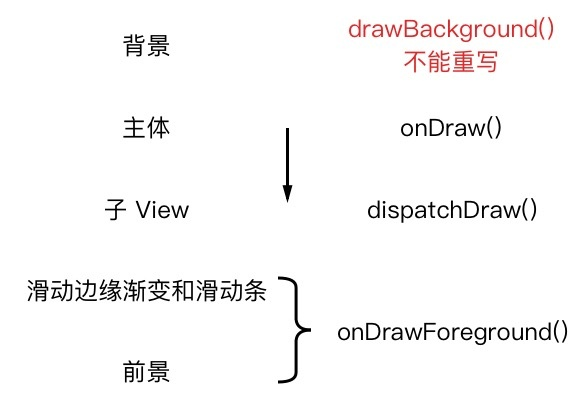
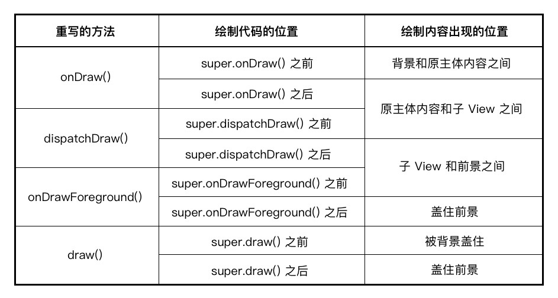

# 绘制顺序

---
## 1 绘制顺序

Android的每个Window中都维护者一个View树，从根布局开始发起绘制操作，遍历整个View树执行每个View的绘制，从而把把内容显示到屏幕上，在这个绘制流程中，View和ViewGroup担负着不同的责任，View只需要负责自己的内容绘制，而ViewGroup一般不会在本身绘制内容，更多的是分发绘制的操作到自己的子View。

执行这个绘制操作的方法是View的draw方法，从绘制的层级来看又可以把draw方法分解为以下几步：

1. 绘制背景色
2. 绘制主题颜色
3. 绘制子View(ViewGroup执行)
4. 滑动边缘渐变和滑动条
5. 绘制前景色(Android6之前只有FrameLayout支持前景色)

这几个步骤对应的方法如下：


>图片来自[hencoder](http://hencoder.com/)


- drawBackground复制绘制背景色，且该方法是私有的，不可重写
- onDraw也就是通常我们在自定义View时会重写的方法，复制绘制View的主体内容，比如TextView的text绘制
- dispatchDraw用于分发绘制操作到子View，对应ViewGroup才有意义
- onDrawForeground负责绘制：滑动边缘渐变和滑动条+前景色，**这个方法在Android6.0才有用**

因此draw分发可以简化为下面版本：

```java
    public void draw(Canvas canvas) {
        ...
        drawBackground(Canvas); // 绘制背景（不能重写）
        onDraw(Canvas); // 绘制主体
        dispatchDraw(Canvas); // 绘制子 View
        onDrawForeground(Canvas); // 绘制滑动相关和前景
        ...
    }
```
---
## 2 覆写各种方法的区别


>图片来自hencoder

---
## 3 ViewGroup的优化

出于效率的考虑，`ViewGroup` 默认会绕过 `draw()` 方法，换而直接执行 `dispatchDraw()`，以此来简化绘制流程。所以如果你自定义了某个 `ViewGroup` 的子类（比如 `LinearLayout`）并且需要在它的除 `dispatchDraw()` 以外的任何一个绘制方法内绘制内容，你**可能**会需要调用 `View.setWillNotDraw(false)`这行代码来切换到完整的绘制流程（是「可能」而不是「必须」的原因是，有些 ViewGroup 是已经调用过 `setWillNotDraw(false)` 了的，例如 `ScrollView`）。

---
## 引用

- [hencoder](http://hencoder.com/)