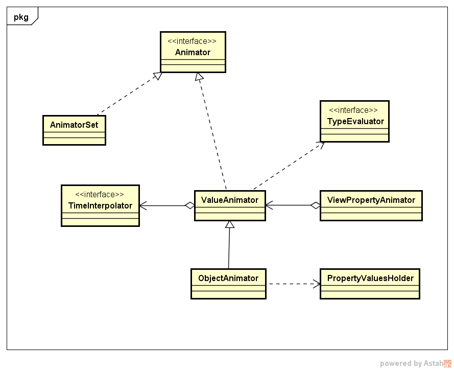
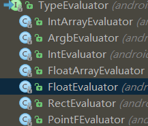
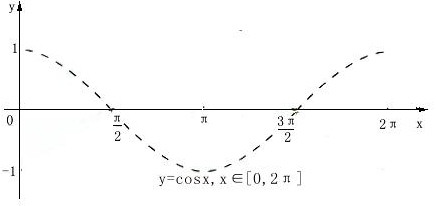

# Android属性动画

属性动画从android3.0开始引入，因为之前的View动画有很多的缺陷：

- 致命的缺陷，就是它只是改变了View的显示效果而已，而不会真正去改变View的属性
- 它只能够实现移动、缩放、旋转和淡入淡出这四种动画操作，并没有什么扩展性
- 它仅仅是对View进行操作

而属性动画解决了这些问题：`Property Animation`故名思议就是通过动画的方式改变对象的属性，而且不仅仅是View，而是任何具有属性的对象，**所以这里的动画并不是仅仅局限于视图动画，而是任意对象属性的单位时间内的一个梯度变化。**


<br/>对于属性动画我们需要掌握的有：

- ValueAnimator 动画的执行类，后面详细介绍
- ObjectAnimator  动画的执行类，后面详细介绍
- ViewPropertyAnimator的用法
- 使用xml定义Property Animator
- AnimatorInflater 用户加载属性动画的xml文件
- AnimatorSet 用于控制一组动画的执行：线性，一起，每个动画的先后执行等。
- TypeEvaluator  类型估值，主要用于设置动画操作属性的值。
- TimeInterpolator 时间插值，下面已经介绍。
- PropertyValuesHolder
- Keyframe
- [**LayoutTransition**](http://blog.csdn.net/feiduclear_up/article/details/45919613) todo
- [**StateListAnimator**]() todo

动画相关类图如下



---
## 1 ValueAnimator使用

ValueAnimator是整个属性动画机制当中最核心的一个类，属性动画的运行机制是通过不断地对值进行操作来实现的，而初始值和结束值之间的动画过渡就是由ValueAnimator这个类来负责计算的。它的内部使用一种时间循环的机制来计算值与值之间的动画过渡，我们只需要将初始值和结束值提供给ValueAnimator，并且告诉它动画所需运行的时长，ValueAnimator就会自动帮我们完成从初始值平滑地过渡到结束值这样的效果。除此之外，ValueAnimator还负责管理动画的播放次数、播放模式、以及对动画设置监听器等

ValueAnimator的使用：比如模拟300秒内从 0.0到1.0的一个梯度变化。

```java
            //创建动画
            ValueAnimator valueAnimator = ValueAnimator.ofFloat(0.0f, 1.0f).setDuration(300);
            //监听
            valueAnimator.addUpdateListener(new ValueAnimator.AnimatorUpdateListener() {

                @Override
                public void onAnimationUpdate(ValueAnimator animation) {
                    Log.d("PropertyFragment", "获取当前动画值:" + animation.getAnimatedValue());
                    Log.d("PropertyFragment", "获取当前的计算分数:" + animation.getAnimatedFraction());
                }
            });
            valueAnimator.start();//开始
```

另外还可以设置一下属性：

```java
            valueAnimator.setInterpolator();//设置插值器
            valueAnimator.setRepeatCount();//重复次数
            valueAnimator.setRepeatMode();//重复模式
            valueAnimator.setStartDelay();//动画延迟
```

除了操作浮点数外，ValueAnimator还可以操作下面其他数据类型
```java
            valueAnimator.ofInt()
            valueAnimator.ofArbg()
            valueAnimator.ofObject()
            valueAnimator.ofPropertyValuesHolder()
```

---
## 2 ObjectAnimator

ObjectAnimator继承自ValueAnimator，ValueAnimator是属性动画的核心，但是它本身只是实现一个值的连续变化，本身并不对任何对象的属性进行修改，而ObjectAnimator实现了对对象属性进行动画操作。使用起来更加方便，在使用ObjectAnimator时，我们需要指定要操作的对象。


比如一个ImageView的水平翻转：

```java
     ObjectAnimator.ofFloat(v, "rotationX", 0, 360)
                    .setDuration(300)
                    .start();
```

ObjectAnimator总结：

- 提供了ofInt、ofFloat、ofObject，ofPropertyValuesHolder系列方法都是设置动画作用的元素、作用的属性、动画开始、结束、以及中间的任意个属性值
- 对于View，如果操作的属性不会导致view的内部重绘，可以添加监听来手动重绘
- 动画更新的过程中，会不断调用`set???Name`更新元素的属性，所有使用ObjectAnimator更新某个属性，必须得有getter（设置一个属性值的时候）和setter方法


---
## 3 ViewPropertyAnimator

ViewPropertyAnimator实现了对Android View的动画操作，内部使用ValueAnimator实现，ViewPropertyAnimator的使用如下：

```java
      v.animate().setDuration(500)
                    .rotation(360)
                    .rotationX(360)
```

在使用ViewPropertyAnimator时，可以不调用start()方法，这是因为新的接口中使用了隐式启动动画的功能，只要我们将动画定义完成之后，动画就会自动启动。并且这个机制对于组合动画也同样有效，只要我们不断地连缀新的方法，那么动画就不会立刻执行，等到所有在ViewPropertyAnimator上设置的方法都执行完毕后，动画就会自动启动。当然如果不想使用这一默认机制的话，我们也可以显式地调用start()方法来启动动画。

---
## 4 多个动画的组合执行

### 1 在动画回调监听里操作

```java
            ObjectAnimator animator = ObjectAnimator.ofFloat(v, "d", 0, 1)//d为随便写的一个属性
                    .setDuration(300);
            v.setPivotX(v.getMeasuredWidth()/2);
            v.setPivotY(v.getMeasuredHeight()/2);
            animator.addUpdateListener(new ValueAnimator.AnimatorUpdateListener() {
                @Override
                public void onAnimationUpdate(ValueAnimator animation) {
                    Float animatedValue = (Float) animation.getAnimatedValue();
                    v.setAlpha(animatedValue);
                    v.setScaleX(animatedValue);
                    v.setScaleY(animatedValue);
                }
            });
           animator. start();
```

### 2 使用PropertyValuesHolder

```java
            PropertyValuesHolder pvhX = PropertyValuesHolder.ofFloat("alpha", 1f, 0f, 1f);

            PropertyValuesHolder pvhY = PropertyValuesHolder.ofFloat("scaleX", 1f, 0, 1f);

            PropertyValuesHolder pvhZ = PropertyValuesHolder.ofFloat("scaleY", 1f, 0, 1f);

            ObjectAnimator.ofPropertyValuesHolder(view, pvhX, pvhY,pvhZ).setDuration(1000).start();
```

### 3 使用AnimatorSet

AnimatorSet对单个动画有以下操作方式：

- `after(Animator anim)`   将现有动画插入到传入的动画之后执行
- `after(long delay)`   将现有动画延迟指定毫秒后执行
- `before(Animator anim)`   将现有动画插入到传入的动画之前执行
- `with(Animator anim)`   将现有动画和传入的动画同时执行

比如下面利用AnimatorSet组织下面一系列动画：

```java
    ObjectAnimator rotationXAnim = ObjectAnimator.ofFloat(v, "rotationX", 0, 360) .setDuration(300);
            ObjectAnimator rotationYAnim = ObjectAnimator.ofFloat(v, "rotationY", 0, 360) .setDuration(300);
            ObjectAnimator rotationAnim = ObjectAnimator.ofFloat(v, "rotation", 0, 360) .setDuration(300);
            float translationX = v.getTranslationX();
            ObjectAnimator translationXAnimator = ObjectAnimator.ofFloat(v, "translationX", translationX, translationX - 500, translationX).setDuration(1000);
            AnimatorSet animatorSet = new AnimatorSet();
            animatorSet.play(translationXAnimator).after(rotationAnim).before(rotationXAnim).with(rotationYAnim);
            animatorSet.start();
```

---
##  5 动画监听

valueAnimator和ObjectAnimator都可以添加动画监听：

### 5.1 动画生命周期监听

```java
    valueAnimator.addListener(new Animator.AnimatorListener() {
            @Override
            public void onAnimationStart(Animator animation) { }//开始
            @Override
            public void onAnimationEnd(Animator animation) {  }//结束
            @Override
            public void onAnimationCancel(Animator animation) { }//取消
            @Override
            public void onAnimationRepeat(Animator animation) { }//重复
        });
```

### 5.2 动画更新监听

```java
    valueAnimator.addUpdateListener(new ValueAnimator.AnimatorUpdateListener() {
                @Override
                public void onAnimationUpdate(ValueAnimator animation) { }
    });
```

第一个参数fraction非常重要，这个参数用于表示动画的完成度的，我们应该根据它来计算当前动画的值应该是多少

### 5.3 ViewPropertyAnimator

- `ViewPropertyAnimator.withStartAction()`
- `ViewPropertyAnimator.withEndAction()`

## 6 TypeEvaluator

TypeEvaluator什么呢？Evaluator是计算的意思TypeEvaluator的作用就是告诉动画系统如何从初始值过度到结束值。比如`ValueAnimator.ofFloat()`方法就是实现了初始值与结束值之间的平滑过度，那么这个平滑过度是怎么做到的呢？其实就是系统内置了一个FloatEvaluator，它通过计算告知动画系统如何从初始值过度到结束值，我们来看一下FloatEvaluator的代码实现：

```java
    //原始类型为一个接口
    public interface TypeEvaluator<T> {
        public T evaluate(float fraction, T startValue, T endValue);
    }

    //有很多子类，比如FloatEvaluator
    public class FloatEvaluator implements TypeEvaluator<Number> {
        public Float evaluate(float fraction, Number startValue, Number endValue) {
            float startFloat = startValue.floatValue();
            return startFloat + fraction * (endValue.floatValue() - startFloat);
        }
    }
```

可以看到，FloatEvaluator实现了TypeEvaluator接口，然后重写evaluate()方法。evaluate()方法当中传入了三个参数：

- 第一个参数fraction非常重要，这个参数用于表示动画的完成度的，我们应该根据它来计算当前动画的值应该是多少，默认是：0.0-1.0
- 第二个参数动画的初始值
- 第三个参数动画的结束值

比如上面的FloatEvaluator：用结束值减去初始值，算出它们之间的差值，然后乘以fraction这个系数，再加上初始值，那么就得到当前动画的值了。系统提供的TypeEvaluator如下：



*   IntEvaluator：属性的值类型为int；
*   FloatEvaluator：属性的值类型为float；
*   ArgbEvaluator：属性的值类型为十六进制颜色值；

### TypeEvaluator的使用场景

比如前面使用的ofFloat，ofInt有上面的TypeEvaluator来应对，但是ValueAnimator还有一个方法是**ofObject**是用于对**任意对象**进行动画操作的。但是相比于浮点型或整型数据，对象的动画操作明显要更复杂一些，**因为系统将完全无法知道如何从初始对象过度到结束对象**，因此这个时候我们就需要实现一个自己的TypeEvaluator来告知系统如何进行过度

---
## 7 Interpolator

Interpolator就是插值器，**主要作用是可以控制动画的变化速率**。Interpolator并不是属性动画中新增的技术，实际上从Android 1.0版本开始就一直存在Interpolator接口了，而之前的补间动画当然也是支持这个功能的。只不过在属性动画中新增了一个TimeInterpolator接口，这个接口是用于兼容之前的Interpolator的，这使得所有过去的Interpolator实现类都可以直接拿过来放到属性动画当中使用。

TimeInterpolator接口已经有非常多的实现类了，这些都是Android系统内置好的并且我们可以直接使用的Interpolator。每个Interpolator都有它各自的实现效果，比如说:

- `AccelerateInterpolator`是一个加速运动的Interpolator
- `DecelerateInterpolator`是一个减速运动的Interpolator
- `AccelerateDecelerateInterpolator`是一个先增速后减速运动的Interpolator
- `BounceInterpolator`是一个模拟弹跳运动的Interpolator
- `OvershootInterpolator`向前抛出，并超过目标值，然后再返回
- `AnticipateInterpolator`先向后，然后向前抛出（抛物运动）
- `AnticipateOvershootInterpolator `先向后，向前抛出并超过目标值，然后最终返回到目标值。
- `CycleInterpolator` 用指定的循环数，重复播放动画
- `PathInterpolator` 自定义动画完成度 / 时间完成度曲线。用这个 Interpolator 可以定制出任何想要的速度模型。定制的方式是使用一个 Path 对象来绘制出你要的动画完成度 / 时间完成度曲线。

当有一些特殊的动画时，我们可以选择合适的Interpolator，比如要模拟一个球的自由落体，可以选用BounceInterpolator，它就是用来模拟自由落体然后落地后回弹效果的动画插值器。**系统默认的插值器是AccelerateDecelerateInterpolator。**


### 7.1 TimeInterpolation源码学习

虽然系统提供了这么多，但是如果我们对动画播放速率有特殊的要求，可以自定义Interpolator，在自定义Interpolator前，可以先看一下系统的Interpolator是如何实现的。

```
    public interface TimeInterpolator {
        float getInterpolation(float input);
    }
```

可以看到TimeInterpolator定义了getInterpolation键方法，input的变化范围是0.0-1.0，而且input的输入是平滑变化的，而我们可以在getInterpolation方法内对input进行处理，然后返回变化后的input，从而影响动画的播放速率，但是返回的input的取值范围也应该是0.0-1.0，只是这个值的变化速率变了而已。

**线性插值器**：

```java
    public class LinearInterpolator extends BaseInterpolator implements NativeInterpolatorFactory {
        public LinearInterpolator() {
        }

        public LinearInterpolator(Context context, AttributeSet attrs) {
        }

        public float getInterpolation(float input) {
            return input;
        }

        public long createNativeInterpolator() {
            return NativeInterpolatorFactoryHelper.createLinearInterpolator();
        }
    }
```

getInterpolation是关键方法，可以它直接返回了input，没有对input做任何处理，所以很明显它就是一个线性的插值器

**先加速后减速的插值器**

```java
    public class AccelerateDecelerateInterpolator implements Interpolator, NativeInterpolatorFactory {  
        public AccelerateDecelerateInterpolator() {  
        }  

        public AccelerateDecelerateInterpolator(Context context, AttributeSet attrs) {  
        }  
          
        public float getInterpolation(float input) {  
            return (float)(Math.cos((input + 1) * Math.PI) / 2.0f) + 0.5f;  
        }  
        public long createNativeInterpolator() {  
            return NativeInterpolatorFactoryHelper.createAccelerateDecelerateInterpolator();
        }
    }
```

可以看到，算法中主要使用了余弦函数，由于input的取值范围是0到1，那么cos函数中的取值范围就是π到2π。而cos(π)的结果是-1，cos(2π)的结果是1，那么这个值再除以2加上0.5之后，getInterpolation()方法最终返回的结果值还是在0到1之间。只不过经过了余弦运算之后，最终的结果不再是匀速增加的了，而是经历了一个先加速后减速的过程，我们可以从余弦的曲线图看出：



### 7.2 PathInterpolator

PathInterpolator的使用方式时，用Path绘制的图形来自定义动画完成度/时间完成度曲线。它可以定制出任何想要的速度模型。定制的方式是使用一个Path对象来绘制出想要的动画完成度/时间完成度曲线。

具体可以参考[hencoder](http://hencoder.com/ui-1-6/)

---
## 8 使用xml编写动画

如果想要使用XML来编写动画，首先要在res目录下面新建一个animator文件夹，所有属性动画的XML文件都应该存放在这个文件夹当中。然后在XML文件中我们一共可以使用如下三种标签：

*   `<animator>`对应代码中的ValueAnimator
*   `<objectAnimator>`  对应代码中的ObjectAnimator
*   `<set>`  对应代码中的AnimatorSet

### 8.1 animator标签

比如说我们想要实现一个从0到100平滑过渡的动画，在XML当中就可以这样写：

```xml
//xml
    <animator xmlns:android="http://schemas.android.com/apk/res/android"
              android:duration="300"
              android:startOffset="100"
              android:valueFrom="1"
              android:valueTo="360"
              android:valueType="floatType">
    </animator>

//java代码
        ValueAnimator animator = (ValueAnimator)AnimatorInflater.loadAnimator(getContext(),R.animator.animator_demo);
        animator.addUpdateListener(new ValueAnimator.AnimatorUpdateListener() {
            @Override
            public void onAnimationUpdate(ValueAnimator animation) {
                //......
            }
        });
        animator.start();
```

valueType有四个个值：

- intType
- floatType
- colorType
- pathType

### 8.2 objectAnimator标签

如反复的改变view的透明度：

```xml
    <objectAnimator xmlns:android="http://schemas.android.com/apk/res/android"
        android:duration="1000"
        android:propertyName="alpha"
        android:valueFrom="0"
        android:valueTo="1"
        android:valueType="floatType"
        android:repeatCount="-1"
        android:repeatMode="reverse"
        android:startOffset="100">
    </objectAnimator>

    Animator animator = AnimatorInflater.loadAnimator(getContext(), R.animator.alpha_animator);
            animator.setTarget(v);
            animator.start();
```

### 8.3 set标签

```xml
    <?xml version="1.0" encoding="utf-8"?>
    <set xmlns:android="http://schemas.android.com/apk/res/android" android:ordering="sequentially">
    
        <objectAnimator
            android:duration="2000"
            android:propertyName="translationX"
            android:valueFrom="-500"
            android:valueTo="0"
            android:valueType="floatType">
        </objectAnimator>
    
        <set android:ordering="together">
            <objectAnimator
                android:duration="3000"
                android:propertyName="rotation"
                android:valueFrom="0"
                android:valueTo="360"
                android:valueType="floatType">
            </objectAnimator>
    
            <set android:ordering="sequentially">
                <objectAnimator
                    android:duration="1500"
                    android:propertyName="alpha"
                    android:valueFrom="1"
                    android:valueTo="0"
                    android:valueType="floatType">
                </objectAnimator>
                <objectAnimator
                    android:duration="1500"
                    android:propertyName="alpha"
                    android:valueFrom="0"
                    android:valueTo="1"
                    android:valueType="floatType">
                </objectAnimator>
            </set>
        </set>
    </set>
```

set的ordering属性可以指定其内部动画的执行方式，只支持两种:

- sequentially 串行
- together 并行

View的常用属性和xml中属性说明：

```
`"alpha" 透明度`
`"pivotX" 相对位置x`
`"pivotY" 相对位置y`
`"translationX" x方向移动距离`
`"translationY" `y方向移动距离
`"rotation" 旋转`
`"rotationX" x立体旋转`
`"rotationY" y立体旋转`
`"scaleX"`<font face="Consolas">    x缩放</font>
`"scaleY"`<font face="Consolas">    y缩放</font>
`"scrollX"`
`"scrollY"`
`"x" x坐标`
`"y" y坐标`
```

他们的含义如下：

1. translationX和translationY：这两个属性作为一种增量来控制着View对象从它布局容器的左上角坐标开始的位置。
2. rotation、rotationX和rotationY：这三个属性控制View对象围绕支点进行2D和3D旋转。
3. scaleX和scaleY：这两个属性控制着View对象围绕它的支点进行2D缩放。
4. pivotX和pivotY：这两个属性控制着View对象的支点位置，围绕这个支点进行旋转和缩放变换处理。默认情况下，该支点的位置就是View对象的中心点。
5. x和y：这是两个简单实用的属性，它描述了View对象在它的容器中的最终位置，它是最初的左上角坐标和translationX和translationY值的累计和。
6. alpha：它表示View对象的alpha透明度。默认值是1（不透明），0代表完全透明（不可见）。

### 8.4  Property Animation属性介绍

 我们可以用XML文件来定义Property Animation。XML的基本语法如下：

```xml
    <set
      android:ordering=["together" | "sequentially"]>
        <objectAnimator
            android:propertyName="string"
            android:duration="int"
            android:valueFrom="float | int | color"
            android:valueTo="float | int | color"
            android:startOffset="int"
            android:repeatCount="int"
            android:repeatMode=["repeat" | "reverse"]
            android:valueType=["intType" | "floatType"]/>
        <animator
            android:duration="int"
            android:valueFrom="float | int | color"
            android:valueTo="float | int | color"
            android:startOffset="int"
            android:repeatCount="int"
            android:repeatMode=["repeat" | "reverse"]
            android:valueType=["intType" | "floatType"]/>
        <set>
            ...
        </set>
    </set>
```

- `set` : 是objectAnimator和animator的集合。标签是可以嵌套的。
- `objectAnimator` : 对应是ObjectAnimator动画。
- `animator` : 对应是ValueAnimator动画。
- ` android:propertyName`: 属性名。仅ObjectAnimator才有该属性。
- `android:duration`: 动画的总时间，以ms为单位，默认是300ms。
- `android:valueFrom`: 动画的起始值。
- `android:valueTo`: 动画的结束值。
- `android:startOffset`: 动画的起始偏移时间，以ms为单位。
- `android:repeatCount`: 动画重复播放重复次数。-1表示无穷次，默认是0。
- `android:repeatMode`: 动画重复播放时的模式。repeat表示和原来一样从头开始播放，reverse表示反向播放；默认是repeat。
- `android:valueType`: 属性的值的类型。可以位intType或floatType。

假设存在res/anim/property_animator.xml文件，该文件中定义了Property Animation动画。则动画的使用方法如下：

```java
    AnimatorSet set = (AnimatorSet) AnimatorInflater.loadAnimator(myContext,
        R.anim.property_animator);
    set.setTarget(myObject);
    set.start();
```

补充

- View Animation的部分属性在Property Animation中也是可以使用的。例如，android:interpolator。
- 为了区分Property Animation和View Animation的资源文件，从Android 3.1开始，Property Animation的xml文件存在res/animator/目录下（View Animation存在res/anim/目录下）， animator这个名是可选的。

---
## 9 关键帧

由时间和值构成的Keyframe对象会定义动画在特定的时间点上特定的状态。每个关键帧还有它自己的插补器来控制当前关键帧与前一个关键帧之间的动画行为。

**Keyframe.ofFloat(0f,0f);**

- 第一个参数为：要执行该帧动画的时间节点（elapsed time / duration）
- 第二个参数为属性值。因此如果你想指定某一特定时间的特定状态，那么简单的使用ObjectAnimator就满足不了你了，因为，ObjectAnimator.ofInt(....)类似的工厂方法，无法指定特定的时间点。


要实例化一个Keyframe对象，必须使用以下工厂方法之一：ofInt()、ofFloat()、或ofObject()。使用这些工厂方法来获取对应类型的关键帧，然后调用ofKeyframe工厂方法来获取一个PropertyValuesHolder对象，一旦获得了这个对象，就能够得到一个在PropertyValuesHolder对象中传递的动画制作器对象。

```java
    Keyframe kf0 = Keyframe.ofFloat(0f, 0f);
    Keyframe kf1 = Keyframe.ofFloat(.5f, 360f);
    Keyframe kf2 = Keyframe.ofFloat(1f, 0f);

    PropertyValuesHolder pvhRotation = PropertyValuesHolder.ofKeyframe("rotation", kf0, kf1, kf2);

    ObjectAnimator rotationAnim = ObjectAnimator.ofPropertyValuesHolder(target, pvhRotation)

    rotationAnim.setDuration(5000ms);
```

---
## 引用

- [官方文档](http://developer.android.com/intl/zh-cn/guide/topics/graphics/prop-animation.html)
- [官方文档-Animation Resources](http://developer.android.com/intl/zh-cn/guide/topics/resources/animation-resource.html)
- [鸿洋-Android 属性动画（Property Animation](http://blog.csdn.net/lmj623565791/article/details/38067475)
- [郭霖-Android属性动画完全解析](http://blog.csdn.net/guolin_blog/article/details/43536355)
