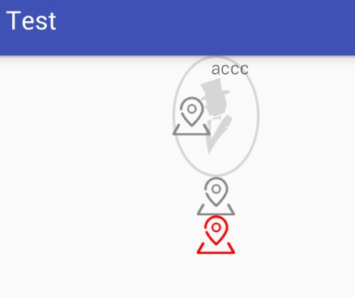
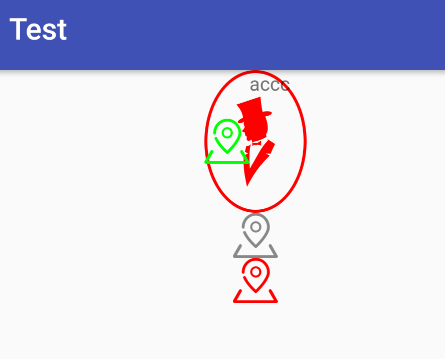

# Drawable 着色

---
## 1 Tint

Tint 即着色，可以对 Drawable 进行着色，示例：

```xml
        <TextView
            android:layout_width="wrap_content"
            android:layout_height="wrap_content"
            android:background="@drawable/account_icon_male"
            android:backgroundTint="#ff0000"
            android:drawableLeft="@drawable/me_icon_address"
            android:drawableTint="#00ff00"
            android:foregroundTint="#0000ff"
            android:text="accc"
            android:tint="#FFCDD2"
            tools:ignore="HardcodedText"/>

        <ImageView
            android:layout_width="wrap_content"
            android:layout_height="wrap_content"
            android:src="@drawable/me_icon_address"
            android:tint="#ff0000"
            tools:ignore="ContentDescription"/>
```

Android5.0 以下支持的属性只有`android:tint="#FFCDD2"`(AppCompatButton 支持 backgroundTint)，其他属性则不支持。tint 是有 support 包中提供的 API 支持的，当然需要继承 AppCompatActivity，在 xml 定义的各种View都会被替换为对应的兼容View，比如 `ImageView` 都会被替换为`AppCompatEditView`。


Android4.1 的效果为：



Android6.0 的效果为：




所以在为了兼容 5.0 以下的系统，应该使用 support 包中的API：

- DrawableCompat
 - setTint
 - setTintList
 - setTintMode
- ViewCompat，使用此 API 的 View 需要实现 TintableBackgroundView 接口
 - setBackgroundTintList
 - getBackgroundTintList
 - getBackgroundTintMode
 - getBackgroundTintMode

---
## 2 使用 DrawableCompat 给 drawable 着色

着色

```
        public static Drawable tintDrawable(Drawable drawable, ColorStateList colors) {
            final Drawable wrappedDrawable = DrawableCompat.wrap(drawable);
            DrawableCompat.setTintList(wrappedDrawable, colors);
            return wrappedDrawable;
        }
```

EditText 着色

```
            EditText editText1 = (EditText) view.findViewById(R.id.et1);
            final Drawable originalDrawable = editText1.getBackground();
            final Drawable wrappedDrawable = tintDrawable(originalDrawable, ColorStateList.valueOf(Color.RED));
            editText1.setBackgroundDrawable(wrappedDrawable);

    //注意这里是getColorStateList
     editText2.setBackgroundDrawable(tintDrawable(editText2.getBackground(),
                   getContext().getResources().getColorStateList(R.color.edit_se)));
```


res/color/deit_se:

```
    <?xml version="1.0" encoding="utf-8"?>
    <selector xmlns:android="http://schemas.android.com/apk/res/android">
        <item android:state_focused="true" android:color="@android:color/holo_red_dark"/>
        <item android:state_focused="false" android:color="@android:color/holo_blue_bright"/>
    </selector>
```

ImageView着色

```
            ImageView iv1 = (ImageView) view.findViewById(R.id.iv1);
            ImageView iv2 = (ImageView) view.findViewById(R.id.iv2);
            final Drawable originalBitmapDrawable = getResources().getDrawable(R.drawable.ic_account);
            iv2.setBackgroundDrawable(originalBitmapDrawable);
            iv1.setImageDrawable(tintDrawable(originalBitmapDrawable, ColorStateList.valueOf(Color.MAGENTA)));
```


---
## 3 让自定义 View 支持 BackgroundTint、Tint

既然 AppCompatImageView 支持 tint、srcCompat 属性，AppcomatButton 支持 backgroundTint 属性，我们可以参考其源码让自定义 View 也支持这些属性，对于 v4/v7 中某些 package 级权限的 API，我们可以把自定义 View 定义在对应的相同包名下即可访问。

比如让一个自定义View支持 backgroundTint：查看 View 的源码发现其定义了 setBackgroundTintList 方法，但是很明显，只在 api21 及以上可用

```java
    public void setBackgroundTintList(@Nullable ColorStateList tint) {
        if (mBackgroundTint == null) {
            mBackgroundTint = new TintInfo();
        }
        mBackgroundTint.mTintList = tint;
        mBackgroundTint.mHasTintList = true;

        applyBackgroundTint();
    }
```

此时，应该想到的是，ViewCompat 类，于是去查看 ViewCompat 提供的方法，发现确实有 setBackgroundTintList 方法，该方法说明为：`Applies a tint to the background drawable. This will always take effect when running on API v21 or newer. When running on platforms previous to API v21, it will only take effect if view implements the  TintableBackgroundView interface.`，这个方法在 API 21 以下才有效果，而且要求 View 实现了 TintableBackgroundView 接口：

```java
public interface TintableBackgroundView {

    void setSupportBackgroundTintList(@Nullable ColorStateList tint);
    
    ColorStateList getSupportBackgroundTintList();
    
    void setSupportBackgroundTintMode(@Nullable PorterDuff.Mode tintMode);
    
    PorterDuff.Mode getSupportBackgroundTintMode();
}
```


实现 TintableBackgroundView 后可以使用 AppCompatBackgroundHelper 来帮助我们实现 TintableBackgroundView 中的方法。这样就支持在代码中使用 调用 ViewCompat.setBackgroundTintList() 给 View 的 Background 着色了，另外发现 AppCompatButton 是支持在 xml 中定义 backgroundTint，可以参考其源码实现，然后让自定义 View 也支持 在 xml 中定义 backgroundTint，最终实现方式为：

```kotlin
//注意：一定要使用 TintContextWrapper 包装原始的 context
class TintableToggleButton
@JvmOverloads
constructor(context: Context, attrs: AttributeSet?= null,  defStyleAttr: Int = 0)
    : ToggleButton(TintContextWrapper.wrap(context), attrs, defStyleAttr), TintableBackgroundView {

    private var backgroundTintHelper: AppCompatBackgroundHelper? = null

    init {
        backgroundTintHelper = AppCompatBackgroundHelper(this)
        backgroundTintHelper?.loadFromAttributes(attrs, defStyleAttr)
    }

    override fun setSupportBackgroundTintList(tint: ColorStateList?) {
        backgroundTintHelper?.supportBackgroundTintList = tint
    }

    override fun getSupportBackgroundTintMode() = backgroundTintHelper?.supportBackgroundTintMode

    override fun setSupportBackgroundTintMode(tintMode: Mode?) {
        backgroundTintHelper?.supportBackgroundTintMode = tintMode
    }

    override fun getSupportBackgroundTintList() = backgroundTintHelper?.supportBackgroundTintList

    override fun setBackgroundResource(@DrawableRes resId: Int) {
        super.setBackgroundResource(resId)
        backgroundTintHelper?.onSetBackgroundResource(resId)
    }

    override fun setBackgroundDrawable(background: Drawable?) {
        super.setBackgroundDrawable(background)
        backgroundTintHelper?.onSetBackgroundDrawable(background)
    }
}
```

总结，关于着色常用类：

- AppCompatHintHelper
- AppCompatImageHelper
- TintableBackgroundView
- ViewCompat

---
##  引用

- [Drawable 着色的后向兼容方案](http://www.race604.com/tint-drawable/)
- [Tint实践](http://www.jianshu.com/p/6bd7dd1cd491)
- [浅谈 Android L 的 Tint（着色）](http://www.imli.me/android/2016/01/24/Android-L-Tint/)
- [从使用到源码，细说 Android 中的 tint 着色器](https://yifeng.studio/2017/03/30/android-tint/)
