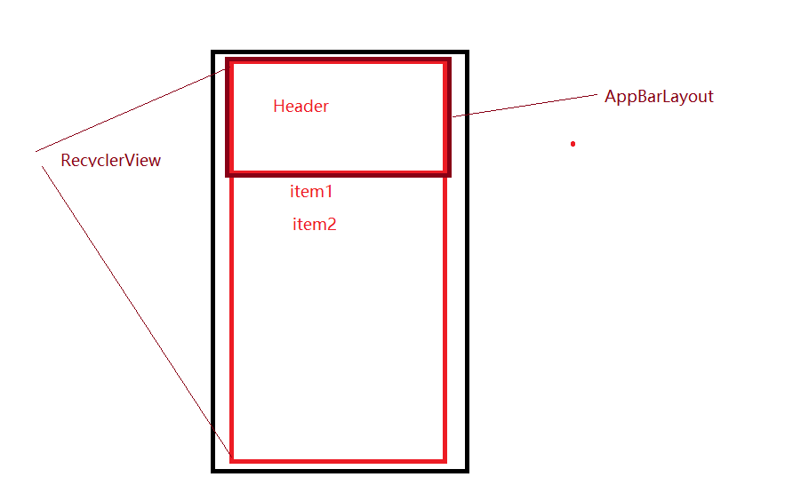

# AppBarLayout 解析

---
## 1 AppBarLayout 解析

AppBarLayout是一个vertical的线性布局，用于实现MD设计中的**App Bar**,一般配合CoordinateLayout使用。

使用方式：

在CoordinateLayout中，使用AppBarLayout包含Toolbar或者CollapsingToolbarLayout，并被被包含的子view设置`app:layout_scrollFlags`属性，然后被配合滑动的内容布局(比如RecyclerView)设置` app:layout_behavior="@string/appbar_scrolling_view_behavior"`，即可实现AppBarLayout实现app bar随着内容布局滑动的各种效果了。

### 1.1 layout_scrollFlags

layout_scrollFlags是AppBarLayout内部LayoutParams的一个属性，所以可以给AppBarLayout的直接子view设置这个属性，AppBarLayout会根据这个属性实现不同的滑动效果，比如`SCROLL_FLAG_SCROLL|SCROLL_FLAG_ENTER_ALWAYS`

### 1.2  Behavior

AppBarLayout提供了两个Behavior，分别是`AppBarLayout.ScrollingViewBehavior`和`AppBarLayout.Behavior`。

- AppBarLayout.Behavior是AppBarLayout自己使用的，AppBarLayout使用了DefaultBehavior注解指定
- ScrollingView是给在CoordinateLayout中配合`app bar`滑动的内容布局（比如RecyclerView)使用的，即`app:layout_behavior="@string/appbar_scrolling_view_behavior"`

AppBarLayout.Behavior继承关系如下

    ViewOffsetBehavior
        |
    HeaderBehavior
        |
    Behavior

AppBarLayout.ScrollingViewBehavior如下

    ViewOffsetBehavior
        |
    HeaderScrollingViewBehavior
        |
    ScrollingViewBehavior

#### ViewOffsetBehavior

ViewOffsetBehavior只是提供了一些设置宿主child的TopAndBottomOffset和LeftAndRightOffset的方法

    ViewOffsetHelper
    private int mTempTopBottomOffset = 0;
    private int mTempLeftRightOffset = 0;
    public boolean setTopAndBottomOffset(int offset)
    public boolean setLeftAndRightOffset(int offset)

#### HeaderBehavior

HeaderBehavior中封装了基本的事件拦截逻辑和滑动逻辑。

    //滑动逻辑
    final int scroll(CoordinatorLayout coordinatorLayout, V header,
                int dy, int minOffset, int maxOffset)
    //fling逻辑
    final boolean fling(CoordinatorLayout coordinatorLayout, V layout, int minOffset,
                int maxOffset, float velocityY)

#### AppBarLayout.Behavior

 AppBarLayout.Behavior处理了AppBarLayout的滑动逻辑

#### HeaderScrollingViewBehavior

HeaderScrollingViewBehavior主要处理了内容布局的测量与布局逻辑。

#### ScrollingViewBehavior

ScrollingViewBehavior封装了内容布局与AppBarLayout配合滑动时的逻辑，主要是设置内容布局的TopAndBottomOffset和LeftAndRightOffset

### 1.3 CollapsingToolbarLayout

CollapsingToolbarLayout用于实现可折叠的`App Bar`，其原理是在onAttachedToWindow方法中获取父容器AppBarLayout，然后添加OnOffsetChangedListener，在OnOffsetChangedListener的onOffsetChanged方法中折叠和扩展自己。并且设置自己子view的TopAndBottomOffset和LeftAndRightOffset值，防止ziview随着AppBarLayout一起向上移动。

---
## 2 smooth-app-bar-layout

smooth-app-bar-layout是一个github的一个开源项目，其扩展了design库中的`AppBarLayout`,从而实现了更加顺滑子view与父容器之间的交互滑动：

smooth-app-bar-layout提供了一种思路去实现:

那就是不适用ScrollingViewBehavior，而是通过监听内容布局(比如RecyclerView)滑动来达到无缝连接的fling效果。如下图所示:

1. RecycerView并没有使用设置Behavior，所以布局的位置为沾满了CoordinateLayout
2. RecycerView设置了一个头部，其头部是AppBarLayout的高度，看起来就像RecyclerView被布局在AppBarLayout的下面一样
3. 在AppBarLayout的Behavior中，获取内容布局RecycerView(或者其他View)，监听他们的滑动偏差，来达到类似使用ScrollingViewBehavior的效果，并且滑动更加的顺滑。

---
## 引用

- [smooth-app-bar-layout](https://github.com/henrytao-me/smooth-app-bar-layout)
