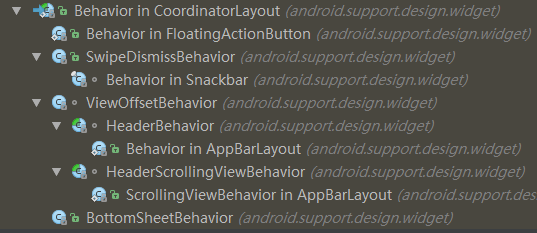

# CoordinatorLayout

---
## 1 CoordinatorLayout介绍

`CoordinatorLayout`布局在Design库中的被提供，利用这个`CoordinatorLayout`我们实现Material Design中各种复杂的动作响应和子控件间的交互，现在就来了解一下`CoordinatorLayout`的工作原理，Coordinator就是协调器的意思，可见`CoordinatorLayout`可以协调在它内部的各个子view。

在学习design包时，我们在xml中就可以实现很多效果，比如`floatingActionButton`在`SnackBar`弹出时自动向上移动，防止被`SnackBar`盖住。比如`AppBarLayout`随着控件的滑动扩大和缩小等。这都是`CoordinatorLayout`实现的。

其实`CoordinatorLayout`本身没有实现这么大的能力来控制各个子view，他主要依靠的是它内部的`Behavior`，比如在`CoordinatorLayout`中`AppBarLayout`随着`RecyclerView`扩大和缩小，Recycler也在调整自己的位置，我们在`RecyclerView`的布局节点中加上`app:layout_behavior="@string/appbar_scrolling_view_behavior`的声明就可以实现。（AppBarLayout有默认的Behavior）如下面代码：

```
    <android.support.v7.widget.RecyclerView
            android:layout_width="match_parent"
            android:layout_height="match_parent" app:layout_behavior="@string/appbar_scrolling_view_behavior" />
```

xml中定义的layout_behavior其实是定义的一个类路径，比如：

```
     <string name="appbar_scrolling_view_behavior" translatable="false">android.support.design.widget.AppBarLayout$ScrollingViewBehavior</string>
```

然后我们去看的`LayoutPraams`的代码,发现`Behavior`定义在`LayoutPraams`中，也就是说CoordinatorLayout的每个子view都可以定义自己的`Behavior`。

```
    public static class LayoutParams extends ViewGroup.MarginLayoutParams {
        /**
         * A {@link Behavior} that the child view should obey.
         */
        Behavior mBehavior;
        //......
    }
```

### Behavior介绍

Behavior的设置方式有三种

1：使用LayoutParams设置：

```
          public void setBehavior(Behavior behavior) {
                if (mBehavior != behavior) {
                    mBehavior = behavior;
                    mBehaviorTag = null;
                    mBehaviorResolved = true;
                }
            }
```

2：在xml布局中设置

3：使用`CoordinatorLayout`中的注解定义默认Behavior，比如AppBarLayout就有默认的Behavior

```
    @CoordinatorLayout.DefaultBehavior(AppBarLayout.Behavior.class)
    public class AppBarLayout extends LinearLayout {
         ......
    }
```

在LayoutParams创建的时候会构造view的指定的Behavior

```
     LayoutParams(Context context, AttributeSet attrs) {
                super(context, attrs);
    
                final TypedArray a = context.obtainStyledAttributes(attrs,
                        R.styleable.CoordinatorLayout_LayoutParams);
    
                this.gravity = a.getInteger(
                        R.styleable.CoordinatorLayout_LayoutParams_android_layout_gravity,
                        Gravity.NO_GRAVITY);
               //锚点
                mAnchorId = a.getResourceId(R.styleable.CoordinatorLayout_LayoutParams_layout_anchor,
                        View.NO_ID);
                this.anchorGravity = a.getInteger(
                        R.styleable.CoordinatorLayout_LayoutParams_layout_anchorGravity,
                        Gravity.NO_GRAVITY);
    
                this.keyline = a.getInteger(R.styleable.CoordinatorLayout_LayoutParams_layout_keyline,
                        -1);
                 
                mBehaviorResolved = a.hasValue(
                        R.styleable.CoordinatorLayout_LayoutParams_layout_behavior);
                if (mBehaviorResolved) {
                   //如果指定了Behavior，就去解析
                    mBehavior = parseBehavior(context, attrs, a.getString(
                            R.styleable.CoordinatorLayout_LayoutParams_layout_behavior));
                }
    
                a.recycle();
            }
```

另外在`prepareChildren`方法中也会根据注解去解析子view的behavior，前提是在xml中没有指定behavior。`prepareChildren`方法会在测量时被调用。

```
    prepareChildren-->
    
    LayoutParams getResolvedLayoutParams(View child) {
            final LayoutParams result = (LayoutParams) child.getLayoutParams();
            //如果没有解析Behavior，就根据注解去解析。
            if (!result.mBehaviorResolved) {
                Class<?> childClass = child.getClass();
                DefaultBehavior defaultBehavior = null;
                while (childClass != null &&
                        (defaultBehavior = childClass.getAnnotation(DefaultBehavior.class)) == null) {
                    childClass = childClass.getSuperclass();
                }
                if (defaultBehavior != null) {
                    try {
                        result.setBehavior(defaultBehavior.value().newInstance());
                    } catch (Exception e) {
                        Log.e(TAG, "Default behavior class " + defaultBehavior.value().getName() +
                                " could not be instantiated. Did you forget a default constructor?", e);
                    }
                }
                result.mBehaviorResolved = true;
            }
            return result;
        }
```

在Design包中已经有了一些默认的Behavior实现：



比如SnackBar的swipeDismiss，或者AppBarLayout的放大缩小等。

要了解`Behavior`是如何工作的，需要先了解`CoordinatorLayout`的工作原理。


---
## 2 CoordinatorLayout分析

android中的任何一个view都需要经过测量，布局，绘制，从而出现在屏幕上，而要实现与用户的交互还需要对事件的分发进行控制，所以可以从这些方面入手。

### CoordinatorLayout的成员变量

CoordinatorLayout有一些比较重要的成员变量，我们需要了解

```
    public class CoordinatorLayout extends ViewGroup implements NestedScrollingParent {
      
        private static final int TYPE_ON_INTERCEPT = 0;
        private static final int TYPE_ON_TOUCH = 1;
        
        private View mBehaviorTouchView;//记录当前处理事件的子view

        //......
    
        /*用于获取Behavior的构造器*/
        static final Class<?>[] CONSTRUCTOR_PARAMS = new Class<?>[] {
                Context.class,
                AttributeSet.class
        };

        static final ThreadLocal<Map<String, Constructor<Behavior>>> sConstructors =
                new ThreadLocal<>();

        /**
         * 根据子view间的依赖关系对各个子进行排序的比较器，
         * Coordinator不是根据子View的添加顺序对子view进行排序的，而是依赖关系
         * 如果A 依赖 B ，则 A 排在 B 的后面
         */
        final Comparator<View> mLayoutDependencyComparator = new Comparator<View>() {
            @Override
            public int compare(View lhs, View rhs) {
                if (lhs == rhs) {
                    return 0;
                } else if (((LayoutParams) lhs.getLayoutParams()).dependsOn(
                        CoordinatorLayout.this, lhs, rhs)) {
                    return 1;//可以看出如果A 依赖于 B 那么A必然要在B的后面！
                } else if (((LayoutParams) rhs.getLayoutParams()).dependsOn(
                        CoordinatorLayout.this, rhs, lhs)) {
                    return -1;
                } else {
                    return 0;
                }
            }
        };

        //......
        //用于存放根据依赖关系排序的子view们
        private final List<View> mDependencySortedChildren = new ArrayList<View>();
        private final List<View> mTempList1 = new ArrayList<>();
        private final List<View> mTempDependenciesList = new ArrayList<>();
    
        private final int[] mTempIntPair = new int[2];
    
        private int[] mKeylines;
    
        private final NestedScrollingParentHelper mNestedScrollingParentHelper =
                new NestedScrollingParentHelper(this);//嵌套滑动辅助类
    ...... }
```

`mLayoutDependencyComparator`是子view间的依赖关系比较器
`mDependencySortedChildren`用于存放排序后的所有子view。

>既然CoordinatorLayout是协调它内部各个子view的布局，一个子view可以根据另一个子view改变而改变，的那么它内部的子view间肯定有着某些依赖关系，比如`FloatingActionButton`随着`snackBar`的出现而上移了，这就是一种依赖关系。比如`RecyclerView`随着`AppBarLayout`的放大缩小重新调整了位置，比如`FloatingActionButton`可以设置锚点，依附在`AppBarLayout`上，随着`AppBarLayout`的放大缩小而出现或隐藏。

```
         <android.support.design.widget.FloatingActionButton
            android:id="@+id/fab"
            android:layout_width="wrap_content"
            android:layout_height="wrap_content"
            android:layout_margin="@dimen/fab_margin"
            android:src="@android:drawable/ic_dialog_email"
            app:layout_anchor="@id/app_bar"//锚定在另一个子视图上
            app:layout_anchorGravity="bottom|end"/>
```

### measure的逻辑

```
        protected void onMeasure(int widthMeasureSpec, int heightMeasureSpec) {
            prepareChildren();//根据依赖关系排序
              /*
              根据子视图间是否有依赖关系决定是否需要添加
              ViewTreeObserver中的OnPreDrawListener。
              在OnPreDrawListener中会调用dispatchOnDependentViewChanged()方法。
             */
            ensurePreDrawListener();
            ......
            final boolean applyInsets = mLastInsets != null && ViewCompat.getFitsSystemWindows(this);
    
            final int childCount = mDependencySortedChildren.size();
            for (int i = 0; i < childCount; i++) {
                final View child = mDependencySortedChildren.get(i);
                final LayoutParams lp = (LayoutParams) child.getLayoutParams();
    
                int keylineWidthUsed = 0;
                if (lp.keyline >= 0 && widthMode != MeasureSpec.UNSPECIFIED) {
                     // 针对keyline属性的特殊处理
                }
    
                int childWidthMeasureSpec = widthMeasureSpec;
                int childHeightMeasureSpec = heightMeasureSpec;
                      ......
    
                final Behavior b = lp.getBehavior();
                //如果子view有behavior，先使用Behavior进行测量
                if (b == null || !b.onMeasureChild(this, child, childWidthMeasureSpec, keylineWidthUsed,
                        childHeightMeasureSpec, 0)) {
                    onMeasureChild(child, childWidthMeasureSpec, keylineWidthUsed,
                            childHeightMeasureSpec, 0);
                }
                            ......
            }
            ......
            setMeasuredDimension(width, height);
        }
```

1：prepareChildren首先根据子view依赖关系进行排序

```
     private void prepareChildren() {
            mDependencySortedChildren.clear();
            for (int i = 0, count = getChildCount(); i < count; i++) {
                final View child = getChildAt(i);
                //getResolvedLayoutParams中会解析注解指定的默认的behavior
                final LayoutParams lp = getResolvedLayoutParams(child);
                lp.findAnchorView(this, child);
    
                mDependencySortedChildren.add(child);
            }
            selectionSort(mDependencySortedChildren, mLayoutDependencyComparator);
        }
```

`mLayoutDependencyComparator`的排序规则如下：

    如果A和B是同一视图，则 A = B
    如果A依赖B，则 A>B
    如果B依赖A，则 B>A
    如果A和B没有依赖关系，则 A = B

    简单来说就是依赖别人的大，被依赖的小。也就是说A依赖B，则A肯定在B的后面

排序的时候会涉及到`LayoutParams的dependsOn`方法：

```
       boolean dependsOn(CoordinatorLayout parent, View child, View dependency) {
                return dependency == mAnchorDirectChild
                        || (mBehavior != null && mBehavior.layoutDependsOn(parent, child, dependency));
            }
```

依赖关系的确定：如果view A的锚点设置在了view B上，则a依赖B，或者根据view A的Behavior的layoutDependsOn方法确定依赖关系。


2：ensurePreDrawListener

```
    class OnPreDrawListener implements ViewTreeObserver.OnPreDrawListener {
            @Override
            public boolean onPreDraw() {
                dispatchOnDependentViewChanged(false);
                return true;
            }
        }
```

dispatchOnDependentViewChanged会分发依赖的view的变化。也是通过behavior，等下再分析。

3：如果子view没有behavior或者behavior不处理测量，则调用自身的测量逻辑，而自身的测量逻辑就是调用`measureChildWithMargins`，并没有做特殊处理

```
        public void onMeasureChild(View child, int parentWidthMeasureSpec, int widthUsed,
                                   int parentHeightMeasureSpec, int heightUsed) {
            measureChildWithMargins(child, parentWidthMeasureSpec, widthUsed,
                    parentHeightMeasureSpec, heightUsed);
        }
```

### layout的逻辑

```
     protected void onLayout(boolean changed, int l, int t, int r, int b) {
            final int layoutDirection = ViewCompat.getLayoutDirection(this);//布局方向不用管
    
            final int childCount = mDependencySortedChildren.size();
            for (int i = 0; i < childCount; i++) {
                final View child = mDependencySortedChildren.get(i);
                final LayoutParams lp = (LayoutParams) child.getLayoutParams();
                final Behavior behavior = lp.getBehavior();
                //优先让子view对自己的位置进行处理
                if (behavior == null || !behavior.onLayoutChild(this, child, layoutDirection)) {
                     //如果子view不处理，就自己处理
                    onLayoutChild(child, layoutDirection);
                }
            }
        }
```

再来看一下onLayoutChild

```
      public void onLayoutChild(View child, int layoutDirection) {
            final LayoutParams lp = (LayoutParams) child.getLayoutParams();
            if (lp.checkAnchorChanged()) {
                throw new IllegalStateException("An anchor may not be changed after CoordinatorLayout"
                        + " measurement begins before layout is complete.");
            }
            if (lp.mAnchorView != null) {
             //根据各个view的锚定关系来处理子view的位置，这个过程还是有点复杂的
                layoutChildWithAnchor(child, lp.mAnchorView, layoutDirection);
            } else if (lp.keyline >= 0) {
                keyline的处理
            } else {
                 //否则就是按照frameLayout的方式进行布局
                layoutChild(child, layoutDirection);
            }
        }
```
### 事件分发的处理
```
     public boolean onInterceptTouchEvent(MotionEvent ev) {
            MotionEvent cancelEvent = null;
    
            final int action = MotionEventCompat.getActionMasked(ev);
    
            // Make sure we reset in case we had missed a previous important event.
            //重置之前的事件处理者
            if (action == MotionEvent.ACTION_DOWN) {
                resetTouchBehaviors();
            }
    
            final boolean intercepted = performIntercept(ev, TYPE_ON_INTERCEPT);
    
            if (cancelEvent != null) {
                cancelEvent.recycle();
            }
    
            if (action == MotionEvent.ACTION_UP || action == MotionEvent.ACTION_CANCEL) {
                //重置之前的事件处理者
                resetTouchBehaviors();
            }
            return intercepted;
        }
```
主要的逻辑都在`performIntercept`中，这里传入的是`TYPE_ON_INTERCEPT`，进去看看：

```
     private boolean performIntercept(MotionEvent ev, final int type) {
            boolean intercepted = false;
            boolean newBlock = false;
    
            MotionEvent cancelEvent = null;
    
            final int action = MotionEventCompat.getActionMasked(ev);
    
            final List<View> topmostChildList = mTempList1;
            //根据drawingOrder或者在api21后根据view的z轴排序
            getTopSortedChildren(topmostChildList);
    
            // Let topmost child views inspect first
            final int childCount = topmostChildList.size();
            for (int i = 0; i < childCount; i++) {
                final View child = topmostChildList.get(i);
                final LayoutParams lp = (LayoutParams) child.getLayoutParams();
                final Behavior b = lp.getBehavior();
    
                if ((intercepted || newBlock) && action != MotionEvent.ACTION_DOWN) {
                    // 取消所有被拦截的行为
                    // If the event is "down" then we don't have anything to cancel yet.
                    if (b != null) {
                        if (cancelEvent == null) {
                            final long now = SystemClock.uptimeMillis();
                            cancelEvent = MotionEvent.obtain(now, now,
                                    MotionEvent.ACTION_CANCEL, 0.0f, 0.0f, 0);
                        }
                        switch (type) {
                            case TYPE_ON_INTERCEPT:
                                b.onInterceptTouchEvent(this, child, cancelEvent);
                                break;
                            case TYPE_ON_TOUCH:
                                b.onTouchEvent(this, child, cancelEvent);
                                break;
                        }
                    }
                    continue;
                }
                //从这里开始，找到拦截事件的子view
                if (!intercepted && b != null) {
                    switch (type) {
                        case TYPE_ON_INTERCEPT:
                            intercepted = b.onInterceptTouchEvent(this, child, ev);
                            break;
                        case TYPE_ON_TOUCH:
                            intercepted = b.onTouchEvent(this, child, ev);
                            break;
                    }
                    if (intercepted) {
                        //如一个子view处理或拦截了事件，mBehaviorTouchView指向它，它就是此次事件序列的处理者
                        mBehaviorTouchView = child;
                    }
                }
    
                // Don't keep going if we're not allowing interaction below this.
                // Setting newBlock will make sure we cancel the rest of the behaviors.
                final boolean wasBlocking = lp.didBlockInteraction();
                final boolean isBlocking = lp.isBlockingInteractionBelow(this, child);
                newBlock = isBlocking && !wasBlocking;
                if (isBlocking && !newBlock) {
                    // Stop here since we don't have anything more to cancel - we already did
                    // when the behavior first started blocking things below this point.
                    break;
                }
            }
    
            topmostChildList.clear();
    
            return intercepted;
        }
```
这里看的不是很明白，但是可以看出，`CoordinatorLayout`的事件拦截都交给它的子view处理。

在onTouchEvent中的处理也是类似的：
```
    public boolean onTouchEvent(MotionEvent ev) {
            boolean handled = false;
            boolean cancelSuper = false;
            MotionEvent cancelEvent = null;
    
            final int action = MotionEventCompat.getActionMasked(ev);
            //有子view处理事件就交给它处理
            if (mBehaviorTouchView != null || (cancelSuper = performIntercept(ev, TYPE_ON_TOUCH))) {
                // Safe since performIntercept guarantees that
                // mBehaviorTouchView != null if it returns true
                final LayoutParams lp = (LayoutParams) mBehaviorTouchView.getLayoutParams();
                final Behavior b = lp.getBehavior();
                if (b != null) {
                    handled = b.onTouchEvent(this, mBehaviorTouchView, ev);
                }
            }
    
            // Keep the super implementation correct
            if (mBehaviorTouchView == null) {
                handled |= super.onTouchEvent(ev);//否则就是正常的处理
            } else if (cancelSuper) {
                if (cancelEvent == null) {
                    final long now = SystemClock.uptimeMillis();
                    cancelEvent = MotionEvent.obtain(now, now,
                            MotionEvent.ACTION_CANCEL, 0.0f, 0.0f, 0);
                }
                super.onTouchEvent(cancelEvent);
            }
    
            if (!handled && action == MotionEvent.ACTION_DOWN) {
    
            }
    
            if (cancelEvent != null) {
                cancelEvent.recycle();
            }
    
            if (action == MotionEvent.ACTION_UP || action == MotionEvent.ACTION_CANCEL) {
                resetTouchBehaviors();
            }
    
            return handled;
        }
```
另还有关于嵌套滑动的处理，`CoordinatorLayout`实现了`NestedScrollingParent`接口，而他的所有关于嵌套滑动的回调，都会遍历查找能处理的子view，然后交给它处理。然后会调用一个很重要方法`dispatchOnDependentViewChanged`来通知依赖的变化。
```
       public void onNestedPreScroll(View target, int dx, int dy, int[] consumed) {
            int xConsumed = 0;
            int yConsumed = 0;
            boolean accepted = false;
    
            final int childCount = getChildCount();
            //遍历分发
            for (int i = 0; i < childCount; i++) {
                final View view = getChildAt(i);
                final LayoutParams lp = (LayoutParams) view.getLayoutParams();
                if (!lp.isNestedScrollAccepted()) {
                    continue;
                }
    
                final Behavior viewBehavior = lp.getBehavior();
                if (viewBehavior != null) {
                    mTempIntPair[0] = mTempIntPair[1] = 0;
                    //交给一个子view的behavior处理
                    viewBehavior.onNestedPreScroll(this, view, target, dx, dy, mTempIntPair);
    
                    xConsumed = dx > 0 ? Math.max(xConsumed, mTempIntPair[0])
                            : Math.min(xConsumed, mTempIntPair[0]);
                    yConsumed = dy > 0 ? Math.max(yConsumed, mTempIntPair[1])
                            : Math.min(yConsumed, mTempIntPair[1]);
    
                    accepted = true;
                }
            }
    
            consumed[0] = xConsumed;
            consumed[1] = yConsumed;
    
            if (accepted) {
            //这个方法很重要，就是通知依赖的变化
                dispatchOnDependentViewChanged(true);
            }
        }
```
### 通知依赖视图的变化

通知依赖view的变化主要有以下方法：

- dispatchOnDependentViewChanged 通知依赖的view的变化
- dispatchDependentViewRemoved  通知依赖的view被移除
- dispatchOnDependentViewChanged 在某些场景下我们需要手动调用`dispatchOnDependentViewChanged`来通知自己变化了。在AppBarLayout.Behavior中就有此场景。

dispatchOnDependentViewChanged在嵌套滑动中和在view树的构建完成时会被调用。用于通知任何依赖view的变化

>通过dispatchOnDependentViewChanged将任何被依赖的视图的变化分派给相关的Behavior实例。如果至少有一个子视图上报了对其它视图的依赖，那么此方法通常作为绘制前准备工作的一部分来执行。这允许CoordinatorLayout来解释常规布局途径之外的布局变动和动画。它也可以作为嵌套滚动事件分派过程的一部分来执行，保证位移是在正确的坐标窗口内完成。这里实现的位移行为没有在LayoutParams中存储计算后的偏移量，反之它认为布局过程始终会重新进行恰当的定位。

```
      void dispatchOnDependentViewChanged(final boolean fromNestedScroll) {
            final int layoutDirection = ViewCompat.getLayoutDirection(this);
            final int childCount = mDependencySortedChildren.size();
            for (int i = 0; i < childCount; i++) {
                final View child = mDependencySortedChildren.get(i);
                final LayoutParams lp = (LayoutParams) child.getLayoutParams();
    
                // Check child views before for anchor 查询child是否锚定在另一个子视图上，
                //因为已经进行过排序，所以找前面的
                for (int j = 0; j < i; j++) {
                    final View checkChild = mDependencySortedChildren.get(j);
    
                    if (lp.mAnchorDirectChild == checkChild) {
                        // 按照锚定视图的位置调整child的位置
                        offsetChildToAnchor(child, layoutDirection);
                    }
                }
    
                // Did it change? if not continue， // 检查此child的位置是否有变化
                final Rect oldRect = mTempRect1;
                final Rect newRect = mTempRect2;
                getLastChildRect(child, oldRect);
                getChildRect(child, true, newRect);
                if (oldRect.equals(newRect)) {
                    // 如果没有变化，继续检查下一个子视图
                    continue;
                }
                // 保存此次child的布局位置
                recordLastChildRect(child, newRect);
    
                // 按照依赖关系的排序方式，认为所有依赖此child的子视图都在此child的前面。
                for (int j = i + 1; j < childCount; j++) {
                    final View checkChild = mDependencySortedChildren.get(j);
                    final LayoutParams checkLp = (LayoutParams) checkChild.getLayoutParams();
                    final Behavior b = checkLp.getBehavior();
                    //首先调用child的layoutDependsOn判断是否有依赖
                    if (b != null && b.layoutDependsOn(this, checkChild, child)) {
                        //如果是来自嵌套滑动，调整位置
                        if (!fromNestedScroll && checkLp.getChangedAfterNestedScroll()) {
                            // If this is not from a nested scroll and we have already been changed
                            // from a nested scroll, skip the dispatch and reset the flag
                            checkLp.resetChangedAfterNestedScroll();
                            continue;
                        }
                        //分发依赖view的变化
                        final boolean handled = b.onDependentViewChanged(this, checkChild, child);
                        //如果是来自嵌套滑动，调整位置
                        if (fromNestedScroll) {
                            // If this is from a nested scroll, set the flag so that we may skip
                            // any resulting onPreDraw dispatch (if needed)
                            checkLp.setChangedAfterNestedScroll(handled);
                        }
                    }
                }
            }
        }
```
在dispatchOnDependentViewChanged中主要处理锚定关系和通知依赖变化。因为之前已经有过排序，被依赖的View总是在需要依赖的view的前面，所以只需要遍历被依赖的view后面的view即可。

---
## 3 Behavior

Behavior需要依附与一个View，这里把这个View称为`target view`

Behavior的所有方法如下：

```
     public static abstract class Behavior<V extends View> {
    
            public Behavior() {
            }
    
            //如果希望Behavior能在xml中定义，则需要定义此构造方法
            public Behavior(Context context, AttributeSet attrs) {
            }
    
            //拦截事件
            public boolean onInterceptTouchEvent(CoordinatorLayout parent, V child, MotionEvent ev) {
                return false;
            }
            //处理touch事件
            public boolean onTouchEvent(CoordinatorLayout parent, V child, MotionEvent ev) {
                return false;
            }
    
          
            public int getScrimColor(CoordinatorLayout parent, V child) {
                return Color.BLACK;
            }
    
          
            public float getScrimOpacity(CoordinatorLayout parent, V child) {
                return 0.f;
            }
    
            public boolean blocksInteractionBelow(CoordinatorLayout parent, V child) {
                return getScrimOpacity(parent, child) > 0.f;
            }
    
            //返回依赖关系
            public boolean layoutDependsOn(CoordinatorLayout parent, V child, View dependency) {
                return false;
            }
    
            //在dispatchOnDependentViewChanged中被调用
            public boolean onDependentViewChanged(CoordinatorLayout parent, V child, View dependency) {
                return false;
            }
    
            public void onDependentViewRemoved(CoordinatorLayout parent, V child, View dependency) {
            }

            //测量target View
            public boolean onMeasureChild(CoordinatorLayout parent, V child,
                    int parentWidthMeasureSpec, int widthUsed,
                    int parentHeightMeasureSpec, int heightUsed) {
                return false;
            }

            //给target view布局
            public boolean onLayoutChild(CoordinatorLayout parent, V child, int layoutDirection) {
                return false;
            }

            // Utility methods for accessing child-specific, behavior-modifiable properties.
            //工具方法用于访问孩子规定的可变的行为属性

            public static void setTag(View child, Object tag) {
                final LayoutParams lp = (LayoutParams) child.getLayoutParams();
                lp.mBehaviorTag = tag;
            }

            public static Object getTag(View child) {
                final LayoutParams lp = (LayoutParams) child.getLayoutParams();
                return lp.mBehaviorTag;
            }
    
          //下面是关于嵌套滑动的一下方法
            public boolean onStartNestedScroll(CoordinatorLayout coordinatorLayout,
                    V child, View directTargetChild, View target, int nestedScrollAxes) {
                return false;
            }
    
           //当嵌套滑动被接受
            public void onNestedScrollAccepted(CoordinatorLayout coordinatorLayout, V child,
                    View directTargetChild, View target, int nestedScrollAxes) {
                // Do nothing
            }
        //当嵌套滑动被停止
            public void onStopNestedScroll(CoordinatorLayout coordinatorLayout, V child, View target) {
                // Do nothing
            }
           
            public void onNestedScroll(CoordinatorLayout coordinatorLayout, V child, View target,
                    int dxConsumed, int dyConsumed, int dxUnconsumed, int dyUnconsumed) {
                // Do nothing
            }
           
            public void onNestedPreScroll(CoordinatorLayout coordinatorLayout, V child, View target,
                    int dx, int dy, int[] consumed) {
                // Do nothing
            }
    
        
            public boolean onNestedFling(CoordinatorLayout coordinatorLayout, V child, View target,
                    float velocityX, float velocityY, boolean consumed) {
                return false;
            }
    
            public boolean onNestedPreFling(CoordinatorLayout coordinatorLayout, V child, View target,
                    float velocityX, float velocityY) {
                return false;
            }
    
          
            public WindowInsetsCompat onApplyWindowInsets(CoordinatorLayout coordinatorLayout,
                    V child, WindowInsetsCompat insets) {
                return insets;
            }
    
          //恢复状态
            public void onRestoreInstanceState(CoordinatorLayout parent, V child, Parcelable state) {
                // no-op
            }
    
         //保存状态
            public Parcelable onSaveInstanceState(CoordinatorLayout parent, V child) {
                return BaseSavedState.EMPTY_STATE;
            }
        }
```

由于之前分析了CoordinatorLayout的工作方式，所以Behavior的方法已经一目了然了。


### 学习已有的Behavior

在design库中已经实现了一些Behavior：

- `SwipeDismissBehavior`用于实现拖动删除，使用ViewDragHelper实现，被`SnackBarLayout`使用
- `BottomSheetBehavior`用于实现BottomSheetBehavior的效果
- `AppBarLayout`默认的Behavior，`AppBarLayout`内部有两个Behavior
 - 默认的Behavior给自己用的，用于在滑动中改变自身的大小
 - `ScrollingViewBehavior`是给滑动控件用的，用于在`AppBarLayout`改变自身大小时，滑动控件调整自己的位置。
- `FloatingActionButton`的Behavior

这些Behavior都值得我们去学习，当然我们也可以实现自己的Behavior。


在`CoordinatorLayout`中有一些方便的方法，记录如下：

    
    isPointInChildBounds(View child, int x, int y);//判断事件位置是否在自己的区域范围
    getDependencies(View view);//获取当前子view的所有依赖
    doViewsOverlap(View first, View second);//判断两个View是否重叠


### 自定义一个Behavior

比如我们希望实现一个如下图的fab


如果按照平常的做法，我们可能需要监听滑动控件的滑动状态，但是如果使用Behavior就非常简单了。代码如下：

```
    public class ScrollAwareFABBehavior extends FloatingActionButton.Behavior {
    
        public ScrollAwareFABBehavior(Context context, AttributeSet attributeSet) {
    
        }
    
    
        @Override
        public boolean onStartNestedScroll(CoordinatorLayout coordinatorLayout,
                                           FloatingActionButton child,
                                           View directTargetChild,
                                           View target,
                                           int nestedScrollAxes) {
            return ViewCompat.SCROLL_AXIS_VERTICAL == nestedScrollAxes
                    || super.onStartNestedScroll(coordinatorLayout, child, directTargetChild, target, nestedScrollAxes);
        }
    
    
        @Override
        public void onNestedScroll(CoordinatorLayout coordinatorLayout, FloatingActionButton child, View target, int dxConsumed, int dyConsumed, int dxUnconsumed, int dyUnconsumed) {
            super.onNestedScroll(coordinatorLayout, child, target, dxConsumed, dyConsumed, dxUnconsumed, dyUnconsumed);
            if (dyConsumed > 0) {
                hideFab(child);
            } else {
                showFab(child);
            }
        }
    
        private void showFab(FloatingActionButton child) {
            if (!child.isShown()) {
                child.show();
            }
    
        }
    
        private void hideFab(FloatingActionButton child) {
            if (child.isShown()) {
                child.hide();
            }
        }
    }
    

       <android.support.design.widget.FloatingActionButton
            android:id="@+id/fab"
            android:layout_width="wrap_content"
            android:layout_height="wrap_content"
            android:layout_gravity="bottom|right"
            android:layout_margin="@dimen/fab_margin"
            android:src="@android:drawable/ic_dialog_email"
            app:layout_behavior="com.ztiany.mydemo.view.nest.ScrollAwareFABBehavior"/>
```


当然使用`CoordinatorLayout`和`Behavior`我们可是实现更加绚丽的效果，`CoordinatorLayout`和是要给高度自由的布局，它通过`Behavior`让子view可以定制自己的各种行为，而且让子view与子view直接的依赖于互动变得非常简单。

---
## 引用

### 博客

- [Android Design Support Library: 学习CoordinatorLayout](http://www.cnblogs.com/yuanchongjie/p/4997134.html)
- [CoordinatorLayout源码解析](https://github.com/desmond1121/AndroidSdkSourceAnalysis/blob/master/article/CoordinatorLayout%E6%BA%90%E7%A0%81%E8%A7%A3%E6%9E%90.md)
- [掌握 Coordinator Layout](https://www.aswifter.com/2015/11/12/mastering-coordinator/)

### 项目

- [smooth-app-bar-layout](https://github.com/henrytao-me/smooth-app-bar-layout)原生的appBarLayout滑动起来不顺畅，而且向下Fling时无法到达AppBarLayout扩大的状态，推荐使用这个。
- [coordinated-effort](https://github.com/devunwired/coordinated-effort)
- [CoordinatorLayoutDemos](https://github.com/sungerk/CoordinatorLayoutDemos)
