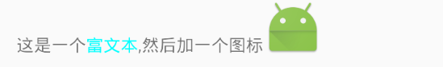

## 添加Link

将文本中的一些电话号码等设置为链接。对这个的设置叶有两种方式：


一种是在layout中的xml文件中进行添加：支持的连接有电话号码、Email、URL、map或者全部

```
           <TextView
                android:id="@+id/textView"
                android:layout_width="wrap_content"
                android:layout_height="wrap_content"
                android:text="TextView:13314121514"
                android:autoLink="phone"/>
```

另一种是在中添加代码。

```
            //设置连接方式，文字必须在其后面。
            textView.setAutoLinkMask(Linkify.ALL);
            textView.setText("TextView:13314121514")
```


## 添加富文本

QQ聊天经常发表情，这也是一种富文本。富文本，可以支持一部分的HTML，也可以动态添加的一些图片。

```
      TextView textView = (TextView) getView().findViewById(R.id.text_fu);
            Spanned spanned = Html.fromHtml("这是一个<font color='#00ffff'>富文本</font>,然后加一个图标",
                    new Html.ImageGetter() {
                        @Override
                        public Drawable getDrawable(String s) {
                            //方法二，直接通过R.mipmap.a_merchant_06_click，得到图片。
                            Drawable drawable = getResources().getDrawable(R.mipmap.ic_launcher);
                            drawable.setBounds(0,0,drawable.getIntrinsicWidth(),drawable.getIntrinsicHeight());
                            return drawable;
                        }
                    },null);
```

效果：



## 使用Paint标志位

用TextView设计Paint的一个画笔标识，可以方便的实现一些文字的显示效果，如删除线：

```
    textView.setPaintFlags(Paint.STRIKE_THRU_TEXT_FLAG);
```

## setMaxLines后，如何获取Text完全实现的高度

```
    获取TextView的完整高度，核心代码
    
    private int getTextViewHeight(TextView pTextView) {
        Layout layout = pTextView.getLayout();
        int desired = layout.getLineTop(pTextView.getLineCount());
        int padding = pTextView.getCompoundPaddingTop() + pTextView.getCompoundPaddingBottom();
        return desired + padding;
    }
```

## 对TextView的排版有特殊要求时，可以使用TextView的Layout

```
    //在TextView中
     Layout layout = getLayout();//获取Layout对象
     mLineCount = layout.getLineCount();//获取一共有多少行
     mLineEnd = layout.getLineEnd(mShowTextCount - 1);//获取第几行最后一个字符在TextView所有现实的String中的位置。
```


## 去掉文字 padding

TextView默认上下是有一定的padding的，有时候我们可能不需要上下这部分留白，加上它即可

```
includeFontPadding=”false”
```


## 文本可点击

```
        Spannable span = Spannable.Factory.getInstance().newSpannable(source);
        ClickableSpan clickableSpan = new ClickableSpan() {
            @Override
            public void onClick(View v) {
                onClickListener.onClick(v);
            }
        };
        int[] positions = getStart(source);
        span.setSpan(clickableSpan, positions[0], positions[1], Spanned.SPAN_INCLUSIVE_INCLUSIVE);
        textView.setText(span);
        textView.setMovementMethod(LinkMovementMethod.getInstance());
```
