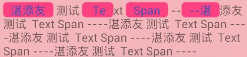

# Android中各种Span的用法

在`android.text.style`包下的一些Span类，可以**提供我们完成一些在TextView中的特殊内容**。比如：部分内容颜色、字体、大小不同等等，更有部分字体可点击。**还有一个SpannableStringBuilder，可以帮助我们设置Span**。

---
## SpannableStringBuilder

SpannableStringBuilder 类用于组合各种 Span：

```
SpannableStringBuilder.setSpan(Object what, int start, int end, int flags)
```
Flag:

*   Spanned.SPAN_EXCLUSIVE_EXCLUSIVE —— **(a,b)**
*   Spanned.SPAN_EXCLUSIVE_INCLUSIVE —— **(a,b]**
*   Spanned.SPAN_INCLUSIVE_EXCLUSIVE —— **[a,b)**
*   Spanned.SPAN_INCLUSIVE_INCLUSIVE —— **[a,b]**

EXCLUSIVE表示不包含，INCLUSIVE表示包含

---
## Span类

Span类非常多，可以显示不同的文本效果：

- URLSpan ：点击文字，可以打开一个URL。
- UnderlineSpan：添加下划线
- TypefaceSpan：改变文字字体
- TextAppearanceSpan：设置文字字体、文字样式（粗体、斜体、等等）、文字颜色状态、文字下划线颜色状态等等。
- TabStopSpan：每行的MarginLeft的偏移量（跟 \t 和 \n 有关系）。可以让文字换行
- SuperscriptSpan：文字设置为上标，数学公式中用到。
- SubscriptSpan：文字设置为下标，数学公式中用到。
- StrikethroughSpan：文字设置删除线。
- ScaleXSpan：文字横向缩放。
- StyleSpan：文字设置样式（正常、粗体、斜体、粗斜体）。
- RelativeSizeSpan：设置文字相对大小，指相对于文本设定的大小的相对比例。
- QuoteSpan：设置文字左侧显示引用样式（一条竖线）。
- MaskFilterSpan：设置文字模糊效果和浮雕效果。（关闭硬件加速）
- LeadingMarginSpan：设置文本缩进。
- ImageSpan：文本插入图片。（根据图片大小调整控件大小）
- IconMarginSpan：文本插入图片+Margin。（不根据图片大小调整控件大小，不缩放图片）
- ForegroundColorSpan：设置文字颜色。
- DrawableMarginSpan：文本插入图片+Margin。（不根据图片大小调整控件大小，缩放图片）
- BulletSpan：类似于HTML中的`<li>`标签的圆点效果。
- BackgroundColorSpan：设置背景色。
- AlignmentSpan：设置文字对齐方式。
- AbsoluteSizeSpan：设置文字绝对大小。
- ClickableSpan：文字可点击。

---
## 扩展： 圆角的BackGroundSpan

```java
    public class RoundedBackgroundSpan extends ReplacementSpan {
        private int mPadding = 0;
        private int mBackgroundColor;
        private int mTextColor;
    
        public RoundedBackgroundSpan(int backgroundColor, int textColor, int padding) {
            super();
            mBackgroundColor = backgroundColor;
            mTextColor = textColor;
            mPadding = padding;
        }
    
        @Override
        public int getSize(Paint paint, CharSequence text, int start, int end, Paint.FontMetricsInt fm) {
            return (int) (mPadding + paint.measureText(text.subSequence(start, end).toString()) + mPadding);
        }
    
        @Override
        public void draw(Canvas canvas, CharSequence text, int start, int end, float x, int top, int y, int bottom, Paint paint) {
            float width = paint.measureText(text.subSequence(start, end).toString());
            Log.d("RoundedBackgroundSpan", String.format("start %d , end %d , x %f ,y %d , top  %d , bottom %d, ", start, end, x, y, top, bottom));
            RectF rect = new RectF(x, top, x + width + (2 * mPadding), bottom);
            paint.setColor(mBackgroundColor);
            canvas.drawRoundRect(rect, 10, 10, paint);
            paint.setColor(mTextColor);
            canvas.drawText(text, start, end, x + mPadding, y, paint);
        }
    }
```

效果图：




---
## 引用

- [Android中各种Span的用法](http://blog.csdn.net/qq_16430735/article/details/50427978)
- [使用 Span 来修改文本样式的优质体验](https://github.com/xitu/gold-miner/blob/master/TODO1/spantastic-text-styling-with-spans.md)
- GoogleSample [android-text](https://github.com/googlesamples/android-text)
