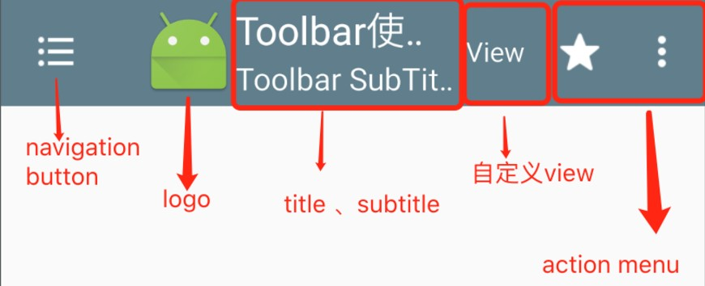

# Toolbar

Toolbar的官方文档描述是：A standard toolbar for use within application content.翻译过来就是：在应用程序中使用的标准工具栏。

Toolbar继承自ViewGroup，主要包含以下内容：



---
## 1  Toolbar使用

### Toolbar常用的属性

```
    toolbar:navigationIcon 设置navigation button
    toolbar:logo 设置logo 图标
    toolbar:title 设置标题
    toolbar:titleTextColor 设置标题文字颜色
    toolbar:subtitle 设置副标题
    toolbar:subtitleTextColor 设置副标题文字颜色
    toolbar:popupTheme 引用一个theme属性，用于在Toolbar上显示的一个Popup组件，即overflow menu
    toolbar:titleTextAppearance 设置title text 相关属性，如：字体,颜色，大小等等
    toolbar:subtitleTextAppearance 设置subtitle text 相关属性，如：字体,颜色，大小等等
    toolbar:logoDescription logo 描述
    android:background Toolbar 背景
    android:theme 主题
```

设置属性的方法：

```java
    //设置NavigationIcon
    setNavigationIcon();
    // 设置navigation button 点击事件
    setNavigationOnClickListener();
    // 设置 toolbar 背景色
    setBackgroundColor();
    // 设置 Title
    setTitle();
    //  设置Toolbar title文字颜色
    setTitleTextColor();
    // 设置Toolbar subTitle
    setSubtitle();
    setSubtitleTextColor();
    // 设置logo
    setLogo();
    //设置 NavigationIcon 点击事件
    setNavigationOnClickListener()
    // 设置溢出菜单的图标
    setOverflowIcon();
    // 设置menu item 点击事件
    setOnMenuItemClickListener()
    //填充菜单
    inflateMenu()
```

在Activity中使用Toolbar，那么Activity应该继承AppCompatActivity，并且使用Compat的Style，比如`
Theme.AppCompat.Light.NoActionBar`

在xml中定义toolbar

```xml
    <android.support.v7.widget.Toolbar
        xmlns:android="http://schemas.android.com/apk/res/android"
        xmlns:app="http://schemas.android.com/apk/res-auto"
        android:layout_width="match_parent"
        android:layout_height="match_parent"
        //设置弹出菜单的样式
        app:popupTheme="@style/ThemeOverlay.AppCompat.Dark"
       //设置Toolbar的样式
       app:theme="@style/ThemeOverlay.AppCompat.ActionBar"/>
```

### 风格样式

```xml
    <style name="App_Theme_Toolbar" parent="Theme.AppCompat.Light">
            <!-- 更换Toolbar OVerFlow menu icon -->
          <item name="actionOverflowButtonStyle">@style/OverFlowIcon</item>
            <!-- 设置 toolbar 溢出菜单的文字的颜色 -->
          <item name="android:textColor">@android:color/holo_red_dark</item>
            <!-- 设置 显示在toobar上菜单文字的颜色 -->
          <item name="actionMenuTextColor">@android:color/white</item>
            <!-- 设置toolbar 弹出菜单的字体大小和溢出菜单文字大小-->
          <item name="android:textSize">15sp</item>
        </style>
    
        <style name="OverFlowIcon" parent="Widget.AppCompat.ActionButton.Overflow">
            <item name="android:src">@drawable/abc_ic_menu_moreoverflow_mtrl_alpha</item>
        </style>
```

---
### popupTheme

这个属性就是用来自定义我们弹出的菜单的样式，比如

```xml
        //弹出的是黑底白色
        <style name="AppTheme.AppBarOverlay" parent="ThemeOverlay.AppCompat.Dark"/>
        //弹出的是白底黑字
        <style name="AppTheme.PopupOverlay" parent="ThemeOverlay.AppCompat.Light"/>
```

---
## 引用

- [MaterialDesign之 oolbar开发实践总结](http://www.jianshu.com/p/e2ae6aaff696)
- [Material适配2 - 高级篇](http://www.cnblogs.com/ct2011/p/4493439.html)
- [When should one use Theme.AppCompat vs ThemeOverlay.AppCompat?](https://stackoverflow.com/questions/27238433/when-should-one-use-theme-appcompat-vs-themeoverlay-appcompat)