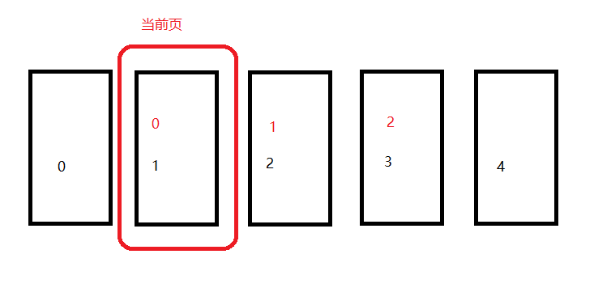

# ViewPager无限轮播

---
## 1 ViewPager的监听器介绍

ViewPager的使用非常多，主要用于实现可以左右滑动切换内容的界面，当需要知道ViewPager滑动到第几页时，我们可以给ViewPager添加OnPageChangeListener。
```
    public interface OnPageChangeListener {
            public void onPageScrolled(int position, float positionOffset, int positionOffsetPixels);
            public void onPageSelected(int position);
            public void onPageScrollStateChanged(int state);
        }
```

### onPageSelected

一般使用到的是`onPageSelected`方法，它的参数position就表示ViewPager当前的页数，但是这不是最吊的一个方法，最吊的是`onPageScrolled`这个方法：

### onPageScrolled

onPageScrolled方法有三个参数：

- int position ：表示当前滑动到了第几页，与onPageSelected的position一样，只是调用时机不一样
- float positionOffset：positionOffset表示当前滑动偏移的百分比，取值范围是(0.0F,1.0F)
- int positionOffsetPixels：表示当前滑动时具体的偏移量，数值与ViewPager的宽度有关

positionOffset：是一个随着滑动动态变化的百分比数值，使用这个数值可以做出很多有意思的效果，比如PagerTransform就可以使用这个positionOffset来实现的。但是positionOffset还有其他用途，比如实现ViewPager的无限轮播。

### onPageScrollStateChanged

onPageScrollStateChanged是ViewPager的状态变化回调，有三种状态

- ViewPager.SCROLL_STATE_IDLE: 空闲状态，没有任何滚动正在进行（表明完成滚动
- ViewPager.SCROLL_STATE_DRAGGING:正在拖动page状态
- ViewPager.SCROLL_STATE_SETTLING:手指已离开屏幕，自动完成剩余的动画效果

---
## 2 使用ViewPager的OnPageChangeListener实现无限轮播

### 老的方式

之前老项目实现ViewPager实现无限轮播的方式是在ViewPager的PagerAdapter的getSize方法中返回Integer.MAX_VALUE,多少感觉这种方式有点不优雅。

### 新的方式onPageScrolled

刚刚说到`onPageScrolled`方法的 positionOffset 表示当前滑动偏移的百分比，取值范围是(0.0F,1.0F)，但是有一点需要注意，当ViewPager已经滑动到某一页时positionOffset的值为0，看下面数据：
```
    Page 0
     [0], positionOffset = [0.0], positionOffsetPixels = [0]

    //在拖动的过程中positionOffset从0到1变化，
    Page 0 -> 1 positionOffset:(0-1)

     position = [0], positionOffset = [0.962037], positionOffsetPixels = [1039]
     position = [0], positionOffset = [0.9685185], positionOffsetPixels = [1046]
     position = [0], positionOffset = [0.97314817], positionOffsetPixels = [1051]
     position = [0], positionOffset = [0.9787037], positionOffsetPixels = [1057]
     position = [0], positionOffset = [0.98333335], positionOffsetPixels = [1062]

    //已经滑动到page 1，则positionOffset=0
    Page 1
    position = [1], positionOffset = [0.0], positionOffsetPixels = [0]

    Page 1 -> 0     当在拖动的过程中positionOffset从1到0变化，
     position = [0], positionOffset = [0.017592609], positionOffsetPixels = [19]
     position = [0], positionOffset = [0.012962937], positionOffsetPixels = [13]
     position = [0], positionOffset = [0.010185182], positionOffsetPixels = [10]
     position = [0], positionOffset = [0.007407427], positionOffsetPixels = [8]
     position = [0], positionOffset = [0.00555557], positionOffsetPixels = [6]
     position = [0], positionOffset = [0.0037037134], positionOffsetPixels = [4]
     position = [0], positionOffset = [0.0027777553], positionOffsetPixels = [2]
     position = [0], positionOffset = [0.0018518567], positionOffsetPixels = [2]
     position = [0], positionOffset = [9.2589855E-4], positionOffsetPixels = [0]
```

现在来构思一下如何实现ViewPage的无效轮播：

比如我们的ViewPager需要展示3个页面，如下面红色字体标识的0，1，2，这是我们希望展示给用户看到，但是要实现无限轮播的话就需要滑动到红色的0页时还可以继续往右边滑动，而且希望看到的是红色的2页，而当Viewpager滑动到红色的第2页是还可以往左边滑动，而且希望看到的是红色第0页，按照这个思路我们偷偷的给ViewPager再加上两页，就变成了下面黑色字体表示的5页了，分别是0-4，而黑色的第0页显示的是红色的第2页，黑色的第4页实现的是红色的第0页，这样第一步就实现了，接下来就是如何实现当滑动到黑色的第0页是还可以继续往右边滑动，解决的方案就是：既然黑色的第0页和黑色的第3也显示的内容是一样的，那就通过`onPageScrolled`方法监听ViewPager的滑动,当ViewPager滑动到黑色的第0页时，立即调用ViewPager的setCurrentItem方法把当前页数设置到黑色的第3页，如果不加上滑动动画的话就可以让用户察觉不到。而`setCurrentItem(position, false)`就可以实现，至此此问题就解决了。




实现步骤为：

1. 当给ViewPager设置数据时，偷偷的在头和尾分别加上一页。
2. 给ViewPager设置OnPageChangeListener，`onPageScrolled`方法中动态的改变ViewPager的currentItem。

具体实现如下：

`entities.size()`表示ViewPager中显示的数据列表。

```java
public void onPageScrolled(int position, float positionOffset, int positionOffsetPixels) {

                    if (positionOffsetPixels == 0.0F) {//表示此时没有发生滑动
                        if (position == entities.size() - 1) {//最后一页，显示的是Extra的0也
                            viewPager.setCurrentItem(1, false);//此时设置setCurrentItem=1即也是现实的第0页
                        } else if (position == 0) {//真实的第0页，显示的是最后一页，
                            viewPager.setCurrentItem(entities.size() - 2, false);//此时设置到显示.size() - 2，效果也是一样的
                        } else {
                            viewPager.setCurrentItem(position);
                        }
                    }
}
```


### 最终方案onPageScrollStateChanged

使用onPageScrolled确实可以达到无限轮播的效果，但是还有一个问题，就是在滑动到最后一页或第一页时ViewPager会出现闪动，原因是onPageScrolled的调用时机，onPageScrolled调用时ViewPager的Page切换动画可能还没有执行完毕，此时立即调用setCurrentItem的话，就造成页面切换不能无缝衔接，具体参考[Android寻坑之路】ViewPager实现无限轮播切换页面出现闪屏(白屏)问题](https://www.jianshu.com/p/99b9e4b53dc0)，所以最终的解决方案是onPageScrollStateChanged方法，当ViewPager处于ViewPager.SCROLL_STATE_IDLE状态时，表示ViewPager没有任何滚动正在进行，即已经完成滚动。


```java
    public void onPageScrollStateChanged(int state) {
         super.onPageScrollStateChanged(state);
         //(positionOffset为0的时候，并不一定是切换完成，所以动画还在执行，强制再次切换，就会闪屏)
         switch (state) {
               case ViewPager.SCROLL_STATE_IDLE:// 空闲状态，没有任何滚动正在进行（表明完成滚动）
               //在此处调整ViewPager的位置
                   setViewPagerItemPosition(mViewPager.getCurrentItem());
                   break;
               case ViewPager.SCROLL_STATE_DRAGGING:// 正在拖动page状态
                   break;
               case ViewPager.SCROLL_STATE_SETTLING:// 手指已离开屏幕，自动完成剩余的动画效果
                   break;
         }
    }
```