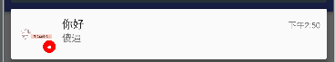
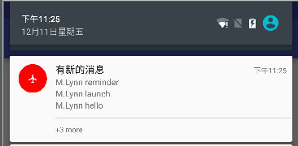

# Notification介绍

Notification通知，是一种让你的应用程序在不使用Activity的情况下警示用户方式。**它是看不见的程序组件(Broadcast Receiver，Service和不活跃的Activity)警示用户有需要注意的事件发生的最好途径**。 Notification 是由NotificationManager(系统服务)统一管理的。

**Notification包括以下功能**:

- 显示状态栏图标
- 灯光/LED闪烁
- 让手机振动
- 发出声音
- 在通知托盘显示其他额外的信息
- 在通知托盘使用交互式操作来操作广播


**Notification 对象必须包含以下内容：**

- 小图标，由 setSmallIcon() 设置
- 标题，由 setContentTitle() 设置
- 详细文本，由 setContentText() 设置

---
## 1 Notification视觉元素介绍

一个通知就是一条消息，显示在你的应用程序之外的界面（通知栏）。当你告知系统需要发布一个通知时，它首先作为一个icon出现在状态栏区域。为了进一步了解它的细节，用户可以下拉状态栏展开至通知栏查看。

 通知有两种可视化样式，取决于版本和drawer的状态：
 
 - 标准视图：在通知drawer中显示标准视图的通知。
 - 大型视图：当通知被展开时可以看到的一个大型视图。该视图也是扩展通知的一部分，该特征引入于4.1Jerry Bean。


#### 正常视图元素介绍

 一个出现在标准视图中的通知，其高度是64dp。即使你使用大型视图创建一个通知，它仍然出现在标准视图中直至被展开。下面是一个正常视图的范例：
 
 
 1. 内容标题，
 2. 大型图标，
 3. 内容文本，
 4. 内容附加，
 5. 小型图标，
 6. 发布时间，可以使用 setWhen() 方法设置一个明确值。

#### 大型视图(4.1后支持)

 大型视图只有当通知被展开时才能出现，并且该通知必须位于通知drawer的顶部。用户可以借助手势（双指水平滑动或垂直滑动）展开或合拢它。可扩展的通知这一特征引入于4.1Jerry Bean。下面是一个收件箱样式的通知范例：

 


大型视图的视觉元素与正常视图共享。不同之处在于“7”：通知细节区域。对于此区域的显示内容，各种大型视图通知有着不同的设置：

- Big picture style：细节区域展现一个高度为256dp的bitmap。
- Big text style：细节区域显示一个大型文本块。
- Inbox style：细节区域包含文本行数。

**另外，如下的两个通知视觉元素仅支持大型视图，所以采用标准视图的没有效果**

 - Big content title：允许你添加一个标题去覆盖正常视图的内容标题，但它只能出现在可扩展的视图中。
 - Summary text：允许你在细节区域底端添加一行文本。


---
## 2 如何使用Notification

Notification的api在不同的系统版本变化较大,为了解决Android系统版本差异导致的Notification兼容性问题，Android官方在4.1版本后提供了`NotificationCompat`兼容类来帮助开发实现体验统一的Notification,这一段主要介绍如何使用`NotificationCompat`。


### 2.1 简单的使用方法

```java
            Intent intent = new Intent(this, SecondActivity.class);
            PendingIntent pendingIntent = PendingIntent.getActivity(this, 100,intent, PendingIntent.FLAG_UPDATE_CURRENT);
    
    
            NotificationCompat.Builder builder = new NotificationCompat.Builder(this);
            builder.setSmallIcon(R.mipmap.ic_launcher)//小图
                    .setContentTitle("有新的消息")//标题
                    .setContentText("没有呢，骗你的")//内容
                    //可选元素
                    .setLargeIcon(BitmapFactory.decodeResource(getResources(), R.mipmap.ic_message))//大图
                    .setWhen(System.currentTimeMillis())//时间
                    .setAutoCancel(true)//点击后自动取消
                    .setContentIntent(pendingIntent)//点击后执行的意图
                    .setTicker("你妈妈叫你回家吃饭------------")//
                    .setDefaults(Notification.DEFAULT_SOUND | Notification.DEFAULT_VIBRATE | Notification.DEFAULT_LIGHTS)//设置标识 默认声音/振动/
                    .setSound(RingtoneManager.getDefaultUri(RingtoneManager.TYPE_NOTIFICATION))//设置声音，如果需要自定义声音，需要将资源文件复制到存储中
                    .setColor(Color.RED)//小图颜色 6.0
                    .setNumber(32)//number和附加信息貌似只会显示一个
                    .setContentInfo("附加信息")//附加信息
                    //.setOnlyAlertOnce(true) 同一个通知 播放首次声音和振动
                    .setProgress(100, 20, false);//设置进度 分别为最大进度/实际进度/是否使用动画，如果最后参数为true，签名两个参数无效，最需需要设置setProgress(0,0,false)再取消通知，否则通知取消不了
    
            NotificationManagerCompat.from(this).notify(ID_1, builder.build());//分别为 通知的id ， 和通知
```

上面代码可以显示一个简单的Notification如下：

 

上面Notification设置了通知的基本元素，接下来详细讲解：

- 添加时间：setWhen
- 添加flags：setDefaults，可以设置如下效果（具体参考官方文档）
    - 声音
    - 振动
    - 闪烁灯
- 通知的数量：setNumber
- 点击后自动消失：setAutoCancel
- 设置小图表背景色：setColor（5.0支持）
- 设置进度：setProgress,支持在 Android 4.0 及更高版本的平台上使用进度指示器

### 2.2 配置持续的和连续的Notification

设置连续的通知
```
    .setOngoing(true)//连续的通知，一直持续振动，播放音乐，和闪烁，直到用户处理
```
设置持续的通知：
```
    Notification.FLAG_INSISTENT 表示那些正在进行的事件(下载，播放音乐，前台的Service必须要有持续的通知)
```

### 2.3 其他特性（Api21）

- 浮动通知：setFullScreenIntent
- 锁定屏幕通知:
- 在锁定屏幕上控制媒体播放

如下图：

 


### 2.4 Api4.1后的Style的通知

#### 大型文本通知样式：

```java
      .setStyle(new NotificationCompat.InboxStyle() // 设置通知样式为收件箱样式
                            .addLine("M.Lynn reminder")
                            .addLine("M.Lynn launch")
                            .addLine("M.Lynn hello")
                            .setSummaryText("+3 more")// 设置在细节区域底端添加一行文本
```

 

#### 大图样式

```java
    new NotificationCompat.BigPictureStyle() // 设置通知样式为大型图片样式
                        .bigPicture(BitmapFactory.decodeResource(getResources(), R.drawable.fantasy)))
```

 


### 2.5 启动 Activity 时保留导航

##### 常规 Activity

>您要启动的 Activity 是应用的正常工作流的一部分。在这种情况下，请设置 PendingIntent 以启动全新任务并为 PendingIntent提供返回栈，这将重现应用的正常“返回”行为。

意思是你希望一个通知打开的一个Activity后，点击返回，不是直接退出到桌面，而是模拟一个任务栈，返回他的上一个界面，这是可以用TaskStackBuilder来构建一个任务栈。

首先我们应该构建给Activity设置parentActivity

```xml
    <activity
        android:name=".MainActivity"
        android:label="@string/app_name" >
        <intent-filter>
            <action android:name="android.intent.action.MAIN" />
            <category android:name="android.intent.category.LAUNCHER" />
        </intent-filter>
    </activity>
    <activity
        android:name=".ResultActivity"
        android:parentActivityName=".MainActivity">
        <meta-data
            android:name="android.support.PARENT_ACTIVITY"
            android:value=".MainActivity"/>
    </activity>
```

使用TaskStackBuilder来构建PendingIntent

```java
            TaskStackBuilder stackBuilder = TaskStackBuilder.create(this);
            stackBuilder.addParentStack(SecondActivity.class);
            stackBuilder.addNextIntent(intent);//可以反复叠加
            PendingIntent resultPendingIntent = stackBuilder.getPendingIntent(0, PendingIntent.FLAG_UPDATE_CURRENT);
            //stackBuilder.editIntentAt(1).putExtra() 添加数据
```

#####  特殊 Activity

>仅当从通知中启动时，用户才会看到此 Activity。 从某种意义上说，Activity 是通过提供很难显示在通知本身中的信息来扩展通知。对于这种情况，请将 PendingIntent 设置为在全新任务中启动。但是，由于启动的 Activity 不是应用 Activity 流程的一部分，因此无需创建返回栈。点击“返回”仍会将用户带到主屏幕。

如，可以设置如下属性：

```
    android:launchMode="singleTask"
    taskAffinity:设置新的任务栈，在新的任务栈启动该Activity
    android:excludeFromRecents="true"退出后不在历史任务栈中保留该任务栈
```

### 2.6 自定义View

使用RemoveViews，比较简单，构建一个RemoteViews，然后调用setContent即可，RemoveViews后面会深入学习。

### 2.7 进度通知

参考官方demo

```java
    mNotifyManager =
            (NotificationManager) getSystemService(Context.NOTIFICATION_SERVICE);
    mBuilder = new NotificationCompat.Builder(this);
    mBuilder.setContentTitle("Picture Download")
        .setContentText("Download in progress")
        .setSmallIcon(R.drawable.ic_notification);
    // Start a lengthy operation in a background thread
    new Thread(
        new Runnable() {
            @Override
            public void run() {
                int incr;
                // Do the "lengthy" operation 20 times
                for (incr = 0; incr <= 100; incr+=5) {
                        // Sets the progress indicator to a max value, the
                        // current completion percentage, and "determinate"
                        // state
                        mBuilder.setProgress(100, incr, false);
                        // Displays the progress bar for the first time.
                        mNotifyManager.notify(0, mBuilder.build());
                            // Sleeps the thread, simulating an operation
                            // that takes time
                            try {
                                // Sleep for 5 seconds
                                Thread.sleep(5*1000);
                            } catch (InterruptedException e) {
                                Log.d(TAG, "sleep failure");
                            }
                }
                // When the loop is finished, updates the notification
                mBuilder.setContentText("Download complete")
                // Removes the progress bar
                        .setProgress(0,0,false);
                mNotifyManager.notify(ID, mBuilder.build());
            }
        }
    // Starts the thread by calling the run() method in its Runnable
    ).start();
```


#### 2.8 和Service一起使用

配合Service可以构建一个前台进程服务，此服务需要一个Notification，并且这个Notification不能被移除。如何第一个参数为0,Notification不会显示

```java
      startForeground(1, mNotification);
```


#### 2.9 取消通知

所有的通知都由NotificationManager管理，可以通过NotificationManager来取消对于的通知

---
## 3 Notification开发方式在各个版本中的区别

Notification的api在不同的系统版本变化较大，下面根据不同版本简单介绍Notification的使用，具体版本差异具体参考此[博客](http://blog.csdn.net/wwzqj/article/details/44098587)

### 低于API Level 11版本中(即Android 2.3.3之前的系统)

```java
    Notification notification = new Notification();//创建一个Notification
         notification.icon = R.drawable.ic_launcher;//图标
         notification.tickerText = "hello world";
         notification.when = SystemClock.currentThreadTimeMillis();//时间
         notification.flags = Notification.FLAG_AUTO_CANCEL;//Notification行为标识
         //添加 声音和振动(需要权限)
         notification.defaults |= (Notification.DEFAULT_SOUND | Notification.DEFAULT_VIBRATE);  
         Intent intent = new Intent(this, SecondActivity.class);
         PendingIntent pendingIntent = PendingIntent.getActivity(this, 0, intent, PendingIntent.FLAG_UPDATE_CURRENT);
         //设置pendingIntent，否则保存
         notification.setLatestEventInfo(this , "ddd","cecece" , pendingIntent);
         NotificationManager notificationManager = (NotificationManager) getSystemService(NOTIFICATION_SERVICE);
         notificationManager.notify(1, notification);
```
在这个版本中setLatestEventInfo是唯一的实现方法，在构造notification的时候有很多种写法，但是要注意，用Notification notification = new Notification();这种构建方法的时候，一定要加上notification.icon这个设置，不然，程序虽不会报错，但是会没有效果。


### 高于API Level 11，低于API Level 16 (Android 4.1.2)

Android在API级别 11中添加了Notification.Builder，高于API Level 11，低于API Level 16 (Android 4.1.2)版本的系统中，可使用Notification.Builder来构造函数。但要使用**getNotification()**来使notification实现。此时，前面版本在notification中设置的**Flags，icon等属性都已经无效**，要在builder里面设置。

```java
            Intent intent = new Intent(this, SecondActivity.class);
            PendingIntent pendingIntent = PendingIntent.getActivity(this, 0, intent, PendingIntent.FLAG_UPDATE_CURRENT);
            Notification.Builder builder = new Notification.Builder(this)
                    .setAutoCancel(true)
                    .setSmallIcon(R.mipmap.ic_launcher)
                    .setContentIntent(pendingIntent)
                    .setContentTitle("haha")
                    .setContentText("你大爷");
            NotificationManager notificationManager = (NotificationManager) getSystemService(NOTIFICATION_SERVICE);
            notificationManager.notify(1, builder.getNotification());
```


### 高于API Level 16的版本

高于API Level 16的版本，就可以用Builder和build()函数使用notification了。

```java
     Notification notification = new Notification.Builder(context)    
             .setAutoCancel(true)    
             .setContentTitle("title")    
             .setContentText("describe")    
             .setContentIntent(pendingIntent)    
             .setSmallIcon(R.drawable.ic_launcher)    
             .setWhen(System.currentTimeMillis())    
             .build();
```

---
## 引用

- [官方文档地址](http://developer.android.com/intl/zh-cn/guide/topics/ui/notifiers/notifications.html)
- [Android倚天剑之Notification之江南style](http://www.cnblogs.com/dyllove98/archive/2013/06/08/3127580.html)
- [Android自定义Notification并没有那么简单](http://sixwolf.net/blog/2016/04/18/Android%E8%87%AA%E5%AE%9A%E4%B9%89Notification%E5%B9%B6%E6%B2%A1%E6%9C%89%E9%82%A3%E4%B9%88%E7%AE%80%E5%8D%95/)
- [Android Notification常见样式总结](http://blog.csdn.net/w804518214/article/details/51231946)
- [Android通知栏微技巧，那些你所没关注过的小细节](http://blog.csdn.net/guolin_blog/article/details/50945228)


