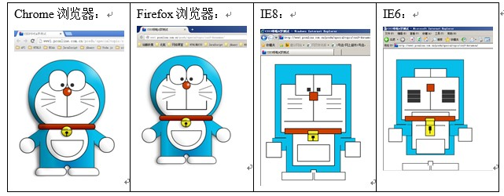

# CSS 基础与选择器

现在的互联网前端三层：

- `HTML`    超文本标记语言    从语义的角度描述页面结构。
- `CSS`        层叠式样式表    从审美的角度负责页面样式。
- `JS`        JavaScript        从交互的角度描述页面行为。

**css**就是`cascading style sheet(层叠式样式表)`的简写。css的最新版本是`css3`我们写css的地方是style标签，就是“样式”的意思，写在head里面。当然css也可以写在单独的文件里面。


------------
## 1 常见的属性

### 1.1 字符颜色

```
    color:red;

    color属性的值，可以是英语单词，比如red、blue、yellow等等；也可以是rgb、十六进制。
    color就是前景色
```

### 1.2 字号大小

```
    font-size:40px;

    font就是“字体”，size就是“尺寸”。px是“像素”。
    单位必须加，不加不行。
```

### 1.3 背景颜色

```
    background-color: blue;
    background就是“背景”。
```

### 1.4 字体样式

```
    //加粗
    font-weight: bold;
    font是“字体” weight是“重量”的意思，bold粗。

    不加粗：
    font-weight: normal;
    normal就是正常的意思 

    斜体：
    font-style: italic;
    italic就是“斜体”

    不斜体：
    font-style: normal; 

    下划线：
    text-decoration: underline;
    decoration就是“装饰”的意思。 

    没有下划线：
    text-decoration:none;
```

css的样式不需要死记，需要的时候查文档即可

------------
## 2 基础选择器

css怎么学？很简单，有两个知识部分：

- 选择器，怎么选
- 属性，样式是什么

### 2.1 标签选择器：`标签名`

1. 标签选择器就是标签的名字
2. 所有的标签，都可以是选择器。比如`ul、li、label、dt、dl、input`
3. 标签选择器，选择的是页面上所有这种类型的标签，所以经常描述“共性”，无法描述某一个元素的“个性”的

```
    <style type="text/css">
        span {
            color:red;
        }
    </style>
```

### 2.2 id选择器：`#`

html
```
    <p>我是段落1</p>
    <p id="para2">我是段落2</p>
    <p>我是段落3</p>
```
css：
```
    <style type="text/css">
        #para2{
            color:red;
        }
    </style>
```
1. id选择器的选择符是“#”。
2. 任何的HTML标签都可以有id属性。表示这个标签的名字。
3. 这个标签的名字，可以任取，但是：
 - 只能有字母、数字、下划线
 - 必须以字母开头
 - 不能和标签同名。比如id不能叫做`body、img、a`
 - 大小写严格区别，也就是说mm和MM是两个不同的id。

**一个HTML页面，不能出现相同的id，哪怕他们不是一个类型。比如页面上有一个id为pp的p，一个id为pp的div，是非法的！**


###  2.3 类选择器：`.`

点号——**`.`**就是类选择器的符号。类的英语叫做class。所谓的类，就是class属性，class属性和id非常相似，**任何的标签都可以携带class属性。**

- class属性可以重复
- 同一个标签，可能同时属于多个类，用空格隔开

**类的使用，能够决定一个人的css水平。**:

- 不要去试图用一个类名，把某个标签的所有样式写完。这个标签要多携带几个类，共同造成这个标签的样式。
- 每一个类要尽可能小，有“公共”的概念，能够让更多的标签使用。

**到底用id还是用class？**:尽可能的用class，除非极特殊的情况可以用id。因为id是js用的。也就是说，js要通过id属性得到标签，所以我们css层面尽量不用id，要不然js就很别扭。另一层面，我们会认为一个有id的元素，有动态效果。


<font color="red">**一个标签，可以同时被多种选择器选择，标签选择器、id选择器、类选择器。这些选择器都可以选择上同一个标签，从而影响样式，这就是css的cascading“层叠式”的第一层含义。**</font>

------------
## 3  css高级选择器

### 3.1  后代选择器：`空格`

**空格**就表示后代，`.div1 p `就是`.div1`的后代所有的`p`,注意**选择的是后代，不一定是儿子。**，空格可以多次出现。

后代选择器，就是一种平衡：**共性、特性的平衡**。当要把某一个部分的所有的xx进行样式改变，就要想到后代选择器。**后代选择器，描述的是祖先结构。**


### 3.2 交集选择器：`s1.s2.s3`

```
    h3.special{
      color:red;3
    }
```
上面css选择的元素是同时满足两个条件：1，必须是h3标签；2，必须是special标签。

交集选择器可以连续交（一般不要这么写）
```
    h3.special.zhongyao{
       color:red;3
    }
```
交集选择器，我们一般都是以标签名开头，比如`div.haha ` 比如`p.special。`


### 3.3 并集选择器：`,`

也叫分组选择器，用逗号就表示并集：
```
    h3,li{
       color:red;3
    }
```

### 3.4 通配符：`*`

`*`就表示所有元素。但是效率不高，如果页面上的标签越多，效率越低，**所以页面上不能出现这个选择器。**

------------
## 4 一些CSS3选择器

### 4.1 兼容问题介绍

**IE**： 微软的浏览器，随着操作系统安装的。所以每个windows都有IE浏览器。

    windows xp    操作系统安装的IE6
    windows vista 操作系统安装的IE7
    windows 7     操作系统安装的IE8
    windows 8     操作系统安装的IE9
    windows10     操作系统安装的edge

浏览器兼容问题，要出，就基本上就是出在IE6、7身上，这两个浏览器是非常低级的浏览器。

使用不同的浏览器打开下面链接：http://www1.pconline.com.cn/pcedu/specialtopic/css3-doraemon/



浏览器的市场占有率： http://tongji.baidu.com/data/

    IE9 5.94%
    IE8 21.19%
    IE7 4.79%
    IE6 4.11%

**HTML5浏览器打分：**

http://html5test.com/results/desktop.html：


**项目一般兼容到IE8，但是典型的IE6兼容问题需要知道**


### 4.2 儿子选择器：`>`

IE7开始兼容，IE6不兼容。
```
    div>p{
     color:red;3
    }
```
div的儿子p。和div的后代p的截然不同。

### 4.3  序选择器：`x:first-child、x:last-child`

IE8开始兼容；IE6、7都不兼容

选择第1个li：
```
    <style type="text/css">
        ul li:first-child{
            color:red;
        }
    </style>
```
选择最后一个1i：
```
    ul li:last-child{
        color:blue;
    }
```
但是由于浏览器的更新需要过程，所以现在如果公司还要求兼容IE6、7，那么就要自己写类名：

```css
<ul>
    <li class="first">项目</li>
    <li>项目</li>
    <li>项目</li>
    <li>项目</li>
    <li>项目</li>
    <li>项目</li>
    <li>项目</li>
    <li>项目</li>
    <li>项目</li>
    <li class="last">项目</li>
</ul>

//选择器
ul li.first{
    color:red;
}
ul li.last{
    color:blue;
}
```


### 4.4  邻近选择器：`+`

IE7开始兼容，IE6不兼容。`+`表示选择下一个兄弟

    <style type="text/css">
       h3+p{
         color:red;
       }
    </style>

选择上的是h3元素后面紧挨着的第一个兄弟。
```
    <h3>我是一个标题</h3>
    <p>我是一个段落</p> //被选中
    <p>我是一个段落</p>
    <p>我是一个段落</p>
    <h3>我是一个标题</h3>
    <p>我是一个段落</p> //被选中
    <p>我是一个段落</p>
```

------------
## 5 其他属性

### 5.1 !important标记
```
    <style type="text/css">
                p{
                    color:red !important;
                }
                #para1{
                    color:blue;
                }
                .spec{
                    color:green;
                }
            </style>
```
important是英语里面的“重要的”的意思。我们可以通过语法：`k:v !important;`
来给一个属性提高权重。这个属性的权重就是无穷大。

- `!important`提升的是一个属性，而不是一个选择器
- `!important`无法提升继承的权重，该是0还是0
- `!important`不影响就近原则
- `!important`做站的时候，不允许使用。因为会让css写的很乱。


---
## 6 在Html中引入css的方式

1. sytle属性方式(行内样式)：`<div style="font-size:18cm">hello</div>`
1. style标签方式(内嵌样式)：在head标签中加入style标签
1. 链接方式，通过head标签中link标签来实现：`<link rel="stylesheet" type="text/css" href="css_3.css" />`
1. 导入方式：
```css
<style type="text/css">
    @import url(css_3.css);
    div { color:#FF0000;}
</style>
```
