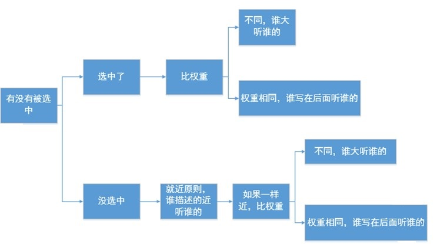

# CSS的继承性和层叠性

## 1 继承性

有一些属性，当给自己设置的时候，自己的后代都继承上了，这个就是继承性。

**哪些属性能继承：**`color、 text-开头的、line-开头的、font-开头的。`这些关于文字样式的，都能够继承； 所有关于盒子的、定位的、布局的属性都不能继承。

所以，如果我们的页面的文字，都是灰色，都是14px。那么就可以利用继承性：

```css
    body{
        color:gray;
        font-size:14px;4
    }
```

继承性是从自己开始，直到最小的元素。

## 2 层叠性

层叠性：**就是css处理冲突的能力。 所有的权重计算，没有任何兼容问题！**

1. 当选择器选择上了某个元素的时候，那么要这么统计权重：`id的数量，类的数量，标签的数量`**id的权重大于类，类的权重大于标签**
2.  **如果权重一样，那么以后出现的为准**
3.  **如果不能直接选中某个元素，通过继承性影响的话，那么权重是0**，如果大家都是0，那么有一个就近原则：谁描述的近，听谁的。

>进位:奇淫知识点：255个标签，等于1个类名，但是没有实战意义！

权重计算：

```html
<!DOCTYPE html>
<html>
<head>
    <title>Test</title>

    <style type="text/css">
        /*
        //1个id选择器，1个类选择器，1个标签选择器
        //1:1:1
        */
        #box1 .hezi2 p{
            color: red;
        }

        /*
        //1个id选择器，0个类选择器，3个标签选择器
        //1:0:3
        */
        div div #box3 p{
            color: green;
        }

        /*
        //0个id选择器，3个类选择器，4个标签选择器
        //0:3:4
        */
        div.hezi1 div.hezi2 div.hezi3 p{
            color: blue;
        }
    </style>

</head>
<body>

<div class="hezi1" id="box1">

    <div class="hezi2" id="box2">

        <div class="hezi3" id="box3">

            <P>猜猜我是什么颜色？</P>    

        </div>

    </div>

</div>

</body>
</html>
```

## 3 总结

- 继承性：好的事儿。继承从上到下，哪些能？哪些不能？
- 层叠性：冲突，多个选择器描述了同一个属性，听谁的？




