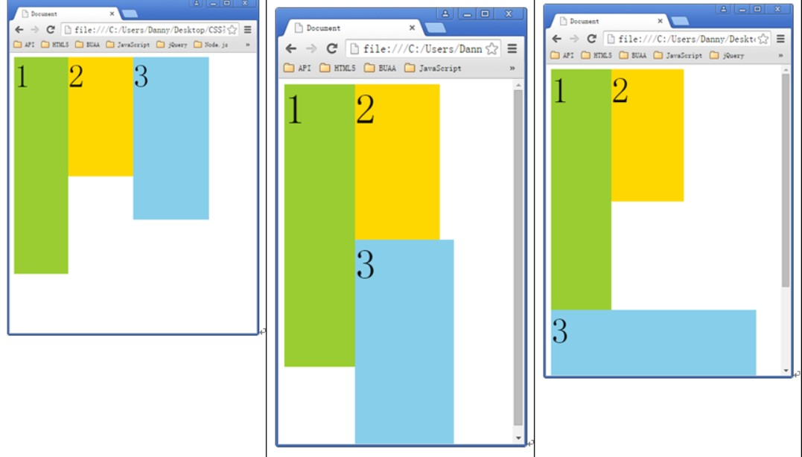
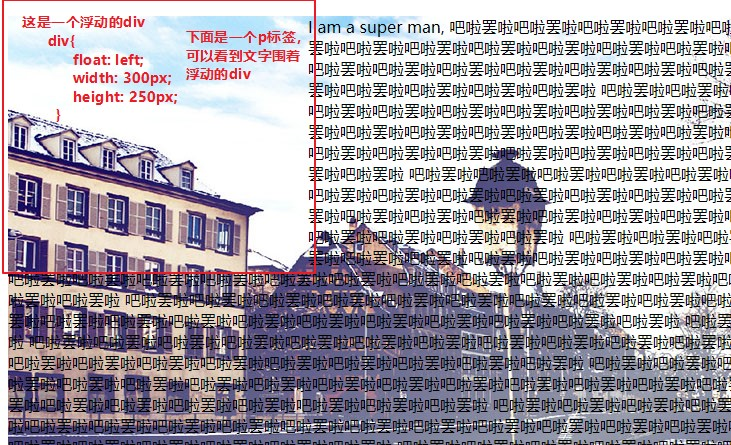
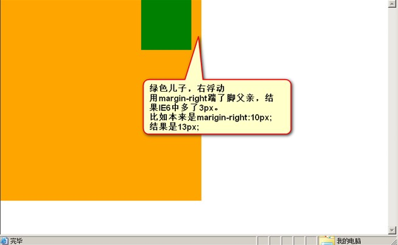

# CSS浮动

---
## 1 浮动概念与特性

浮动是css里面布局用的最多的属性。标准流中不能实现**两个元素并排了，并且两个元素都能够设置宽度、高度**。而浮动之后的元素是可以的。浮动想学好，一定要知道浮动的性质：

1. **浮动的元素脱离标准文档流**
2. **浮动的元素互相贴靠**
如果有足够空间，那么就会靠着2。如果没有足够的空间，那么会靠着1。如果没有足够的空间靠着1，自己去贴左墙(`float:left`)：

3. **浮动的元素有“字围”效果**

4. **收缩**：一个浮动的元素，如果没有设置width，那么将自动收缩为文字的宽度（这点非常像行内元素），高度特性不变，默认为0，可以被子元素撑起高度。

>关于浮动的元素互相贴靠，不仅仅是统一方向的浮动，不同方向的浮动也会影响彼此所占用的空间

**整个网页，就是通过浮动，来实现并排的。**

---
## 2 浮动的清除

默认情况下没有浮动子元素可以撑起父元素，但是如果是浮动，那么**一个容器如果没有指定高度，就不能给自己浮动的孩子撑起一个区域。**或者说不能被自己浮动的孩子撑起来。

### 清除浮动方法1：给浮动的元素的祖先元素加高度。

- 如果一个元素要浮动，那么它的祖先元素一定要有高度。有高度的盒子，才能关住浮动。
- 只要浮动在一个有高度的盒子中，那么这个浮动就不会影响后面的浮动元素。这就是清除浮动带来的影响。

### 清除浮动方法2：`clear:both;`

网页制作中，高度height很少出现。为什么？因为能被内容撑高！那也就是说，刚才我们讲解的方法1，工作中用的很少。那么能不能不写height，也把浮动清除了呢？也让浮动之间，互不影响呢？可以的！那就是`clear:both;`属性

clear 有 `both/left/right/none/inherit` 几个属性值，分别代表：

- 在元素左右两侧不允许出现浮动元素
- 在元素左侧不允许出现浮动元素
- 在元素右侧不允许出现浮动元素
- 元素不清除浮动
- 继承父元素的值。

这种方法有一个非常大的致命的问题，就是设置clear清除浮动的属性的标签间的margin失效了。即margin对于设置clear清除浮动的属性的标签无效。

### 清除浮动方法3：隔墙法

隔墙法利用的是`clear`属性，专门定义标签用来设置clear属性，隔墙法又分为**内墙法和外墙法**

### 清除浮动方法4：`overflow:hidden;`

overflow就是“溢出”的意思， hidden就是“隐藏”的意思。表示“溢出隐藏”。所有溢出边框的内容，都要隐藏掉。

本意就是清除溢出到盒子外面的文字。但是，前端开发工程师又发现了，它能做偏方。**一个父亲不能被自己浮动的儿子，撑出高度。但是，只要给父亲加上`overflow:hidden;` 那么，父亲就能被儿子撑出高了。这是一个偏方。**

###  清除浮动总结

1. 加高法：浮动的元素，只能被有高度的盒子关住。 也就是说，如果盒子内部有浮动，这个盒子有高，那么妥妥的，浮动不会互相影响。但是，工作上，我们绝对不会给所有的盒子加高度，这是因为麻烦，并且不能适应页面的快速变化。
2. `clear:both;法`：最简单的清除浮动的方法，就是给盒子增加`clear:both；`表示自己的内部元素，不受其他盒子的影响。浮动确实被清除了，不会互相影响了。但是有一个问题，就是margin失效。两个div之间，没有任何的间隙了。
3. 隔墙法：在两部分浮动元素中间，建一个墙。隔开两部分浮动，让后面的浮动元素，不去追前面的浮动元素。墙用自己的身体当做了间隙。我们发现，隔墙法好用，但是第一个div，还是没有高度。如果我们现在想让第一个div自动的根据自己的儿子撑出高度，我们就要想一些“小伎俩”，“奇淫技巧”。那就是内墙法，**内墙法**的优点就是，不仅仅能够让后部分的浮动标签不去追前部分的浮动标签了，并且能把第一个div撑出高度。这样，这个div的背景、边框就能够根据p的高度来撑开了。
4. `overflow:hidden;`这个属性的本意，就是将所有溢出盒子的内容，隐藏掉。但是，我们发现这个东西能够用于浮动的清除。我们知道，一个父亲，不能被自己浮动的儿子撑出高度，但是，如果这个父亲加上了`overflow:hidden；`那么这个父亲就能够被浮动的儿子撑出高度了。这个现象，不能解释，就是浏览器的小偏方。并且,`overflow:hidden;`能够让margin生效。

---
## 3 清除浮动时浏览器兼容问题

对于上述知识点遇见的不同浏览器有如下兼容问题

### 3.1 第一，IE6，不支持小于12px的盒子，任何小于12px的盒子，在IE6中看都大

解决办法很简单，就是将盒子的字号，设置小（小于盒子的高），比如0px。

    height: 4px;//如果只设置height，在ie6中是没有用的。会显示为12px
    _font-size: 0px;

**浏览器hack**。hack就是“黑客”，就是使用浏览器提供的后门，针对某一种浏览器做兼容。**IE6**留了一个后门，就是只要给css属性之前，加上下划线，这个属性就是IE6认识的专有属性。比如：`_background-color: green;`，所以解决微型盒子，正确写法：

        height: 10px;
        _font-size:0;

### 3.2 第二，IE6不支持用`overflow:hidden;`来清除浮动的

解决办法：

        overflow: hidden;
        _zoom:1;

实际上，`_zoom:1;`能够触发浏览器hasLayout机制。这个机制，就IE6有。

强调一点， `overflow:hidden;`的本意，就是溢出盒子的border的东西隐藏，这个功能是IE6兼容的。不兼容的是overflow:hidden;清除浮动的时候。

上面两个IE6的兼容问题，都是通过多写一条hack来解决的。这个我们称为**伴生属性**。


---
## 4 margin

### 4.1 margin的塌陷现象

标准文档流中，竖直方向的margin不叠加，以较大的为准，如果不在标准流，比如盒子都浮动了，那么两个盒子之间是没有塌陷现象的

### 4.2 盒子居中`margin:0 auto;`

margin的值可以为auto，表示自动。当left、right两个方向，都是auto的时候，盒子居中了：

注意：

- 使用`margin:0 auto;` 的盒子，必须有width，有明确的width
- 只有标准流的盒子，才能使用`margin:0 auto; `居中。也就是说，当一个盒子浮动了、绝对定位了、固定定位了，都不能使用`margin:0 auto;`
- `margin:0 auto;`是在居中盒子，不是居中文本。文本的居中，要使用`text-align:center;`


### 4.3 善于使用父亲的padding，而不是儿子的margin

如果父亲没有border，那么儿子的margin实际上踹的是“流”，踹的是这“行”。所以，父亲整体也掉下来了，**margin这个属性，本质上描述的是兄弟和兄弟之间的距离； 最好不要用这个marign表达父子之间的距离。**，所以，我们一定要善于使用父亲的padding，而不是儿子的margin。

### 4.4 关于margin的IE6兼容问题

####  IE6双倍margin bug

当出现连续浮动的元素，携带和浮动方向相同的margin时，队首的元素，会双倍marign。

解决方案：
1. 使浮动的方向和margin的方向，相反。所以，你就会发现，我们特别喜欢，浮动的方向和margin的方向相反。并且，前端开发工程师，把这个当做习惯了。
```
float: left;
margin-right: 40px;
```
2. 使用hack,单独给队首的元素，写一个一半的margin（没必要，别惯着这个IE6）


#### IE6的3px bug



解决办法：不用管，因为根本就不允许用儿子踹父亲。所以，如果你出现了3px bug，**说明你的代码不标准**。

---
## 5 Fireworks和精确盒子还原

fireworks是Adobe公司的一个设计软件。功能非常多。前端工程师用它来精确还原盒子

1. css中，任何文本都有行高。行高就是`line-height`属性。顾名思义，就是行的高度。
2. 首行空两个汉字的格`text-indent:2em;`，em就是汉字的一个宽度。indent就是“缩进”的意思。


