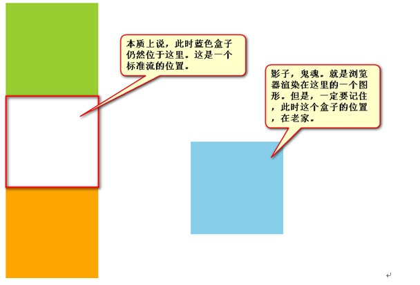
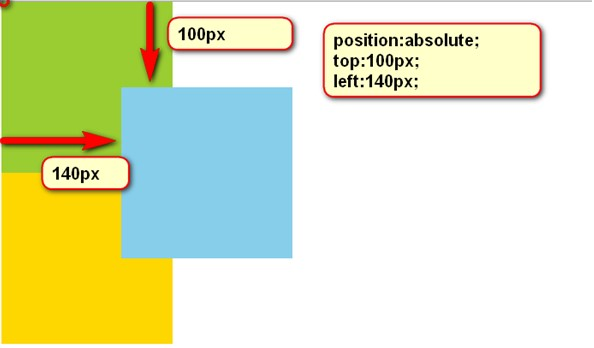
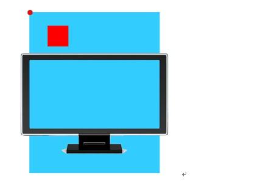
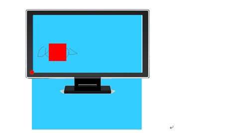
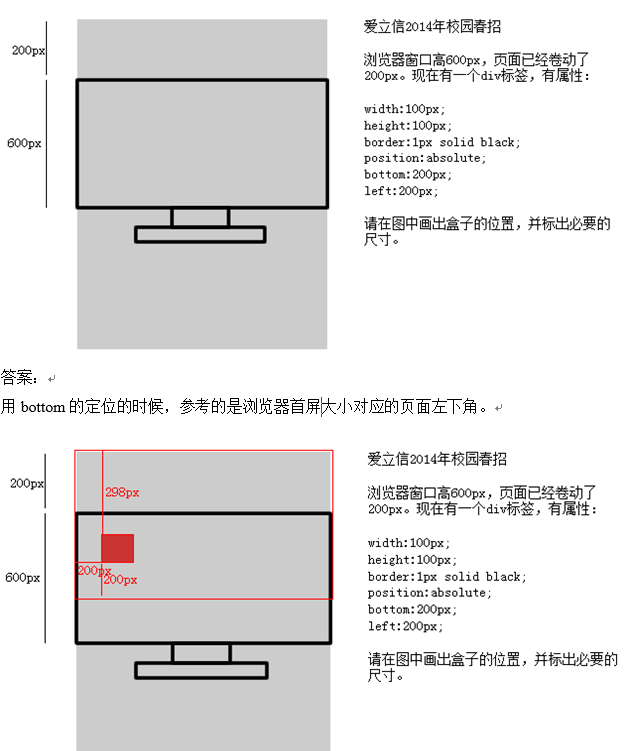
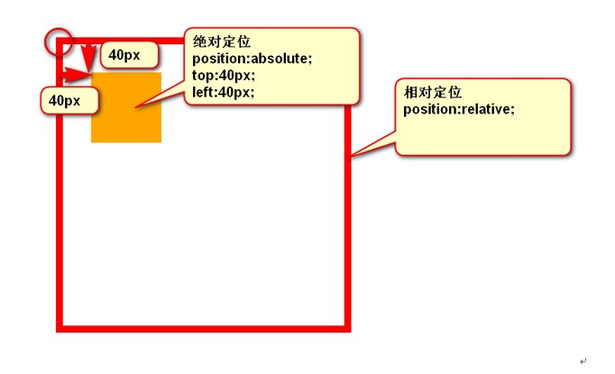
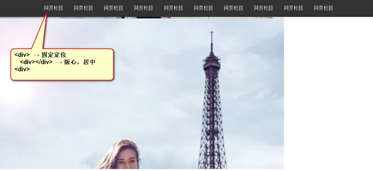

# CSS定位

定位有三种，分别是相对定位、绝对定位、固定定位。


- 标准文档流：`position:static`
- 相对定位：`position:relative;`
- 绝对定位：`position:absolute;`
- 固定定位：`position:fixed;`
- 从父元素继承 position 属性的值： `position:inherit`


---
## 1 相对定位

相对定位，就是**微调**元素位置的。让元素相对自己原来的位置，进行位置调整。也就是说，如果一个盒子想进行位置调整，那么就要使用相对定位

使用：
```
    position:relative;   → 必须先声明，自己要相对定位了，
    left:100px;       → 然后进行调整。
    top:150px;       → 然后进行调整。
```

### 1.1 不脱标，老家留坑，形影分离

相对定位不脱标，真实位置是在老家，只不过影子出去了，可以到处飘。



### 1.2 相对定位用途

相对定位有坑，所以一般不用于做“压盖”效果。页面中，效果极小。就两个作用：

-  微调元素
-  做绝对定位的参考，子绝父相（讲绝对定位的时候说）

### 1.3 相对定位的定位值

- 可以用left、right来描述盒子右、左的移动；
- 可以用top、bottom来描述盒子的下、上的移动。

---
## 2 绝对定位

绝对定位比相对定位更灵活.



### 2.1  绝对定位脱标

绝对定位的盒子，是脱离标准文档流的。所以，所有的标准文档流的性质，绝对定位之后都不遵守了。绝对定位之后，标签就不区分所谓的行内元素、块级元素了，**不需要`display:block;`就可以设置宽、高了**

### 2.2 参考点

绝对定位的参考点，如果用top描述，那么定位参考点就是页面的左上角，而不是浏览器的左上角：



如果用bottom描述，那么就是浏览器首屏窗口尺寸，对应的页面的左下角：




**例题**：




### 2.3 以盒子为参考点

一个绝对定位的元素，如果父辈元素中出现了也定位了的元素，那么将以父辈这个元素为参考点。



- 要听最近的已经定位的祖先元素的，不一定是父亲，可能是爷爷
- 不一定是相对定位，任何定位，都可以作为参考点
- 绝对定位的儿子，无视参考的那个盒子的padding。

**子绝父绝、子绝父相、子绝父固**都是可以给儿子定位的。但是工程上如果使用`子绝、父绝`就没有一个盒子在标准流里面了，所以页面就不稳固，没有任何实战用途。**工程上“子绝父相”才有意义**，父亲没有脱标，儿子脱标在父亲的范围里面移动。

### 2.4 绝对定位的盒子居中

```
    width: 600px;
    height: 60px;
    position: absolute;
    left: 50%;
    top: 0;
    margin-left: -300px;   → 宽度的一半
```

---
## 3 固定定位

固定定位，就是相对浏览器窗口定位。页面如何滚动，这个盒子显示的位置不变。固定定位脱标！**IE6不兼容**

固定定位用于制作顶部通栏


---
## 4 z-index

- z-index值表示谁压着谁。数值大的压盖住数值小的。
- 只有定位了的元素，才能有z-index值。也就是说，不管相对定位、绝对定位、固定定位，都可以使用z-index值。而浮动的东西不能用。
- z-index值没有单位，就是一个正整数。默认的z-index值是0。
- 如果大家都没有z-index值，或者z-index值一样，那么谁写在HTML后面，谁在上面能压住别人。定位了的元素，永远能够压住没有定位的元素。
- 从父现象：父亲怂了，儿子再牛逼也没用。


