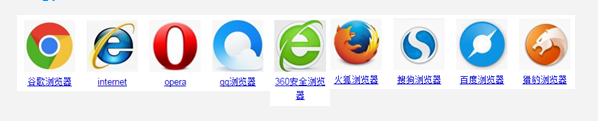

---
## 1 互联网的原理

上网就是请求数据

### 服务器

 - 服务器就是计算机，只不过比咱们用的笔记本的配置牛逼了很多，并且24小时不断电，不关机。
 - 服务器上存储着网页的相关文件。一旦有访问者浏览网站，服务器就将发送这些文件给访问者。
 - 服务器一旦关机，网站就无法访问了。

### 浏览器

浏览器是安装在客户的电脑里面的，是一个软件，能够让用户上网。浏览器有版本之分，有浏览器兼容问题，出现浏览器兼容的核心问题是因为各个厂商的浏览器的内核不一样。

---
## 2 前端技术

W3C标准定义WEB包含三个层：

*   结构层（HTML）
*   表现层（CSS）
*   行为层（Javascript）

提倡**结构、表现、行为，三者分离，互不干涉**的WEB页面。

**他们各代表这什么？**

*   内容：让访问者浏览的信息
*   结构：使内容具有逻辑性和易用性
*   表现：修饰内容的外在表现使之看起来美观
*   行为：与内容的交互操作
