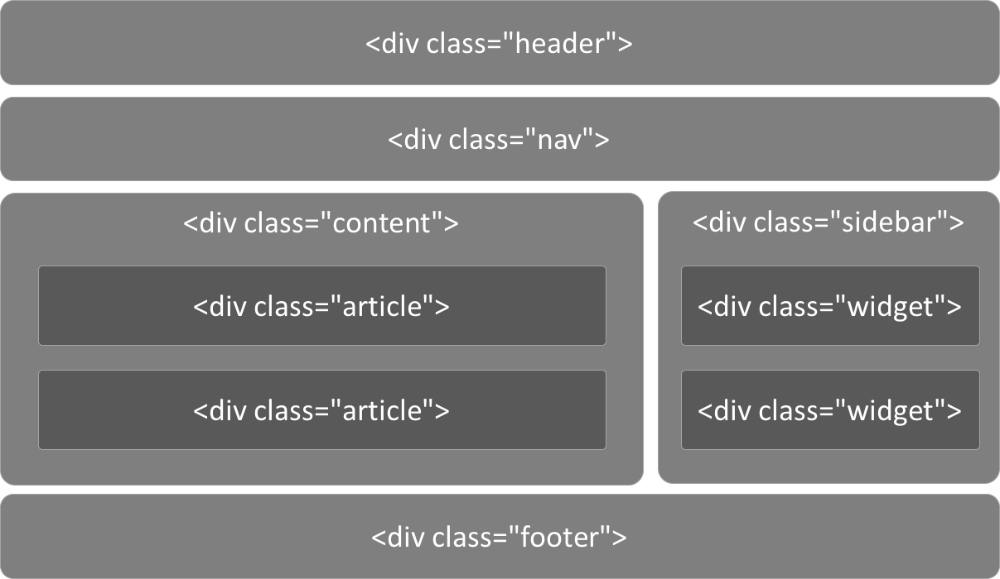
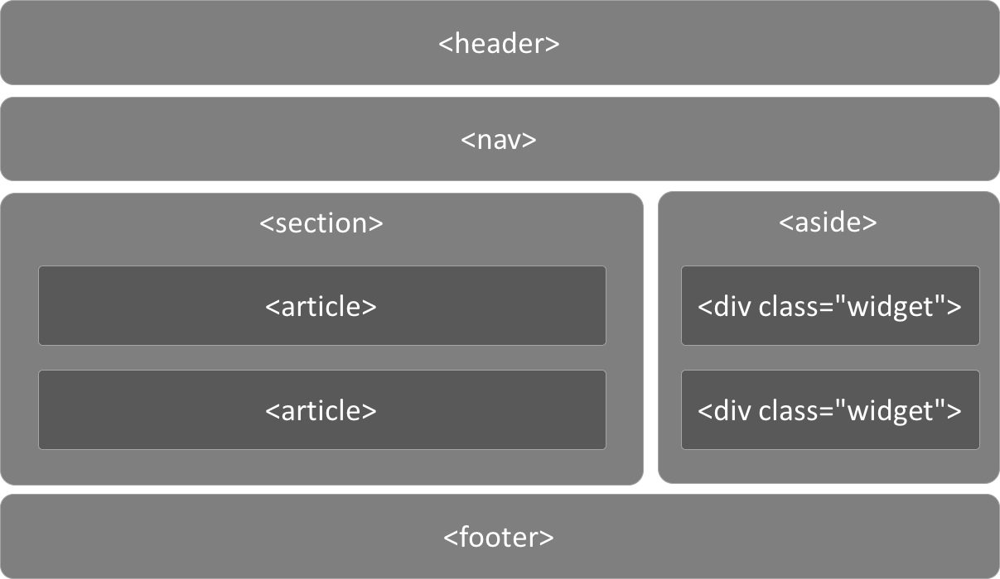
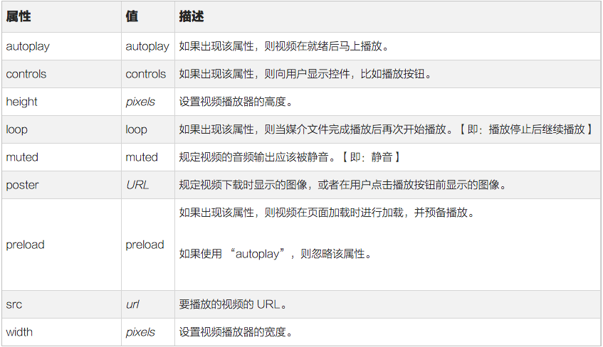

# HTML简介

## Web 技术发展时间线

- 1991 HTML
- 1994 HTML2
- 1996 CSS1 + JavaScript
- 1997 HTML4
- 1998 CSS2
- 2000 XHTML1
- 2002 Tableless Web Design(表格应该数据而不是网页结构，table被淘汰)
- 2005 AJAX
- 2009 HTML5
- 2014 HTML5 Finalized

## What is HTML5

H5草案前身(原名)：Web Application

- 提出 by WHATWG @2004
- 接纳 by W3C @2007
- 发布HTML5第一个草案 by W3C @2008-01-22
- HTML5 不仅仅是 HTML next version
- HTML5 约等于 `HTML↑ + CSS↑ + JavaScript API↑`，**结构+样式+交互**的全面升级
- 广义上的HTML5：新一代开发Web富客户端应用程序整体解决方案，**富客户端**即具有很强交互性和体验的客户端程序
- 之前交互+绚丽的效果依靠Flash，现在Flash已经没落，HTML5重归正轨，参数[Flash和HTML5](https://www.zhihu.com/question/19728465)

### HTML5 的应用场景

- 极具表现力的网页
- 网页应用程序
    - PC端：iCloud、百度脑图、Office 365···
    - APP端：淘宝、京东、美团···
    - WeChat端：淘宝、京东、美团···
- 混合式本地应用
    - PC端：网易云音乐、有道词典···
    - APP端：淘宝、京东、美团···
- 简单的游戏

HTML5 的能力已经覆盖：

- Offline / Storage
- Realtime / Communication
- File / Hardware Access
- Semantics & Markup
- Graphics / Multimedia
- CSS3
- Nuts & Bolts

### HTML5 到底多了点啥

- HTML
- JavaScript
- CSS

#### HTML

- 标签
  - 更语义化标签
  - 应用程序标签
- 属性
  - 链接关系描述
  - 结构数据标记
  - ARIA
  - 自定义属性
- 智能表单
  - 新的表单类型
  - 虚拟键盘适配
- 网页多媒体
  - 音频
  - 视频
  - 字幕
- Canvas
  - 2D
  - 3D (WebGL)
- SVG

#### JavaScript API

- 核心平台提升
    - 新的选择器
    - Element.classList
    - 访问历史API
    - 全屏API
- 网页存储
    - Application Cache
    - localStorage
    - sessionStorage
    - WebSQL
    - IndexedDB
- 设备信息访问
    - 网络状态
    - 硬件访问
    - 设备方向
    - 地理围栏
- 拖放操作
    - 网页内拖放
    - 桌面拖入
    - 桌面拖出
- 文件
    - 文件系统API
    - FileReader
- 网络访问
    - XMLHttpRequest
    - fetch
    - WebSocket
- 多线程
- 桌面通知

#### CSS

- New Selector
- Web Fonts
- Text Styles
- Opacity
- HSL Color
- Rounded Corners
- Gradients
- Shadows
- Background Enhancements
- Border Image
- Flexible Box Model
- Transforms
- Transitions
- Animations

## HTML新特性

### 标签

#### 语义化的标签

更具有语义化的标签，就让HTML代码符合内容的结构化，标签语义化

以前我们可能是这样的：



以后我们一定是这样的(现代网页结构)：



为什么要有语义化标签：

- 能够便于开发者阅读和写出更优雅的代码，代码如诗
- 同时让浏览器或是网络爬虫可以很好地解析，从而更好分析其中的内容
- 更好地搜索引擎优化
- **HTML的职责是描述一块内容是什么（或其意义）**，而不是它长的什么样子，它的外观应该由CSS来决定。

#### 应用程序标签

- DataList(数据列表)
- Progress(进度条)
- Meter(数值显示器)
- Menu(右键菜单)
- Details(明细)
- View Demo

### 属性

#### 链接关系 rel

```html
<link rel="stylesheet" href="style.css">
<link rel="alternate" type="application/rss+xml" href="http://myblog.com/feed">
<link rel="shortcut icon" href="favicon.ico">
<link rel="pingback" href="http://myblog.com/xmlrpc.php">
<link rel="prefetch" href="http://myblog.com/main.php">
...

<a rel="archives" href="http://myblog.com/archives">old posts</a>
<a rel="external" href="http://notmysite.com">tutorial</a>
<a rel="license" href="http://www.apache.org/licenses/LICENSE-2.0">license</a>
<a rel="nofollow" href="http://notmysite.com/sample">wannabe</a>
<a rel="tag" href="http://myblog.com/category/games">games posts</a>
```

用来描述指定链接与当前文档的关系，便于机器理解文档结构，常见的链接关系表：

```
alternate    文档的可选版本（例如打印页、翻译页或镜像）
stylesheet    文档的外部样式表
start    集合中的第一个文档
next    集合中的下一个文档
prev    集合中的前一个文档
contents    文档目录
index    文档索引
glossary    文档中所用字词的术语表或解释
copyright    包含版权信息的文档
chapter    文档的章
section    文档的节
subsection    文档的子段
appendix    文档附录
help    帮助文档
bookmark    相关文档
nofollow    用于指定 Google 搜索引擎不要跟踪链接
licence    一般用于文献，表示许可证的含义
tag    标签集合
friend    友情链接
```

#### ARIA 属性

- Accessible Rich Internet Application (无障碍富互联网应用程序)
- 主要针对于屏幕阅读设备(e.g. NVDA)，更快更好地理解网页
- 不仅仅是为了盲人用户，更多语义化
- [WAI-ARIA无障碍网页应用属性完全展示](http://www.zhangxinxu.com/wordpress/2012/03/wai-aria-%E6%97%A0%E9%9A%9C%E7%A2%8D%E9%98%85%E8%AF%BB/)

#### 自定义属性 `data-*`

通过DOM存储与DOM对象强相关的数据，通`data-xxx`自定义属性。

```html
<ul id="users">
  <li data-id="1" data-age="18" data-gender="true">张三</li>
  <li data-id="2" data-age="18" data-gender="false">李四</li>
  <li data-id="3" data-age="18" data-gender="true">王二</li>
</ul>
```

### 智能表单

#### 新的表单类型

```html
<input type="text" required>
<input type="email" value="some@email.com">
<input type="date" min="2010-08-14" max="2011-08-14" value="2010-08-14">
<input type="range" min="0" max="50" value="10">
<input type="search" results="10" placeholder="Search...">
<input type="tel" placeholder="(555) 555-5555" pattern="^\(?\d{3}\)?[-\s]\d{3}[-\s]\d{4}.*?$">
<input type="color" placeholder="e.g. #bbbbbb">
<input type="number" step="1" min="-5" max="10" value="0">
```

虚拟键盘适配

```html
<input type="text" name="txt_text" id="txt_text">
<input type="number" name="txt_number" id="txt_number">
<input type="email" name="txt_email" id="txt_email">
<input type="tel" name="txt_tel" id="txt_tel">
<input type="url" name="txt_url" id="txt_url">
```

智能表单学习目标：网页开发过程中可以针对需求使用特定的智能表单类型

### 网页多媒体

在此之前需要依赖于第三方插件，现在有原生的标签支持

```html
<!-- 音频 -->
<audio controls="controls">
  <source src="img/music.mp3" type="audio/mpeg"/>
</audio>

<!-- 视频 -->
<!--如果浏览器不支持video，那么会把video当作一个普通标签，比如与div样-->
<video controls="controls">
  <!-- 不同浏览器支持格式不一样 -->
  <source src="fun.ogg" type="video/ogg" />
  <source src="fun.mp4" type="video/mp4" />
  <!-- 当浏览器不兼容video标签，就会将他以div方式解析 -->
  SHIT 你的浏览器不支持！
</video>
```

Video属性：



字幕：

```html
<video id="clip" controls>
  <source src="fun.mp4" type="video/mp4" />
  <track label="English subtitles" kind="subtitles" srclang="en" src="video-subtitles-en.vtt" default />
</video>
```

多媒体学习目标：

- 掌握网页多媒体的意义
- 对Video标签和Audio标签熟练使用
- 了解字幕标签
- 多媒体兼容方案：[HTML5 video was meant to be this easy](https://html5media.info/)
 
###  SVG

- Scalable Vector Graphics 可缩放矢量图形
- 优势：体积小，质量高，效果好，可控程度高

使用 SVG File 的方式：

- 使用 `<embed>`标签
- 使用 `<object>` 标签
- 使用 `<iframe>` 标签
- Ajax方式加载

### Canvas

提供网页级画布（GDI+）的实现

[参考](http://www.w3schools.com/html/html5_svg.asp)

### About IE

为了尽可能让IE更好地支持HTML5，你可以使用以下两种方式：

```
//Client side:
<meta http-equiv="X-UA-Compatible"
                            content="chrome=1">

//Server side:
X-UA-Compatible: chrome=1
```


## JavaScript新特性

### 基础API提升

#### 新选择器

JS多了一个原始支持，类似jqueryDOM选择器，通过CSS语法查找元素。

```javascript
document.querySelectorAll('ul');
document.querySelectorAll('.container');
document.querySelector('div.container > .inner');
```

1. `document.querySelector(selector);` ：返回第一个满足选择器条件的元素，一个dom对象
3. `document.querySelectorAll('.item');`：返回所有满足该条件的元素 一个元素类型是dom类型的数组
5. `$('.item');`：返回一个jQuery对象（dom元素的数组）
7. 本质上jquery方式和qs方式都是获取DOM数组， 只不过jquery会多一些其他成员
8. DOM数组的每一个成员注册事件不能像jquery一样直接注册， 必须分别给每个元素注册
9. h5就是将我们经常需要的操作又包装一层


#### 元素.classList

提供类似于jQuery中CSS操作的API

1. 新H5中DOM对象多了一个classList属性，是一个数组
2. add 添加一个新的类名
3. remove 删除一个的类名
4. contains 判断是否包含一个指定的类名 
5. toggle 切换一个class element.toggle('class-name',[add_or_remove])
6. toggle函数的第二个参数true为添加 false删除

```
<div id="demo" class="highlighted"></div>
// script
document.querySelector('#btn').addEventListener('click', function() {
  var demoElement = document.querySelector('#demo');
  var demoClassList = demoElement.classList;
  demoClassList.add('bordered'); // 添加一个类名
  demoClassList.add('shadowed'); // 添加一个类名
  demoClassList.remove('highlighted'); // 删除一个类名
  // 获取是否存在指定类名
  var isAnimated = demoClassList.contains('animated');
  // 根据第二个参数切换一个类名
  demoClassList.toggle('animated', !isAnimated);
  console.log(demoClassList); // ["bordered", "shadowed", "animated"]
});
```

#### 访问历史 API

界面上的所有JS操作不会被浏览器记住，就无法回到之前的状态，在HTML5中可以通过window.history操作访问历史状态，让一个页面可以有多个历史状态

1. `window.history.forward();` 前进
2. `window.history.back();` 后退
3. `window.history.go();` 刷新
4. 通过JS可以加入一个访问状态
5. `history.pushState(放入历史中的状态数据, 设置title(现在浏览器不支持), 改变历史状态)`
6. `history.replaceState()`方法：替换状态
7. `window.onpopstate`事件：得到状态

#### 全屏 API

JavaScript中可以通过调用requestFullScreen()方式实现指定元素的全屏显示。

```
var elem = 需要全屏的元素;
if (elem.webkitRequestFullScreen) {
  elem.webkitRequestFullScreen();
} else if (elem.mozRequestFullScreen) {
  elem.mozRequestFullScreen();
} else if (elem.requestFullScreen){
  elem.requestFullScreen();
}
```
 
###  网页存储

通过以下API，可以轻松构建离线H5应用

### Application Cache

就是让网页可以离线访问的技术。

####  Web Storage

包括：localStorage & sessionStorage。

```
var btnSet = document.querySelector('#btn_set');
var btnGet = document.querySelector('#btn_get');
var txtValue = document.querySelector('#txt_value');
btnGet.addEventListener('click', function() {
  // txtValue.value = localStorage.getItem('key1');
  txtValue.value = localStorage['key1'];
});
btnSet.addEventListener('click', function() {
  // localStorage.setItem('key1', txtValue.value);
  localStorage['key1'] = txtValue.value;
});
```

#### Web SQL

HTML5中的关系型数据库

####  IndexedDB

HTML5中的NoSQL数据库

### 文件系统

提供客户端本地操作文件的可能

#### File API

通过file表单或拖放操作选择文件，还可以通过JavaScript读取文件的名称、大小、类型、和修改时间。

```html
<input id="input_1" class="form-control" name="input_1" type="file">

<script type="text/javascript">
    // script
    var input = document.querySelector('#input_1');
    // 获取文件域中选择的文件
    // var file = input.files[0];
    var file = input.files.item(0);
</script>
```

#### FileReader

FileReader就是用来读取本地文件的对象。

```javascript
var reader = new FileReader();
reader.addEventListener('load', function () {
  this.result; // 读取出来的结果
});
reader.readAsText(file); // 以文本的形式读取
reader.readAsDataURL(file); // 以DataURI的形式读取
// 以下（后台工程师用，前端不会用到）
reader.readAsBinaryString(file); // 二进制格式
reader.readAsArrayBuffer(file); // 字节数组
```

### 拖放操作

包括： 网页内拖放和文件拖入。

- 学会使用：`ondragenter`
- 学会使用：`ondragover`
- 学会使用：`ondragleave`
- 学会使用：`ondrop`


### 设备信息访问

HTML5提供了让我们可以访问设备的硬件信息API

#### 网络状态

对于离线应用，经常需要获取当前的网络连接状态。

```
//所有PC浏览器现在都不支持 只有手机端的Firefox
var connectionInfo = navigator.connection;

//现在浏览器支持比较好的是"是否在线"
if (navigator.onLine)
  console.log('online');
else
  console.log('offline');
```

#### 重力感应方向控制

获取移动设备的重力感应信息。

```
window.addEventListener('deviceorientation', function(event) {
  var a = event.alpha; // Y轴 上下方向
  var b = event.beta; // Z轴 东西方向
  var g = event.gamma; // X轴 南北方向
});
```

#### 加速度计

```
window.addEventListener('devicemotion', function(e) {
  // 获取加速计数据 {x,y,z}
  var acceleration = e.accelerationIncludingGravity;
});
```

### 坐标系

获取手机的在空间上的坐标和朝向。

### 地理围栏

获取设备所在位置的坐标。

```
navigator.geolocation.getCurrentPosition(function(e) {
  // e.coords.longitude : 经度, e.coords.latitude : 纬度
  document.querySelector('#result').innerHTML = JSON.stringify(e.coords);
}, function(e) {
  document.querySelector('#result').innerHTML = JSON.stringify(e);
});
navigator.geolocation.watchPosition(success, error);
```
