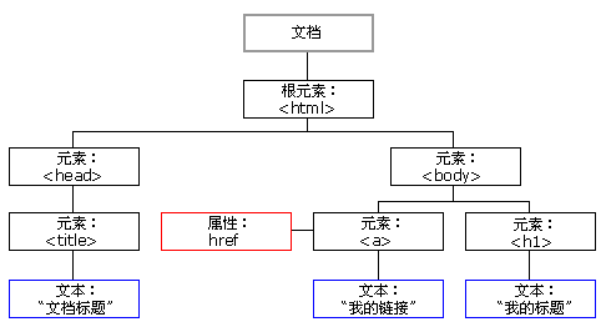

# DOM

DOM(Document Object Model) 是 W3C（万维网联盟）的标准。DOM 定义了访问 HTML 和 XML 文档的标准。

W3C DOM 标准被分为 3 个不同的部分：

- 核心 DOM：针对任何结构化文档的标准模型
- XML DOM：定义了所有 XML 元素的对象和属性，以及访问它们的方法。
- HTML DOM ：定义了所有 HTML 元素的对象和属性，以及访问它们的方法。

什么是HTML DOM

- HTML 的标准对象模型
- HTML 的标准编程接口
- W3C 标准

HTML DOM 是关于如何获取、修改、添加或删除 HTML 元素的标准

---
## 1 Html中引入js的方式

HTML 的 `<script>` 标签用于把 JavaScript 插入 HTML 页面当中，编写JavaScript 两种方式：**内部JS和外部JS**

- 内部JS程序，在HTML源码中

```html
     //一般写在body最下面，这样表示页面已经加载完毕
     <script type="text/javascript">
        alert(1);
    </script>
    
    //或则用window.onload
    window.onload=function(){//当整个页面加载完毕后再出发函数中的内容
            //alert("提示消息");
            /*
            var result = confirm("确定要删除吗?");//有返回值。用于删除、修改时的二次提示
            alert(result);
            */
            var result = prompt("请输入姓名","伍静");
            //alert(result);
            //document.write(result);
            document.getElementById("s1").innerHTML=result;
        }
```

- 引入外部的js文件

```
<script src="1.js"></script>
```

- 采用事件调用

```
<input type="button" onclick="alert('hei')"/>
```

---
## 2 JavaScript常用对象介绍与常用全局函数

常用对象：

- Array：数组
- String：字符串
- Number：数字原始类型引用类型
- Boolean：布尔原始类型引用类型
- Math对象：执行数学任务
- Date对象：用于处理日期和时间
- RegExp：对象正则表达式对象

常用全局函数：

- `isNaN` 检查某个值是否为数字
- `parseInt / parseFloat` 解析字符串为整数 / 浮点数
- `eval` 计算javascript 字符串，并把它作为脚本代码来执行
- `escape、unescape、encodeURI()、decodeURI()`


---
## 3 HTML DOM

### Document

每个载入浏览器的 HTML 文档都会成为 Document 对象。Document 对象使我们可以从脚本中对 HTML 页面中的所有元素进行访问。Document 对象是 Window 对象的一部分，可通过 `window.document` 属性对其进行访问。

HTMLDocument 接口对 DOM Document 接口进行了扩展，定义 HTML 专用的属性和方法。


### DOM树结构

- Element 元素
- Attribute：属性
- Text：文本

统一抽象为节点(Node)

- 整个文档是一个文档节点
- 每个 HTML 标签是一个元素节点
- 包含在 HTML 元素中的文本是文本节点
- 每一个 HTML 属性是一个属性节点
- 注释属于注释节点

DOM的属性

- nodeName 节点名称
- nodeValue节点的值
- parentNode：父节点
- childNodes：子节点（不止一个）
- attributes：属性（不止一个）



---
## 引用

- [W3School HTML DOM](http://www.w3school.com.cn/htmldom/index.asp)
- [W3School XML DOM](http://www.w3school.com.cn/xmldom/index.asp)
- [JavaScript 参考手册](http://www.w3school.com.cn/jsref/index.asp)