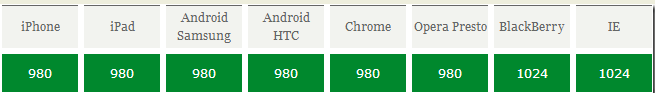

# Bootstrap

Bootstrap来自 `Twitter`，是目前很受欢迎的前端框架。Bootstrap是基于 `HTML、CSS、JavaScript` 的，它简洁灵活，使得Web开发更加快捷。Bootstrap是**跨设备**的

- Bootstrap 是最受欢迎的 HTML、CSS 和 JS 框架，用于开发响应式布局、移动设备优先的 WEB 项目。
- 为所有开发者、所有应用场景而设计。
- Bootstrap 让前端开发更快速、简单。所有开发者都能快速上手、所有设备都可以适配、所有项目都适用。
- 在 Bootstrap 的帮助下通过同一份代码快速、有效适配手机、平板、PC 设备，这一切都是 CSS 媒体查询（Media Query）的功劳。

什么是响应式布局：

- 一个网址能兼容多个终端，而不需要为每个终端做一个特定的版本，此概念是为了解决移动互联网浏览而诞生的。
- 响应式布局能够为不同终端的用户提供更加舒适的界面和更加友好的用户体验。
- Bootstrap就是响应式布局最成功的实现。为了兼容不同的浏览器采用jQuery，为适配不同的终端而采用CSS3 Media Query(媒体查询)。


## 1 Viewport

### Viewport的概念

通俗的讲，移动设备上的viewport就是设备的屏幕上能用来显示我们的网页的那一块区域，在具体一点，就是浏览器上(也可能是一个app中的webview)用来显示网页的那部分区域，但viewport又不局限于浏览器可视区域的大小，它可能比浏览器的可视区域要大，也可能比浏览器的可视区域要小。在默认情况下，一般来讲，移动设备上的viewport都是要大于浏览器可视区域的，这是因为考虑到移动设备的分辨率相对于桌面电脑来说都比较小，所以为了能在移动设备上正 常显示那些传统的为桌面浏览器设计的网站，移动设备上的浏览器都会把自己默认的viewport设为980px或1024px（也可能是其它值，这个是由 设备自己决定的），但带来的后果就是浏览器会出现横向滚动条，因为浏览器可视区域的宽度是比这个默认的viewport的宽度要小的。下图列出了一些设备上浏览器的默认viewport的宽度。



### css中的1px并不等于设备的1px

在css中我们一般使用px作为单位，在桌面浏览器中css的1个像素往往都是对应着电脑屏幕的1个物理像素，这可能会造成我们的一个错觉，那就是css 中的像素就是设备的物理像素。但实际情况却并非如此，css中的像素只是一个抽象的单位，在不同的设备或不同的环境中，css中的1px所代表的设备物理 像素是不同的。在为桌面浏览器设计的网页中，我们无需对这个斤斤计较，但在移动设备上，必须弄明白这点。在早先的移动设备中，屏幕像素密度都比较低，如 iphone3，它的分辨率为320x480，在iphone3上，一个css像素确实是等于一个屏幕物理像素的。后来随着技术的发展，移动设备的屏幕像 素密度越来越高，从iphone4开始，苹果公司便推出了所谓的Retina屏，分辨率提高了一倍，变成640x960，但屏幕尺寸却没变化，这就意味着 同样大小的屏幕上，像素却多了一倍，这时，一个css像素是等于两个物理像素的。其他品牌的移动设备也是这个道理。例如安卓设备根据屏幕像素密度可分为 ldpi、mdpi、hdpi、xhdpi等不同的等级，分辨率也是五花八门，安卓设备上的一个css像素相当于多少个屏幕物理像素，也因设备的不同而不 同，没有一个定论。还有一个因素也会引起css中px的变化，那就是用户缩放。例如，当用户把页面放大一倍，那么css中1px所代表的物理像素也会增加一倍；反之把页面缩小一倍，css中1px所代表的物理像素也会减少一倍。

### 利用meta标签对viewport进行控制

我们在开发移动设备的网站时，最常见的的一个动作就是把下面这个东西复制到我们的head标签中：

```
<meta name="viewport" content="width=device-width, initial-scale=1.0, maximum-scale=1.0, user-scalable=0">
```

该meta标签的作用是让当前viewport的宽度等于设备的宽度，同时不允许用户手动缩放。也不允许用户缩放不同的网站有不同的要求，但让 viewport的宽度等于设备的宽度，这个应该是大家都想要的效果，如果你不这样的设定的话，那就会使用那个比屏幕宽的默认viewport，也就是说会出现横向滚动条。

meta viewport 标签首先是由苹果公司在其safari浏览器中引入的，目的就是解决移动设备的viewport问题。后来安卓以及各大浏览器厂商也都纷纷效仿，引入对meta viewport的支持，事实也证明这个东西还是非常有用的。

在苹果的规范中，meta viewport 有6个属性(暂且把content中的那些东西称为一个个属性和值)，如下：


属性|说明
---|---
width|设置layout viewport  的宽度，为一个正整数，或字符串"width-device"
initial-scale|设置页面的初始缩放值，为一个数字，可以带小数
minimum-scale|允许用户的最小缩放值，为一个数字，可以带小数
maximum-scale|允许用户的最大缩放值，为一个数字，可以带小数
height|设置layout viewport  的高度，这个属性对我们并不重要，很少使用
user-scalable|是否允许用户进行缩放，值为"no"或"yes", no 代表不允许，yes代表允许

这些属性可以同时使用，也可以单独使用或混合使用，多个属性同时使用时用逗号隔开就行了。

### 总结

1. 必须设置 meta viewport 标签，如果不设置meta viewport标签，那么移动设备上浏览器默认的宽度值为800px，980px，1024px等这些，总之是大于屏幕宽度的。这里的宽度所用的单位px都是指css中的px，它跟代表实际屏幕物理像素的px不是一回事。
2. 设置浏览器视口宽度为设备理想宽度每个移动设备浏览器中都有一个理想的宽度，这个理想的宽度是指css中的宽度，跟设备的物理宽度没有关系，在css中，这个宽度就相当于100%的所代表的那个宽度。我们可以用meta标签把viewport的宽度设为那个理想的宽度，如果不知道这个设备的理想宽度是多少，那么用device- width这个特殊值就行了
```html
<meta name="viewport" content="width=device-width, initial-scale=1">
```

---
## 2 Bootstrap入门

- Bootstrap集成
- 全局CSS样式
 - 容器
 - 栅格化
- 组件
- JS插件
- 定制