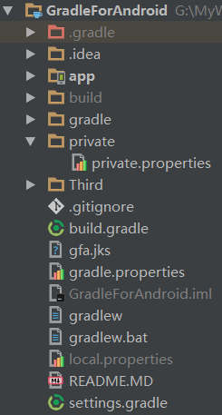
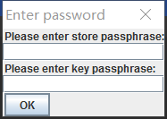

[TOC]
# GradleAndroid

---
## 1 GradleAndroid基础

### Android提供的构建任务

- assembleDebug 用于组装一个debug版本的apk
- check 运行所有的检查，通常意味着一个连接的设备或者模拟器上运行测试.
- build 触发assemble和check任务
- clean 清除项目的所有输出
- connectedCheck在连接的设备或者模拟器上运行测试
- installDebug和installRelease在连接的设备或者模拟器上安装特定版本的apk

### applicationId和packageName的不同

- packageName的两个用途：1 用于作为一个应用的唯一标识；2 在R资源类中作为包名，而使用构建variants解耦了packageName的

---
## 2 理解依赖管理

除了Java提供的集中配置外，Android还为不同的构建类型动态创建了配置，如：

- testCompile
- androidTestCompile
- debugCompile
- releaseProvided

JCenter等仓库依赖的语义化化版本，比如`1.2.3`

- 当不做兼容的API变化时，major版本增加
- 当意向后兼容的方式添加功能时，minor版本增加
- 当修复一些bug时，patch版本增加

### 多Libraries的资源合并

如果你的app module引用了多个library module, 你可以给这些library module排优先级。在编译的时候，这些library会按从优先级低到高来和app一次性合并。

- 资源合并冲突：编译工具会把library module的资源和app module的资源合并起来。如果library module和app module中有相同的资源id，则app module中的会保留。如果是多个AAR library之间发生了这样的冲突，依赖library module的列表(**dependencies**块关于library module的声明)中最上面的library module的资源会被保留.
- library module不能包含assets资源
- app module的**minSdkVersion**必须大于等于library module的
- 每个library module都会创建它们自己的**R**类

具体参考[android-library](https://developer.android.com/studio/projects/android-library.html)

---
## 3 创建构建Variant

### 构建Variant

`productFlavors`表示不同定制的产品，其让管理多个应用或者依赖成为可能，构建类型和productFlavors经常结合一起使用，**构建类型和productFlavors的结合结果被称为构建Variant**

### 构建类型

**构建类型**：通常用来被定义如何构建一个应用或依赖库，默认情况下，每个模块都有debug和release两个构建类型，默认的构建类型是debug，下面代码演示添加一个新的构建类型：

```
  x86Type{
            initWith debug
            ndk {
                abiFilters 'armeabi-v7a', 'x86'
            }
        }
```


**源集**:构建类型可以定义自己的源集(不能在main中定义)，源集合并的规则为：

 - drawables和layout文件会全部被覆盖
 - values文件中的文件则会合并到main资源中
 - manifest的规则也是合并，具体的manifest合并规则为：优先级规则由高到低依次是，`buildType下的Manifest设置->productFlavor下的Manifest设置->主工程src/main->dependency&library`，具体的细节可以参考API文档

### productFlavors

productFlavors被用来创建不同的版本,**选择够建类型还是productFlavors？**：如果需要一个全新的app，独立于已有的应用发布，那么productFlavors就是你需要的，否则用构建类型

同样可以为productFlavors创建源集，规则与上面构建类型相似,可以为构建类型和productFlavors的组合创建源集，且优先级最高，命名为：Flavors名+构建类型名称，**（组合后的productFlavors和构建类型的源集不能有重复的定义，比如构建类型和Flavors中定义相同的类）**


### 任务

定义了productFlavors和构建类型后，通过运行`gradlew tasks`会发现多了很多构建任务，比如：

增加构建一个构建类型Staging，定义red、blue两个productFlavors：

```
    assemble - Assembles all variants of all applications and secondary packages.
    assembleAndroidTest - Assembles all the Test applications.
    assembleBlue - Assembles all Blue builds.
    assembleDebug - Assembles all Debug builds.
    assembleRed - Assembles all Red builds.
    assembleRelease - Assembles all Release builds.
    assembleStaging - Assembles all Staging builds.
    installBlueDebug - Installs the DebugBlue build.
    installBlueDebugAndroidTest - Installs the android (on device) tests for the Blu
    installBlueRelease - Installs the ReleaseBlue build.
    installBlueStaging - Installs the StagingBlue build.
    installRedDebug - Installs the DebugRed build.
    installRedDebugAndroidTest - Installs the android (on device) tests for the RedD
    installRedStaging - Installs the StagingRed build.
    ......
```

除此之外，还有未列出的任务比如：`assembleRedDebug`

### 配置

同样定义了productFlavors和构建类型后，配置也会随之增加，运行`gradlew -papp depend`可以查看app模块中的所有配置

```
    blueProvided
    blueDebugCompile
    blueReleaseCompile
    ......
```

### 源集合并

构建类型、productFlavors以及两者的结合体都可以定义自己的源集合并，需要注意以下几点：

- 交叉的源集不能有重复的类定义
- 上面`assembleRedDebug`任务，Flavors的设置会覆盖构建类型的设置
- 源集合并时，资源和manifest的顺序是：`buildType->Flavor->Main->Dependencies`,如果资源在flavor和main源中都有定义，那么flavor中的资源将被赋予更高的优先级。

### variant过滤器

在构建过程中完全可以忽略某些variant

```
        // Remove redRelease as it's not needed. gradle过滤器
        android.variantFilter { variant ->
            if (variant.buildType.name.equals('release')
                    && variant.getFlavors().get(0).name.equals('red')) {
                variant.setIgnore(true);
            }
        }
        这样redRelease就不会参与构建了
```

### 签名配置

用于给不同的构建类型和flavor配置签名信息，flavor和构建类型组合时，flavor的签名配置具有更高的优先级。

---
## 4 管理多模块

当在根项目目录下运行一个命令时，Gradle会找出哪个模块有这一名称的任务，然后为每个模块执行该任务，如果希望在根目录任务某一个模块的任务可以使用下面命令：

```
    gradlew :ModelName：assembleDebug
    gradlew -p ModelName assembleDebug
```

---
## 5 运行测试

### 5.1 单元测试

可以在test源集中针对特定的特进行类进行单元测试，新建项目时AndroidStudio已经帮我们集成了JUnit单元测试框架：

```
        testCompile 'junit:junit:4.12'
        //使用的配置是testCompile，如果希望针对某个构建类型或者Flavor声明依赖，可以使用
        //testRedCompile，(red为一个Flavor)
```

使用`gradlew test`运行测试后，会在`build/reports`中发现生成的测试结果

- 使用`gradlew test -continue`一个测试失败不会中断继续其他测试
- 使用`gradlew testDebug --tests="*.LogicTest"`针对特定的类进行测试


#### Robolectric

如果单元测试设计到了Android的API，由于Java类库中没有android相关的api，测试时会报错，所以需要使用一些模拟框架，比较有名的是**Robolectric**

配置[Robolectric](http://robolectric.org/getting-started/)：

```
        testCompile "org.robolectric:robolectric:3.1.4"
```

### 5.2 功能测试

功能测试用于测试应用中的几个组件是否可以一起正常工作，Android中有几个功能测试框架，最简单最基础的框架是**Espresso**

Google创造了Espresso，该依赖由`Android support library`提供

使用`gradlew connectedCheck`来执行Espresso测试。

### 5.3 测试覆盖率

AndroidGradle默认就集成了 Jacoco测试覆盖率，通过

```
    buildTypes{
       debug{
         testCovefrageEnabled = true
       }
    }
```

即可开启测试覆盖率

---
## 6 创任务和插件

## mustRunAfter

```
    task TaskA<<{
        println 'taskA run'
    }
    task TaskB<<{
        println 'taskB run'
    }
    TaskB.mustRunAfter TaskA
```

mustRunAfter表示两个Task可以单独执行，但是同时执行两个task的时候，TaskB必须在TaskA后面执行。这与dependsOn是有区别的。

### 自定义任务来简化releae过程

使用命令行来进行打包时需要配置签名信息，但是又不想把密码等敏感字符直接写在脚本文件中，可以通过配置文件和脚本来配置：



在private/private.properties文件中配置签名信息：

```
    keyAlias=gfa
    storeFile=gfa.jks
    # keyPassword=666666 //此时我们注释了密码
    # storePassword=666666
```

定义任务来读取签名信息：

```groovy
    android {
        //省略一些列配置......
        release {

        }
    }

    //为什么要在whenTaskAdded时声明依赖呢？因为Android打包时，这些任务时动态添加的，所以不能直接访问任务，这个时候任务还不存在
    tasks.whenTaskAdded {
        //以'package'开头以'Release'结尾的，表示打包某个Release版本
        if (it.name.startsWith('package') && it.name.endsWith('Release')) {
            it.dependsOn getReleasePassword//让其依赖getReleasePassword任务
        }
    }

    //读取正式打包的密码
    import groovy.swing.SwingBuilder

    task getReleasePassword << {
        //定义签名需要的信息
        def keyAlias = ""
        def keyPassword = ""
        def storePassword = ""
        def storeFile = ""
        File privateFile = rootProject.file("private/private.properties")

        //判断有没有配置文件
        if (!privateFile.exists()) {
            throw new NullPointerException("no propetties file")
        }

        //读取签名信息
        privateFile.withInputStream {
            def properties = new Properties()
            properties.load(it)
            keyAlias = properties.getProperty("keyAlias")
            keyPassword = properties.getProperty("keyPassword")
            storePassword = properties.getProperty("storePassword")
            storeFile = properties.getProperty("storeFile")
        }

        //如果没有配置密码
        if (!storePassword?.trim() || !keyPassword?.trim()) {
            def console = System.console()
            if (console != null) {//console获取不到是个bug
                password = new String(console.readPassword("\"what's the secret password?\""))
            } else {//获取不到就使用Swing来让开发者输入密码
                new SwingBuilder().edt {
                    dialog(modal: true, title: 'Enter password', alwaysOnTop: true, resizable: false, locationRelativeTo: null, pack: true, show: true) {
                        vbox { // Put everything below each other
                            label(text: "Please enter store passphrase:")
                            def input1 = passwordField()

                            label(text: "Please enter key passphrase:")
                            def input2 = passwordField()

                            button(defaultButton: true, text: 'OK', actionPerformed: {
                                storePassword = new String(input1.password)
                                keyPassword = new String(input2.password);
                                dispose();
                            })
                        }
                    }
                }
            }
        }
        //赋值签名配置
        android.signingConfigs.release.storePassword = storePassword
        android.signingConfigs.release.keyPassword = keyPassword
        android.signingConfigs.release.keyAlias = keyAlias
        android.signingConfigs.release.storeFile = rootProject.file(storeFile)
    }
```

当没有签名信息时，会弹出提示框让你输入密码：



### Hook到Android插件

通过all来遍历构建variant，而不是上面的variantFilter，variantFilter的each会在构建variant被Android插件创建之前的评测阶段被触发,all方法会在每次添加新项目到集合时被触发

```
        android.applicationVariants.all { variant ->
            variant.outputs.each { output ->
                //......
            }
        }
```

---
## 7 持续集成

持续集成(CI)是一个开发实践，需要一个团队的开发者，每天多次整合它们的工作，每次推动到主仓库都需要一个自动构建验证，这种做法有助于尽早的发现问题，从而加速开发并提高代码的质量。**jenkins**是现在流行的CI框架。

---
## 8 高级自定义构建

### 减少APK文件

 - 使用proGuard
 - 开启自动缩减资源(shrinkResource)
 - resConfigs

### 加速构建

```
    org.gradle.parallel=true
    org.gradle.daemon=ture
    org.gradle.jvmargs=-Xms256m -Xmx1024m (jvmargs时jvm的参数，Xms用于指定初始化内存大小，Xmx用来设置最大的内存大小)
    org.gradle.configureondemand 忽略正在执行的task不需要的模块来限制在配置阶段的消耗
```

### Profiling

执行任务时加上`--profiling`可以在任务结束后得到一份构建的详细报告(build/reports/profile下)，用于分析各个任务的耗时

### 分隔apk

使用APK`splits`可以根据密度或者application binary interface(abi)来分隔APKs
