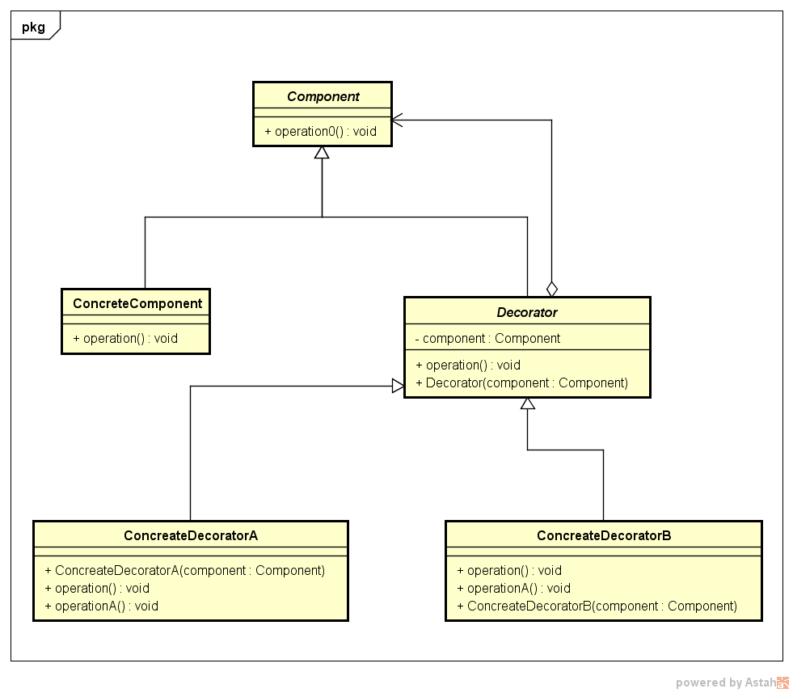

# 装饰器设计模式

## 1 装饰器设计模式介绍

装饰设计模式(Decorator Pattern)也成为包装模式，**结构型模式之一**，其定义为：**动态的给一个对象添加一些额外的职责，就增加功能来说，装饰模式相比生成子类对象更为灵活**。

---
## 2 类图设计与角色说明



- Component 组件对象的接口，可以给对象动态的添加职责。
- ConcreteComponent 具体的组件对象，实现组件对象接口，通常就是被装饰器装饰的原始对象，也就是可以给这个对象添加职责。
- Decorator 所有装饰器的抽象父类，需要定义一个与组件接口一致的接口，并持有一个Component对象，其实就是持有一个被装饰的对象。**如果装饰器逻辑单一，只有一个的情况下，可以省略此类直接作定义具体的装饰者。**
- ComcreteComponent 具体的装饰器实现。

---
## 3 示例

使用装饰模式计算奖金，实现灵活的奖金计算，需求:

- 每个人当月业务奖金 = 当月销售额 * 3%
- 每个人累计奖金 = 总的回款额 * 0.1%
- 团队奖金 = 团队销售额 * 1%

### 设计

- 定义一个业务接口，此接口定义计算奖金的业务方法，
- 添加一个基础的实现组件接口的对象，让它返回奖金0即可
- 把各个奖金计算规则当作装饰器对象，首先需要为它们定义统一的抽象装饰器接口，方便约束各个具体的装饰器
- 把各个奖金计算规则实现为具体的装饰器实现。

### 代码示例

```java
    //计算奖金的组件接口
    public abstract class Component {
        public abstract float calcPrize(String user, int month);
    }

     //为业务接口提供一个基本的实现，基本的实现奖金的类，也就是被装饰器装饰的对象
        public class ConcreteComponent extends Component {
               @Override
               public float calcPrize(String user, int month) {
                   return 0;
               }
        }
    
    /*在进一步定义装饰器之前，先定义各个装饰器的公共基类，在基类中定义所有装饰器需要实现的方法，这个基类需要和被装饰对象实现同样的接口，这样才能包装饰后的对象仍可以继续被装饰。*/
    public abstract class Decorator extends Component {
    
        private Component mComponent;
        
        public Decorator(Component component) {
            mComponent = component;
        }
        
        @Override
        public float calcPrize(String user, int month) {
            return mComponent.calcPrize(user, month);
        }
    
    }

        //接下来是具体的装饰器：
        public class MonthPrizeDecorator extends Decorator {
    
        public MonthPrizeDecorator(Component component) {
            super(component);
        }
    
        @Override
        public float calcPrize(String user, int month) {
            //计算前面的奖金
            float money = super.calcPrize(user, month);
            //然后计算当月业务奖金 ，
            float prize = DB.monthSaleMoney.get(user) * 0.03F;
            System.out.println(user + " 当月的奖金为 " + prize);
            return money + prize;
        }
    }
    public class SumPrizeDecorator extends Decorator {
    
        public SumPrizeDecorator(Component component) {
            super(component);
        }
    
        @Override
        public float calcPrize(String user, int month) {
            float money = super.calcPrize(user, month);
            //计算总的销售奖金，这里为了方便，假设每个人的当月累计销售额都是100000元
            float prize = 100000 * 0.001F;
            System.out.println(user + " 累计奖金为 " + prize);
            return money + prize;
        }
    }
    
    public class GroupPrizeDecorator extends Decorator {
    
        public GroupPrizeDecorator(Component component) {
            super(component);
        }
    
        @Override
        public float calcPrize(String user, int month) {
            float money = super.calcPrize(user, month);
            //计算团队奖金
            final float[] total = {0};
            DB.monthSaleMoney.entrySet().forEach(stringFloatEntry -> {
                total[0] += stringFloatEntry.getValue();
            });
    
            float prize = total[0] * 0.01F;
            System.out.println(user + " 当月的团队奖金为 " + prize);
            return money + prize;
        }
    }
    
然后在客户端验证：

    public class Client {
        
        public static void main(String... args) {
            //1 基本的计算奖金的类
            Component component = new ConcreteComponent();
            //2 根据需求，创建具体的装饰器
            Decorator monthDecorator = new MonthPrizeDecorator(component);
            Decorator sumDecorator = new SumPrizeDecorator(monthDecorator);
            //张三和李四是普通员工，计算当月奖金和当月累计奖金即可。
            System.out.println("=============张三的应得奖金为："+sumDecorator.calcPrize("张三", 1));
            System.out.println("=============李四的应得奖金为：："+sumDecorator.calcPrize("李四", 1));
            //假设王五是经理，还需要计算团队奖金
            Decorator groupDecorator = new GroupPrizeDecorator(sumDecorator);
            System.out.println("=============王五的应得奖金为：："+groupDecorator.calcPrize("王五", 1));
        }
    }
```

当然这只是一个示例，实际的开发中不会由这么简单，也不可能使用浮点数计算奖金，但是试想一下，如果不适用装饰模式，我们的代码可能会有各种`if else`判断，而且在面对之后的计算需求更改，这些`if else`判断也会显得非常脆弱。


---
## 4 装饰器模式解释

- 装饰器的功能：装饰模式能够动态的为对象添加功能，是从一个对象的外部给对象添加功能，相当于是改变了对象的外观。
- 对象组合：一个类的功能扩展，可以是**继承**，也可以是功能更加强大的**对象组合**，装饰模式思考的起点即是如此。
- 装饰器：各个装饰器之间最好是使用完全独立的功能，不要由依赖，这样在进行装饰器组合的时候，才没有组装装饰器先后顺序的限制。否则将大大降低装饰器的灵活性。
- 退化形式：如果仅仅是先搞添加一个功能，就没有必要再设计装饰器的抽象类了，直接在装饰器中实现跟组件一样的接口，然后实现相应的装饰功能即可。


### 优点

- 比继承更加灵活，从给对象添加功能的角度来看，装饰器模式比继承更加灵活，继承是**静态的**，而且一旦继承所有子类则拥有了一样的功能，而装饰模式采用把**功能分类到各个装饰器当中**，然后通过对象组合的方式来动态的实现功能组合。
- 更容易复用，一个装饰器只实现一个功能，装饰器同样可以被其他装饰器继续装饰
- 简化了高层定义，通过把功能分离到装饰器中，然后进行功能组合，在定义高层时，必须要把所有的功能都定义出来，而是定义最基本的功能即可。

### 缺点

产生很多细粒度对象

### 装饰模式思考

装饰模式的本质：**动态组合**

动态是手段，组合才是目的，此处组合有两个意思，一个是功能动态的组合，其次是装饰器对象动态的组合，通过组合对象来实现为被装饰对象透明的增加功能。**装饰模式不仅可以增加功能，而且也可以控制功能访问，完全实现新的功能。**

**何时使用装饰模式：**
- 如果需要在不影响其他对象的情况下，以动态、透明的方式给对象添加职责，可以使用装饰模式，这几乎是装饰模式的主要功能。
- 当不适合使用子类来进行功能扩展的时候，可以考虑使用装饰模式，因为装饰模式使用的就是**对象组合**的方式。所谓不适合使用子类进行功能扩展，比如，扩展功能需要的子类太多，造成子类数据爆炸性增长。


---
## 5 Java中的装饰器模式应用：Java IO


Java的IO类库设计就是经典的装饰模式应用，一般使用IO的情景如下：

```
     DataInputStream dataInputStream = null;
            try {
                dataInputStream = new DataInputStream(
                        new BufferedInputStream(
                                new FileInputStream("test.txt")
                        )
                );
                int available = dataInputStream.available();
                byte[] buff = new byte[available];
                dataInputStream.read(buff);
                System.out.println(new String(buff));
            } catch (IOException e) {
                e.printStackTrace();
            }finally {
                if (dataInputStream != null) {
                    try {
                        dataInputStream.close();
                    } catch (IOException e) {
                        e.printStackTrace();
                    }
                }
            }
```

观察代码，发行这其实就是一个装饰模式的应用

FileInputStream-->BufferedInputStream-->DataInputStream。

- FileInputStream相当于原始的被装饰对象
- BufferedInputStream和DataInputStream则为添加功能的装饰器

熟悉`java IO`类库的应该知道，BufferedInputStream和DataInputStream都继承自FilterInputStream，FilterInputStream继承于InputStream，FilterInputStream的实现是简单的转调它内部的InputStream对象对应的方法。

说明：

- InputStream相当于装饰模式中的Component
- 类似FileInputStream、ObjectInputStream都直接继承了InputStream，相当于具有基础功能的组件
- FilterInputStream相当于装饰模式中的Decorator，而它的子类BufferedInputStream、DataInputStream等相当于具体的装饰器。