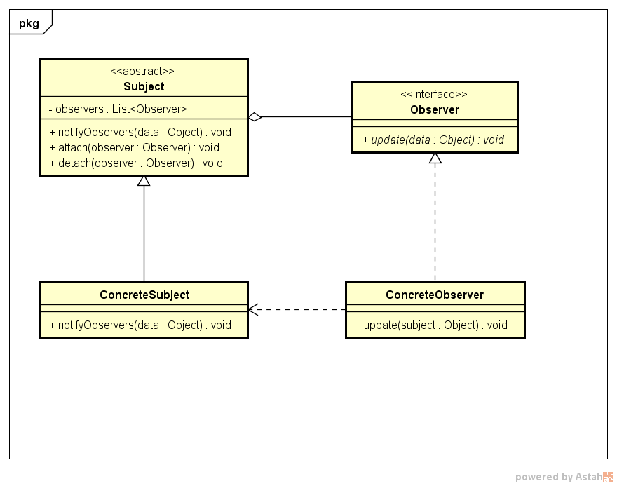

# 观察者模式

---
## 1 观察者模式介绍

观察者模式一个重要作用就是解耦，其定义如下：**定义对象间的一种一对多的依赖关系，使得每当一个对象改变状态时，则所有依赖于它的对象都会得到通知并作自动更新**

---
## 2 类图与角色说明



- Subject：目标对象，也就是被观察者，保存了所有观察者的引用，每个主题可以有任意个数量的观察者，可以增加和删除观察者对象。当Subject发生变化时，负责通过所有已经注册的并且有效的观察者。
- Observer：抽象的观察者，提供目标更新时对应的更新方法
- ConcreteSubject：具体的目标对象，用来维护目标的状态，当目标发生变化，通知所有的观察者。
- ConcreteObserver：具体的观察者，用来接收目标的通知，并进行后续的处理，比如更新自己的状态

---
## 3 模式讲解

### 3.1 目标和观察者之间的关系

1. 按照模式的定义，目标和观察者之间是典型的一对多的关系
2. 但是如果观察者只有一个，也是可以的，这就变相的实现了目标和观察者之间的一对一关系
3. 同样的一个观察者也可以对应多个目标，如果观察者为多个目标定义的通知更新的方法都是update的话，就会带来麻烦，需要在方法内部区分多个目标，最好是为不同的目标定义不同的更新方法

### 3.2 单向依赖

观察者与目标之间的关系是单向依赖的，**只有观察者依赖于目标，而目标并不会依赖于观察者**

**观察者模式中主动权永远掌握在目标手中，只有目标知道什么时候通知观察者，而观察者始终是被动的。**

### 3.3 具体的实现说明

如果是一个观察者对应多个目标，那么在观察者的更新方法里面，需要去判断是那个目标的更新通知，有两种解决方法：
- 扩展update方法，为其增加一个参数，多传递的一个参数用来说明是哪个目标的更新
- 为多个目标定义不同的更新回掉方法。


### 3.4 命名建议

- 观察者模式有被称之为发布-订阅模式
- 目标接口定义，建议在后面加上Subject
- 观察者接口定义，建议在后面加上Observer
- 观察者更新的方法，建议名称为update，而方法参数可以根据具体的情况而不同，可以定义多个参数


### 3.5 通知的时机

一定要在目标完成了自身的状态更新之后去通知观察者

### 3.6 相互引用

某些情况下可能会出现相互引用的情况，比如实现的一套观察者模式中，A对象、B对象观察C对象，而在另一个套观察者模式的实现里面，实现的是B对象、C对象观察A对象，那么A和C就出现了相互观察的情况，此种情况下需要特别大小心，否则会出现死循环的情况。


### 3.7 观察者模式的调用顺序

在使用观察者模式时分为两个阶段：准备阶段和运行阶段
- 准备阶段：维护目标和观察者之间的关系
 1. 创建目标对象
 2. 创建观察者对象
 3. 向目标对象注册观察者对象
- 运行阶段
 1. 改变目标对象的状态
 2. 通知所有的观察者对象进行相应的处理
 3. 如果是拉模型，则观察者调用目标对象的相关方法来回去更新的内容

### 3.8 通知的顺序

理论上来讲，当目标的状态发生变化之后通知所有的观察者的时候，顺序是不确定的，因此观察者实现的功能对绝不能依赖于通知的顺序，也就是说，多个观察者之间的功能是平行的，相互之间不应该有依赖关系。

---
## 4 推模型和拉模型

在观察者的实现中，又分为推模型和拉模型：

- **推模型**：目标对象向观察者推送目标的详细信息，不管观察者是否需要，推送的信息通常是目标对象的全部或者部分数据，相当于是在广播通信
- **拉模型**：目标对象在通知观察者的时候，只传递少量的数据信息，如果观察者需要更加具体的信息，由观察者主动到目标对象中获取，相当于是观察者从目标对象中拉取数据，一般这中模型的实现中，会把目标对象自身通知upate方法传递给观察者，这样在观察者需要获取数据的时候，就可以通过这个引用来获取了。


### 4.1 推模型代码示例

```
    //抽象的目标，确定了通知更新的内容为String
    public abstract class Subject {
    
        private List<Observer> mObservers = new ArrayList<>();
    
        public void attact(Observer observer) {
            mObservers.add(observer);
        }
    
        private void detach(Observer observer) {
            mObservers.remove(observer);
        }
    
        public void notifyObservers(String content) {
            for (Observer observer : mObservers) {
                observer.update(content);
            }
        }
    }
    
    //抽象的观察者，已经确定了需要的更新内容为String
    public interface Observer {
       void update(String content);
    }
    //具体的目标，维护自身的内容在内容变化时通知所有的观察者
    public class ConcreteSubject extends Subject{
        private String mContent;
        public void setContent(String content) {
            mContent = content;
            notifyObservers(content);
        }
        public String getContent() {
            return mContent;
        }
    }
    //具体的观察者，征地更新做出对应的变化
    public class ConcreteObserver implements Observer {
        @Override
        public void update(String content) {
            System.out.println("收到了更新的通知：" + content);
        }
    }
```

### 4.2 拉模型代码示例

```
    //没有确定需要通知更新的内容，所以把自身传递过去
    public abstract class Subject {
    
        private List<Observer> mObservers = new ArrayList<>();
    
        public void attact(Observer observer) {
            mObservers.add(observer);
        }
    
        private void detach(Observer observer) {
            mObservers.remove(observer);
        }
    
        public void notifyObservers() {
            for (Observer observer : mObservers) {
                observer.update(this);
            }
        }
    }
    //抽象的观察者，定义update方法接受的参数为抽象的目标
    public interface Observer {
        void update(Subject content);
    }
    
    //具体的目标
    public class ConcreteSubject extends Subject {
    
        private String mContent;
    
        public void setContent(String content) {
            mContent = content;
            notifyObservers();
        }
    
        public String getContent() {
            return mContent;
        }
    }
    //具体的观察者，在获取内容的时候，需要对Subject进行强制转换
    public class ConcreteObserver implements Observer {
        @Override
        public void update(Subject content) {
            System.out.println("收到了更新的通知：" + ((ConcreteSubject)content).getContent());
        }
    
    }
```

### 4.3 两种模型的对比

- 推模型是假定目标对象知道观察者需要的数据，而拉模型对象并不知道观察者需要的具体数据，只能把自身传递给观察者，让观察者**按需取值**。
- 推模型可能会使得观察者难以复用，因此观察者定义的update方法是按需定义的，无法兼顾其他没有考虑的情况，这就意味着出现新的情况的时候，需要提供新的update方法，或者重写观察者
- 拉模型不会造成上述情况，基本上可以适应各种情况

>这里说的复用是在同一套观察者模式的实现范围内，而不是多套观察者模式的实现，因为肯定是没有万能的观察者和目标实现，前面也说到Observer是依赖于目标类的，所以在具体的Observer中对Subject进行强转也是正常的。

---
## 5 Java中的观察者模式实现

java的api中已经有了观察者模式的实现，一般情况下的实际的开发中，我们可以直接使用，而不需要重新定义：
```
    //抽象的观察者
    public interface Observer {
        void update(Observable o, Object arg);
    }
    //抽象的目标，这里的命名为：可以被观察者
    public class Observable {
        private boolean changed = false;
        private Vector<Observer> obs;
        public Observable() {
            obs = new Vector<>();
        }
    
        public synchronized void addObserver(Observer o) {
            if (o == null)
                throw new NullPointerException();
            if (!obs.contains(o)) {
                obs.addElement(o);
            }
        }
    
    
        public synchronized void deleteObserver(Observer o) {
            obs.removeElement(o);
        }
    
        public void notifyObservers() {
            notifyObservers(null);
        }
    
       
        public void notifyObservers(Object arg) {
            /*
             * a temporary array buffer, used as a snapshot of the state of
             * current Observers.
             */
            Object[] arrLocal;
    
            synchronized (this) {
                if (!changed)
                    return;
                arrLocal = obs.toArray();
                clearChanged();
            }
    
            for (int i = arrLocal.length-1; i>=0; i--)
                ((Observer)arrLocal[i]).update(this, arg);
        }
    
    
        public synchronized void deleteObservers() {
            obs.removeAllElements();
        }
    
        protected synchronized void setChanged() {
            changed = true;
        }
    
        protected synchronized void clearChanged() {
            changed = false;
        }
    
        public synchronized boolean hasChanged() {
            return changed;
        }
    
        public synchronized int countObservers() {
            return obs.size();
        }
```

使用JDK中的观察者模式实习需要注意的是：
- 通知的方式有一点发生了变换，要先调用setChanged方法，这就是java为了更精确的触发通知而提供的功能。
- Observable和Observer同时实现了推模型和拉模型，这个是java在定义时就已经考虑进去了的。

---
## 6 观察者模式的优缺点与使用场景

### 优点
- 观察者模式是实现了观察者与目标之间的解耦：抽象出的观察者接口使得目标不依赖与具体的观察者，也就是说只有观察者知道目标，而目标值知道抽象的观察者接口。
- 观察者模式实现了动态的联动，所谓联动就是做一个操作会引起其他相关的操作，由于观察者模式对观察者注册实行管理，那就可以在运行期间，通过动态的控制注册的观察者，来控制某一个动作的联动范围，从而实现动态的联动。(这也应该数据观察者模式的控制)
- 观察者支持广播通信
### 缺点
- 可能会引起无谓的操作，不管观察者是否需要，每个观察者都会被调用update方法，如果这个观察者不需要，那么这次操作就浪费了
- **可能引起误更新**，比如本应该在这次状态发生更新前把某个观察者删除掉，这样通知的时候就没有这个观察者了，但是如果忘记了删除，就会引起误操作。
- 在应用观察者模式时需要考虑开发效率和运行效率的问题，在java中通知默认是顺序执行的，一个观察者卡顿，会影响整体的执行效率，这种情况下，可以考虑采用异步的方式
- 如果通知的数据是可变变量，由于在java中通知默认是顺序执行的，而如果通知的数据是可变变量，前面的观察者可能对发射的数据进行更改，这样就会造成后面的观察者获取到的通知不是原来的，这时可以考虑使用原型模式。


### 使用场景

- 当一个抽象模型有两个方面，其中一个方面的操作依赖于另外一个方面的状态变化
- 如果在更新一个对象的时候，需要同时连带修改其他的对象
- 当一个对象必须通知其他的对象，但是不希望这个对象和其他被通知的对象之间是送耦合的

---
## 7 观察者的变形示例——区别对待观察者

有这样的需求，对于一个目标的更在存在多种类型，而众多的观察者中，并不需要订阅所有的类型更新，而直关系部分类型的更新，这个时候怎么使用过程中模式呢？两种解决方案：

1. 依然通知每一种类型的变化，但是观察者只针对自己关心的类型执行对应的操作
2. 在通知的时候，对观察者关心的类型进行判断，不关心此种类型更新的观察者，就不需要通知了

方式1的把操作放在了观察者那边，每个实习那的观察者都需要有判断类型的操作，方式2把判断放在了目标类中，这样观察者就不需要做各种判断了，相对来说方式2更好。

```
    //方式1可以在update中增加参数来说明修改的类型
    public interface Observer {
        void update(Subject subject, int type);
    }
    // 方式2通过Observer告诉目标它关心的类型
    public interface Observer {
        void update(Subject subject);
        int[] getCareType();
    }
```
