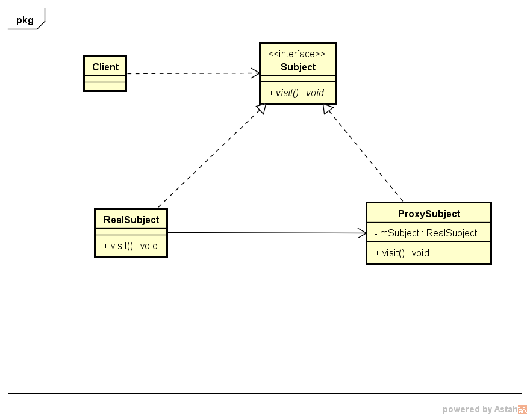

# 代理模式

---
## 1 代理模式简介

代理模式称为 **委托模式**，属于结构类模式，其定义是 **为其他对象提供一种代理以控制对这个对象的访问**。

使用场景：当无法或不想直接访问某个对象或者访问某个对象存在困难时可以通过一个代理对象来间接访问，为了保证客户端使用的透明性，委托对象和代理对象需要实现相同的接口。

---
## 2 UML类图



```
public interface Subject {
    void visit();
}

public class RealSubject implements Subject {

    @Override
    public void visit() {
        System.out.println("real subject ");
    }
}

public class ProxySubject implements Subject {

    private final Subject mProxy;

    public ProxySubject(Subject proxy) {
        mProxy = proxy;
    }

    @Override
    public void visit() {
        //通过真实主题引用的对象调用真实主题中的逻辑方法
        mProxy.visit();
    }
}
```

角色介绍：

- Subject：抽象主题类，主要职责是声明真实主题与代理主题的共同接口方法，该类既可以是一个抽象类也可以是一个接口
- RealSubject：真实主题类，该类也被称为被委托类或被代理类，该类定义了代理所表示的真实对象，由其执行具体业务逻辑方法，而客户端通过代理简介地调用真实主题类中定义的方法
- ProxySubject：代理类，该类也被称为代理类和委托类，该类持有一个真实的主题类引用，在其所实现的方法中调用真实类中相应的接口方法执行，以此起到代理作用
- Client：使用代理类的类型

---
## 3 其它

- 代理模式分为静态代理和动态代理，一般动态代理的更加灵活，在Java使用Proxy类可以方便的实现动态代理，开源库cglib可是个不错的选择。
- Android中使用代理模式的地方非常多，比如 ActivityManagerProxy、Binder机制等。