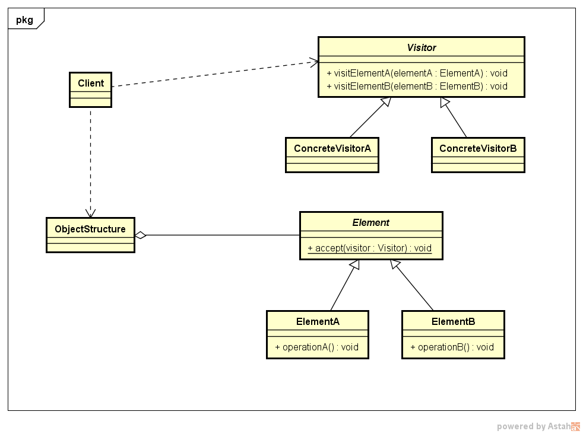

# 访问者模式

---
## 1 访问者模式介绍

封装一些作用于某种数据结构中的各种元素的操作，它们可以在**不改变这种数据结构**的前提下定义作用于这些元素的新的操作。

---
## 2 类图设计与角色说明



- Visitor:接口或者抽象类，它定义了对每个元素的访问行为，它的参数就是可以访问的元素，它的方法个数理论上与元素的个数是一样的，**因此访问者模式要求元素的类族要稳定，如果经常添加、移除元素类，必然会导致频繁的修改Visitor接口**，
- ConcreteVisotor：具体的访问者，它需要给出对每一个元素类访问时所产生的具体行为。
- Element：元素接口或者抽象类，它定义了一个接受访问者的accept方法，其意义是指每一个元素都可以被访问者访问。
- ElementA、ElementB：具体的元素，提供接受访问方法的具体实现。
- ObjectStructure：定义当中所提到的对象结构，是一种抽象描述。

---
## 3 示例

年终对经理和工程师评核，由CEO和CTO分别进行评定，而CEO关注经理的产品数和KPI和工程师的KPI、CTO关注经理的产品数和工程师的代码量。从中可以看出被评定的元素是经理和工程师，元素相对固定，CEO和CTO的关注带你不同，也即是对元素的操作不同，可以使用访问者模式。

- 元素：员工
- 具体的元素：经理和工程师
- 访问者：CEO和CTO

### 代码演示

```java
//员工类
public abstract class Staff {

    static final Random RANDOM = new Random();

    private String name;
    private int kpi;

    public Staff(String name) {
        this.name = name;
        this.kpi = RANDOM.nextInt(10);
    }

    public abstract void accept(Visitor visitor);

    public int getKpi() {
        return kpi;
    }

    public String getName() {
        return name;
    }
}
//访问者
public interface Visitor  {

    void visit(Engineer engineer);

    void visit(Manager manager);
}
//工程师
public class Engineer extends Staff {

    private long codeLines;

    public Engineer(String name) {
        super(name);
        codeLines = RANDOM.nextInt(10 * 10000);
    }

    public long getCodeLines() {
        return codeLines;
    }


    @Override
    public void accept(Visitor visitor) {
        visitor.visit(this);
    }
}
//经理
public class Manager extends Staff {

    private int products;//产品数量

    public Manager(String name) {
        super(name);
        products = RANDOM.nextInt(10);
    }


    public int getProducts() {
        return products;
    }


    @Override
    public void accept(Visitor visitor) {
        visitor.visit(this);
    }
}
//CEOVisitor和CTOVisitor
public class CEOVisitor implements Visitor {

    @Override
    public void visit(Engineer engineer) {
        System.out.println("工程师：" + engineer.getName() + ", KPT：" + engineer.getKpi());
    }

    @Override
    public void visit(Manager manager) {
        System.out.println("经理：" + manager.getName() + ", KPT：" + manager.getKpi() + " , 产品数：" + manager.getProducts());
    }
}
public class CTOVisitor implements Visitor {

    @Override
    public void visit(Engineer engineer) {
        System.out.println("工程师：" + engineer.getName() + ", 代码数：" + engineer.getCodeLines());
    }

    @Override
    public void visit(Manager manager) {
        System.out.println("经理：" + manager.getName() + " , 产品数：" + manager.getProducts());
    }
}
//客户端
public class Client {

    public static void main(String... args) {
        CEOVisitor ceoVisitor = new CEOVisitor();
        CTOVisitor ctoVisitor = new CTOVisitor();
        BusinessReport businessReport = new BusinessReport();
        System.out.println("ceo 查看报表");
        businessReport.showReport(ceoVisitor);
        System.out.println("cto 查看报表");
        businessReport.showReport(ctoVisitor);
    }


    public static class BusinessReport {
        private List<Staff> staffList = new ArrayList<>();

        BusinessReport() {
            staffList.add(new Manager("张三"));
            staffList.add(new Engineer("李四"));
            staffList.add(new Engineer("王五"));
            staffList.add(new Engineer("赵六"));
        }

        public void showReport(Visitor visitor) {
            for (Staff staff : staffList) {
                staff.accept(visitor);
            }
        }
    }
}
```
这样设计则避免了各种if else判断，代码清晰。


---
## 4 访问者模式解释


### 优点

- 好的扩展性，能够在不改变对象结构中的元素的情况下，为对象结构中的元素添加新的功能
- 好的复用性，可以通过访问者来定义整个对象结构的功能，从而提高复用程度
- 分离无感行为，通过访问者来分离无关的行为

### 缺点

- 对象结构的变化很困难
- 破坏了封装：通常需要对象结构开放背部数据给访问者和ObjectStrucetrue，这破坏了对象的封装。

### 使用场景

- 对象结构表稳定，但经常需要在此对象结构上定义新的操作，
- 需要对一个对象结构中的对象进行很多不同的并且不相关的操作，而需要避免这些操作**污染**这些对象的类，也不希望在添加新的操作时修改这些类。


---
## 5 Java中的访问者模式

Java编译时注解处理就是利用了访问者模式：

```java
    //类型元素基类
    public interface Element extends javax.lang.model.AnnotatedConstruct {
        //......
        <R, P> R accept(ElementVisitor<R, P> v, P p);
    }
    //访问者
    public interface ElementVisitor<R, P> {
        R visit(Element e, P p);
        R visit(Element e);
        R visitPackage(PackageElement e, P p);
        R visitType(TypeElement e, P p);
        R visitVariable(VariableElement e, P p);
        R visitExecutable(ExecutableElement e, P p);
        R visitTypeParameter(TypeParameterElement e, P p);
        R visitUnknown(Element e, P p);
    }
```
